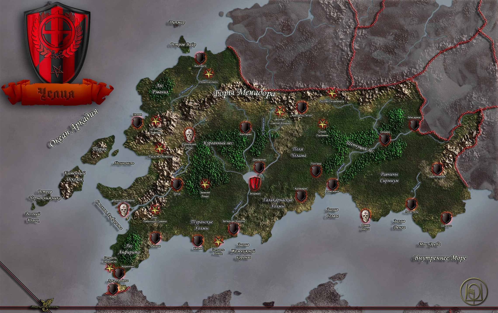
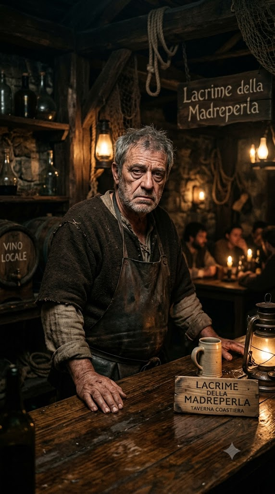
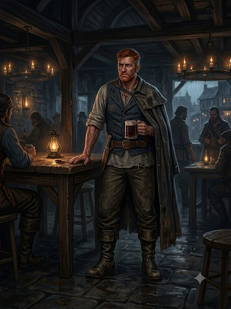
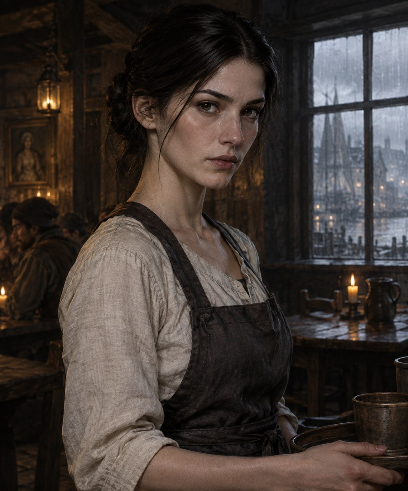
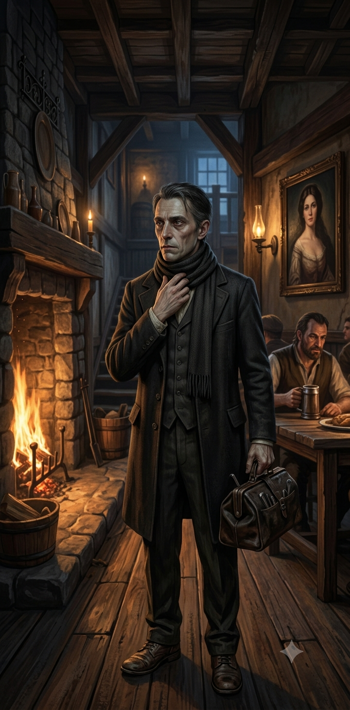
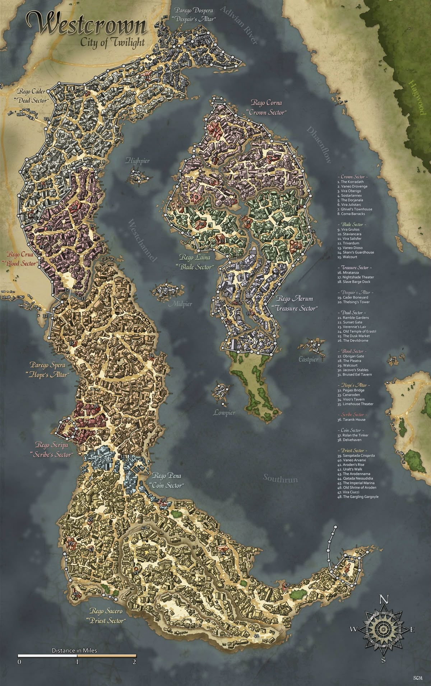
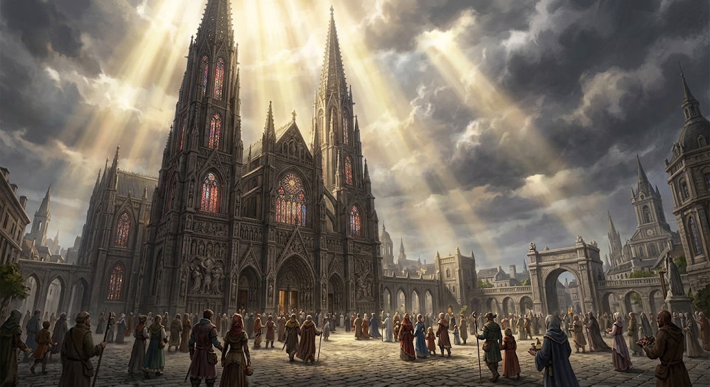
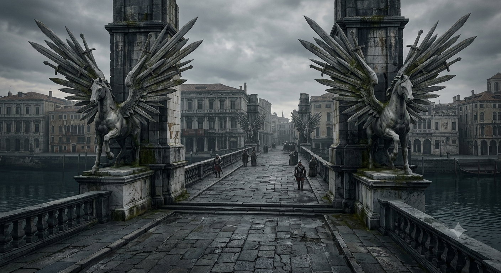
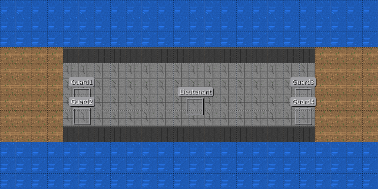

# КРАТКОЕ ОПИСАНИЕ (1 страница)

## Логлайн

В прибрежной таверне «Слёзы устрицы» (Lacrime della Madreperla) в эту ночь должно случиться убийство.
А к рассвету город окажется под водой.
И то, и другое — следствие поклонения хтоническому божеству.
Игроки должны распутать клубок интриг, пока вода не поднялась до второго этажа.

## Жанр и тон

Детектив с элементами хоррора и таймера.
Ограниченное пространство (таверна), ограниченное время (одна ночь + рассвет), закрытый круг подозреваемых.
Атмосфера — сырость, вино, соль, страх, приближающаяся вода.

## Сеттинг

Город Весткроун — порт с дождливым климатом, старыми доками и мрачными закоулками.
Таверна «Слёзы устрицы» (Lacrime della Madreperla) стоит за городом, у Хагвудского леса, на самом берегу реки Адивиан.

## Основной конфликт

В таверне в ночи совершается убийство.
Жертва — один из постояльцев.

## Задача игроков:

- Найти убийцу.
- Понять, что потоп — не случайность.
- Остановить ритуал (или выжить).

## Структура

- Глава 1 — Город, знакомство с сеттингом и некоторыми персонажами, завязка расследования.
- Глава 2 — прибытие в таверну «Слёзы устрицы» (Lacrime della Madreperla), знакомство с постояльцами, первые странности.
- Глава 3 — ночь, убийство, подозрения.
- Глава 4 — расследование, потоп (07:15+)
- Глава 5 — выживание и развязка.

## Концовки

- Solve — убийца найден, потоп остановлен.
- Solve only — убийца найден, потоп случился.
- Flood only — потоп остановлен, убийца ушёл.
- Drown — всё провалено.

## Основные персонажи

| d6 | Персонаж         | Роль       | Служебный ID  |
|----|------------------|------------|---------------|
| 1  | Гаэтано Вельди   | Трактирщик | tavern_keeper |
| 2  | Корин Марроне    | Моряк      | sailor        |
| 3  | Виттория Вельди  | Официантка | waitress      |
| 4  | Элио Вентури     | Врач       | doctor        |
| 5  | Джакомо Раньери  | Детектив   | detective     |
| 6  | Лучиано Аврелиан | Художник   | artist        |

### Сводная таблица стат-блоков

| Персонаж           | Уровень | Класс                  | AC | HP  | Ключевая способность |
|--------------------|---------|------------------------|----|-----|----------------------|
| Гаэтано Вельди     | 5       | Вор                    | 22 | 80  | Коварный удар 2d6    |
| Корин Марроне      | 9       | Боец/Вор               | 28 | 170 | Двойной разрез       |
| Виттория Вельди    | 7       | Жрец Дагона            | 25 | 115 | Волна Дагона         |
| Элио Вентури       | 6       | Алхимик/Жрец           | 23 | 85  | Алхимические бомбы   |
| Джакомо Раньери    | 9       | Следователь            | 27 | 150 | Стратегия            |
| Лучиано Аврелиан   | 9       | Чемпион Шелин (павший) | 28 | 151 | Божественная кара    |
| Ильтус Мартис      | 3       | Воин                   | 18 | 45  | Пьяный командир      |
| Алессандро Маретти | 8       | Боец                   | 26 | 135 | Приказ               |
| Тобиа Бандини      | 2       | Алхимик                | 18 | 24  | Полевая медицина     |
| Вассиндио Дровендж | 10      | Вор                    | 29 | 150 | Мастер-ум            |
| Изабелла Вельди    | 5       | Призрак                | 21 | 60  | Ужасающий вид        |

### Трактирщик — Гаэтано Вельди (d6=1)

#### Что зачитать игрокам при первой встрече

>
> За стойкой — грузный, но ещё крепкий мужчина лет пятидесяти пяти. Обветренное лицо в глубоких морщинах, седые коротко
> стриженые волосы, серые усталые глаза с постоянной тенью. Плечи чуть ссутулены, руки в мозолях, на левой ладони —
> старый шрам от ножа. Он вытирает кружку и смотрит на вас тяжёлым, настороженным взглядом. На поясе — связка ключей, на
> левой руке — обручальное кольцо, которое он никогда не снимает. Пахнет пылью, чернилами и лёгким запахом спирта.
> Говорит короткими фразами, с паузами, низким приглушённым голосом.

#### Идентификация

- **Имя:** Гаэтано Вельди.
- **Прозвище:** «Старый Гаэтано».
- **Роль:** владелец таверны «Слёзы устрицы» (Lacrime della Madreperla), контрабандист.
- **Раса:** человек.
- **Мировоззрение:** Нейтральный (N)
- **Статус:** main_npc.
- **Может ли быть жертвой:** true.

#### Описание

Владелец таверны «Слёзы устрицы», бывший контрабандист. Много лет назад, после встречи с женой (Изабеллой Вельди),
завязал с контрабандой, уехал подальше, женился и открыл таверну. После убийства жены Корин Марроне вынужден
вернуться к контрабанде под угрозой расправы над дочерью.

#### Внешний вид и черты лица

Обветренное лицо в глубоких морщинах; седые коротко стриженные волосы; серые усталые глаза с постоянной тенью, тяжёлый
взгляд. Крепкое, но уже не молодое тело: плечи чуть ссутулены, руки в мозолях. Шрам на левой ладони — старый, от ножа.
Возраст: ~55 лет.

#### Одежда и детали

Простая тёмная одежда — льняная рубаха с закатанными рукавами, кожаный жилет, тяжёлый фартук. На поясе — связка
ключей. На левой руке — обручальное кольцо, которое он никогда не снимает.

#### Поведение и шлейф восприятия

Суровый, настороженный. Медленная речь с паузами.
Ночью, когда думает, что его не видят, сидит у портрета жены и разговаривает с ним шёпотом. Когда смотрит на портрет —
на секунду замирает.
Шлейф восприятия: пахнет пылью, бумагой, чернилами и лёгким запахом спирта.

#### Речь

Суровый, ворчливый, настороженный, медленный, с паузами, низкий приглушённый голос. Говорит короткими фразами, иногда
замирает на середине фразы.

- L1: холодно врёт, резко обрывает, не смотрит.
- L2: бурчит, отводит глаза, цедит через зубы.
- L3: тише, злее, взвешенно; прищуривается.
- L4: глухо, как разговор с портретом, впервые смотрит в глаза.

Клички/лексика: «Не спрашивай», «Моего дела»; слова «тайник», «счёт», «ключи», «дочь».
Жесты: перебирает ключи в связке, бросает быстрые взгляды на портрет жены.

#### Профессия

- владелец таверны «Слёзы устрицы»;
- контрабандист.

#### Скрывает

- **[big]** Корин Марроне изнасиловал и убил его жену.
  Корин Марроне узнал его и предлагал вести общие дела; Трактирщик отказал, тогда Корин Марроне убил его жену и угрожал
  так же
  поступить с дочерью (Витторией). После этого через таверну пошла незаконная торговля.
    - **Кто еще знает:** Корин Марроне, Гаэтано Вельди (сам).
- **[big]** Подозревает, что Виттория связана с культом (не знает, что она — верховная жрица).
  Не распространяется об этом подозрении.
- **[small]** Занимается контрабандой: продаёт запрещённые в Челии товары («Погибель Дьявола», пеш, лист-живодёр,
  грязь). Много лет назад также занимался контрабандой; после встречи с женой завязал.
    - **Кто еще знает:** Корин Марроне - поставщик. Лучиано Аврелиан - покупатель. Виттория Вельди - только
      подозревает (не уверена точно).
- **[small]** Продает Лист живодёр Лучиано Аврелиану.
    - **Кто еще знает:** Лучиано Аврелиан.

#### Хочет

- защитить дочь Витторию Вельди (Официантку);
- сохранить таверну;
- отомстить Корину Марроне.

#### Боится

- Корин Марроне — убил его жену и держит его через дочь;
- Доттари (городской стражи) — могут раскрыть контрабанду;
- Совета Воров — контрабанда идёт мимо Совета, и если Совет узнает, может привлечь к ответу за нелегальную контрабанду.

#### Отношения

- **Виттория Вельди** — его дочь; также работает в его таверне официанткой и помогает по хозяйству (love /
  money: работник таверны).
- **Изабелла Вельди** — погибшая жена; её портрет висит на видном месте над камином в основном зале (love).
- **Корин Марроне** — деловой партнёр по контрабанде (Корин привозит товар, Гаэтано хранит его в таверне);
  вражда сосуществует с деловыми связями — работает из страха, что Корин Марроне убьёт дочь так же, как и жену (hatred /
  money).
- **Элио Вентури** — парень его дочери; снимает комнату на втором этаже. Резко против их отношений: сам ведёт
  незаконную контрабанду и подозревает, что Врач связан с контрабандистами (Врач знает Корина Марроне — ложное
  подозрение;
  Врач не знает о контрабанде и не контрабандист) (hatred / religion).
- **Лучиано Аврелиан** — снимает мансарду под художественную мастерскую; покупает у Гаэтано лист-живодёр.
  Гаэтано продаёт его неофициально (через контрабанду) и знает о зависимости Художника (justice, canonical).

#### [PF2e stat-block]

**Гаэтано Вельди — Трактирщик (NPC 5)**

| Параметр               | Значение                                                                                                                                                      |
|------------------------|---------------------------------------------------------------------------------------------------------------------------------------------------------------|
| **Уровень**            | 5                                                                                                                                                             |
| **Мировоззрение**      | N                                                                                                                                                             |
| **Раса**               | Человек                                                                                                                                                       |
| **Роль**               | Melee support / bodyguard                                                                                                                                     |
| **Восприятие**         | +13 (moderate)                                                                                                                                                |
| **Языки**              | Общий, Варисийский                                                                                                                                            |
| **Навыки**             | Атлетика +12 (moderate), Обман +12 (moderate), Воровство +12 (moderate), Скрытность +14 (high), Запугивание +10 (moderate), Знание контрабанды +12 (moderate) |
| **Сила (STR)**         | +4                                                                                                                                                            |
| **Ловкость (DEX)**     | +3                                                                                                                                                            |
| **Телосложение (CON)** | +3                                                                                                                                                            |
| **Интеллект (INT)**    | +0                                                                                                                                                            |
| **Мудрость (WIS)**     | +2                                                                                                                                                            |
| **Харизма (CHA)**      | +1                                                                                                                                                            |
| **AC**                 | 22 (moderate)                                                                                                                                                 |
| **HP**                 | 80 (high)                                                                                                                                                     |
| **Скорость**           | 25 футов                                                                                                                                                      |
| **Спасброски**         | Стойкость +12 (high), Реакция +14 (extreme), Воля +10 (moderate)                                                                                              |
| **Ближний бой**        | Кинжал +1 (Striking): +15 (high), 2d4+6 колющий, +2d6 скрытый удар                                                                                            |
| **Дальний бой**        | Тяжёлый арбалет: +13 (moderate), 2d10+4 колющий                                                                                                               |

**Способности:**

- **Скрытый удар (Sneak Attack) 2d6.** Носит урон по цели в состоянии «Застигнут врасплох» (Off-Guard).
- **Отвергнуть преимущество (Deny Advantage):** Существа 5 уровня и ниже не могут застать Гаэтано «врасплох»
  (Off-Guard).
- **Уклонение (Evasion):** При успешном спасброске Реакции — нет урона; при критическом успехе — нет урона и
  эффектов.
- **Перехват удара (Intercept Strike, реакция):** Когда союзник в пределах 10 футов получает урон от атаки ближнего
  боя, Гаэтано может совершить атаку по атакующему (без штрафной проверки).
- **Фигура вора: Ruffian:** Может использовать скрытый удар с любым оружием.

#### GM knows

- **Тайны:** [big] Корин Марроне убил его жену; [small] контрабанда (тайник в кабинете, яд, долговая расписка, дневник);
  [small] подозревает Официантку в культе.
- **Реакции:** найден секрет/улика → резко обрывает, отводит глаза; при упоминании контрабанды — замирает.
- **При раскрытии тайны:** [big] — угрожает / признаётся / убегает (детали не определены).
- **Ложные убеждения:**
    - Корин Марроне — единственный, кто точно знает о его контрабанде (confidence: medium).
    - Врач связан с контрабандистами (знает Корина Марроне) — ложное подозрение (confidence: low).

### Корин Марроне — Моряк (d6=2)

#### Что зачитать игрокам при первой встрече

>
> У стойки стоит мужчина лет сорока, крепкий и жилистый, с обветренным грубым лицом, покрытым сетью мелких старых
> шрамов. Короткая небрежная рыжеватая щетина, тёмно-рыжие волосы, практичная морская стрижка. Глаза внимательные,
> настороженные, оценивающие — он замечает всех, кто входит, и все выходы. Одет в грубую светлую льняную рубаху, тёмные
> рабочие штаны, высокие потёртые кожаные сапоги, короткий морской жилет и тяжёлый тёмный плащ от дождя. На поясе —
> простой рабочий нож в кожаных ножнах. От него пахнет ромом, солью и табаком. Когда он нервничает, то крутит перстень
> на левой руке. Говорит громко, с морским акцентом, пересыпая речь ругательствами.

#### Идентификация

- **Имя:** Корин Марроне.
- **Прозвище:** «Ржавый», «Кайрэн» (Прозвище «Кайрэн» — старое, его так называли на «Чёрной Сирене»; актуальное -
  «Ржавый»)
- **Роль:** моряк, контрабандист; тайный деловой партнёр по контрабанде Трактирщика.
- **Раса:** полуэльф.
- **Мировоззрение:** Хаотично-нейтральный (CN).
- **Статус:** main_npc.
- **Может ли быть жертвой:** true.

#### Описание

Мужчина примерно 35–45 лет, опытный портовый моряк и контрабандист. Прежде всего моряк и портовый контрабандист,
который умеет оставаться незаметным среди обычных людей. Дезертир с «Чёрной Сирены», украл судовую казну.

#### Внешний вид и черты лица

Крепкое сухое жилистое телосложение, развитые предплечья и плечи; компактный, выносливый и подвижный мужчина.
Лицо обветренное, грубоватое, с выраженными носогубными складками и тяжёлыми веками;
кожа загорелая, повреждённая ветром и водой. Несколько небольших старых шрамов на лице; короткая небрежная рыжеватая
щетина; волосы короткие, тёмно-рыжие/медно-рыжие, практичная морская стрижка. Взгляд внимательный, настороженный,
оценивающий. Одежда: грубая светлая льняная рубаха, тёмные рабочие штаны, высокие потёртые кожаные сапоги, короткий
морской жилет/куртка, широкий ремень, тяжёлый тёмный плащ; на поясе простой рабочий нож.

#### Поведение и шлейф восприятия

Спокойное, немного тяжёлое и неприятное выражение лица, без театральной злобы; привык скрывать свои мысли. Когда
нервничает — крутит перстень на левой руке. Избегает смотреть в глаза Трактирщику. Ночью выходит во двор, проверяет,
не следит ли кто.
Шлейф восприятия: пахнет ромом, солью, табаком.

#### Речь

Грубый, морской; ругательства и мат как связки. Говорит громко, с морским акцентом, пересыпает речь
ругательствами.

- L1: агрессивно врёт, повышает голос, перебивает, обрывает.
- L2: бурчит, отводит взгляд, отвечает нехотя, цедит.
- L3: говорит тише, злее, но по делу; крутит перстень.
- L4: глухо, обрывисто, почти шёпотом; впервые смотрит в глаза.
- Клички/лексика: «Слушай сюда», «Ты меня понял?»; слова «трюм», «казна», «дьявол», «по реке». Жесты: крутит перстень,
  не смотрит в глаза.

#### Профессия

- контрабандист (поставщик запрещённых товаров);
- бывший матрос корабля «Чёрная Сирена» (дезертир).

#### Скрывает

- **[big]** Дезертировал с корабля «Чёрная Сирена» (La Sirena Nera) Капитана (ship_captain), украв судовую казну.
    - **Кто знает (known_by):** ship_captain.
- **[big]** Изнасиловал и убил жену Трактирщика (Изабеллу Вельди). Угрожал Официантке (дочерью), чтобы Трактирщик
  согласился вести общие дела. Свершившийся задолго до начала истории факт.
    - **Кто знает (known_by):** Гаэтано Вельди, Корин Марроне, Изабелла Вельди.
- **[small]** Контрабандист. Привозит Трактирщику запрещённые PF2e-товары: «Погибель Дьявола», пеш, лист-живодёр,
  грязь (инструменты культа Дагона); товары идут по реке Адивиан.
    - **Кто знает (known_by):** Гаэтано Вельди.

#### Хочет

- сохранить контрабанду;
- не раскрывать дезертирство/кражу.

#### Боится

- Алессандро Маретти (Капитан) — его бывший командир; знает о дезертирстве и краже судовой казны (может повесить);
- Совет Воров — Корин Марроне и Трактирщик торгуют сами, минуя Совет, и не вносят в общак; Совет (Вассиндио Дровендж)
  может
  привлечь их к ответу за нелегальную контрабанду;
- Доттари (городская стража) — может раскрыть контрабанду или дезертирство.

#### Отношения

- **Гаэтано Вельди (Трактирщик)** — деловой партнёр по контрабанде; угроза в ответ на отказ в контрабанде (убил жену,
  угрожал дочерью) (hatred / money).
- **Изабелла Вельди** — изнасиловал и убил.
- **Виттория Вельди (Официантка)** — угрожал насилием, чтобы держать Трактирщика в контрабанде.
- **Элио Вентури (Врач)** — бывший сослуживец по кораблю «Чёрная Сирена».
- **Алессандро Маретти (Капитан)** — бывший командир с одного корабля «Чёрная Сирена».

#### [PF2e stat-block]

**Корин Марроне — Моряк (NPC 9)**

| Параметр          | Значение                                                                                                                                     |
|-------------------|----------------------------------------------------------------------------------------------------------------------------------------------|
| **Уровень**       | 9                                                                                                                                            |
| **Мировоззрение** | CN                                                                                                                                           |
| **Раса**          | Полуэльф                                                                                                                                     |
| **Роль**          | Solo boss / dirty fighter                                                                                                                    |
| **Восприятие**    | +18 (moderate)                                                                                                                               |
| **Языки**         | Общий, Эльфийский, Варисийский                                                                                                               |
| **Навыки**        | Атлетика +20 (extreme), Акробатика +17 (high), Запугивание +17 (high), Скрытность +17 (high), Морячество +19 (extreme), Воровство +17 (high) |
| **Сила**          | +5                                                                                                                                           |
| **Ловкость**      | +4                                                                                                                                           |
| **Телосложение**  | +4                                                                                                                                           |
| **Интеллект**     | +2                                                                                                                                           |
| **Мудрость**      | +3                                                                                                                                           |
| **Харизма**       | +2                                                                                                                                           |
| **AC**            | 28 (high)                                                                                                                                    |
| **HP**            | 170 (high)                                                                                                                                   |
| **Скорость**      | 25 футов                                                                                                                                     |
| **Спасброски**    | Стойкость +20 (extreme), Реакция +18 (extreme), Воля +14 (moderate)                                                                          |
| **Ближний бой**   | Боевой нож +1 (Striking): +20 (extreme), 2d4+8 колющий, +2d6 скрытый удар                                                                    |
| **Дальний бой**   | Метательный нож +19 (extreme), 2d4+6 колющий                                                                                                 |

**Способности:**

- **Скрытый удар (Sneak Attack) 2d6.** Носит урон по цели в состоянии «Застигнут врасплох» (Off-Guard).
- **Грязный приём (1 действие):** Атлетика против Стойкости цели; при успехе цель «Ослеплён» (Blinded) или
  «Застигнут врасплох» (Off-Guard) на 1 раунд.
- **Двойной разрез (2 действия):** Две атаки с -2 каждая; если обе попадают, урон складывается для целей
  сопротивления.
- **Внезапный рывок (2 действия):** Перемещение на две дистанции и одна атака.
- **Морские ноги:** +2 к Атлетике и Акробатике у воды; игнорирует труднопроходимую местность от влажных
  поверхностей.
- **Не уйти (реакция):** Когда существо перемещается прочь, Корин Марроне совершает Перемещение за ним (до своей
  скорости).
- **Жестокий финал (1 действие, 1/раунд):** Атака по цели «Застигнут врасплох» (Off-Guard); +2d6 урона; при попадании
  цель проходит спасбросок Стойкости СЛ 27, иначе «Сбит с ног» (Prone).
- **Действия логова (на инициативе 20, проигрывая ничьи):**
    - **Скользкая палуба:** Один квадрат 10×10 футов становится труднопроходимым (вода, кровь, верёвка).
    - **Канат:** Верёвка или цепь пролетает по линии 20 футов; существа проходят спасбросок Реакции СЛ 25, иначе
      3d6 дробящего урона и «Сбит с ног» (Prone).
    - **Соль на рану:** Корин Марроне восстанавливает 15 HP и может немедленно совершить «Грязный приём» против смежного
      существа.

#### GM knows

- **Тайны:** [big] дезертирство + кража казны; [big] убийство/изнасилование жены Трактирщика + угроза дочерью; [small]
  контрабанда.
- **Реакции:** найден секрет/улика → агрессивно врёт, повышает голос, перебивает; при упоминании «Чёрной Сирены» —
  крутит перстень.
- **При раскрытии тайны:** [big] — угрожает / признаётся / убегает (детали не определены).
- **Ложные убеждения:**
    - Никто не знает о его дезертирстве и краже (confidence: medium).
    - Трактирщик не знает о его прошлом, кроме контрабанды (confidence: low).
    - Официантка не знает о его угрозах в отношении её отца (confidence: low).
- **Скрытое при обыске (hidden):** тайник (sailor_hiding), нож (sailor_knife), поддельное письмо (fake_letter),
  морская карта (nautical_chart).

### Официантка — Виттория Вельди (d6=3)

#### Что зачитать игрокам при первой встрече

>
> К вам подходит молодая женщина с очень светлой кожей и густыми тёмными волосами, убранными просто и практично. Лицо
> тонкое, с выраженными скулами, тёмные глаза смотрят спокойно и немного отстранённо. Одета в простую тёмную юбку,
> светлую рабочую рубаху и плотный фартук. Держится тихо, сдержанно, почти незаметно — но вы замечаете, как
> автоматически она следит за столами и посетителями. От неё пахнет травами, благовониями и… солёным морским приливом.
> На запястье — тонкий шрам.

#### Идентификация

- **Имя:** Виттория Вельди.
- **Прозвище:** «Госпожа Виттория».
- **Роль:** официантка в таверне «Слёзы устрицы»; тайно — верховная жрица культа Дагона.
- **Раса:** человек.
- **Мировоззрение:** Нейтрально-злое (NE).
- **Статус:** main_npc.
- **Может ли быть жертвой:** true.

#### Описание

Дочь Трактирщика; тайно — верховная жрица культа Дагона. Мать (Изабелла Вельди) была бывшей верховной жрицей культа
и обучила её ритуалам при жизни; инициацию Виттория завершила после смерти матери.

#### Внешний вид и черты лица

Молодая женщина с очень светлой кожей и густыми тёмными волосами. Лицо тонкое, с выраженными скулами и узкой нижней
частью; нос прямой, достаточно заметный. Глаза тёмные, внимательные, обычно смотрят спокойно и немного отстранённо.
Внешность привлекательная, но без нарочитой яркости; в ней есть что-то от матери, особенно в очертаниях лица и взгляде.
Стройное, лёгкое телосложение; движения быстрые и точные. Возраст: ~20 лет. На запястье — тонкий шрам (ритуальный, от
инициации).

#### Одежда и детали

Простая, практичная одежда работницы таверны: тёмная юбка, светлая рабочая рубаха и плотный фартук. Одежда чистая и
аккуратная, но слегка потёртая от ежедневной работы. Волосы (густые, тёмные) убраны просто и практично. Украшений
почти нет — никаких заметных религиозных символов, которые могли бы выдать её связь с культом.

#### Поведение и шлейф восприятия

Тихая, сдержанная и незаметная. Привыкла много работать и почти не привлекать к себе внимание. В таверне свободно
ориентируется и автоматически следит за столами, посетителями и хозяйственными мелочами. С посторонними держится
вежливо и спокойно, редко показывает сильные эмоции. При упоминании матери или Корин Марроне становится заметно
напряжённее, хотя старается этого не показывать. Отца побаивается и старается не вступать с ним в открытый конфликт.
Рядом с Элио позволяет себе быть мягче и эмоциональнее. Избегает подходить к подвалу при гостях; ночью уходит в подвал
(cult_lair) на молитву.
Шлейф восприятия: пахнет травами, благовониями и… солёным морским приливом (запах культа Дагона — демон океана).

#### Речь

Тихий, сдержанный, с налётом культа; вежливая официантка на поверхности. Быстрый, точный темп; обрывки и шёпоты;
иногда замолкает.

- L1: вежливо молчит, отводит глаза, нехотя.
- L2: тише, тревожнее, замирает; смотрит на запястье.
- L3: при упоминании матери/Корина Марроне — заметно напрягается, но старается не показать.
- L4: шёпот ритуала, почти беззвучно; впервые смотрит в глаза.
- Клички/лексика: «Не спрашивай», «Мой отец»; слова «подвал», «молитва», «Дагон», «мать». Жест: смотрит на запястье.

#### Профессия

- официантка в таверне «Слёзы устрицы»;
- верховная жрица культа Дагона (тайная, запрещённая ересь).

#### Скрывает

- **[big]** Верховная жрица небольшого тайного культа Дагона. Святилище — в тайной комнате в подвале таверны
  (cult_lair).
    - **Кто знает (known_by):** Элио Вентури .
- **[big]** Молится Дагону (демон-лорд океана), и тот насылает дождь, чтобы задержать Корина Марроне в таверне. Потоп —
  это
  РИТУАЛ ДАГОНА, усиленный естественным паводком реки Адивиан; никто не знает, что потоп — последствия её молитвы.
    - **Кто знает (known_by):** Виттория Вельди.
- **[big]** За пару недель до игровых событий призрак Жены (Изабелла Вельди) приходит к ней и рассказывает, что Корин
  Марроне
  убил её мать и угрожал ей.
    - **Кто знает (known_by):** Виттория Вельди.
- **[small]** Знает, что её отец (Трактирщик) занимается нелегальной торговлей, но без подробностей.
    - **Кто знает (known_by):** Виттория Вельди.

#### Хочет

- отомстить за мать (для этого молилась Дагону, чтобы задержать Корина Марроне);
- скрыть существование культа.

#### Боится

- раскрытия культа;
- Корин Марроне — угрожает её изнасиловать;
- Потерять Элио Вентури.

#### Отношения

- **Гаэтано Вельди (Трактирщик)** — отец; она его побаивается и старается не вступать с ним в открытый конфликт (love /
  money: работает в таверне).
- **Изабелла Вельди** — погибшая мать; бывшая верховная жрица культа, обучившая её; её призрак рассказал,
  что Корин Марроне убил её (love).
- **Элио Вентури (Врач)** — в любовных отношениях; рядом с Элио она позволяет себе быть мягче и эмоциональнее; также
  член её культа Дагона (love / religion).
- **Корин Марроне (Моряк)** — убил её мать; она хочет отомстить ему (месть, подстрекаемая призраком Жены) (hatred).
- **Лучиано Аврелиан (Художник)** — она «запала» на него (он необычно красив), но не бросает Элио.

#### [PF2e stat-block]

**Виттория Вельди — Официантка (NPC 7)**

| Параметр              | Значение                                                                                                                                           |
|-----------------------|----------------------------------------------------------------------------------------------------------------------------------------------------|
| **Уровень**           | 7                                                                                                                                                  |
| **Мировоззрение**     | NE                                                                                                                                                 |
| **Раса**              | Человек                                                                                                                                            |
| **Роль**              | Caster (Cleric of Dagon)                                                                                                                           |
| **Восприятие**        | +15 (moderate)                                                                                                                                     |
| **Языки**             | Общий, Акло, Варисийский                                                                                                                           |
| **Навыки**            | Религия +17 (extreme), Дипломатия +15 (high), Обман +15 (high), Запугивание +13 (moderate), Скрытность +13 (moderate), Знание Дагона +17 (extreme) |
| **Сила**              | +0                                                                                                                                                 |
| **Ловкость**          | +2                                                                                                                                                 |
| **Телосложение**      | +2                                                                                                                                                 |
| **Интеллект**         | +1                                                                                                                                                 |
| **Мудрость**          | +5                                                                                                                                                 |
| **Харизма**           | +4                                                                                                                                                 |
| **AC**                | 25 (high)                                                                                                                                          |
| **HP**                | 115 (moderate-high)                                                                                                                                |
| **Скорость**          | 25 футов                                                                                                                                           |
| **Спасброски**        | Стойкость +12 (moderate), Реакция +12 (moderate), Воля +17 (extreme)                                                                               |
| **Ближний бой**       | Ритуальный кинжал +1 (Striking): +15 (high), 2d4+2 колющий                                                                                         |
| **СЛ заклинаний**     | 25 (extreme)                                                                                                                                       |
| **Атака заклинанием** | +17                                                                                                                                                |

**Способности:**

- **Волна Дагона (2 действия):** 30-футовый конус, 4d6 холодного урона (Стойкость СЛ 25 — половина), отбрасывает на
  10 футов при провале.
- **Приливная молитва (1 действие, фокус):** Все союзники в пределах 30 футов получают +1 к AC на 1 раунд.
- **Касание утопленника (1 действие):** Атака заклинанием ближнего боя +17, 3d6 холодного урона; цель должна пройти
  спасбросок Стойкости СЛ 25, иначе «Замедлен 1» (Slow 1) на 1 раунд.
- **Волна глубин (1/день, 2 действия):** 20-футовый взрыв, 6d6 холодного урона (Стойкость СЛ 25 — половина); область
  становится труднопроходимой на 1 минуту.
- **Голос Дагона (реакция, 1/раунд):** Когда Виттория получает урон, атакующий должен пройти спасбросок Воли СЛ 25,
  иначе «Испуган 1» (Frightened 1).

**Заклинания (Cleric, Dagon):**

- **Фокусные:** Волна Дагона (4d6 дробящий, 30-футовый конус), Приливная молитва (даёт союзникам +1 к AC на 1 раунд).
- **1-й круг (4 слота):** Befuddle, Command, Fear, Heal.
- **2-й круг (3 слота):** Calm Emotions, Hold Person, Silence.
- **3-й круг (2 слота):** Blindness, Slow.

**Способности:**

- **Верховная жрица (High Priestess).** Виттория может проводить ритуалы культа Дагона; при успешной проверке Религии
  (СЛ 25) она может вызвать дождь или задержать наводнение на 1 час.
- **Скрытая вера (Hidden Faith).** Виттория не носит видимых символов Дагона; проверки Обмана против тех, кто
  подозревает её в культе, получают +2.

#### GM knows

- **Тайны:** [big] верховная жрица культа Дагона; [big] молитва Дагону → потоп; [big] призрак Жены рассказал об
  убийстве матери; [small] подсматривает за гостями; [small] знает о контрабанде отца без подробностей.
- **Реакции:** найден секрет/улика (cult_lair, молитва) → напрягается, но старается не показать; при упоминании
  матери/Корина Марроне — заметно напрягается.
- **При раскрытии тайны:** [big] — угрожает / признаётся / убегает (детали не определены).
- **Ложные убеждения:**
    - Трактирщик не знает о культе (confidence: medium; он может подозревать).
- **Скрытое при обыске (hidden):** дневник (waitress_diary, waitress_diary_secret), тайник (waitress_hiding),
  заклинательный фокус (waitress_focus), молитва культа Дагона (dagon_prayer), речевые особенности культистов
  (cult_speech).

### Врач — Элио Вентури (d6=4)

#### Что зачитать игрокам при первой встрече

>
> Перед вами худощавый мужчина лет сорока пяти с узким бледным лицом и острыми скулами. Тёмные волосы с проседью
> зачёсаны назад, серо-голубые глаза внимательные, чуть лихорадочные, под ними — тёмные круги. Одет в тёмный сюртук,
> белую рубашку и жилет; на поясе — сумка с медицинскими инструментами. Пальцы длинные, на них — следы химикатов.
> Когда он нервничает, то поправляет воротник. От него пахнет спиртом, травами и… благовониями. Он смотрит на
> официантку с плохо скрываемой нежностью.

#### Идентификация

- **Имя:** Элио Вентури.
- **Прозвище:** «Доктор Вентури».
- **Роль:** врач и патологоанатом; тайно — член культа Дагона; любовник Официантки.
- **Раса:** человек.
- **Мировоззрение:** Законопослушное-злое (LE).
- **Статус:** main_npc.
- **Может ли быть жертвой:** true.

#### Описание

Мужчина, врач и патологоанатом; член культа Дагона; любовник Виттории Вельди. В прошлом служил судовым врачом на
корабле «Чёрная Сирена». Не последний жрец: может провести обратный ритуал (flood_mechanic.path_3), но не знает
деталей заклинания Официантки.

#### Внешний вид и черты лица

Узкое, бледное лицо с острыми скулами. Тёмные волосы с проседью, зачёсанные назад. Глаза серо-голубые, внимательные,
чуть лихорадочные; под глазами — тёмные круги.
Телосложение — худощавое, жилистое, с длинными пальцами.
Возраст: ~45 лет.

#### Одежда и детали

Тёмный сюртук, белая рубашка, жилет; на поясе сумка с медицинскими инструментами; на пальцах — следы от химикатов;
обувь добротная, но потёртая.

#### Поведение и шлейф восприятия

Когда нервничает — поправляет воротник.
Смотрит на Официантку с плохо скрываемой нежностью.
Избегает Корина Марроне, но иногда бросает на него странные взгляды.

Шлейф восприятия: пахнет спиртом, травами и… благовониями (след культа).

#### Речь

Сухой, хладнокровный, медицинский; чуть лихорадочный. Ровный темп, с точными паузами; как диктовка.

- L1: холодно врёт, резко, отводит взгляд.
- L2: ровно, сухо, нехотя как диктовка.
- L3: тише, злее, замирает; поправляет воротник.
- L4: обрывисто, почти шёпотом; впервые смотрит в глаза.
- Клички/лексика: «Не спрашивай, кто», «Я не знаю точно»; слова «вскрытие», «симптомы», «яда», «журнал». Жесты:
  поправляет воротник, смотрит на Официантку.

#### Профессия

- врач (имеет лицензию лечить людей);
- патологоанатом (работает в морге, ведёт вскрытия);
- культист Дагона (последователь).

#### Скрывает

- **[big]** Состоит в тайном культе Дагона (cult) — культе Официантки.
    - **Кто знает (known_by):** Виттория Вельди.
- **[small]** Влюблён в Официантку.
    - **Кто знает (known_by):** Виттория Вельди, Гаэтано Вельди.
- **[big]** Подделывает некоторые отчёты о вскрытии, чтобы замести следы деятельности культа (меняет описания и
  причины смерти жертв культистов).
    - **Кто знает (known_by):** Виттория Вельди.

#### Хочет

- быть с Официанткой;
- скрыть существование культа.

#### Боится

- раскрытия культа;
- Гаэтано Вельди против их отношений с Витторией Вельди;
- Потерять работу в морге.

#### Отношения

- **Виттория Вельди (Официантка)** — в любовных отношениях; также член её культа Дагона (love / religion: верховная
  жрица / последователь).
- **Гаэтано Вельди (Трактирщик)** — конфликт/вражда из-за отношений с Витторией: Трактирщик подозревает, что Врач
  (связанный с правосудием)   сдаст его и контрабандистов властям; ложное подозрение — Врач не знает о контрабанде и не
  контрабандист (hatred).
- **Корин Марроне (Моряк)** — бывший сослуживец по кораблю «Чёрная Сирена» (не знает о краже казны); защищал
  Официантку от приставаний Корина Марроне (money / justice).
- **Джакомо Раньери (Детектив)** — знакомы по работе (морг/вскрытия); Детектив видел отчёты о вскрытии (work / justice:
  может раскрыть культ).
- **Алессандро Маретти (Капитан)** — бывший сослуживец/командир по кораблю «Чёрная Сирена» (money / justice: может
  раскрыть дезертирство Корина Марроне).
- **Тобиа Бандини (Ассистент Доктора)** — его подчинённый в Морге (work).
- **Лучиано Аврелиан (Художник)** — потенциальный религиозный враг; Художник может стать целью охоты на культистов
  (religion / justice) — НЕ было в прежнем блоке, добавлено из JSON.

#### [PF2e stat-block]

**Элио Вентури — Врач (NPC 6)**

| Параметр          | Значение                                                                                                                                            |
|-------------------|-----------------------------------------------------------------------------------------------------------------------------------------------------|
| **Уровень**       | 6                                                                                                                                                   |
| **Мировоззрение** | LE                                                                                                                                                  |
| **Раса**          | Человек                                                                                                                                             |
| **Роль**          | Support caster / debuffer                                                                                                                           |
| **Восприятие**    | +14 (moderate)                                                                                                                                      |
| **Языки**         | Общий, Акло, Варисийский                                                                                                                            |
| **Навыки**        | Медицина +17 (extreme), Религия +14 (high), Ремесло (алхимия) +14 (high), Обман +12 (moderate), Скрытность +12 (moderate), Знание Дагона +14 (high) |
| **Сила**          | +0                                                                                                                                                  |
| **Ловкость**      | +2                                                                                                                                                  |
| **Телосложение**  | +2                                                                                                                                                  |
| **Интеллект**     | +4                                                                                                                                                  |
| **Мудрость**      | +3                                                                                                                                                  |
| **Харизма**       | +2                                                                                                                                                  |
| **AC**            | 23 (moderate)                                                                                                                                       |
| **HP**            | 85 (moderate-high)                                                                                                                                  |
| **Скорость**      | 25 футов                                                                                                                                            |
| **Спасброски**    | Стойкость +12 (moderate), Реакция +14 (high), Воля +14 (high)                                                                                       |
| **Ближний бой**   | Скальпель +1 (Striking): +14 (high), 2d4+2 колющий, +2d6 скрытый удар                                                                               |
| **Дальний бой**   | Метательная склянка +14 (high), 2d6 кислоты/огня (20 футов)                                                                                         |
| **СЛ заклинаний** | 22 (high)                                                                                                                                           |

**Способности:**

- **Патологоанатом (Pathologist).** Элио получает +2 к проверкам Медицины при вскрытии тел; может определить причину
  смерти с точностью до часа.
- **Подделка отчётов (Forged Reports).** Элио может изменить описание вскрытия; проверка Обмана против Восприятия
  следователя (СЛ 20) позволяет скрыть следы культа.
- **Алхимические бомбы (Alchemical Bombs).** Элио может создавать бомбы (кислота, огонь, холод) с уроном 2d6 в радиусе 5
  футов.
- **Анестезирующий яд (1 действие):** Наносит яд на оружие; следующее попадание наносит +2d6 яда, цель проходит
  спасбросок Стойкости СЛ 22, иначе «Замедлен 1» (Slow 1) на 1 раунд.
- **Волна тошноты (2 действия):** 15-футовая эманация, 4d6 яда (Стойкость СЛ 22 — половина). При провале — «Тошнота
  1».
- **Экстренная помощь (1 действие, 2/день):** Лечит союзника в пределах касания на 3d8+6 HP.
- **Скрытый удар (Sneak Attack) 2d6:** Когда цель «Застигнут врасплох» (Off-Guard).

**Заклинания (Cleric, Dagon):**

- **1-й круг (3 слота):** Fear, Heal, Protection.
- **2-й круг (2 слота):** Silence, Spiritual Weapon.
- **3-й круг (1 слот):** Blindness.

#### GM knows

- **Тайны:** [small] в культе Дагона; [big] влюблён в Официантку; [small] подделывает отчёты о вскрытии.
- **Реакции:** найден секрет/улика (ritual dagger, journal) → холодно врёт, отводит взгляд; при упоминании Официантки —
  поправляет воротник.
- **При раскрытии тайны:** [big] — угрожает / признаётся / убегает (детали не определены).
- **Ложные убеждения:**
    - Никто не знает о его участии в культе Дагона (кроме Официантки) (confidence: low).
- **Скрытое при обыске (hidden):** записка (doctor_note), медицинский журнал (doctor_journal), тайник (doctor_hiding),
  ритуальный кинжал (doctor_dagger), речевые особенности культистов (cult_speech).
- **Лошадь:** лошадь Доктора стоит в конюшне во дворе таверны (потоп отрезал отъезд).

### Детектив — Джакомо Раньери (d6=5)

#### Что зачитать игрокам при первой встрече

>
> На улице вы замечаете грузного, чуть сутулого мужчину лет пятидесяти. Усталое лицо с пробивающейся щетиной и
> седеющими висками, красноватый нос, заметные мешки под глазами. Взгляд цепкий, въедливый, но немного мутный — следы
> пагубных привычек. На нём слегка мятый тёмно-серый плащ, помятый тёмный костюм и шляпа с широкими полями, глубоко
> надвинутая на лоб. На ногах — стоптанные, но прочные сапоги. На поясе — блокнот и карандаш, из внутреннего кармана
> выглядывает металлический бок фляжки. От него разит дешёвым табаком и крепким алкоголем. Он что-то быстро записывает,
> останавливается, прищуривается и оглядывает вас хмурым, подозревающим взглядом.

#### Идентификация

- **Имя:** Джакомо Раньери.
- **Прозвище:** «Джек».
- **Роль:** детектив, нанятый Дуксотаром для расследования серии смертей в городе.
- **Раса:** человек.
- **Мировоззрение:** Законопослушно-нейтральное (LN).
- **Статус:** main_npc.
- **Может ли быть жертвой:** true.

#### Описание

Встретив Джакомо Раньери по прозвищу «Джек» на улице города, вы увидите человека, в котором с первого взгляда
угадывается опытный, но сильно побитый жизнью сыщик. Его нанял Дуксотар (Ильтус Мартис) для расследования серии жестоких
убийств (жертвами были члены культа — работа Художника).

#### Внешний вид и черты лица

Грузный, чуть сутулый мужчина лет 50. На его усталом лице с пробивающейся щетиной и седеющими висками выделяется
красноватый нос и заметные мешки под глазами — явные следы тяжёлых недугов и пагубных привычек. Взгляд цепкий,
въедливый и внимательный, но при этом немного мутный, выдающий состояние постоянного лёгкого (или не очень) опьянения.
Среднее, чуть грузное телосложение с привычкой сутулиться.

#### Одежда и детали

Слегка мятый тёмно-серый или коричневый плащ, помятый тёмный костюм и шляпа с широкими полями, глубоко надвинутая на
лоб. На ногах — стоптанные, но прочные сапоги, привыкшие к длительной ходьбе по городской грязи и мостовым. На поясе
или в руках всегда блокнот и карандаш, в которые он на ходу быстро и отрывисто записывает. Из внутреннего кармана плаща
то и дело выглядывает металлический бок фляжки.

#### Поведение и шлейф восприятия

От него отчётливо и густо разит дешёвым табаком и крепким алкоголем. Передвигается немного тяжеловесно, время от времени
останавливается, прищуривается и оглядывает окружающих хмурым, подозревающим взглядом. Ночью бормочет что-то во сне;
когда пьёт — становится подозрительным и агрессивным.
Шлейф восприятия: пахнет алкоголем и табаком.

#### Речь

Разговаривает хриплым, ворчливым и усталым голосом; при общении может внезапно проявлять резкость или
раздражительность. Спотыкающийся темп, с паузами; иногда резко, иногда обрывисто.

- L1: резко врёт, хрипло, отмахивается, пьёт.
- L2: устало, нехотя, мотает головой.
- L3: тише, хмурее, записывает; прищуривается.
- L4: почти шёпотом, обрывисто; впервые смотрит в глаза.
- Клички/лексика: «Запиши», «Не спрашивай, о чём»; слова «морг», «вскрытие», «дело», «отчёт». Жесты: записывает в
  блокнот, достаёт фляжку.

#### Профессия

- детектив на службе у доттари

#### Скрывает

- **[small]** Его нанял Дуксотар для расследования серии смертей в городе.
    - **Кто знает (known_by):** никто.
- **[small]** Зависимость от алкоголя.
    - **Кто знает (known_by):** никто.

#### Хочет

- раскрыть серию убийств в городе.

#### Боится

- оплошать в раскрытии дел (серия может быть его или Художника).

#### Отношения

- **Ильтус Мартис (Дуксотар)** — наниматель; нанят расследовать серию смертей в городе (money).
- **Элио Вентури (Врач)** — знакомы по работе (морг/вскрытия); видел отчёты о вскрытии (work).
- **Тобиа Бандини (Ассистент Доктора)** — иногда пересекаются в Морге по делу (work).
- **Лучиано Аврелиан (Художник)** — расследует серию убийств; противопоставление личного (тайного) и официального
  правосудия (justice) — НЕ было в прежнем блоке, добавлено из JSON.

#### [PF2e stat-block]

**Джакомо Раньери — Детектив (NPC 9)**

| Параметр          | Значение                                                                                                                                                                                      |
|-------------------|-----------------------------------------------------------------------------------------------------------------------------------------------------------------------------------------------|
| **Уровень**       | 9                                                                                                                                                                                             |
| **Мировоззрение** | LN (склоняется к LE)                                                                                                                                                                          |
| **Раса**          | Человек                                                                                                                                                                                       |
| **Роль**          | Solo boss / ranged controller                                                                                                                                                                 |
| **Восприятие**    | +18 (moderate)                                                                                                                                                                                |
| **Языки**         | Общий, Варисийский                                                                                                                                                                            |
| **Навыки**        | Восприятие +18, Общество +17 (high), Знание (местное) +19 (extreme), Проницательность +18 (extreme), Медицина +17 (high), Скрытность +17 (high), Запугивание +17 (high), Обман +15 (moderate) |
| **Сила**          | +2                                                                                                                                                                                            |
| **Ловкость**      | +4                                                                                                                                                                                            |
| **Телосложение**  | +3                                                                                                                                                                                            |
| **Интеллект**     | +5                                                                                                                                                                                            |
| **Мудрость**      | +4                                                                                                                                                                                            |
| **Харизма**       | +2                                                                                                                                                                                            |
| **AC**            | 27 (moderate)                                                                                                                                                                                 |
| **HP**            | 150 (moderate)                                                                                                                                                                                |
| **Скорость**      | 25 футов                                                                                                                                                                                      |
| **Спасброски**    | Стойкость +16 (high), Реакция +18 (extreme), Воля +20 (extreme)                                                                                                                               |
| **Ближний бой**   | Дубинка +1 (Striking): +18 (extreme), 2d6+4 дробящий, нелетальный, +2d6 скрытый удар                                                                                                          |
| **Дальний бой**   | Дуэльный пистолет +1 (Striking): +18, 2d6+4 колющий (дистанция 60 футов, перезарядка 1)                                                                                                       |

**Способности:**

- **Разработать стратегию (Devise a Stratagem) (1 действие):** - Джакомо может потратить 1 действие, чтобы бросить
  d20 и запомнить результат; при следующей атаке по выбранной цели он использует этот результат вместо броска.
- **Стратегический удар (Strategic Strike):** При попадании по цели, для которой разработана стратегия, +2d6 точного
  урона.
- **Подсказка (Clue In) (1 действие):** Джакомо может поделиться своим Восприятием с союзниками: один союзник получает
  +1 к следующей проверке Восприятия или Проницательности.
- **Удар пистолетом (1 действие):** Атака ближнего боя рукоятью пистолета; при попадании цель «Застигнут врасплох»
  (Off-Guard).
- **Чутьё детектива (реакция):** При атаке по нему может совершить Проверку знаний (Общество или Знание) как
  реакцию; при успехе +2 к AC против этой атаки.
- **Быстрый выстрел (2 действия):** Две атаки из пистолета с -2 каждая; если обе попадают, цель «Замедлена 1».
- **Действия логова (на инициативе 20, проигрывая ничьи):**
    - **Скрытая ловушка:** Заранее установленная ловушка срабатывает в квадрате 10×10 футов; существа проходят
      спасбросок Реакции СЛ 25, иначе 4d6 колющего урона и «Обездвижен» (Высвобождение СЛ 25).
    - **Дымовая шашка:** 15-футовый взрыв дыма; область «Скрыта» (concealed); длится 1 раунд.
    - **Холодное чтение:** Детектив изучает существо; получает +2 к AC и атакам против него на 1 раунд.

#### GM knows

- **Тайны:** [small] нанят Дуксотаром; [small] зависимость от алкоголя.
- **Реакции:** найден секрет/улика → резко врёт, хрипло, отмахивается, пьёт; при упоминании дела — записывает.
- **При раскрытии тайны:** [small] — угрожает / признаётся / убегает (детали не определены).
- **Ложные убеждения:** нет в JSON.
- **Скрытое при обыске (hidden):** следы пьянства (detective_drunk), разбитая бутылка (broken_bottle).
- **Лошадь:** лошадь Детектива стоит в конюшне во дворе таверны (приехал на лошади; потоп отрезал отъезд, мокрая).

### Художник — Лучиано Аврелиан (d6=6)

#### Что зачитать игрокам при первой встрече

>
> У парапета стоит высокий, стройный мужчина лет тридцати пяти с почти аристократическими и необычайно острыми чертами
> лица — резкими скулами и высоко очерченным лбом. В его осанке и движениях — мягкая, бесшумная кошачья грация; держится
> он слишком прямо и дерзко легко для обычного горожанина. Тёмные волосы аккуратно зачёсаны назад. Серые глаза с
> безумной искрой и обаятельная улыбка — но эта улыбка кажется натянутой фальшивкой, не доходит до глаз. Стоит ему
> подумать, что на него никто не смотрит, как лицо мгновенно теряет эмоции и превращается в пустую маску. Он одет в
> простую, но качественную тёмную рубаху, кожаный жилет и тёмные штаны; на ногах — мягкие туфли. Длинные пальцы и кисти
> рук испачканы в краске, из карманов жилета торчат кисти и тюбики с масляными красками. В воздухе вокруг него — стойкий
> смешанный аромат масляной краски, льняного масла, резких трав и еле уловимого, противоестественного холода.

#### Идентификация

- **Имя:** Лучиано Аврелиан.
- **Прозвище:** «Маэстро».
- **Роль:** ложная личность «вольный художник»; по факту — паладин (тайный агент ордена) из Мендева, серийный убийца.
- **Раса:** аасимар.
- **Мировоззрение:** Хаотично-добрый (CG).
- **Статус:** main_npc.
- **Может ли быть жертвой:** true.

#### Описание

Встретив Лучиано Аврелиана на городском переулке или уличной площади, вы с первого взгляда обратите внимание на
человека с очень притягательной, но тревожащей внешностью. Ложная личность «вольный художник» — на самом деле
паладин (тайный агент ордена) из Мендева, поклоняется Шелин; серийный убийца (убивает тех, кого считает злыми,
получает удовольствие).

#### Внешний вид и черты лица

Высокий, стройный мужчина лет 35 (кажется моложе из-за происхождения) с очень притягательной, но тревожащей
внешностью. Почти аристократические и необычайно острые черты лица — резкие скулы и высоко очерченный лоб. В его
осанке и движениях мягкая, бесшумная кошачья грация; держится слишком прямо и дерзко легко для обычного горожанина.
Серые глаза с безумной искрой и обаятельная улыбка — но эта улыбка кажется натянутой фальшивкой, не доходит до глаз.
Стоит ему подумать, что на него никто не смотрит, как лицо мгновенно теряет эмоции и превращается в пустую маску.
Тёмные волосы аккуратно зачесаны назад.
В тени лицо кажется чуть острее, а фигура становится чуть невесомее.

#### Одежда и детали

Простая, но весьма качественная одежда — тёмная рубаха, кожаный жилет и тёмные штаны. На ногах — мягкие туфли или
сапоги, позволяющие перемещаться совершенно бесшумно. Его выдают детали — длинные пальцы и кисти рук испачканы в
краске, а из карманов жилета торчат кисти и тюбики с масляными красками.

#### Поведение и шлейф восприятия

На любого прохожего смотрит не как обыватель, а как художник на натуру — оценивающе, въедливо, словно примеривая к
холсту. Двигается бесшумно, легче, чем человек. Ночью бодрствует — работает в мастерской, спит в жилой комнате
(artist_room); когда думает, что его не видят, рассматривает картины и улыбается.
Шлейф восприятия: стойкий смешанный аромат масляной краски, льняного масла, резких трав, эле уловимого
противоестественного холода, напоминающего тень; и — странно — лёгкий холод, как от тени/призрака.

#### Речь

Обаятельный, вкрадчивый, но пустой голос; чуть звенящий, с металлическим оттенком. Плавный темп, с паузами.

- L1: обаятельно врёт, мелодично, отмахивается.
- L2: мягко, вкрадчиво, нехотя; улыбается.
- L3: тише, злее, замирает; лицо пустеет.
- L4: глухо, обрывисто, впервые слышно металл; маска падает.
- Клички/лексика: «Не спрашивай, зачем», «Я не считаю себя злодеем»; слова «картины», «реликвия», «орден», «культов».
  Жесты: улыбается не доходя до глаз, держит кисти.

#### Профессия

- «вольный художник» (ложная личность; арендовал мансарду в долгосрочную аренду, минимум 6 месяцев);
- паладин (тайный агент ордена) из Мендева, поклоняется Шелин;
- серийный убийца (убивает тех, кого считает злыми, получает удовольствие).

#### Скрывает

- **[big]** Паладин (тайный агент ордена) из Мендева. Покровитель — ШЕЛИН (Shelyn, богиня искусства/красоты, Neutral
  Good), но его путь — ПАДЕНИЕ/извращение: он верит, что убивая «уродливых» культистов Дагона, создаёт идеальную
  красоту (их смерть) и увековечивает её на холсте; получает извращённое удовольствие от убийств, но НЕ считает себя
  злодеем. Официально не имеет права на убийства в этой стране — действует тайно.
    - **Кто знает (known_by):** никто.
- **[big]** Охотится на культистов Дагона.
    - **Кто знает (known_by):** никто.
- **[big]** Миссия: вернуть украденную реликвию (реликварий — мумифицированный череп святого) и покарать культистов
  Дагона (event_018, event_020).
    - **Кто знает (known_by):** никто.
- **[big]** Серийный убийца; убивает тех, кого считает злыми, получает удовольствие.
    - **Кто знает (known_by):** никто.
- **[big]** Тайно принимает наркотики — Лист-живодёр (Flayleaf).
    - **Кто знает (known_by):** Трактирщик.
- **[small]** Ложная личность: в таверне арендовал мансарду, представившись вольным художником;.
    - **Кто знает (known_by):** Трактирщик, Официантка, Врач.

#### Хочет

- вернуть реликвию в орден;
- покарать укравших её культистов.

#### Боится

- раскрытия (повесят);
- не найти реликвию / серии убийств.

#### Отношения

- **Гаэтано Вельди (Трактирщик)** — арендодатель жилья, продавец Лист-живодёра (Flayleaf).
- **Виттория Вельди (Официантка)** — раздражает его своим поведением (преследует по таверне, томно вздыхает и
  принимает вызывающие позы), но он её терпит, т.к. это дочь хозяина таверны.
- **Элио Вентури (Врач)** — парень Виттории. Иногда показывает Художнику отчеты о вскрытии (альтернативное алиби, откуда
  художник знает, как выглядят места преступлений).

#### [PF2e stat-block]

**Лучиано Аврелиан — Художник (NPC 9)**

| Параметр          | Значение                                                                                                                                                                                           |
|-------------------|----------------------------------------------------------------------------------------------------------------------------------------------------------------------------------------------------|
| **Уровень**       | 9                                                                                                                                                                                                  |
| **Мировоззрение** | CG (падший паладин)                                                                                                                                                                                |
| **Раса**          | Аасимар                                                                                                                                                                                            |
| **Роль**          | Solo boss / melee striker                                                                                                                                                                          |
| **Восприятие**    | +18 (moderate)                                                                                                                                                                                     |
| **Языки**         | Общий, Небесный, Акло, Варисийский                                                                                                                                                                 |
| **Навыки**        | Акробатика +18 (high), Атлетика +17 (high), Обман +20 (extreme), Скрытность +20 (extreme), Религия +17 (high), Ремесло (живопись) +15 (moderate), Запугивание +17 (high), Знание Дагона +17 (high) |
| **Сила**          | +3                                                                                                                                                                                                 |
| **Ловкость**      | +5                                                                                                                                                                                                 |
| **Телосложение**  | +3                                                                                                                                                                                                 |
| **Интеллект**     | +3                                                                                                                                                                                                 |
| **Мудрость**      | +4                                                                                                                                                                                                 |
| **Харизма**       | +5                                                                                                                                                                                                 |
| **AC**            | 28 (high)                                                                                                                                                                                          |
| **HP**            | 151                                                                                                                                                                                                |
| **Скорость**      | 30 футов                                                                                                                                                                                           |
| **Спасброски**    | Стойкость +16 (high), Реакция +18 (extreme), Воля +18 (extreme)                                                                                                                                    |
| **Ближний бой**   | Глефа «Шёпот Душ» +1 (Striking): +18 (extreme), 2d8+7 рубящий, +2d6 скрытый удар                                                                                                                   |
| **Дальний бой**   | Метательный нож +17 (high), 2d4+5 колющий                                                                                                                                                          |

**Способности:**

- **Скрытый удар (Sneak Attack) 2d6.** Носит урон по цели в состоянии «Застигнут врасплох» (Off-Guard).
- **Божественная кара (Divine Smite):** При попадании ближним боем Художник наносит цели 5 persistent spirit damage
  (модификатор Харизмы +5); действует до его следующего хода. *Это способность 9-го уровня, а не базовая.*
- **Сокрушительный удар (1 действие):** Атака; при попадании цель «Застигнут врасплох» (Off-Guard) до конца
  следующего хода Художника.
- **Художественная казнь (2 действия, 1/раунд):** Атака по цели «Застигнут врасплох» (Off-Guard); при попадании +2d6
  урона, цель проходит спасбросок Стойкости СЛ 27, иначе «Замедлен 1» (Slow 1, спасбросок в конце каждого хода).
- **Ярость листа-живодёра (1 действие, перезаряжается при убийстве):** Вдыхает лист-живодёр; +2 к атакам на 1 раунд,
  но -2 к AC.
- **Ужасающее присутствие (1 действие):** Все враги в пределах 30 футов проходят спасбросок Воли СЛ 27, иначе
  «Испуган 2» (Frightened 2).
- **Шёпот душ (реакция):** При попадании по цели он может заставить её пройти спасбросок Воли СЛ 27, иначе
  «Ошеломлён 1» (Stunned 1) на 1 раунд.
- **Аура защиты (Champion's Aura).** Союзники в пределах 15 футов получают +1 к AC.
- **Возмездие (Retributive Strike).** Реакция: когда союзник в пределах 15 футов получает урон, Лучиано может
  атаковать врага.
- **Божественная кара (Divine Smite).** При попадании Retributive Strike Лучиано наносит 5 persistent spirit damage
  (равно модификатору Харизмы +5).
- **Оружие-реликвия (Glaive of Soul Whisper).** Глефа наносит +1d10 урона по культистам Дагона; при критическом ударе
  цель должна пройти спасбросок Воли (СЛ 25), иначе получает состояние «Испуган 2» (Frightened 2).
- **Падший паладин (Fallen Champion).** Лучиано потерял благословение Шелин, но сохранил способности; его аура защиты
  работает, но не даёт бонуса против страха.

- **Действия логова (на инициативе 20, проигрывая ничьи):**
    - **Сдвиг холста:** Один квадрат 10×10 футов становится труднопроходимым.
    - **Цвета безумия:** Одно существо в пределах 60 футов проходит спасбросок Воли СЛ 25, иначе «Замешательство»
      (Confused) на 1 раунд.
    - **Кровь на кисти:** Художник восстанавливает 15 HP и получает +1 к следующей атаке.

#### GM knows

- **Тайны:** [big] серийный убийца; [big] паладин (тайный агент ордена) / охотник на культистов Дагона; [big] миссия —
  вернуть реликвию; [big] ложная личность (мансарда ради Лист-живодёра); [small] курит Лист-живодёр.
- **Реакции:** найден секрет/улика (order_order, artist_workshop) → обаятельно врёт, мелодично, отмахивается; при
  упоминании культа — лицо пустеет.
- **При раскрытии тайны:** [big] — угрожает / признаётся / убегает (детали не определены).
- **Ложные убеждения:**
    - Официантка — просто дочь Трактирщика (confidence: medium; она — верховная жрица).
    - Врач — просто парень официантки (confidence: medium; он — последователь).
    - Его миссия незаметна и никто о ней не знает (confidence: high; нет разрешения — действует тайно).
    - Эта таверна — просто случайное место (confidence: high; на самом деле содержит главное логово культа Дагона —
      cult_lair, он выбрал её случайно).
- **Скрытое при обыске (hidden):** ложные следы (artist_traces), мастерская (artist_workshop), приказ ордена
  (order_order), наброски (artist_sketches), тайник (artist_hiding), маска культа (cult_mask), письмо из ордена
  (order_letter), глефа «Шёпот Душ» (shield_soul_whisper), кристаллы/музыкальные инструменты (crystals), молитва/речь
  Шелин (selyn_prayer), знамя/брошь Мендева (mendev_banner), серебряный святой символ Иомедай (yomudai_symbol),
  гравировка «Выдержка побеждает всё»/карта Мировой Язвы (worldwound_map), дневник (artist_diary), изображение радужной
  певчей птицы (rainbow_bird).

### Другие значимые персонажи

* Лорд-мэр **Абериан Арванкси** — городской правитель;
* Дуксотар **Ильтус Мартис** — глава доттари (городской стражи), племянник Абериана Арванкси;
* Капитан **Алессандро Маретти** («Солёный Алессандро») — Капитан корабля «Чёрная Сирена» (La Sirena Nera);
* **Изабелла Вельди** — погибшая жена Гаэтано Вельди, мать Виттории Вельди; бывшая верховная жрица культа Дагона,
  обучившая свою дочь;
* Ассистент **Тобиа Бандини** — Ассистент Доктора Элио Вентури, помогает в морге;
* Патриарх **Вассиндио Дровендж** — глава Совета воров.

### Ильтус Мартис — Дуксотар

#### Что зачитать игрокам при первой встрече

> За столом сидит молодой мужчина лет тридцати с отечным, красноватым лицом и небрежной щетиной. Нос заметно
> покраснел, глаза сонные и мутные. На нём официальная парадная форма городской стражи, но выглядит она крайне
> небрежно и смята, мундир заметно велик ему по размеру. На столе — фляжка с алкоголем. Он сидит неуклюже, с трудом
> сохраняя подобие выправки, и разговаривает нечётко, заплетающимся языком. От него разит алкоголем и
> некомпетентностью.

#### [PF2e stat-block]

**Ильтус Мартис — Дуксотар (NPC 3)**

| Параметр          | Значение                                                        |
|-------------------|-----------------------------------------------------------------|
| **Уровень**       | 3                                                               |
| **Мировоззрение** | LN (склоняется к LE)                                            |
| **Раса**          | Человек                                                         |
| **Класс**         | Воин (Fighter)                                                  |
| **Восприятие**    | +8                                                              |
| **Языки**         | Общий                                                           |
| **Навыки**        | Запугивание +8, Знание (местное) +6, Восприятие +8              |
| **Сила**          | +2                                                              |
| **Ловкость**      | +1                                                              |
| **Телосложение**  | +2                                                              |
| **Интеллект**     | +0                                                              |
| **Мудрость**      | +1                                                              |
| **Харизма**       | +2                                                              |
| **AC**            | 22 (10 + 4 нагрудник + 1 Лов + 3 уровень + 4 expert)            |
| **HP**            | 45                                                              |
| **Скорость**      | 25 футов                                                        |
| **Спасброски**    | Стойкость +10 (high), Реакция +8 (moderate), Воля +7 (moderate) |
| **Ближний бой**   | Длинный меч +7 (Striking, expert): 1d8+2 рубящий                |
| **Дальний бой**   | Тяжёлый арбалет +6 (trained): 1d10 колющий                      |
| **Снаряжение**    | Нагрудник, длинный меч, тяжёлый арбалет, фляжка                 |

**Способности:**

- **Пьяный командир (Drunken Commander).** Ильтус получает -2 к проверкам Восприятия и Проницательности, но +2 к
  Запугиванию (он непредсказуем).
- **Связи (Connections).** Ильтус — племянник лорд-мэра; при провале социальной сцены он может «надавить» на NPC через
  родственные связи (1/день).

### Алессандро Маретти — Капитан «Чёрной Сирены»

#### Что зачитать игрокам при первой встрече

> Перед вами мужчина лет пятидесяти, суровый и вкрадчивый, с обветренным лицом и тяжёлым взглядом. Он одет в
> добротный, но потрёпанный морской камзол; на поясе — сабля. От него пахнет солью, дёгтем и ромом. Он смотрит на вас
> оценивающе, как человек, который привык командовать и не привык повторять дважды.

#### [PF2e stat-block]

**Алессандро Маретти — Капитан (NPC 8)**

| Параметр                    | Значение                                                                                                 |
|-----------------------------|----------------------------------------------------------------------------------------------------------|
| **Уровень**                 | 8                                                                                                        |
| **Мировоззрение**           | LN                                                                                                       |
| **Раса**                    | Человек                                                                                                  |
| **Класс**                   | Боец (Fighter)                                                                                           |
| **Восприятие**              | +16 (moderate)                                                                                           |
| **Языки**                   | Общий, Варисийский                                                                                       |
| **Навыки**                  | Атлетика +18, Запугивание +16, Морячество +18, Выживание +14, Знание (морское) +15                       |
| **Сила**                    | +5                                                                                                       |
| **Ловкость**                | +3                                                                                                       |
| **Телосложение**            | +3                                                                                                       |
| **Интеллект**               | +1                                                                                                       |
| **Мудрость**                | +3                                                                                                       |
| **Харизма**                 | +3                                                                                                       |
| **AC**                      | 26 (+5 броня, +3 Лов, +8 уровень)                                                                        |
| **HP**                      | 135                                                                                                      |
| **Скорость**                | 25 футов                                                                                                 |
| **Спасброски**              | Стойкость +16, Реакция +15, Воля +14                                                                     |
| **Ближний бой**             | Сабля +1 (Striking) +19 (2d6+7 рубящий)                                                                  |
| **Дальний бой**             | Пистолет +16 (2d6+4 колющий, перезарядка 1)                                                              |
| **Специальные способности** | Двойная атака (Double Slice), Атака с разбега (Sudden Charge), Приказ (Command), Морской волк (Sea Legs) |
| **Снаряжение**              | Сабля +1 (Striking), Нагрудник +1, Пистолет (10 патронов), Зелье умеренного лечения (2)                  |

**Способности:**

- **Приказ (Command).** Алессандро может потратить 1 действие, чтобы отдать приказ союзнику; тот получает +1 к следующей
  атаке.
- **Морской волк (Sea Legs).** +2 к Атлетике и Акробатике на корабле или у воды.

### Тобиа Бандини — Ассистент Доктора

#### Что зачитать игрокам при первой встрече

> В морге вас встречает молодой человек лет двадцати пяти, в белом фартуке, с усталым, но живым лицом. Он явно привык
> к трупам, но не потерял любопытства. На столе — бумаги, карточки, инструменты. Он говорит быстро, чуть нервно, но
> по делу.

#### [PF2e stat-block]

**Тобиа Бандини — Ассистент (NPC 2)**

| Параметр          | Значение                                                                                                 |
|-------------------|----------------------------------------------------------------------------------------------------------|
| **Уровень**       | 2                                                                                                        |
| **Мировоззрение** | NG                                                                                                       |
| **Раса**          | полурослик (Halfling)                                                                                    |
| **Класс**         | Алхимик (Alchemist, Chirurgeon)                                                                          |
| **Восприятие**    | +6 (trained; +2 с Keen Eyes при Seek)                                                                    |
| **Языки**         | Общий, Полуросличий, +3 (от Интеллекта: Варисийский, Акло, Эльфийский)                                   |
| **Навыки**        | Медицина +8 (expert), Ремесло (алхимия) +7 (trained), Дипломатия +2 (untrained), Восприятие +6 (trained) |
| **Сила**          | -1                                                                                                       |
| **Ловкость**      | +3                                                                                                       |
| **Телосложение**  | +1                                                                                                       |
| **Интеллект**     | +3                                                                                                       |
| **Мудрость**      | +2                                                                                                       |
| **Харизма**       | +0                                                                                                       |
| **AC**            | 18 (+1 лёгкая кожа, +3 Лов, +2 уровень, +2 trained)                                                      |
| **HP**            | 24 (6 ancestry + (8 class + 1 Con) × 2)                                                                  |
| **Скорость**      | 25 футов                                                                                                 |
| **Спасброски**    | Стойкость +5, Реакция +7, Воля +6                                                                        |
| **Ближний бой**   | Скальпель (как кинжал): +9 (1d4-1 колющий, finesse)                                                      |
| **Дальний бой**   | Метательная склянка: +9 (1d6 кислоты, 20 футов)                                                          |
| **Снаряжение**    | Скальпель, Лёгкая кожа, Алхимический набор, Медицинский журнал                                           |

**Способности:**

- **Полевая медицина (Field Medicine).** Тобиа может лечить 1d8 HP за 10 минут (проверка Медицины СЛ 15). Благодаря
  экспертизе в Медицине он получает +2 к этой проверке (итого +10).
- **Алхимические бомбы (Alchemical Bombs).** 3 бомбы (кислота, огонь, холод) с уроном 1d6. Атака +9, дистанция 20
  футов.
- **Keen Eyes (полурослик).** +2 бонус обстоятельства к Восприятию при действии *Seek*.
- **Halfling Luck (1/день).** Реакция: перебросить провальный спасбросок (но не критический провал).
- **Chirurgeon (класс).** Тобиас получает экспертизу в Медицине на 1 уровне и может использовать алхимические
  инструменты для лечения.

### Вассиндио Дровендж — Патриарх Совета Воров

#### Что зачитать игрокам при первой встрече

> В тёмном подвале, за столом, сидит старик с длинными седыми волосами и пронзительным взглядом. Он одет в тёмные,
> дорогие, но неброские одежды. Вокруг него — несколько фигур в капюшонах. На столе — карта города, свечи, вино. Он
> говорит тихо, но каждое слово звучит как приказ. От него веет властью, тайной и холодом.

#### [PF2e stat-block]

**Вассиндио Дровендж — Патриарх (NPC 10)**

| Параметр                    | Значение                                                                                                                 |
|-----------------------------|--------------------------------------------------------------------------------------------------------------------------|
| **Уровень**                 | 10                                                                                                                       |
| **Мировоззрение**           | LE                                                                                                                       |
| **Раса**                    | Человек                                                                                                                  |
| **Класс**                   | Вор (Rogue, Mastermind)                                                                                                  |
| **Восприятие**              | +20 (мастер)                                                                                                             |
| **Языки**                   | Общий, Варисийский, Акло, Воровской жаргон                                                                               |
| **Навыки**                  | Обман +22, Запугивание +20, Проницательность +20, Общество +18, Знание (Совет Воров) +20, Скрытность +18                 |
| **Сила**                    | +2                                                                                                                       |
| **Ловкость**                | +3                                                                                                                       |
| **Телосложение**            | +2                                                                                                                       |
| **Интеллект**               | +5                                                                                                                       |
| **Мудрость**                | +4                                                                                                                       |
| **Харизма**                 | +5                                                                                                                       |
| **AC**                      | 29 (+2 лёгкая кожа, +3 Лов, +10 уровень, +4 мастер)                                                                      |
| **HP**                      | 150                                                                                                                      |
| **Скорость**                | 25 футов                                                                                                                 |
| **Спасброски**              | Стойкость +16, Реакция +19, Воля +20                                                                                     |
| **Ближний бой**             | Кинжал +2 (Striking) +20 (2d4+6 колющий, 2d6 скрытый)                                                                    |
| **Дальний бой**             | Метательный нож +20 (2d4+5 колющий)                                                                                      |
| **Специальные способности** | Коварный удар 2d6, Удар из засады, Отвергнуть преимущество, Уклонение, Мастер-ум (Mastermind), Анализ (Analyze Weakness) |
| **Снаряжение**              | Кинжал +2 (Striking), Лёгкая кожа +2, Кольцо защиты, Зелье высшего лечения                                               |

**Способности:**

- **Коварный удар (Sneak Attack).** +2d6 урона по существам в состоянии «Застигнут врасплох» (Off-Guard) (уровень 10;
  следующее увеличение на 11-м уровне).
- **Мастер-ум (Mastermind).** Если Вассиндио успешно использует Проницательность или Знание против цели, цель становится
  «Застигнут врасплох» (Off-Guard) для него до конца его следующего хода.
- **Анализ (Analyze Weakness).** 1 действие: Вассиндио анализирует цель; при успешной проверке Восприятия (СЛ 25) он
  узнаёт одну уязвимость или сопротивление цели.
- **Связи Совета (Council Connections).** 1/день Вассиндио может призвать 2d4 воров Совета (уровень 3) для помощи.

### Изабелла Вельди — Призрак

#### Что зачитать игрокам при первой встрече

> В холодном воздухе появляется полупрозрачная фигура женщины с тонкими чертами лица и тёмными волосами. Она смотрит на
> вас с печалью и гневом. Её голос звучит как шёпот издалека: «Найди его. Он убил меня. Он убьёт и её». Затем она
> исчезает, оставляя лишь запах соли и морской воды.

#### [PF2e stat-block]

**Изабелла Вельди — Призрак (NPC 5)**

| Параметр                    | Значение                                                                                                                                |
|-----------------------------|-----------------------------------------------------------------------------------------------------------------------------------------|
| **Уровень**                 | 5                                                                                                                                       |
| **Мировоззрение**           | NG                                                                                                                                      |
| **Тип**                     | Призрак (Ghost)                                                                                                                         |
| **Восприятие**              | +12                                                                                                                                     |
| **Языки**                   | Общий, Варисийский                                                                                                                      |
| **Навыки**                  | Религия +12, Проницательность +12, Запугивание +10                                                                                      |
| **AC**                      | 21                                                                                                                                      |
| **HP**                      | 60                                                                                                                                      |
| **Сопротивления**           | 5 ко всем типам урона (кроме Force и Ghost Touch)                                                                                       |
| **Скорость**                | 25 футов (полёт 25 футов)                                                                                                               |
| **Спасброски**              | Стойкость +10, Реакция +12, Воля +15                                                                                                    |
| **Ближний бой**             | Призрачное касание +12 (2d6 spirit damage)                                                                                              |
| **Специальные способности** | Невидимость, Прохождение сквозь стены, Ужасающий вид (Frightful Moan), Дар пророчества (могут видеть только те, кому она хочет явиться) |
| **Снаряжение**              | —                                                                                                                                       |

**Примечание по шаблону Ghost:** статы рассчитаны как уникальный призрак (не по стандартному шаблону Ghost). При
создании по шаблону: уровень существа +2 (базовое существо 3 уровня → призрак 5 уровня),
AC/спасброски/Восприятие/DC/модификаторы навыков +2, Сила = -5, Телосложение = +0. Если нужно строго по шаблону —
пересчитать по этим правилам; текущие значения (AC 21, HP 60, спасброски +10/+12/+15) — кастомные.

**Способности:**

- **Ужасающий вид (Frightful Moan).** Изабелла издаёт стон; все живые в пределах 30 футов должны пройти спасбросок Воли
  (СЛ 22) или получить «Испуган 2» (Frightened 2).
- **Дар пророчества (Prophetic Gift).** Изабелла может рассказать правду о прошлом (убийство Лучиано) или предупредить о
  будущем (потоп). Она не может лгать.
- **Привязка (Bound).** Изабелла привязана к таверне; она не может покинуть её стены.

-----------------------------------------------------------------------------------------------------------------------

# Начало приключения.

Перед началом приключения кидаем d6 для определения "настроек" приключения и определяем по табличке персонажей:

1. Кого убьют во втором акте;
2. Кто будет убийцей;
3. Кто - маньяк в городе.

## Введение
----------------------------------------------------------------------------------------------------------------------

# Глава 1. Город Весткроун.

**Таймлайн главы 1: 12:00–17:30**:

- 12:00 — прибытие в город;
- 12:30 — Мост Клинкокрыла;
- 12:45 — встреча с Художником;
- 13:00 — таможенная проверка;
- 13:30 — улицы города / случайные места убийств d6;
- 14:30 — развилка A/B/C;
- 16:00 — Морг;
- 17:30 — развязка, отправка в «Слёзы устрицы».

При подходе к городу зачитать текст игрокам:

> Вы стоите на гребне Галикарнасских холмов, и перед вами в утренней дымке расстилается Весткроун.
> С высоты город похож на огромного раненого зверя, приникшего к дельте реки Адивиан. Когда-то его называли Городом
> Девяти Звёзд — теперь это Город Сумерек. Ветер, словно стеной давящий на грудь, несёт с залива Жемчужной короны запахи
> соли и гниющего дерева.
> Самый заметный ориентир — гигантская статуя Ародена. Беломраморный колосс высотой в девяносто футов поднимается над
> крышами южного берега. Даже отсюда видно серебряную инкрустацию на его груди — символ крылатого ока. Статуя не тронута
> временем: ни пятна, ни трещины. Она стоит, как и сотни лет назад, лицом к реке, словно всё ещё ждёт возвращения
> мёртвого бога. Вокруг неё — площадь с заброшенными зданиями, построенными к его приходу. Приход, который так и не
> случился. Левее, в самом сердце города, остров Парего Регикона — «Плавучий Дворец». Его окружает стена с цепными
> арками, а за ней теснятся дворцы старой знати: Дровендж, Обе́риго, Джулистарк. Шпили и купола ещё хранят остатки
> былого величия, но краска облупилась, а сады заросли. Флюгеры, некогда радостно крутящиеся на крышах, кажется намертво
> застыли, показывая на север. Некогда здесь заседал Имперский Двор. Теперь это остров призраков в человеческом
> обличье — обедневших аристократов, цепляющихся за титулы.
> Прямо под вами, вдоль южного берега, кипит порт. Сотни мачт, склады, причалы.
> Стаи птиц, беззвучно кружащих над утренним хаосом занятых людей.
> Утро — время торговли, и Весткроун на несколько часов становится похож на живого.
> Отсюда уходят корабли вниз по реке, к Внутреннему морю. Но чем дальше на север, тем тише становится город.
> Там, за каналами, лежит Парего Доспе́ра — «Алтарь Отчаяния». Руины, обгоревшие каркасы домов, пустые глазницы окон.
> Там не ходят днём. А ночью там не ходят вообще.
> И вот, когда вы уже готовы тронуться в путь, взгляд цепляется за движение на воде.
> Из залива Жемчужной короны в устье мутного Адивиана входит корабль.
> Он идёт медленно, уверенно, словно не замечая тёмных туч на горизонте, медленно ползущих к городу.
> Чёрные паруса, как вымпелы ночи, надуты теплым и упругим ветром с залива.
> А на каждом из них — белая сирена, раскинувшая руки, словно приглашающая в объятия.
> Корабль скользит мимо доков, не сворачивая к торговым причалам, мимо статуи Ародена и уходит к внутренним причалам
> острова. Никто на берегу не машет ему. Никто не выходит встречать.
> Весткроун смотрит на него молча.
> Добро пожаловать в Город Сумерек.

Если игроки сделают успешную проверку на Мудрость (Выживание) или Интеллект (Природа) (СЛ 15) - узнают, что мутная
река, застывшие в одном направлении флюгеры, беззвучные стаи птиц, тучи на горизонте и незатухающий постоянный ветер с
залива - это всё признаки Ветрового нагона, и через пару дней в городе может произойти мощное наводнение (зацепка
«Ветровой нагон» / «Потоп»).

## 1.1 Районы города

### 1.1.1 Парего Регикона («Плавучий Дворец»)

Остров в центре города, где живёт знать. Окружён стеной с цепными арками.

- **Рего Корна** («Коронный сектор»):
  Здесь находится старый Имперский Двор (Коррадат) и поместья домов Дровендж, Обе́риго и Джулистарк.
- **Рего Лаина** («Клинковый сектор»):
  Известен своими арсеналами и кузницами. Здесь расположено старейшее обитаемое здание Весткроуна — Ставианкара.
- **Рего Аэрум** («Сектор Сокровищ»):
  Место для торговли редкостями. Самый южный остров сектора — эксклюзивный городской парк.

### 1.1.2 Парего Доспе́ра («Алтарь Отчаяния»)

Северная, разрушенная часть города. Когда-то здесь жили слуги и рабы.

- *Рего Кадер* («Мёртвый сектор»):
  Самый северный и разрушенный район. Здесь находится Сумеречный рынок (Dusk Market) и заброшенные сады Рэмбл-Гарденс.
- *Рего Круа* («Кровавый сектор»):
- Бывший центр работорговли. Здесь сохранились руины огромного невольничьего рынка Плеатра и заброшенный храм Уолкурт.

### 1.1.3 Парего Спе́ра («Алтарь Надежды»)

Процветающий полуостров, где живёт 95% населения. Торговля здесь преобладает над политикой.

- *Рего Скрипа* («Сектор Писцов»):
  Здесь расположен гарнизон Адских Рыцарей Ордена Дыбы в здании Тараник-Хаус.
- *Рего Пе́на* («Сектор Монет»):
  Район нуворишей. Главная достопримечательность — запечатанная и, по слухам, проклятая ложа Pathfinder Дельвхейвен.
- *Рего Сасеро* («Сектор Жрецов»):
- Здесь находятся гигантская статуя Ародена (Ароденнама), храм Асмодея Катада Нессудидия и особняк лорд-мэра.

### 1.1.4 Прочие локации за городом

- *Рего Фунда* (Фермерский сектор):
  Территория между городом и Адивианским мостом, включая фермы и склады.
- *Мост Клинкокрыла* (Bladewing Bridge):
  **Основной западный вход в Весткроун.** Единственный сухопутный путь в город с западного тракта; ведёт в процветающий
  Rego Scripa (часть Parego Spera). Перекинут через глубокий канал Канароден (Canaroden). На мосту — стража (проверка
  документов/пошлина) и оборонительные укрепления.
- *Цитадель Ривад*:
  Штаб-квартира Ордена Дыбы, расположена в дне пути к западу от Весткроуна.
- *Река Адивиан* (Adivian River):
  Широкая, бурная, несущая река; чёрная как гниль. По берегам — обрывки лодок, тросы, следы недавнего разлива. Вода —
  тёмная, холодная, пахнет солью, гнилью и дёгтем. Слышно плеск воды, прибой и скрип тросов.
  Это река, на которой стоит Весткроун; она регулярно выходит из берегов из-за таяния снегов в
  горах Менадор.

## 1.2. Структура главы

Путешествие в городе в целом можно провести по следующей схеме:

1. Вход.
    1. Мост Клинкокрыла.
       Игроки знакомятся с **Художником**, а также с порядками в городе (доттари рассказывают про комендантский час и
       районы, которые лучше не посещать)
    2. Улицы Весткроуна.
       Игроки идёт по улицам города, натыкаются на место преступления, встречают **Детектива** (который отправляет их к
       дуксотару)
2. Развилка. Игроки выбирают, чем займутся дальше:
   A. Расследование серии убийств. Если игроки решили расследовать серию загадочных убийств.
   A1. Тривардум, офис дуксотара — взятие заказа.
   A2. Морг — осмотр тел.
   A3. Помощник доктора — направляет в таверну «Слёзы устрицы».
   A4. Сход: «Слёзы устрицы».
   B. Контрабанда. Игроки по предложению Художника или своим мотивам пошли на сумеречный рынок.
   B1. Сумеречный рынок. Нападение группы воров для проверки навыков.
   B2. Совет Воров. Получение заказа на поиск новых поставщиков дури, которые не отчисляют Совету процент.
   B3. Сумеречный рынок. Опрос торговцев. Выход на след «Погибели Дьявола».
   B4. Сход: «Слёзы устрицы».
   C. Дезертир. Игроки по своим мотивам или видя корабль с черными парусами решили пойти в порт.
   C1. Порт. Нападение группы моряков для проверки навыков.
   С2. Порт. Таверна «Булькающая гаргулья» — встреча с Капитаном.
   С3. Порт. Таверна «Трикалиста». Допрос моряков/докеров (Дипломатия или Запугивание, СЛ 15) — выход на след Корина
   Марроне
   С4. Сход: «Слёзы устрицы».
3. Развязка.
   Игроки получают одну или несколько зацепок, которые отправляют их в Слёзы устрицы за город.
   Игроки отправляются в Слёзы устрицы.

## 1.3. Ключевые локации и Сцены

### 1.3.1 Мост Клинкокрыла (Bladewing Bridge)

#### Зачитать при первом входе в локацию:

Вы подходите к западному въезду в Весткроун. Перед вами — Мост Клинкокрыла: длинная каменная лента, перекинутая через
Канароден. Под вами — тёмная, глубокая вода, вдвое глубже городских каналов. Опоры, перила и парапеты украшены крылатыми
конями, а вдоль стен канала тянутся огромные фризы высотой в пятнадцать футов — фигуры, стёртые временем, но всё ещё
смотрящие на проходящих.

На мосту кипит обычная дневная толчея. Стража проверяет документы, заглядывает в повозки, откидывает полог, стучит по
ящикам. Писец у стола скрипит пером, записывая пошлины. Кто-то смеётся, кто-то спорит, ребёнок плачет, лошадь фыркает,
колёса грохочут по брусчатке. Пахнет мокрым камнем, водой, пылью, лошадьми и дымом. За мостом видны чистые, строгие
здания Rego Scripa — Сектора Писцов.

Чуть в стороне, у парапета, стоит высокий стройный мужчина. Он не спешит пройти. Он смотрит на толпу так, словно перед
ним не пропускной пункт, а полотно: оценивающе, жадно, смакуя каждый звук и запах. В его длинных пальцах — карандаш, из
карманов жилета торчат кисти и тюбики. На мгновение его серые глаза останавливаются на вас. Улыбка трогает губы, но не
доходит до глаз. В воздухе — лёгкий запах масляной краски, льняного масла, резких трав и странного, противоестественного
холода. Он ещё не подошёл. Но вы уже чувствуете, что вас оценивают.

#### Атмосфера:

Каменный мост Пегасов, перекинутый через глубокий канал Канароден (Canaroden) — самый длинный и наименее изменённый
канал Весткроуна, вдвое глубже каналов внутреннего города. Опоры, перила и парапеты украшены изображениями крылатых
коней. Вдоль стен канала сохранились огромные фризы высотой 15 футов с изображениями фигур. Вода глубже и темнее, чем в
каналах внутреннего города. На мосту — стража и, возможно, укрепления. За мостом — Rego Scripa («Сектор Писцов»), часть
процветающего района Parego Spera с бюрократическими и административными учреждениями Челии. Это главный вход в
Весткроун с запада: единственный сухопутный вход с западного тракта (adivian_bridge). Атмосфера строгой, официальной
границы — контраст между процветающим сектором за мостом и мрачными руинами на севере. Пахнет водой, мокрым камнем и
пылью; слышны шаги стражи, плеск воды в Канародене и ветер.

#### Наблюдения:

- **Оборонительные укрепления** — мост имеет важное оборонное значение: защитники на нём легко могут закрыть Весткроун
  от массированной атаки с запада. Условие: осмотр моста / проверка на Мудрость.
- **Фризы Канародена** — огромные фризы высотой 15 футов с изображениями фигур вдоль стен канала. Условие: осмотр +
  знание лора мостов Пегасов.
- **Изображения крылатых коней** — мост, как и другие мосты Пегасов, украшен изображениями крылатых коней. Условие:
  осмотр.

#### Входы и выходы

- **Вход:** с западного тракта (адивийский тракт / adivian_bridge) — единственная сухопутная дорога в город с запада.
- **Выход → Rego Scripa** («Сектор Писцов»), часть Parego Spera; далее в торговый район и к **Улицам Весткроуна**
  (1.3.2).
- **Выход (условный, при провале переговоров):** → **Боевая сцена** доттари (см. ниже).

#### Куда ведёт по расследованию

- **Зацепка «Проверка на мосту» → действие:** пройти/подкупить/запугать стражу → **результат:** попасть в город +
  знакомство с Художником → **следующая локация:** Улицы Весткроуна (1.3.2).
- **Зацепка «Встреча с Художником» → действие:** принять работу → **результат:** заказ на поиск артефакта храма
  (реликвия ордена) + отношение Художника +1 → **следующая локация:** Улицы Весткроуна / Тривардум (1.3.4).
- **Зацепка «Оборонный пост» → действие:** осмотр → **результат:** понимание обороны запада → **следующая локация:**
  (фон, не переводит).

#### Зацепки

- **Вход в город с запада.** Игроки, идущие по западному тракту, подходят к мосту и попадают в процветающий сектор Rego
  Scripa. Условие: прибытие по западному тракту.
- **Проверка на мосту (таможня).** Отряд доттари проверяет въезжающих: документы/пошлина/взятка/запугивание/помощь
  Художника; при провале — боевая сцена (см. ниже). Условие: попытка перехода моста.
- **Оборонный пост.** Мост — ключевой пункт обороны западного направления; можно использовать как сцену охраны. Условие:
  осмотр / расследование.
- **Встреча с Художником (сцена).** На мосту или у его подъёма встречается Художник и предлагает работу — помощь с
  поиском артефакта его храма. Условие: прибытие по западному тракту.

#### Событие

##### Сцена: встреча с Художником

Мост — место, где игроки могут впервые встретить Лучиано Аврелиана (Художника). Он «смотрит на любого, как художник на
натуру — оценивающе, въедливо, словно примеривая к холсту», и это работает идеально в точке входа в город.

- **Как это работает.** Когда игроки проходят через мост, Художник (или его «вольный художник»-личность) наблюдает за
  ними, делает заметки/зарисовку и подходит — то ли как любознательный, то ли как «заказчик». Он может предложить
  игрокам работу — помощь с поиском артефакта его храма.
- **Атмосфера.** Бесшумная кошачья грация, вкрадчивый голос с металлическим оттенком, стойкий запах масляной краски,
  льняного масла и резких трав; еле уловимый противоестественный холод. Улыбка — натянутая, не доходит до глаз.
- **Улики/намёки.** При внимательной проверке (Внимательность, СЛ 10) игроки замечают: пальцы и кисти испачканы в
  краске, из карманов торчат кисти и тюбики (зацепка «Художник»); он оценивающе «примеряет» их к холсту; в его речи —
  лёгкий металлический, чеканный оттенок. При критическом успехе (Внимательность, СЛ 15) — «Признаки маньяка»:
  противоестественный холод, «пустая маска» и холод во взгляде в момент, когда он думает, что его не смотрят.
- **Связь с расследованием.** Художник уже знает о серии смертей (он их совершает / раскрывает). Его первая встреча на
  мосту — крючок для всего расследования; он может дать зацепку (или сам стать подозреваемым/партнёром).
- **Последствие.** Взятие заказа «Поиск артефакта храма» → отношение Художника +1 (дружелюбный); провал/отказ → Художник
  уходит бесшумно, оставляя лишь запах краски и лёгкий холод (вежливо прощается, но следит за партией со стороны).

##### Сцена: таможенная проверка

На мосту стоит отряд доттари и проверяет въезжающих в город. Игроки должны пройти проверку — либо согласным путём
(оплатить завышенную въездную пошлину, дать взятку, запугать стражу, либо воспользоваться помощью наблюдающего за ними
Художника, см. выше), либо силой.

**Способы пройти:**

- **Пошлина** — явно завышенная въездная пошлина (оплата прохода).
- **Взятка** — 50 зм за каждого стражника; лейтенант возьмёт 200 зм.
- **Запугивание** — Запугивание, СЛ 20 для стражников, СЛ 25 для лейтенанта.
- **Помощь Художника** — если Художник встречал игроков (см. выше), он может вмешаться/подкупить стражу.
- **Сила** — при провале переговоров игроки могут напасть на стражников (см. боевую сцену ниже).

**Боевая сцена: Таможенная проверка:**

Отряд доттари на мосту — 4 стражника + 1 лейтенант. Общая сложность — Moderate Threat (уровень 5 партии); для группы
из 4 персонажей 5 уровня это
бой «серьёзный, но не смертельный» (примерно 30–40% истощения ресурсов партии). Статблоки адаптированы из Inner Sea NPC
Codex (Hellknight Armiger) и NPC Codex (City Guard) под доттари Весткроуна.

**Стражники доттари (4 бойца, уровень 2 каждый)** — опытные городские стражники, прошедшие базовую боевую подготовку;
патрулируют мост, проверяют документы, готовы применить силу при малейшем подозрении. Адаптировано из City Guard
(Warrior 2), NPC Codex.

| Параметр       | Значение                                                                                                          |
|----------------|-------------------------------------------------------------------------------------------------------------------|
| Мировоззрение  | LE                                                                                                                |
| AC             | 17, касание 10, врасплох 17 (+5 броня, +2 щит)                                                                    |
| HP             | 22 (2d10+8)                                                                                                       |
| Скорость       | 20 футов                                                                                                          |
| Ближний бой    | Длинный меч +4 (1d8+2, 19–20/×2) или копьё +4 (1d8+2, ×3)                                                         |
| Дальний бой    | Тяжёлый арбалет +2 (1d10, 19–20/×2)                                                                               |
| Спасброски     | Стойкость +5, Реакция +0, Воля +0                                                                                 |
| Характеристики | Сил 15, Лов 10, Тел 14, Инт 8, Мдр 11, Хар 9                                                                      |
| Навыки         | Запугивание +3, Восприятие +4                                                                                     |
| Снаряжение     | Кольчужная рубаха, большой деревянный щит, длинный меч, копьё, тяжёлый арбалет, 10 болтов, дубинка, свисток, 5 зм |

Тактика стражников:

- Двое стоят у входа на мост с копьями, двое — чуть дальше с арбалетами.
- При приближении партии требуют остановиться и предъявить документы. Если документов нет или они подозрительны —
  окружают персонажей и требуют следовать в участок.
- В бою действуют парами: один атакует в ближнем бою, второй прикрывает. Если противник слишком силён — отступают,
  продолжая стрелять из арбалетов.
- Один из стражников (самый молодой) может колебаться перед применением силы — это даёт партии возможность для
  социального взаимодействия.

**Лейтенант доттари (1 командир, уровень 5)** — ветеран городской стражи, уставший от рутины, но преданный порядку. Не
бросается в бой без нужды; предпочитает оценить противника и использовать тактическое преимущество моста. Адаптировано
из Hellknight Armiger (Fighter 3), Inner Sea NPC Codex, с повышением до Fighter 5.

| Параметр       | Значение                                                                                                                                    |
|----------------|---------------------------------------------------------------------------------------------------------------------------------------------|
| Мировоззрение  | LN (склоняется к LE при исполнении приказов)                                                                                                |
| AC             | 21, касание 11, врасплох 20 (+9 броня, +1 Лов, +1 уклонение)                                                                                |
| HP             | 47 (5d10+15)                                                                                                                                |
| Скорость       | 20 футов                                                                                                                                    |
| Ближний бой    | Мастерский гладиус +9 (1d6+5, 19–20/×2) или мастерский длинный меч +9 (1d8+5, 19–20/×2)                                                     |
| Дальний бой    | Композитный длинный лук +6 (1d8+3, ×3)                                                                                                      |
| Спасброски     | Стойкость +7, Реакция +2, Воля +4 (+1 против страха)                                                                                        |
| Характеристики | Сил 16, Лов 13, Тел 14, Инт 10, Мдр 12, Хар 12                                                                                              |
| Навыки         | Запугивание +9, Знание (местное) +5, Восприятие +9, Проницательность +6                                                                     |
| Способности    | Храбрость +1, Обучение владению оружием, Стойкость духа (1/день, +2 к спасброску)                                                           |
| Снаряжение     | Мастерский нагрудник, тяжёлый стальной щит, мастерский гладиус, композитный длинный лук (+3 Сил), 20 стрел, зелье лечения лёгких ран, 25 зм |

Тактика лейтенанта:

- Не вступает в бой первым. Стоит в тылу, наблюдает и отдаёт приказы стражникам. Если начинается схватка — стреляет из
  лука, держась на расстоянии; при первой угрозе применяет «Стойкость духа».
- Если стражники гибнут слишком быстро — может предложить сдаться, обещая «честный суд». Это блеф: он выигрывает время
  для подкрепления.
- Знает мост как свои пять пальцев: использует узкие проходы и парапеты для укрытия или чтобы заставить противников
  двигаться предсказуемо.

**Мост как поле боя.**

Старая каменная переправа через глубокий канал Канароден. Ширина ~20 футов, длина ~80 футов. По
бокам — каменные парапеты высотой 4 фута (укрытие +2 AC от дальних атак). Под мостом — тёмная вода; падение с моста =
падение на 30 футов (3d6 урона) и необходимость плыть в холодной воде.

**Особенности местности**:

- **Узкий проход.** В начале и конце моста — арки ворот (узкие места). Стражники постараются занять их, чтобы не дать
  партии пройти.
- **Скульптуры пегасов.** На парапетах — каменные статуи пегасов с крыльями-мечами. Можно использовать как укрытие или
  обрушить на противника (проверка Силы/Атлетики — урон 2d6 в области).
- **Фонари.** На мосту — масляные фонари для сигналов доттари. Их можно опрокинуть, создав зону огня (1d6 урона в
  раунд, если кто-то в неё входит).

**Возможные сценарии**:

- **Силовой.** Партия атакует: стражники удерживают мост, лейтенант стреляет из лука. Через 3 раунда из города прибудет
  подкрепление (ещё 1d4 стражника), если кто-то успеет подать сигнал.
- **Скрытный.** Партия пытается обойти мост по воде (Атлетика, СЛ 15) или перебраться через парапет незамеченной
  (Скрытность против Восприятия стражников).
- **Социальный.** Партия подкупает стражников (взятка — 50 зм за каждого, лейтенант возьмёт 200 зм) или запугивает их
  (Запугивание, СЛ 20 для стражников, СЛ 25 для лейтенанта).

**Итог**:
Доттари на мосту — первая серьёзная проверка для героев, входящих в Весткроун. Они знают свой город и умеют
использовать преимущество местности; партия может прорваться силой, обмануть стражу или найти обходной путь.

#### NPC

- **Художник (Лучиано Аврелиан, d6=6)** — впервые встречается на мосту; см. §2 (персонажи).
- **Доттари** — городская стража; патрулируют мост, проверяют въезжающих.
- **Лейтенант доттари** — командир патруля на мосту.

#### История и архитектура

- Мост Клинкокрыла (Bladewing Bridge) — один из двух великих мостов Пегасов, сохранившихся со времён Ародена (второй —
  Восточный мост, Truemount Bridge).
- Название «Bladewing» (Клинковое Крыло) связано с формой или историей моста; как и другие мосты Пегасов, украшен
  изображениями крылатых коней.
- Когда-то в Весткроуне было восемь мостов Пегасов, но до наших дней дошли только два.
- Под мостом течёт канал Канароден (Canaroden) — самый длинный и наименее изменённый канал, вдвое глубже каналов
  внутреннего города; вдоль его стен сохранились огромные фризы высотой 15 футов с изображениями фигур.
- Мост ведёт в Rego Scripa («Сектор Писцов») — часть процветающего района Parego Spera с бюрократическими и
  административными учреждениями Челии, а не в разрушенные северные руины.

#### GM knows

- **Доттари — первая проверка для партии:** знают мост как свои пять пальцев, используют узкие проходы и парапеты; при
  провале переговоров — бой (Moderate Threat, уровень 5).
- **Запугивание/взятка:** СЛ 20 для стражников, СЛ 25 для лейтенанта; взятка — 50 зм за каждого, лейтенант возьмёт 200
  зм.
- **Тайный обход:** по воде (Атлетика, СЛ 15) или через парапет (Скрытность против Восприятия стражников).
- **Подкрепление:** через 3 раунда из города прибудет ещё 1d4 стражника, если кто-то подаст сигнал.

### 1.3.2 Улицы Весткроуна

#### Зачитать при первом входе в локацию:

Вы ступаете на обветшалую каменную мостовую Весткроуна — «Города Сумерек». Это бывшая столица Челии, город, потерявший
своего бога-покровителя Ародена и погрузившийся в отчаяние; стены потемнели, краска с фасадов сошла, сады давно заросли.
Утром — суета: лавки, трактиры, переклички торговцев. Но стоит зайти в тёмный переулок, как город
замирает: из-за теневых тварей, привезённых из Нидала, введён комендантский час, и по ночам улицы пустеют. Пахнет
смертью, воском, солью реки Адивиан и гнилью. В торговом районе над всем доминирует огромное здание Тривардум с шиферной
крышей.

#### Атмосфера:

Обветшалая каменная мостовая бывшей столицы Челии, потерявшей бога-покровителя Ародена и погрузившейся в отчаяние; стены
потемнели, краска с фасадов сошла, сады заросли. Утром — суета: лавки, трактиры, переклички торговцев; но в тёмном
переулке город замирает: из-за теневых тварей из Нидала введён комендантский час, и по ночам улицы пустеют. В торговом
районе над всем доминирует огромное здание Тривардум с шиферной крышей, контрастирующее с серыми обветшалыми фасадами.
Пахнет смертью, воском, солью реки Адивиан и гнилью.

#### Наблюдения:

- **Следы серии смертей** — обезображенные тела, следы крови, ритуальные символы Дагона на стенах. Условие: осмотр
  тёмных переулков / место, где находят труп; часть из них — тела жертв Художника (каноническая серия).
- **Символы культа Дагона** — вырезанные на стенах/колоннах. Условие: осмотр + знание лора культа (или сверка с
  символами в логове культа / морге).
- **Курортный контраст** — над торговым районом доминирует Тривардум (шиферная крыша) против серых, обветшалых фасадов.
  Условие: осмотр.

#### Входы и выходы

- **Вход:** с Моста Клинкокрыла (1.3.1) — в Rego Scripa / торговый район; затем по улицам города (city_streets).
- **Выход → Тривардум** (1.3.4) — торговый район, офис Дуксотара.
- **Выход → Сумеречный рынок** (1.3.5) — северные руины, Парего Доспера.
- **Выход → Порт** (1.3.7) — южный берег, устья Адивиана.
- **Выход → Морг** (1.3.8) — если идут по следу серии.
- **Выход → «Слёзы устрицы»** — развязка главы (см. §1.2).

#### Куда ведёт по расследованию

- **Находят труп →** зацепка «Стража» → отправляют к Дуксотару → **Офис Дуксотара / Тривардум**.
- **Символы культа →** ведут к логову культа / моргу → **Моргу / cult_lair**.
- **Теневые звери ночью →** комендантский час → давление на игроков → **продвигают к таверне**.

#### Зацепки

- **Слух (Тривардум).** По городу ходит слух, что находят обезображенные тела, Дуксотар кого-то нанял, но они не
  справляются. Он не откажется от помощи со стороны. Условие: разговор с Дуксотаром / слух в Тривардуме.
- **Стража (Улицы).** Игроки находят обезображенный труп на улице. Стража говорит, что Дуксотар может нанять их для
  расследования. Условие: обнаружить труп на улице.
- **Теневые звери / комендантский час.** По ночам улицы терроризируют тени (из Нидала); из-за них введён комендантский
  час. Условие: попытка действовать ночью.

#### Улики

- **Кулон в форме трезубца** — показывает, что убитый был культистом Дагона. Способ обнаружения: осмотр места убийства
  (СЛ 10).
- **Золотое кольцо (Кольцо культистов)** с гравировкой на древнем языке (Акло). Способ обнаружения: критический успех
  на месте ритуала.
- **Записка от Ржавого** — указывает на место встречи (место убийства вора). Способ обнаружения: осмотр места убийства
  вора (СЛ 10).
- **Блокнот детектива** — описано место убийства в городе. Способ обнаружения: разговор / обыск.
- Условие получения всех улик: **находится в городе, не в таверне**; часть улик — только при проверке на
  Мудрость/Интеллект (Выживание) по следам серии.

#### Скрытое (при обыске/наблюдении)

- **Кулон в форме трезубца** — найдётся среди мясной нарезки при осмотре места убийства культиста. Условие: проверка
  Восприятия (СЛ 10) на месте преступления.
- **Золотое кольцо культистов** — при критическом успехе на месте ритуала. Условие: критический успех проверки
  Восприятия/Интеллекта.
- **Записка от Ржавого** — при осмотре места убийства вора. Условие: проверка Восприятия (СЛ 10).

#### NPC:

- **Детектив** — ведёт расследование серии смертей; идёт по улицам в поисках следов.
- **Художник** — тайно охотится на культистов Дагона; его картины — «отчёты» о вскрытиях.
- **Дуксотар** — командир стражи (встречи в городе, связь с городским расследованием).
- **Доттари** (городская стража) — патрулируют улицы.

#### Таблица случайных встреч (Улицы Весткроуна)

> При блуждании по улицам (или при проверке Восприятие/Интеллект) — кидок d6.
> Случайная/плановая встреча вместо «нападения». Детали — в §1.3 и §2 (персонажи).

| d6 | Встреча / событие             |
|----|-------------------------------|
| 1  | Место убийства культиста      |
| 2  | Место убийства вора           |
| 3  | Место проведения ритуала      |
| 4  | Место убийства контрабандиста |
| 5  | Встреча с Художником          |
| 6  | Встреча с Детективом          |

#### Возможные события

> Место преступления в городе — одно из 4 типов (кто убит = кто убивает).
> Боевые энкаунтеры (Нападение воров / моряков «Чёрной Сирены») — вынесены в свои локации:
> «Налёт воров Совета» — 1.3.5 Сумеречный рынок, «Драка с матросами «Чёрной Сирены» — 1.3.7 Порт.
> Все 4 события — по шаблону сцены (см. `publication/templates.md §3`).

##### Сцена 1: Место убийства культиста (Художник убил культиста)

**Описание**:
Место преступления обустроено как экспозиция арт-объекта. В центре — аккуратно нарезанное на ровные полоски тело,
сложенное в форме куба из мяса.
Обведено красной краской (кровью) по брусчатке. На стене за Мясным кубом — изображена певчая птица с радужным оперением.

**Атмосфера**:
Ужасающее, но «красивое» зрелище: аккуратная мясная нарезка, выведенная краской по брусчатке, — место преступления как
арт-объект.

**Как это работает**:
Игроки находят место при блуждании по тёмным переулкам (d6=1) или идут целенаправленно по зацепке «Стража».

**Улики/намёки**:

- Внимание (СЛ 10) — среди мясной нарезки можно обнаружить маленький кулон в форме трезубца, обросшего кораллами.
- Критический успех — пальцев из кучи торчит больше 10, и некоторые из них — с перепонками.

**Связь с расследованием**:
Указывает на **Художника** (каноническая серия).

**Последствия**:
успех → зацепка на Художника; провал → ничего.
Куда ведёт → Офис Дуксотара (заказ) / cult_lair.

##### Сцена 2: Место убийства вора (Корин Марроне убил представителя Совета воров)

**Описание**:
Тело лежит в луже собственной крови, вытекающей из разрезанного одним быстрым ударом горла.

**Атмосфера**:
Резкий, «деловой» убийство — один удар, без издевательств; кровь, холод, запах уличного переулка.

**Как это работает**:
Игроки находят место при блуждании (d6=2) или по зацепке.

**Улики/намёки**:

- Внимание (СЛ 10) — можно найти записку с указанием на место встречи. Текст: «Встретимся сегодня вечером на том-же
  месте и порешаем, чей это район. Ржавый.»

**Связь с расследованием**:
Указывает на **Совет Воров / контрабанду** (Корин Марроне — «Ржавый»).

**Последствия**:
успех → записка от Ржавого; провал → ничего.
Куда ведёт → Сумеречный рынок / Совет Воров.

##### Сцена 3: Место проведения ритуала (Культисты принесли в жертву горожанина)

**Описание**:
На стенах — влажные потёки, образующие грубый символ: глаз осьминога в золотом диске, обведённый рунами. Краска (или
что-то похуже) ещё не высохла,
стекает тонкими струйками вниз, собираясь в лужицы у основания кирпичной кладки.
На земле — круг, вычерченный солью и тёмной жидкостью. В центре круга — выжженный отпечаток человеческого тела,
раскинувшего руки и ноги в позе, напоминающей распятие.
Контуры обуглены, но вокруг — лужа морской воды. В воде плавают водоросли и чешуя.
По кругу расставлены чёрные свечи, оплывшие так, что воск образовал щупальцеобразные наросты на брусчатке.
Кожа жертвы бледная, почти синяя, покрытая тонкой слизью. На шее — глубокие борозды, будто от щупалец. Глаза
отсутствуют — вместо них аккуратные, почти хирургические пустые глазницы.
Рот открыт, и из него вытекает солёная вода.
Следов борьбы почти нет. Жертва, судя по всему, шла добровольно — или была парализована. На запястьях и лодыжках — следы
верёвок, пропитанных смолой.
На пальцах — порезы от ритуального ножа, будто жертва сама держала лезвие перед ударом.

**Атмосфера**:
Мокрый, солёный, «морской» хоррор: круг, свечи, выжженный отпечаток, морская вода — место, где совершили культ Дагона.

**Как это работает**:
Игроки находят место при блуждании (d6=3) или по зацепке «Символы культа».

**Улики/намёки**:

- Внимание (СЛ 10) — можно найти следы перепончатых лап — не человеческих, ведущие к стоку ливневой канализации. Решётка
  сдвинута, из темноты тянет холодом и запахом глубины.
- Критический успех — золотое кольцо (Кольцо культистов) с гравировкой на древнем языке (Акло).

**Связь с расследованием**:
Указывает на **культ Дагона / Официантку+Доктора**.

**Последствия**:
успех → кольцо культистов / следы лап; провал → ничего.
Куда ведёт → cult_lair / Моргу.

##### Сцена 4: Место убийства контрабандиста (Теневые твари растерзали кого-то из группы контрабандистов)

**Описание**:
Тело растерзано, на земле — следы и кровь; рядом — ящик контрабандного товара.

**Атмосфера**:
Жуткий, «зверский» убийство: растерзанное тело, кровь, рядом — ящик с товаром; в воздухе — запах крови и гнили.

**Как это работает**:
Игроки находят место при блуждании (d6=4) или по зацепке.

**Улики/намёки**:

- Внимание (СЛ 10) — можно найти ящик/следы «Погибели Дьявола» (или иного запрещённого товара).

**Связь с расследованием**:
Указывает на **контрабанду (Корин Марроне/Трактирщик) / теневые твари из Нидала**.

**Последствия**:
успех → следы «Погибели Дьявола»; провал → ничего.
Куда ведёт → Сумеречный рынок / порт.

#### GM knows

- **Тип места преступления (кто убит / кто убил) — определяется d6-механикой начала приключения**
  (жертва/убийца/маньяк).
  Мастер выбирает один из 4 типов места (культист/вор/ритуал/контрабандист) по настройке сценария.
- **Критическая улика:** кулон трезубца / кольцо культистов / записка от Ржавого — не терять из-за одного провала (см.
  todo «Проверить, что критические зацепки нельзя потерять»).
- **Реакция стражи:** игроки находят труп → доттари отправляют к Дуксотару (зацепка «Стража»).
- **Теневые твари (из Нидала):** причина комендантского часа; ночью на улицах — опасность, не только слух.
- **Художник** — сам серия убийств; его картины-расчленёнки — отчёты о вскрытиях (не канон для игроков на начало).

### 1.3.3 Офис Дуксотара

#### Зачитать при первом входе в локацию:

Небольшое здание в торговом районе, рядом с Тривардумом. Внутри — стол, шкаф с делами, карта города на стене, латунная
табличка «Дуксотар». Пахнет бумагой, чернилами и алкоголем. За столом сидит толстый мужчина в потрёпанной форме стражи,
лицом к фляжке. Он не замечает, как входит партия, — он уже на третьем «заседании», и каждое из них однообразно: стакан,
перо, бумага, стакан.

#### Атмосфера:

Небольшое здание в торговом районе, рядом с Тривардумом. Внутри — стол, шкаф с делами, карта города на стене, латунная
табличка «Дуксотар». Пахнет бумагой, чернилами и алкоголем (фляжка Дуксотара). Атмосфера официальной, но хилеющей
власти:
здесь начинается «официальное» расследование, хотя реальная сила в городе совсем не здесь. Входит в торговый район
Весткроуна (parent: town).

#### Наблюдения

- **Фляжка / следы пьянства** — Дуксотар некомпетентен и вечно пьян; это читается с порога. Условие: осмотр / проверка
  на Харизму.
- **Карта города на стене** — показывает зоны влияния доттари и зоны патрулирования. Условие: осмотр стены.
- **Шкаф с делами** — часть карточек жертв пустые или с подчёркнутыми «неизвестно». Условие: осмотр / обыск.

#### Входы и выходы

- **Вход:** из **Улиц Весткроуна** (1.3.2) — из торгового района; либо по направлению стражи, если игроки нашли труп
  на улице.
- **Выход → Тривардум** (1.3.4) — рядом, в том же торговом районе.
- **Выход → Морг** (1.3.8) — если идут по делу серии.

#### Куда ведёт по расследованию

- **Зацепка «Наём Детектива» → действие:** договориться с Дуксотаром → **результат:** заказ расследовать серию →
  **следующая локация:** Морг (1.3.8) / улица.
- **Зацепка «Связь с Советом Воров» → действие:** расследование / допрос → **результат:** понимание, что за видимой
  властью стоит Совет → **следующая локация:** Совет Воров (1.3.6).

#### Зацепки

- **Наём Детектива.** Дуксотар нанимает Детектива и может нанять и игроков для расследования серии. Условие:
  договориться
  с Дуксотаром (или получить направление от стражи на улице).
- **Связь с Советом Воров.** За видимой городской властью (Дуксотар) стоит Совет Воров — его «верх» или противник.
  Условие: расследование / допрос (скрытая зацепка).

#### Улики

- **Дело о серии смертей** — папка с карточками жертв, частью пустыми. Способ обнаружения: разговор с Дуксотаром / обыск
  стола; часть карточек совпадает с телами в морге.
- **Фляжка / следы пьянства** — намёк на некомпетентность Дуксотара. Способ обнаружения: осмотр.
- **Карта города** — показывает зоны влияния доттари. Способ обнаружения: осмотр стены.

#### Скрытое (при обыске/наблюдении)

- **Тайник за шкафом** — при критическом успехе обыска (СЛ 15) — ящик с поддельными/подменёнными карточками жертв.
  Улика: `case_files`. Условие: обыск (СЛ 15, критический успех).
- **Заметки на полях** — при обыске стола (СЛ 12) — имена людей, которые «уже допрашивались» (на самом деле — имена
  из серии). Условие: обыск (СЛ 12).

#### NPC

- **Дуксотар (Ильтус Мартис)** — командир стражи, племянник лорд-мэра Абериана Арванкси; некомпетентен и вечно пьян. См.
  §2 (персонажи) / 03-npcs.md.
- **Детектив** — здесь его нанимают. См. §2 (d6=5).
- **Помощник** (при наличии) — передаёт дела.

#### История и архитектура

- Офис Дуксотара — формальная законная власть в городе (city_authority), но неспособна расследовать серию.
- Власть опирается на родство (Дуксотар — племянник лорд-мэра Абериана Арванкси), а не на компетентность.
- Реальная власть в страже — у 4 капитанов (дуротасам), которые фактически разделили город на зоны влияния.
- За видимой городской властью (Дуксотар) стоит Совет Воров (1.3.6) — реальная сила города.

#### GM knows

- **Тайна:** Дуксотар некомпетентен; его власть — по родству (племянник лорд-мэра), не по делу; реальные зоны влияния
  — у 4 дуротасам.
- **Критическая улика:** карточки жертв в деле — нельзя терять из-за одного провала; при провале обыска Мастер выдаёт
  игрокам хотя бы часть карточек через разговор (Дуксотар сам их «находит»).
- **При раскрытии тайны:** Дуксотар пытается свалить вину на доттари/на игроков; не нападает, но лжёт.
- **Реакция при допросе:** по уровням L1–L4 см. `characters/dukstatar.speech_profile`.

### 1.3.4 Тривардум (Trivardum)

#### Зачитать при первом входе в локацию:

Огромное здание с шиферной крышей, доминирующее над торговым районом. Вы заходите в толпу: покупатели, торговцы,
бюрократы. Пахнет специями, бумагой, вином и чернилами. В одном шиферном здании — магазины, таверны, офисы
правительства, даже послов. Лучше место, чтобы купить редкое, нанять специалиста, собрать слухи, или, наоборот,
затеряться в толпе.

#### Атмосфера:

Огромное здание с шиферной крышей, доминирующее над торговым районом. Внутри — лабиринт магазинов, лавок, таверн, офисов
правительства и даже послов. Толпа покупателей, торговцев, бюрократов. Пахнет специями, бумагой, вином и чернилами.
Лучшее место, чтобы купить редкое, нанять специалиста, собрать слухи о торговых делах, или, наоборот, затеряться в
толпе. Сердце торгового района Весткроуна (parent: town).

#### Наблюдения

- **Толпа и суета** — лучшее место, чтобы затеряться или, наоборот, быть на виду. Условие: осмотр.
- **Торговцы и лавки** — редкие товары, слухи о торговых делах. Условие: осмотр / разговор.
- **Офисы правительства и послов** — внутри здания, за завесой. Условие: осмотр + проверка (СЛ 12).

#### Входы и выходы

- **Вход:** из **Улиц Весткроуна** (1.3.2) — торговый район.
- **Выход → Офис Дуксотара** (1.3.3) — рядом, в том же районе.
- **Выход → Совет Воров** (1.3.6) — по зацепке о контрабанде.
- **Выход → Сумеречный рынок** (1.3.5) — по зацепке о запрещённых товарах.

#### Куда ведёт по расследованию

- **Зацепка «Совет Воров» → действие:** согласиться искать контрабандистов → **результат:** заказ на Корина Марроне →
  **следующая локация:** Совет Воров (1.3.6) / Сумеречный рынок (1.3.5).
- **Зацепка «Капитан «Чёрной Сирены» → действие:** помочь искать дезертира → **результат:** след Корина Марроне →
  **следующая
  локация:** Порт (1.3.7).

#### Зацепки

- **Тривардум (слух).** Дуксотар кого-то нанял, но они не справляются; он не откажется от помощи. Условие: слух в
  Тривардуме.
- **Капитан «Чёрной Сирены».** Просит найти бывшего дезертира (Корина Марроне). Условие: разговор с Капитаном.
- **Совет Воров.** Предлагает найти контрабандистов, которые в общак не скидываются (Корина Марроне). Условие: разговор
  с
  агентами
  Совета.
- **Адские Рыцари.** Подсаживается рыцарь и предлагает поискать еретиков (Официантку, Доктора) либо поставщиков
  «Погибели Дьявола» (Трактирщика, Корина Марроне). Условие: разговор с Адским рыцарем.

#### Улики

- **Слух о найме Дуксотаром** (см. «Улицы»). Способ обнаружения: слух в Тривардуме.
- **Деловая связь Корина Марроне/Трактирщика** — намёк на контрабанду через торговлю. Способ обнаружения: слух /
  разговор.
- **Заметки о «Погибели Дьявола»** — мазь, наносимая на оружие, способная убить дьявола. Способ обнаружения: разговор с
  торговцами / контрабандистами.

#### Скрытое (при обыске/наблюдении)

- **Офисы правительства и послов внутри здания; скрытые встречи с контрабандистами.** Улика: `hidden_meetings`.
  Условие: наблюдение / обыск (СЛ 12).
- **Заметки о «Погибели Дьявола»** — в записях торговца-контрабандиста. Условие: обыск (СЛ 12, hidden).

#### NPC

- **Капитан «Чёрной Сирены» (Солёный Алессандро, Алессандро Маретти)** — может встречаться здесь (и в порту). См.
  03-npcs.md.
- **Торговцы, бюрократы, наёмники** — нанимают специалистов.
- **Дуксотар / Мэр** — встречи с влиятельными лицами (связь с городской властью).

#### История и архитектура

- Тривардум — центр коммерции Весткроуна: магазины, таверны, офисы правительства и послов в одном шиферном здании.
- Лучшее место для закупок, найма специалистов и сбора слухов о торговых делах.
- Рядом — Офис Дуксотара (1.3.3).

#### GM knows

- **Тайна:** в Тривардуме можно найти контрабандистов или затеряться в толпе; скрытые встречи с контрабандистами
  (smugglers).
- **Реакция при допросе:** торг/слухи — по уровням L1–L4 см. `characters/*.speech_profile`.

### 1.3.5 Сумеречный рынок (Dusk Market)

#### Зачитать при первом входе в локацию:

Блуждающий базар в руинах северной части города (Парего Доспера, «Мертвый Сектор»); никогда не остаётся на одном месте
дважды. Тёмные палатки, фонари, туман. Лавки с ядами, наркотиками, рабами и странными существами. Теснота, толпа, шёпот,
торги. Пахнет дымом, гнилью, порохом и ядами. Здесь можно найти всё, что запрещено законом, — это штаб-квартира многих
криминальных организаций и лучшее место для теневых сделок.

#### Атмосфера:

Блуждающий базар в руинах северной части города (Парего Доспера, «Мертвый Сектор»); никогда не остаётся на одном месте
дважды. Тёмные палатки, фонари, туман. Лавки с ядами, наркотиками, рабами и странными существами. Теснота, толпа, шёпот,
торги. Пахнет дымом, гнилью, порохом и ядами. Здесь можно найти всё, что запрещено законом, — это штаб-квартира многих
криминальных организаций и лучшее место для теневых сделок. Северные руины Весткроуна (parent: town).

#### Наблюдения

- **Тёмные палатки и туман** — базар блуждающий, меняется от раза к разу. Условие: осмотр.
- **Лавки с ядами/наркотиками** — пеш, лист-живодёр, грязь, «Погибель Дьявола». Условие: осмотр / разговор.
- **Толпа и шёпот** — теснота, торги, слухи. Условие: осмотр / Восприятие.

#### Входы и выходы

- **Вход:** из **Улиц Весткроуна** (1.3.2) — через руины Парего Доспера.
- **Выход → Совет Воров** (1.3.6) — по зацепке о теневой власти.
- **Выход → Улицы Весткроуна** (1.3.2) — назад в город.

#### Куда ведёт по расследованию

- **Зацепка «Теневые сделки» → действие:** купить/расследовать → **результат:** след «Погибели Дьявола» → **следующая
  локация:** Совет Воров (1.3.6) / контрабанда Корина Марроне.
- **Сцена 5 «Налёт воров Совета» (провал) →** игроков уводят в **Совет Воров** (1.3.6).

#### Зацепки

- **Теневые сделки / покупка запрещённых товаров.** Через рынок продаётся всё запрещённое; связь с Советом Воров.
  Условие: попытка покупки / расследование.

#### Улики

- **Запрещённые товары культа Дагона** — «Погибель Дьявола», пеш, лист-живодёр, грязь (инструменты культа). Способ
  обнаружения: покупка/осмотр через Сумеречный рынок (см. smugglers).
- **Связь с Советом Воров** — скрытые сделки. Способ обнаружения: разговор / наблюдение (hidden).

#### Скрытое (при обыске/наблюдении)

- **Штаб-квартиры криминальных организаций; скрытые сделки с Советом Воров.** Улика: `hidden_deals`. Условие:
  наблюдение (СЛ 10, hidden).
- **Запрещённые товары культа Дагона** — в тайнике дилера. Условие: обыск (СЛ 12, hidden).

#### NPC

- **Криминальные дилеры** — продают «Погибель Дьявола», пеш, лист-живодёр, грязь. Контекстные.
- **Агенты Совета Воров** — связи с теневой властью. Контекстные.
- (Конкретных закреплённых NPC в локации нет; дилеры — контекстные.)

#### История и архитектура

- Сумеречный рынок — блуждающий базар в руинах Парего Доспера (Рего Кадер, «Мертвый Сектор»); никогда не остаётся на
  одном месте дважды.
- Штаб-квартира многих криминальных организаций; связь с Советом Воров (1.3.6).
- Покупка «Погибели Дьявола» (Devil's Bane) — через Сумеречный рынок (см. smugglers).

#### GM knows

- **Тайна:** связь с Советом Воров (реальной властью города); контрабанда Корина Марроне/Трактирщика идёт здесь.
- **Критическая зацепка:** «Погибель Дьявола» / запрещённые товары культа — не терять из-за одного провала; при провале
  обыска Мастер даёт слух о поставщике.
- **При обнаружении:** дилеры пытаются сбежать или подкупить (взятка) — не нападают первыми.

#### Событие

##### Сцена 5: «Налёт воров Совета» (боевой энкаунтер)

**Описание**:
Тёмный переулок / Сумеречный рынок ночью. Из теней выходят люди Совета Воров — карманники и «загонщики». Они не хотят
крови: их задача — окружить партию, выбить оружие или оглушить, и увести к `Вассиндио Дровендж` в `Совет Воров`.
Воры действуют быстро и безжалостно, но не убийственно — это не убийство, а «набор» (захват/запугивание).

**Атмосфера**:
Теснота, фонари, туман, запах гнили и дыма; резкий, «уличный» бой — не дуэль, а засада с удушьем.

**Как это работает**:
Игроки в тёмном переулке / на Сумеречном рынке ночью (d6=5, §1.2 B). Воры окружают, применяют захват/запугивание,
выбивают оружие или оглушают. Бюджет XP: 80 XP (Умеренный бой).

**Улики/намёки**:

- В ходе боя игроки могут заметить на одном из воров знак/печать `Совета Воров` (или записку/кошель с процентом Совета)
  — указывает, что это не случайные грабители, а люди Совета.

**Связь с расследованием**:
→ Совет Воров / контрабанда (зацепка, что Совет Воров — реальная власть города; связывает с контрабандой Корина Марроне/
Трактирщика).

**Последствия**:
успех → игроки побеждают; воры могут выдать зацепку про Совет/контрабанду; провал → игроки захвачены и отведены в
`Совет Воров` (см. 1.3.6) к `Вассиндио Дровендж`.
Куда ведёт → Совет Воров / контрабанда.

###### [Боевая сцена] «Налёт воров Совета»

Бюджет XP: 80 XP (Умеренный бой). Состав: 1× «Заводила Совета» (40 XP); 2× «Уличный карманник» (20 XP каждый = 40 XP).

**Статблок: Уличный карманник (Street Cutpurse) — Creature 3**

| Параметр       | Значение                                                                                                                       |
|----------------|--------------------------------------------------------------------------------------------------------------------------------|
| Мировоззрение  | NE                                                                                                                             |
| Размер         | Средний (Medium)                                                                                                               |
| Вид            | Человек (Human)                                                                                                                |
| Восприятие     | +9; слабое освещение (low-light vision)                                                                                        |
| Языки          | Общий (Common), Воровской жаргон (Thieves' Cant)                                                                               |
| AC             | 19                                                                                                                             |
| HP             | 42                                                                                                                             |
| Скорость       | 30 футов                                                                                                                       |
| Спасброски     | Стойкость +7, Реакция +11, Воля +8                                                                                             |
| Характеристики | Сил +1, Лов +4, Тел +2, Инт +0, Мдр +1, Хар +2                                                                                 |
| Навыки         | Акробатика (Acrobatics) +10, Атлетика (Athletics) +8, Обман (Deception) +7, Скрытность (Stealth) +10, Воровство (Thievery) +11 |
| Ближний бой    | Дубинка-блэкджек (Sap) +11 [Ловкое, Нелетальное], урон 1d6+3 дробящий                                                          |
| Дальний бой    | Болы (Bolas) +11 [Нелетальное, Сбивает с ног, Шаг 10 футов], урон 1d4+1 дробящий                                               |
| Снаряжение     | Дубинка-блэкджек, кожаная броня, воровские инструменты, болы (2)                                                               |

**Скрытый удар (Sneak Attack).** Карманник наносит дополнительно 1d6 урона оружием по существам со статусом «Застигнут
врасплох» (Off-Guard — заставленным врасплох / зажатым в клещи).

**Ловкий уклон (Nimble Dodge) — Реакция (Reaction).** Триггер: по карманнику атакуют ближней или дальней атакой, и он
видит нападающего. Эффект: карманник получает бонус +2 к AC против триггерной атаки.

**Диверсия и кража (Create a Diversion & Steal) — Действие (Action).** Карманник делает проверку Обмана (Deception)
против Воли цели, чтобы сделать её «Застигнут врасплох» (Off-Guard), после чего совершает свободный удар или кражу
(проверка
Воровства (Thievery) против Восприятия цели), срывая кошель или предмет с пояса.

**Статблок: Заводила Совета (Council Ruffian) — Creature 5**

| Параметр       | Значение                                                                                                                                                                                            |
|----------------|-----------------------------------------------------------------------------------------------------------------------------------------------------------------------------------------------------|
| Мировоззрение  | LE                                                                                                                                                                                                  |
| Размер         | Средний (Medium)                                                                                                                                                                                    |
| Вид            | Человек (Human)                                                                                                                                                                                     |
| Восприятие     | +12                                                                                                                                                                                                 |
| Языки          | Общий (Common), Воровской жаргон (Thieves' Cant)                                                                                                                                                    |
| AC             | 22                                                                                                                                                                                                  |
| HP             | 75                                                                                                                                                                                                  |
| Скорость       | 25 футов                                                                                                                                                                                            |
| Спасброски     | Стойкость +14, Реакция +11, Воля +10                                                                                                                                                                |
| Характеристики | Сил +4, Лов +2, Тел +3, Инт +0, Мдр +1, Хар +3                                                                                                                                                      |
| Навыки         | Акробатика (Acrobatics) +11, Атлетика (Athletics) +13, Запугивание (Intimidation) +12, Скрытность (Stealth) +11, Общественные знания (Society) +9                                                   |
| Ближний бой    | Дубинка-блэкджек (Sap) +13 [Ловкое, Нелетальное], урон 2d6+6 дробящий; Тяжёлая дубина (Heavy Club) +13 [Двуручное d10, Нелетальное (без штрафа)], урон 2d8+6 дробящий                               |
| Дальний бой    | Сеть (Net) +11 [Нелетальное, Обезоруживание, Сбивает с ног, Шаг 10 футов], эффект: при попадании цель опутывается (Заклинённый / Неуклюжий 1), пока не пройдёт проверку Избавления (Escape) (СЛ 21) |
| Снаряжение     | Кожаная броня с гвоздями, тяжёлая дубина, сеть, дубинка-блэкджек                                                                                                                                    |

**Вынужденный удар (Coercive Strike) — Действие (Action).** Заводила бьёт дубиной и пытается деморализовать
противника. Совершает атаку дубинкой-блэкджеком (Sap). Если атака успешна, Заводила совершает свободную проверку
Запугивания (Intimidation / Demoralize) против Воли цели. В случае успеха цель получает «Запуган 1» (Frightened 1;
«Запуган 2» при критическом успехе).

**Оглушающий удар (Knockout Blow) — 2 Действия (Actions).** Требование: противник находится в состоянии «Застигнут
врасплох» (Off-Guard) или «Испуган» (Frightened). Заводила делает мощный одиночный удар со свойствами Нелетальное
(Nonlethal).
Проверьте атаку +13. При попадании наносится 2d8+10 дробящего урона, и цель должна пройти спасбросок Стойкости (СЛ 22)
или получить «Оглушён 1» (Stunned 1; при критическом провале — «Без сознания» на 1 минуту).

**Тактика воров:**

- **Раунд 1:** Карманники кидают Болы (Bolas) под ноги самым юрким персонажам (сбивая с ног — Сбивание / Trip), а
  Заводила бросает Сеть (Net) на ключевого воина или чародея.
- **Раунд 2:** Карманники заходят в клещи (Flank), чтобы включить «Скрытый удар» (Sneak Attack) дубинками-блэкджеками
  (Sap). Заводила применяет «Вынужденный удар» (Coercive Strike) и «Оглушающий удар» (Knockout Blow), чтобы выключить
  из боя самых опасных игроков.

**Цель победы:** Когда 2+ игрока упадут без сознания, воры предлагают оставшимся сдаться и добровольно проследовать за
ними. Если более половины воров падает без сознания — из тени выходит представитель Совета, останавливает сражение и
предлагает игрокам проследовать за ним.

#### Подробные описания NPC

- **Дилеры (контекстные).** Продаёт запрещённые товары — инструменты культа Дагона (Devil`s Bane, Pesh, Flayleaf, Grit);
  связывает рынок с контрабандой Корина Марроне/Трактирщика.
- **Агенты Совета Воров (контекстные).** Совет Воров — фактическая реальная власть города; часть контрабандной системы,
  объясняющая, почему контрабанда так долго не замечена.

### 1.3.6 Совет Воров (Council of Thieves)

#### Зачитать при первом входе в локацию:

Совет Воров — легендарная теневая преступная организация Весткроуна и фактическая реальная власть города, скрытая за
видимой городской властью (Дуксотар, Мэр). Большинство горожан считает Совет лишь старой сказкой или мифом — и это их
устраивает. Встречи — в тёмных переулках, подземных подвалах и тёмных уголках города, вдали от глаз. Атмосфера тайны,
шантажа, власти. Пахнет дымом, тёмным деревом, вином; слышен шёпот и далёкие голоса.

#### Атмосфера:

Совет Воров — легендарная теневая преступная организация Весткроуна и фактическая реальная власть города, скрытая за
видимой городской властью (Дуксотар, Мэр). Большинство горожан считает Совет лишь старой сказкой или мифом — и это их
устраивает. Встречи — в тёмных переулках, подземных подвалах и тёмных уголках города, вдали от глаз. Атмосфера тайны,
шантажа, власти. Пахнет дымом, тёмным деревом, вином; слышен шёпот и далёкие голоса. Тайное общество Весткроуна (parent:
town).

#### Наблюдения

- **Тайные встречи в переулках/подвалах** — вдали от глаз. Условие: наблюдение.
- **Слухи о Совете** — горожане считают его сказкой, но слухи ходят. Условие: слух / разговор.
- **Контрабанда мимо Совета** — товар, который не вносит в общак. Условие: наблюдение + расследование (СЛ 12).

#### Входы и выходы

- **Вход:** из **Улиц Весткроуна** (1.3.2) / **Тривардума** (1.3.4) / **Сумеречного рынка** (1.3.5) — по зацепке.
- **Выход (условный, при налёте воров):** из Сумеречного рынка (1.3.5) — игроки уводятся сюда.
- **Выход → Улицы Весткроуна** (1.3.2) — назад в город.

#### Куда ведёт по расследованию

- **Зацепка «Совет Воров» → действие:** согласиться искать контрабандистов → **результат:** заказ на Корина Марроне →
  **следующая локация:** Сумеречный рынок (1.3.5) / «Слёзы устрицы» (развязка).
- **Зацепка «Связь с Дуксотаром» → действие:** расследование → **результат:** понимание реальной власти → **следующая
  локация:** Офис Дуксотара (1.3.3).

#### Зацепки

- **Совет Воров (зацепка из таверн).** Предлагает найти контрабандистов, которые в общак не скидываются (Корина
  Марроне).
  Условие: предложение от Совета.

#### Улики

- **Связь с контрабандой** — часть системы, объясняющая, почему контрабанда Корина Марроне/Трактирщика так долго не
  замечена.
  Способ обнаружения: расследование (hidden).
- **Связь с Дуксотаром** — Дуксотар — видимый городской представитель, Совет — его «верх» или противник. Способ
  обнаружения: расследование (hidden).

#### Скрытое (при обыске/наблюдении)

- **Тайные подвалы и переулки, где Совет встречает агентов; контрабанда Корина Марроне/Трактирщика идёт САМОСТОЯТЕЛЬНО,
  минуя
  Совет (в общак не вносят).** Улика: `council_backroom`. Условие: наблюдение (СЛ 12, hidden).
- **Связь с Дуксотаром** — Совет — фактический «верх» или противник Дуксотара. Условие: расследование (СЛ 12, hidden).

#### NPC

- **Вассиндио Дровендж** — патриарх Совета (дом Дровендж); к 4710 AR его власть ослабевает, внутри Совета зреет
  революция. См. 03-npcs.md.

#### История и архитектура

- Совет Воров возник около 4285 AR; веками контролировал криминальный мир из тени.
- После соглашения с королевой Корадинной в 4469 AR Совет перешёл от насилия к «беловоротничковой» преступности:
  шантаж, ростовщичество, вымогательство, контрабанда, заказные убийства.
- В Совет входят представители восьми знатных домов Весткроуна (старой знати); патриарх — Вассиндио Дровендж.
- В Весткроуне нет других организованных воровских гильдий — только Совет.
- К 4710 AR власть патриарха ослабевает, внутри Совета зреет революция.

#### GM knows

- **Тайна:** Совет — реальная власть города, скрытая за видимой властью (Дуксотар/Мэр); тайное общество, не обычная
  воровская гильдия.
- **Критическая зацепка:** «Совет Воров» — ключ к пониманию, почему контрабанда Корина Марроне/Трактирщика не замечена;
  не
  терять из-за одного провала.
- **Реакция при раскрытии тайны:** Совет угрожает, шантажирует, подкупает — не нападает открыто (тайная организация).

### 1.3.7 Порт

#### Зачитать при первом входе в локацию:

Кирпичные причалы, швартованные корабли, лодки, якоря, толпа грузчиков и матросов. Вдалеке — титанический Арсенал со
скелетом строящегося флагманского корабля «Доминатор». Пахнет солью, дёгтем, рыбой и водой. Громкие голоса, стук
молотка, скрип канатов. Порт обрабатывает около половины всей внешней торговли Челии — крупнейший торговый узел,
несмотря на упадок города. В гавани видна большая песчаная отмель Рифардона, защищающая порт от штормов и приливов;
капитанам приходится огибать Утёсы Жемчужной короны, чтобы попасть в гавань.

#### Атмосфера:

Кирпичные причалы, швартованные корабли, лодки, якоря, толпа грузчиков и матросов. Вдалеке — титанический Арсенал со
скелетом строящегося флагманского корабля «Доминатор». Пахнет солью, дёгтем, рыбой и водой. Громкие голоса, стук
молотка, скрип канатов. Порт обрабатывает около половины всей внешней торговли Челии — крупнейший торговый узел,
несмотря на упадок города. В гавани видна большая песчаная отмель Рифардона, защищающая порт от штормов и приливов;
капитанам приходится огибать Утёсы Жемчужной короны, чтобы попасть в гавань. Южный берег Весткроуна, устье реки Адивиан
(parent: town).

#### Наблюдения

- **Арсенал со скелетом «Доминатора»** — титанический арсенал вдалеке. Условие: осмотр.
- **Отмель Рифардона / Утёсы Жемчужной короны** — в гавани, затрудняют вход. Условие: осмотр / проверка на
  Мудрость (Природа/Выживание).
- **Толпа грузчиков/матросов** — суета, можно наняться на корабль или затеряться. Условие: осмотр.

#### Входы и выходы

- **Вход:** из **Улиц Весткроуна** (1.3.2) — ворота порта.
- **Выход → река Адивиан → причал** (в таверне) — по реке.
- **Выход (условный, при провале):** → **Боевая сцена** «Драка с матросами «Чёрной Сирены» (см. ниже).

#### Куда ведёт по расследованию

- **Зацепка «Капитан «Чёрной Сирены» → действие:** помочь искать дезертира → **результат:** след Корина Марроне →
  **следующая
  локация:** таверна «Булькающая гаргулья» / «Слёзы устрицы» (развязка).
- **Следы контрабанды → действие:** осмотр → **результат:** товар идёт по реке → **следующая локация:** река Адивиан /
  «Слёзы устрицы».

#### Зацепки

- **Капитан «Чёрной Сирены».** Просит найти бывшего дезертира (Корина Марроне). Условие: разговор с Капитаном.

#### Улики

- **Судовые записи «Чёрной Сирены»** — о дезертирстве Корина Марроне и краже казны (связь с Капитаном). Способ
  обнаружения:
  разговор с Капитаном / осмотр (hidden в chernaya_sirena).
- **Следы контрабанды** — товар идёт по реке Адивиан (река → море). Способ обнаружения: осмотр / расследование.

#### Скрытое (при обыске/наблюдении)

- **Судовые записи «Чёрной Сирены»** — о дезертирстве Корина Марроне и краже казны (связь с Капитаном). Условие:
  разговор с
  Капитаном / осмотр (СЛ 10, hidden в chernaya_sirena).
- **Следы контрабанды** — товар идёт по реке Адивиан (река → море). Условие: осмотр / расследование (СЛ 10).

#### NPC

- **Капитан «Чёрной Сирены» (Солёный Алессандро, Алессандро Маретти)** — в порту (и в Тривардуме); ищет Корина Марроне.
  См. 03-npcs.md.
- **Грузчики, матросы, лодочники** — контекстные.

#### История и архитектура

- Порт в устье реки Адивиан, на берегах Залива Жемчужной короны (Gemcrown Bay), части Внутреннего моря.
- Обработка ~½ внешней торговли Челии — крупнейший торговый узел, несмотря на упадок города.
- Отмель Рифардона (Rifardona) защищает порт от штормов/приливов, но затрудняет судоходство; капитаны огибают Утёсы
  Жемчужной короны (Gemcrown Cliffs).
- Титанический Арсенал — строительство флагманского корабля «Доминатор».

#### Событие

##### Сцена 6: «Драка с матросами «Чёрной Сирены» (боевой энкаунтер)

**Описание**:
Порт / у причалов. Закалённые в штормах моряки и абордажники под предводительством боцмана задевают игроков — не ради
убийства, а ради «проверки». Это «кабацкая» драка: без обнажения стального оружия, на импровизированном оружии (кружки,
стулья, бутылки). Задача моряков — обезоружить игроков и привести к капитану «Чёрной Сирены». По сути — проверка
навыков игроков; капитан хочет их нанять.

**Атмосфера**:
Порт, соль, дёготь, дёргающие верёвки; шумный, «морской» бой — песни, грохот, гвалт; не дуэль, а шумная перепалка.

**Как это работает**:
Игроки в порту / у причалов (d6=6, §1.2 C). моряки окружают, применяют борт/захват, обезоруживают. Бюджет XP: 80 XP
(Умеренный бой).

**Улики/намёки**:

- На одном из моряков — знак/тату «Чёрной Сирены» (или упоминание капитана / «Солёный Алессандро» / дезертира Корина
  Марроне) —
  указывает, что это люди «Чёрной Сирены», а не случайные моряки.

**Связь с расследованием**:
→ Капитан («Солёный Алессандро») / след Корина Марроне (дезертира с «Чёрной Сирены»).

**Последствия**:
успех → игроки побеждают; Капитан сам останавливает бой и предлагает поговорить в таверне «Булькающая гаргулья» (см.
§1.2 C); провал → игроков ведут силой (к капитану).
Куда ведёт → Капитан / след Корина Марроне / таверна «Булькающая гаргулья».

###### [Боевая сцена] «Драка с матросами «Чёрной Сирены»

Бюджет XP: 80 XP (Умеренный бой). Состав: 1× «Портовый Боцман» (30 XP); 2× «Абордажник-матрос» (20 XP каждый = 40 XP);
1× «Запевала-корабельный кок» (10 XP).

**Статблок: Абордажник-матрос (Siren Deckhand) — Creature 3**

| Параметр       | Значение                                                                                                                                                                                                     |
|----------------|--------------------------------------------------------------------------------------------------------------------------------------------------------------------------------------------------------------|
| Мировоззрение  | CN                                                                                                                                                                                                           |
| Размер         | Средний (Medium)                                                                                                                                                                                             |
| Вид            | Человек (Human)                                                                                                                                                                                              |
| Восприятие     | +8                                                                                                                                                                                                           |
| Языки          | Общий (Common)                                                                                                                                                                                               |
| AC             | 18                                                                                                                                                                                                           |
| HP             | 50                                                                                                                                                                                                           |
| Скорость       | 25 футов                                                                                                                                                                                                     |
| Спасброски     | Стойкость +10, Реакция +9, Воля +6                                                                                                                                                                           |
| Характеристики | Сил +4, Лов +2, Тел +3, Инт -1, Мдр +1, Хар +0                                                                                                                                                               |
| Навыки         | Атлетика (Athletics) +11, Акробатика (Acrobatics) +9, Запугивание (Intimidation) +7, Морячество (Sailing) +9                                                                                                 |
| Ближний бой    | Кулак / Импровизированное оружие (Improvised Weapon) +11 [Ловкое, Нелетальное, Стычка (Brawling)], урон 1d8+4 дробящий; Тяжёлая кружка / Ножка стула +11 [Нелетальное, Толчок (Shove)], урон 1d10+4 дробящий |
| Снаряжение     | Тяжёлая кожаная нагрудник, боксёрские бинты, импровизированное оружие (табуретки, кружки)                                                                                                                    |

**Драчун (Barroom Brawler).** Абордажник не получает штрафа -2 за использование импровизированного оружия (кружки,
стулья, бутылки).

**Захват в драке (Brawling Grapple) — Действие (Action).** Требование: у матроса свободна хотя бы одна рука. Матрос
делает проверку Атлетики (Athletics) против Стойкости цели. При успехе цель получает статус «Захвачен» (Grabbed). В
следующий ход матрос может использовать действие «Бросок в драке» (Barroom Slam).

**Бросок в драке (Barroom Slam) — Действие (Action).** Требование: матрос удерживает цель в состоянии «Захвачен»
(Grabbed).
Матрос швыряет противника в стол, стены или другого игрока. Наносит 2d6+4 дробящего урона и сбивает цель с ног («Сбит с
ног» / Prone).

**Статблок: Портовый Боцман (Siren`s Boatswain) — Creature 4**

| Параметр       | Значение                                                                                                                                                                           |
|----------------|------------------------------------------------------------------------------------------------------------------------------------------------------------------------------------|
| Мировоззрение  | N                                                                                                                                                                                  |
| Размер         | Средний (Medium)                                                                                                                                                                   |
| Вид            | Человек (Human)                                                                                                                                                                    |
| Восприятие     | +10                                                                                                                                                                                |
| Языки          | Общий (Common)                                                                                                                                                                     |
| AC             | 20                                                                                                                                                                                 |
| HP             | 68                                                                                                                                                                                 |
| Скорость       | 25 футов                                                                                                                                                                           |
| Спасброски     | Стойкость +12, Реакция +9, Воля +10                                                                                                                                                |
| Характеристики | Сил +4, Лов +1, Тел +4, Инт +0, Мдр +2, Хар +1                                                                                                                                     |
| Навыки         | Атлетика (Athletics) +13, Запугивание (Intimidation) +11, Выживание (Survival) +8                                                                                                  |
| Ближний бой    | Тяжёлый корабельный нагель (Belaying Pin) +12 [Нелетальное, Обезоруживание (Disarm), Усилие (Forceful)], урон 2d6+6 дробящий; Кулак +12 [Ловкое, Нелетальное], урон 1d6+6 дробящий |
| Снаряжение     | Тяжёлый корабельный нагель (дубинка), пеньковая верёвка                                                                                                                            |

**Приказ «Чёрной Сирены» (Siren`s Command) — Действие (Action)** (Звуковой, Эмоциональный, Зрительный). Боцман гаркает
приказ своим матросам. Все союзники в пределах 30 футов получают бонус +1 к броскам атаки и проверкам Атлетики
(Athletics) до начала следующего хода боцмана.

**Толчок и сбивание (Bull Rush & Tackling) — 2 Действия (Actions).** Боцман разбегается (Перемещение / Stride) и
совершает попытку Атлетики (Athletics) — Толчок (Shove) или Сбивание с ног (Trip) — с бонусом +2 к броску. Если
проверка успешна, противник падает («Сбит с ног» / Prone), получая 2d6+4 нелетального урона, а Боцман сразу же
накладывает на него состояние «Захвачен» (Grabbed).

**Статблок: Запевала-корабельный кок (Shanty Cook) — Creature 2**

| Параметр       | Значение                                                                                    |
|----------------|---------------------------------------------------------------------------------------------|
| Мировоззрение  | N                                                                                           |
| Размер         | Средний (Medium)                                                                            |
| Вид            | Человек (Human)                                                                             |
| Восприятие     | +7                                                                                          |
| Языки          | Общий (Common)                                                                              |
| AC             | 17                                                                                          |
| HP             | 34                                                                                          |
| Скорость       | 25 футов                                                                                    |
| Спасброски     | Стойкость +8, Реакция +7, Воля +9                                                           |
| Характеристики | Сил +2, Лов +1, Тел +2, Инт +0, Мдр +1, Хар +4                                              |
| Навыки         | Выступление (Performance) +10, Атлетика (Athletics) +7, Готовка (Cooking) +8                |
| Ближний бой    | Тяжёлая чугунная сковорода (Skillet) +8 [Нелетальное, Смертельный d10], урон 1d6+3 дробящий |
| Снаряжение     | Тяжёлая чугунная сковорода                                                                  |

**Ритм кабацкой песни (Shanty Rhythms) — Действие (Action)** (Звуковой, Композиция). Кок начинает орать кабацкую или
морскую песню. Все союзники получают +1 бонус к спасброскам против эффектов страха и состояния «Оглушён» (Stunned), а
противники в пределах 30 футов должны пройти спасбросок Воли (СЛ 18) или получить «Очарован 1» (Stupefied 1) из-за
оглушающего гвалта и грохота кастрюль.

**Тактика моряков:**

- **Раунд 1:** Запевала включает «Ритм кабацкой песни» (Shanty Rhythms), дезориентируя игроков. Боцман отдаёт «Приказ
  «Чёрной Сирены» (Siren`s Command) и делает «Толчок и сбивание» (Bull Rush & Tackling), влетая в самого крепкого
  воина партии.
- **Раунд 2:** Абордажники активно используют окружение (мебель, посуду), чтобы делать «Захват в драке» (Brawling
  Grapple) и швырять игроков на пол с помощью «Бросок в драке» (Barroom Slam).

**Особенность боя:** Бой проходит без обнажения стального оружия. Задача моряков — обезоружить игроков и привести к
капитану «Чёрной Сирены».

**Цель победы:** Если побеждают моряки — игроков ведут силой. Если побеждают игроки (более половины моряков — с 0 HP
или без сознания) — Капитан сам останавливает сражение и предлагает поговорить. По сути этот бой
— проверка навыков игроков, и капитан хочет их нанять.

#### GM knows

- **Тайна:** «Драка с матросами «Чёрной Сирены» — не нападение, а проверка навыков; Капитан хочет нанять игроков.
  Бой без стального оружия (кружки, стулья, бутылки) — задача моряков: обезоружить и привести к Капитану.
- **Критическая зацепка:** знак/тату «Чёрной Сирены» на одном из моряков — не терять из-за одного провала (ведёт к
  Капитану и к след Корина Марроне).
- **При победе игроков:** более половины моряков с 0 HP / без сознания → Капитан сам останавливает бой и предлагает
  поговорить (в таверне «Булькающая гаргулья»).
- **При победе моряков:** игроков ведут силой к Капитану.

#### Подробные описания NPC

- **Капитан «Чёрной Сирены» (Солёный Алессандро, Алессандро Маретти).** Капитан «Чёрной Сирены»; знает о дезертирстве
  Корина Марроне и краже судовой казны, но не знает, что Корин Марроне в таверне. Ищет Корина Марроне (зацепка).
  Встречается в порту или в
  Тривардуме.

### 1.3.8 Морг

#### Зачитать при первом входе в локацию:

Холодное, светлое помещение. Железная стойка, ящики с телами, лампы, пахнет формалином и металлом.
На стенах — карточки с датами и именами, часть пустых.
На телах жертв — символы культа, совпадающие с символами в логове культа (записаны Доктором). Здесь хранятся
невостребованные тела жертв серии смертей. Сюда привязан сценарий: игроков сюда приводят (16:
00), и здесь сообщают, что Доктор сейчас у себя дома (в таверне за городом).

#### Атмосфера:

Холодное, светлое помещение. Железная стойка, ящики с телами, лампы, пахнет формалином и металлом.
На стенах — карточки с датами и именами, часть пустых.
На телах жертв — символы культа, совпадающие с символами в логове культа (записаны Доктором). Здесь хранятся
невостребованные тела жертв серии смертей. Сюда привязан сценарий: игроков сюда приводят (16:
00), и здесь сообщают, что Доктор сейчас у себя дома (в таверне за городом). Городской морг (parent: town).

#### Наблюдения

- **Карточки с именами жертв** — часть пустых (неопознанные). Условие: осмотр стены.
- **Символы культа на телах** — совпадают с символами в логове культа. Условие: осмотр тел / аутопсия.
- **Следы крови** — на телах / в помещении. Условие: осмотр.

#### Входы и выходы

- **Вход:** из **Улиц Весткроуна** (1.3.2) / по направлению стражи; или из **Офиса Дуксотара** (1.3.3) по делу серии.
- **Выход → «Слёзы устрицы»** — развязка главы (Доктор у себя дома в таверне за городом).
- **Выход → Улицы Весткроуна** (1.3.2) — назад в город.

#### Куда ведёт по расследованию

- **Зацепка «Ассистент Доктора» → действие:** разговор → **результат:** Доктор у себя дома в таверне → **следующая
  локация:** «Слёзы устрицы» (развязка).
- **Зацепка «Невостребованные тела» → действие:** осмотр → **результат:** связь серии с культом → **следующая локация:**
  «Слёзы устрицы» / логово культа.

#### Зацепки

- **Тобиа Бандини (ассистент Доктора)** — знакомится с игроками. При взятии заказа «Поиск маньяка» направляет игроков к
  Дуксотару и отказывается пускать в Морг без задания. Рассказывает, что Доктор забрал отчёты о вскрытии
  (autopsy_reports) и поработает с ними дома, снимая комнату в таверне за городом, и объясняет дорогу.
- **Невостребованные тела** — тела жертв серии; связывают серию с культом (при взятии заказа «Поиск маньяка» игроки
  осматривают тела: культист → мутации; вор → профессиональный разрез на горле; горожанин → ритуальные символы;
  контрабандист → остатки Лист-живодёра, Flayleaf).

#### Улики

- **Следы крови (blood_traces)** — на телах / в помещении. Способ обнаружения: осмотр тел.
- **Символы культа на телах** — совпадают с символами в логове культа (записаны Доктором). Способ обнаружения: осмотр
  тел / аутопсия.
- **Карточки с именами жертв серии** — часть пустых. Способ обнаружения: осмотр стены.

#### Скрытое (при обыске/наблюдении)

- **Следы крови (blood_traces)** — на телах / в помещении. Условие: осмотр тел (СЛ 10).
- **Символы культа на телах** — совпадают с символами в логове культа (записаны Доктором). Условие: осмотр тел /
  аутопсия (СЛ 10).
- **Карточки с именами жертв серии** — часть пустых. Условие: осмотр стены (СЛ 10).

#### NPC

- **Тобиа Бандини (ассистент Доктора) (doctor_assistant)** — встречает игроков в морге; не связан с убийством в таверне
  напрямую. См.
  03-npcs.md.
- **Детектив** — может встречаться здесь (связь с городским расследованием серии).

#### История и архитектура

- Морг города — здесь хранятся невостребованные тела жертв серии смертей.
- Сценарий привязан: игроков сюда приводят (16:00) и сообщают, что Доктор сейчас у себя дома (в таверне за городом).
- Символы культа на телах — записаны Доктором, совпадают с символами в логове культа (cult_lair).

#### GM knows

- **Тайна:** невостребованные тела — тела жертв серии; символы культа на телах совпадают с логовом культа.
- **Критическая зацепка:** «Тобиа Бандини (ассистент Доктора) говорит, что Доктор в таверне» — ключ к развязке; нельзя
  терять из-за
  одного провала (Мастер повторяет указание на таверну через другого NPC/стражу).
- **Реакция при допросе:** Тобиа Бандини (ассистент Доктора) — по уровням L1–L4 см.
  `characters/doctor_assistant.speech_profile`.

#### Подробные описания NPC

- **Тобиа Бандини (ассистент Доктора) (doctor_assistant).** Встречает игроков в морге, сообщает, что Доктор сейчас
  у себя дома (в таверне), и объясняет дорогу. Не связан с убийством в таверне напрямую.
- **Детектив.** Может встречаться в морге (связь с городским расследованием серии).

---

## Финальные боссы для партии из 4 игроков 5 уровня (PF2e)

> Боевые версии ключевых персонажей. Встречаются на развязке (Глава 5 / кульминация). Значения скорректированы по
> правилам PF2e: Восприятие приведено к шкале moderate, Коварный удар на 9 уровне = 2d6 (3d6 только на 11 уровне),
> Божественная кара (Divine Smite) = 5 persistent spirit damage (модификатор Харизмы +5).

### Математика энкаунтеров

**Бюджет XP для партии из 4 персонажей 5 уровня:**

- Trivial: 40 XP
- Low: 60 XP
- Moderate: 80 XP
- Severe: 120 XP
- Extreme: 160 XP

**Ценность существ (относительно партии 5 уровня):**

| Уровень существа | XP  | Сложность для одиночки  |
|------------------|-----|-------------------------|
| 5 (PL+0)         | 40  | Moderate                |
| 6 (PL+1)         | 60  | Между Moderate и Severe |
| 7 (PL+2)         | 80  | Severe (низкий)         |
| 8 (PL+3)         | 120 | Severe                  |
| 9 (PL+4)         | 160 | Extreme                 |

**Рекомендации по дизайну:**

- **Групповой бой (3 существа):** суммарный бюджет 160–180 XP (Extreme).
- **Одиночный босс:** 120–160 XP (Severe–Extreme). Для «финального босса» лучше 160 XP (Extreme), но тогда партия
  должна быть отдохнувшей.

---

### 1. Групповой бой: Виттория + Элио + Гаэтано

**Суммарный бюджет:** 180 XP (Extreme, чуть выше нормы — допустимо для финальной сцены).

| Персонаж        | Уровень | XP         |
|-----------------|---------|------------|
| Виттория Вельди | 7       | 80         |
| Элио Вентури    | 6       | 60         |
| Гаэтано Вельди  | 5       | 40         |
| **Итого**       |         | **180 XP** |

> Если хотите ровно Extreme (160 XP), понизьте Витторию до 6 уровня (60 XP). Тогда: 60 + 60 + 40 = 160.

---

#### Виттория Вельди — Верховная жрица Дагона (Level 7)

**Что зачитать игрокам при первой встрече (боевая версия):**

> Виттория стоит в центре подвала, и вода у её ног начинает подниматься. Её глаза чернеют, голос звучит сдвоенно —
> её собственный и чужой, глубокий как океан. Она поднимает руки, и с её пальцев стекает солёная вода, превращаясь
> в щупальца.

**Стат-блок:** см. § «Официантка — Виттория Вельди (d6=3)» — [PF2e stat-block].

---

#### Элио Вентури — Культист-доктор (Level 6)

**Что зачитать игрокам при первой встрече (боевая версия):**

> Элио выходит из тени со скальпелем в одной руке и склянкой в другой. Его лицо бледно, но спокойно — как у
> патологоанатома, который наконец-то нашёл интересный труп. Он смотрит на Витторию с нежностью и на вас — как на
> материал для вскрытия.

**Стат-блок:** см. § «Врач — Элио Вентури (d6=4)» — [PF2e stat-block].

---

#### Гаэтано Вельди — Трактирщик (Level 5)

**Что зачитать игрокам при первой встрече (боевая версия):**

> Гаэтано выходит вперёд, загораживая Витторию и Элио. В его руках — тяжёлый кинжал, на поясе — связка ключей,
> которая больше не звенит: он сжимает её в кулаке. Его лицо искажено яростью и болью. «Не трогай мою дочь», — цедит
> он.

**Стат-блок:** см. § «Трактирщик — Гаэтано Вельди (d6=1)» — [PF2e stat-block].

---

### 2. Одиночный босс: Лучиано Аврелиан — Художник (Level 9)

**Бюджет:** 160 XP (Extreme для партии 5 уровня).

**Что зачитать игрокам при первой встрече (боевая версия):**

> Художник стоит посреди мастерской, и его улыбка наконец-то доходит до глаз — но в этих глазах нет ничего
> человеческого. Он снимает с мольберта холст, и вы видите на нём собственные лица, искажённые агонией. «Вы будете
> моим шедевром», — говорит он, и в его голосе впервые звучит металл.

**Стат-блок:** см. § «Художник — Лучиано Аврелиан (d6=6)» — [PF2e stat-block].

---

### 3. Одиночный босс: Корин «Ржавый» Марроне — Моряк (Level 9)

**Бюджет:** 160 XP (Extreme).

**Что зачитать игрокам при первой встрече (боевая версия):**

> Корин Марроне стоит, широко расставив ноги, с ножом в руке. Его лицо перекошено — уже не настороженность, а голая
> злоба.
> «Вы не понимаете, с кем связались», — рычит он. Перстень на его руке блестит от крови. Он дерётся грязно, как
> человек, который привык выживать любой ценой.

**Стат-блок:** см. § «Корин Марроне — Моряк (d6=2)» — [PF2e stat-block].

---

### 4. Одиночный босс: Джакомо «Джек» Раньери — Детектив (Level 9)

**Бюджет:** 160 XP (Extreme).

> Этот вариант предполагает, что Детектив — антагонист (коррумпирован, сломлен или защищает культ). Если он не
> босс, используйте его как союзника/нейтрала.

**Что зачитать игрокам при первой встрече (боевая версия):**

> Детектив стоит в тени, и его мутный взгляд наконец-то становится ясным — ясным и холодным. В одной руке у него
> пистолет, в другой — блокнот, исписанный вашими именами. «Я знал, что вы придёте», — говорит он, и в его голосе
> нет ни капли пьяной хрипоты. Только усталость человека, который слишком долго играл не на той стороне.

**Стат-блок:** см. § «Детектив — Джакомо Раньери (d6=5)» — [PF2e stat-block].

---

### Сводная таблица

| Босс              | Уровень | XP      | Сложность   | Роль              |
|-------------------|---------|---------|-------------|-------------------|
| **Групповой бой** |         | **180** | **Extreme** |                   |
| Виттория          | 7       | 80      |             | Caster boss       |
| Элио              | 6       | 60      |             | Support caster    |
| Гаэтано           | 5       | 40      |             | Melee support     |
| **Соло**          |         |         |             |                   |
| Художник          | 9       | 160     | Extreme     | Melee striker     |
| Корин Марроне     | 9       | 160     | Extreme     | Dirty fighter     |
| Детектив          | 9       | 160     | Extreme     | Ranged controller |

---

### Заметки по балансу

1. **Extreme-энкаунтеры** — это «финальные боссы». Партия должна быть отдохнувшей (полные HP, все ресурсы). Если
   партия измотана, используйте уровень 8 (Severe, 120 XP).
2. **Действия логова** — ключевой инструмент для соло-боссов. Они дают боссу «виртуальные» дополнительные ходы и
   делают бой динамичнее, не повышая его уровень. Используйте их на инициативе 20 (проигрывая ничьи).
3. **Одиночный босс против 4 игроков** — у партии в 4 раза больше действий (12 против 3). Чтобы босс не был
   «задавлен», используйте:
    - Действия логова;
    - Реакции;
    - Сопротивления/иммунитеты к ключевым эффектам;
    - Тактику с использованием окружения.
4. **Если партия побеждает слишком легко** — добавьте 1–2 миньонов (уровень 3–4) или второй этап боя (босс
   «перерождается» с половиной HP).
5. **Если партия проигрывает** — босс может предложить сделку, взять пленных или оставить героев умирать, что даёт
   сюжетный поворот вместо TPK.
6. **Корин Марроне и Детектив** — не «сверхъестественные» боссы. Их сила — в тактике, грязных приёмах и подготовке. Если
   хотите сделать их более «эпичными», дайте им артефакт или связь с культом (например, Корин Марроне носит амулет
   Дагона,
   Детектив был свидетелем ритуала и тронулся умом).

---

## Финальные локации и их обитатели

> Развёрнутые варианты финальных боёв с окружением, миньонами, действиями логова и таймером потопа. Боссы (Виттория,
> Элио, Гаэтано, Художник, Корин Марроне) — боевые версии из раздела «Финальные боссы». Новые миньоны: культист Дагона
> (2) и
> контрабандист (3). Коварный удар/Скрытый удар на 2–9 уровне = 1d6–2d6; значения скорректированы по правилам PF2e.

### Ответ на вопрос про культистов и контрабандистов

**Да, культисты нужны.** Культ Дагона не может состоять из трёх человек — это разрушает атмосферу тайного общества. Но
их должно быть **немного** (2–3), и они должны быть **слабыми** (уровень 2–3), чтобы не перегружать финальный бой.

**Контрабандисты тоже нужны.** Корин Марроне в одиночку против четырёх игроков — это дисбаланс действий (3 против 12).
Пара
помощников выравнивает экономику действий.

#### Бюджет XP (партия 4×5 уровня)

| Сцена                         | Бюджет | Сложность |
|-------------------------------|--------|-----------|
| **Логово культа**             | 210 XP | Extreme+  |
| **Мастерская Художника**      | 160 XP | Extreme   |
| **Склад/ялик Корина Марроне** | 200 XP | Extreme+  |

> Extreme+ — это финальный бой приключения. Партия должна быть отдохнувшей. Если хотите смягчить — уберите одного
> миньона или понизьте босса на 1 уровень.

---

### 1. Логово культа (подвал таверны)

#### Расположение

Тайная комната в подвале таверны «Слёзы устрицы». Вход — за стеллажом с вином (проверка Восприятия СЛ 20, чтобы
найти; проверка Атлетики СЛ 15, чтобы сдвинуть).

#### Боевая сцена / энкаунтер

> За стеллажом открывается узкий проход, ведущий вниз. Воздух становится тяжёлым и солёным — как будто вы спускаетесь
> не в подвал, а на дно моря. Стены покрыты влажными потёками, образующими грубый символ: глаз осьминога в золотом
> диске, обведённый рунами. В центре комнаты — круг, вычерченный солью и тёмной жидкостью. В центре круга — выжженный
> отпечаток человеческого тела, раскинувшего руки и ноги. Вокруг — чёрные свечи, оплывшие так, что воск образовал
> щупальцеобразные наросты на камне. В дальнем углу — алтарь из чёрного камня, увитый водорослями. За алтарём —
> небольшая заводь; вода в ней поднимается и опускается, как будто дышит. На стенах — полки с костями, черепами и
> морскими раковинами. Пахнет солью, гнилью и благовониями.

**Сложность:** Extreme+ (210 XP, партия 4×5 уровня). Серьёзный, потенциально смертельный бой.
Боссы — боевые версии из раздела «Финальные боссы»: Виттория (7), Элио (6), Гаэтано (5). Миньоны — 2 культиста Дагона
(2).
Стат-блоки боссов — см. § «Финальные боссы»; миньон — ниже.

#### Обитатели

| Персонаж             | Уровень | XP         |
|----------------------|---------|------------|
| Виттория Вельди      | 7       | 80         |
| Элио Вентури         | 6       | 60         |
| Гаэтано Вельди       | 5       | 40         |
| Культист Дагона (×2) | 2       | 30         |
| **Итого**            |         | **210 XP** |

> Боевые версии боссов — см. § «Финальные боссы» (Виттория L7, Элио L6, Гаэтано L5). Ниже — только миньон.

#### Культист Дагона (Level 2) — стат-блок

| Параметр          | Значение                               |
|-------------------|----------------------------------------|
| **Уровень**       | 2                                      |
| **Мировоззрение** | NE                                     |
| **Раса**          | Человек                                |
| **Роль**          | Minion / fanatic                       |
| **Восприятие**    | +6                                     |
| **Языки**         | Общий, Акло                            |
| **Навыки**        | Религия +7, Скрытность +6, Атлетика +5 |
| **Сила**          | +2                                     |
| **Ловкость**      | +2                                     |
| **Телосложение**  | +1                                     |
| **Интеллект**     | +0                                     |
| **Мудрость**      | +2                                     |
| **Харизма**       | +1                                     |
| **AC**            | 17                                     |
| **HP**            | 30                                     |
| **Скорость**      | 25 футов                               |
| **Спасброски**    | Стойкость +5, Реакция +6, Воля +8      |
| **Ближний бой**   | Ритуальный кинжал +8 (1d4+2 колющий)   |
| **Дальний бой**   | Метательный нож +8 (1d4+1 колющий)     |

**Способности:**

- **Фанатичная преданность (реакция):** Когда Виттория или Элио получают урон от атаки в пределах 30 футов, культист
  может переместиться к ним и принять атаку на себя (атака наносит ему половину урона).
- **Благословение Дагона (1 действие, 1/день):** Культист касается союзника; тот получает +2 к следующей атаке.
- **Последний вздох (при 0 HP):** Культист взрывается облаком солёной воды; все в пределах 5 футов проходят
  спасбросок Реакции СЛ 15, иначе 1d6 холодного урона.

#### Действия логова (на инициативе 20, проигрывая ничьи)

| d6  | Эффект                                                                                                                                                                 |
|-----|------------------------------------------------------------------------------------------------------------------------------------------------------------------------|
| 1–2 | **Поднимающаяся вода.** Уровень воды поднимается на 1 фут. Вся комната становится труднопроходимой местностью; существа без плавучести получают -1 к атакам.           |
| 3–4 | **Щупальце из заводи.** Из заводи вырывается щупальце и атакует одно существо в пределах 15 футов: +12, 2d6+4 дробящего урона, цель «Захвачена» (Высвобождение СЛ 20). |
| 5–6 | **Шёпот Дагона.** Все враги в пределах 30 футов проходят спасбросок Воли СЛ 22, иначе «Испуган 1» (Frightened 1).                                                      |

#### Тактика

- **Раунд 1:** Виттория применяет «Волну Дагона» по максимальному числу целей. Элио наносит яд на скальпель и
  атакует ближайшего. Гаэтано встаёт на защиту Виттории. Культисты окружают и используют «Благословение Дагона».
- **Раунд 2:** Виттория применяет «Касание утопленника» по самому опасному бойцу. Элио использует «Волну тошноты».
  Гаэтано встаёт в «Перехват удара» (Intercept Strike) у Виттории.
- **Раунд 3+:** Виттория использует «Волну глубин» (1/день). Культисты жертвуют собой, чтобы прикрыть боссов.
  Гаэтано держит линию, пока не потеряет сознание.

#### Особенности местности

- **Подземная комната (подвал).** Тесное пространство, мало места для манёвра; стены из мокрого камня.
- **Заводь с водой.** В дальнем углу — заводь; из неё бьют щупальца (см. действия логова).
- **Чёрные свечи.** Оплывшие свечи, воск образует щупальцеобразные наросты; горят тускло, дают мало света.
- **Алтарь из чёрного камня.** В центре — ритуальный круг, вычерченный солью и тёмной жидкостью; в центре круга —
  выжженный отпечаток человеческого тела.
- **Поднимающаяся вода (таймер потопа).** На раунде 5 вода до колена (труднопроходимая местность); на раунде 8 — до
  пояса (-2 к атакам); на раунде 12 — до груди (риск утопления). Это создаёт таймер.

#### Возможные сценарии

- **Силовой.** Партия вступает в бой. Виттория — приоритетная цель (ритуал/потоп); Элио — источник яда и лечения
  союзников; Гаэтано — щит Виттории. Культисты прикрывают боссов «Фанатичной преданностью».
- **Скрытный.** Попытка пробраться мимо культистов (Скрытность СЛ 20) к алтарю, чтобы прервать ритуал; при
  критическом успехе — «Застигнут врасплох» (Off-Guard) для одного босса в первом раунде.
- **Социальный.** Запугивание/обман (СЛ 25) Виттории: попытаться заставить её остановить воду до боя; при успехе —
  ритуал прерван без боя, но культ и Корин Марроне остаются.

#### Условия победы и поражения

- **Победа игроков:** Все враги повержены. Вода останавливается. Ритуал прерван.
- **Поражение игроков:** Виттория завершает ритуал; вода поднимается, и таверна уходит под воду. Игроки могут
  спастись, но потоп случится.
- **Сдача Виттории:** Если Виттория при смерти, она предлагает сделку: «Убейте Корина Марроне — и я остановлю воду».
  Мастер
  может использовать это для сюжетного поворота.

---

### 2. Мастерская Художника (мансарда таверны)

#### Расположение

Мансарда на чердаке таверны. Художник арендует её уже полгода. Вход — по лестнице из общего зала; дверь заперта
(Воровство СЛ 20 или Атлетика СЛ 18, чтобы выломать).

#### Боевая сцена / энкаунтер

> Вы поднимаетесь по скрипучей лестнице и открываете дверь в мансарду. Первое, что вы видите, — запах. Масляная
> краска, льняное масло, резкие травы и что-то ещё — сладковатое, металлическое как кровь. Комната залита светом из
> единственного окна. Вдоль стен — холсты. Десятки холстов. На них — лица. Искажённые, растянутые, застывшие в
> крике. Вы узнаёте некоторые лица — это жертвы серии убийств. В центре комнаты — мольберт, на котором стоит
> незаконченная картина. На ней — вы. Все четверо. В тех позах, в которых вы сейчас стоите. Художник сидит в углу на
> табурете, с кистью в руке. Он улыбается.

**Сложность:** Extreme (160 XP, партия 4×5 уровня). Серьёзный, потенциально смертельный бой.
Босс — боевая версия из раздела «Финальные боссы»: Художник (9). Стат-блок — см. § «Финальные боссы».

#### Обитатели

| Персонаж         | Уровень | XP         |
|------------------|---------|------------|
| Лучиано Аврелиан | 9       | 160        |
| **Итого**        |         | **160 XP** |

> Художник — соло-босс. У него нет миньонов; его сила — в тактике, ловушках и действиях логова. Если хотите усилить
> — добавьте 2 «оживших холста» (уровень 4, по 30 XP каждый), но это сделает бой Extreme+.
> Боевая версия Художника (L9) — см. § «Финальные боссы».

#### Действия логова (на инициативе 20)

| d6  | Эффект                                                                                                                                                            |
|-----|-------------------------------------------------------------------------------------------------------------------------------------------------------------------|
| 1–2 | **Краска под ногами.** Один квадрат 10×10 футов покрывается скользкой краской; существа в нём должны пройти спасбросок Реакции СЛ 25, иначе «Сбиты с ног».        |
| 3–4 | **Холст-ловушка.** Один из холстов на стене «оживает»; существо в пределах 10 футов проходит спасбросок Воли СЛ 25, иначе «Ошеломлено 1» (видят себя на картине). |
| 5–6 | **Кровь на кисти.** Художник восстанавливает 15 HP и получает +1 к следующей атаке.                                                                               |

#### Тактика

- **Раунд 1:** Художник применяет «Ужасающее присутствие». Затем — «Сокрушительный удар» по ближайшему.
- **Раунд 2:** «Художественная казнь» по цели «Застигнут врасплох» (Off-Guard). Если цель — заклинатель, он
  фокусируется на ней.
- **Раунд 3+:** Использует «Ярость листа-живодёра» для усиления. Действия логова — для контроля поля.
- **При 50% HP:** Художник разбивает один из холстов; комната наполняется дымом (все «Скрыты» на 1 раунд), и он
  пытается сбежать через окно (Акробатика +18).

#### Особенности местности

- **Мансарда/чердак.** Одно окно — единственный выход; при 50% HP Художник пытается сбежать через него (Акробатика
  +18).
- **Холсты на стенах.** Десятки картин с лицами жертв; любой может «оживить» (действие логова «Холст-ловушка»).
- **Мольберт с незаконченной картиной.** На ней — игроки; визуальный ужас, атмосфера.
- **Опасные материалы.** Масляная краска, льняное масло, резкие травы, кровь; скользкая краска под ногами (действие
  логова «Краска под ногами»).
- **Дым.** При 50% HP Художник разбивает холст; комната наполняется дымом (все «Скрыты» на 1 раунд).

#### Возможные сценарии

- **Силовой.** Партия вступает в бой; Художник — соло-босс, его сила в тактике и действиях логова. Приоритет —
  лишить его целей «Застигнут врасплох» (Off-Guard) и нейтрализовать «Ужасающее присутствие».
- **Скрытный.** Попытка пробраться к окну (Скрытность СЛ 20), чтобы перекрыть единственный путь бегства; при
  критическом успехе — Художник «Застигнут врасплох» (Off-Guard) в первом раунде.
- **Социальный.** Обман/запугивание (СЛ 27): попытаться заставить Художника остановиться или сдать письмо из ордена;
  при успехе — письмо и глефа «Шёпот Душ» без боя, но Художник может уйти.

#### Условия победы и поражения

- **Победа игроков:** Художник повержен. На его теле — письмо из ордена и глефа «Шёпот Душ».
- **Поражение игроков:** Художник убивает их и добавляет их лица к своей коллекции. Игроки могут очнуться пленниками
  — и попытаться сбежать.
- **Сдача Художника:** Он не сдаётся. Он сражается до конца, но при 0 HP произносит: «Вы… тоже… искусство…»

---

### 3. Склад контрабанды / ялик Корина Марроне

#### Расположение

Два варианта на выбор Мастера:

- **Склад:** заброшенный склад на берегу реки Адивиан, в получасе от таверны. Внутри — ящики с контрабандой, лодка,
  выход к воде.
- **Ялик:** небольшое судно, пришвартованное у причала за таверной. Палуба скользкая, качает. Вокруг — вода и туман.

#### Боевая сцена / энкаунтер

> **Вариант «Склад».** Вы подходите к складу на берегу реки. Дверь приоткрыта, внутри горит одинокая лампа. Пахнет
> солью, дёгтем и гнилью. Внутри — ящики, бочки, сети. На стене — карта реки с пометками. В углу — небольшая лодка,
> готовая к отплытию. У стены стоит Корин Марроне, с ножом в руке. Рядом с ним — двое контрабандистов. «Вы всё-таки
> пришли», —
> говорит он, и в его голосе нет удивления. Только усталость.

> **Вариант «Ялик».** Вы выходите на причал. У борта покачивается ялик — небольшое судно с чёрным парусом. На палубе —
> Корин Марроне и двое его людей. Дождь стучит по доскам, река тёмная и быстрая. «Отчаливаем», — командует Корин
> Марроне, и один из
> контрабандистов тянется к канату. Вы должны действовать быстро.

**Сложность:** Extreme+ (200 XP, партия 4×5 уровня). Серьёзный, потенциально смертельный бой.
Босс — боевая версия из раздела «Финальные боссы»: Корин Марроне (9). Миньоны — 2 контрабандиста (3).
Стат-блок босса — см. § «Финальные боссы»; миньон — ниже.

#### Обитатели

| Персонаж           | Уровень | XP         |
|--------------------|---------|------------|
| Корин Марроне      | 9       | 160        |
| Контрабандист (×2) | 3       | 40         |
| **Итого**          |         | **200 XP** |

> Боевая версия Корина Марроне (L9) — см. § «Финальные боссы». Ниже — только миньон.

#### Контрабандист (Level 3) — стат-блок

| Параметр          | Значение                                                                 |
|-------------------|--------------------------------------------------------------------------|
| **Уровень**       | 3                                                                        |
| **Мировоззрение** | CN                                                                       |
| **Раса**          | Человек                                                                  |
| **Роль**          | Minion / smuggler                                                        |
| **Восприятие**    | +8                                                                       |
| **Языки**         | Общий, Варисийский                                                       |
| **Навыки**        | Атлетика +10, Акробатика +9, Скрытность +9, Воровство +9, Морячество +10 |
| **Сила**          | +3                                                                       |
| **Ловкость**      | +3                                                                       |
| **Телосложение**  | +2                                                                       |
| **Интеллект**     | +0                                                                       |
| **Мудрость**      | +1                                                                       |
| **Харизма**       | +0                                                                       |
| **AC**            | 18                                                                       |
| **HP**            | 45                                                                       |
| **Скорость**      | 25 футов                                                                 |
| **Спасброски**    | Стойкость +9, Реакция +11, Воля +7                                       |
| **Ближний бой**   | Дубинка +11 (1d6+4 дробящий)                                             |
| **Дальний бой**   | Метательный нож +10 (1d4+3 колющий)                                      |

**Способности:**

- **Скрытый удар (Sneak Attack) 1d6:** Когда цель «Застигнут врасплох» (Off-Guard).
- **Грязный приём (1 действие):** Атлетика против Стойкости; при успехе цель «Застигнут врасплох» (Off-Guard) или
  «Сбит с ног» (Prone).
- **Морские ноги:** +2 к Атлетике и Акробатике у воды; игнорирует труднопроходимую местность от влажных
  поверхностей.
- **Слаженная работа:** Если контрабандист атакует цель, которую уже атаковал другой контрабандист в этом раунде, он
  получает +1 к атаке.

#### Действия логова (на инициативе 20)

**Для склада:**

| d6  | Эффект                                                                                                                              |
|-----|-------------------------------------------------------------------------------------------------------------------------------------|
| 1–2 | **Падающий ящик.** Ящик падает с полки; существо в пределах 10 футов проходит спасбросок Реакции СЛ 22, иначе 3d6 дробящего урона.  |
| 3–4 | **Разлитое масло.** Один квадрат 10×10 футов становится скользким; существа проходят спасбросок Реакции СЛ 22, иначе «Сбиты с ног». |
| 5–6 | **Крысы.** Стая крыс выбегает из угла; все в пределах 15 футов проходят спасбросок Стойкости СЛ 20, иначе «Тошнота 1».              |

**Для ялика:**

| d6  | Эффект                                                                                                                                               |
|-----|------------------------------------------------------------------------------------------------------------------------------------------------------|
| 1–2 | **Качка.** Судно накреняется; все на палубе проходят спасбросок Акробатики СЛ 22, иначе «Сбиты с ног».                                               |
| 3–4 | **Волна.** Волна накрывает палубу; все в пределах 15 футов получают 2d6 холодного урона (Стойкость СЛ 22 — половина).                                |
| 5–6 | **Обрыв каната.** Канат лопается; одно существо в пределах 10 футов должно пройти спасбросок Реакции СЛ 22, иначе «Захвачено» (Высвобождение СЛ 20). |

#### Тактика

- **Раунд 1:** Корин Марроне применяет «Грязный приём» по ближайшему. Контрабандисты окружают и используют «Слаженную
  работу».
- **Раунд 2:** Корин Марроне применяет «Двойной разрез» по цели «Застигнут врасплох» (Off-Guard). Контрабандисты
  используют «Грязный приём»,
  чтобы сбить с ног.
- **Раунд 3+:** Корин Марроне использует «Жестокий финал» по самой опасной цели. Если бой на ялике — он пытается
  сбросить
  кого-то за борт (Атлетика против Стойкости).
- **При 50% HP:** Корин Марроне пытается сбежать (если на ялике — отчаливает; если на складе — бежит к лодке).
  Контрабандисты прикрывают отход.

#### Особенности местности

**Для склада:**

- **Заброшенный склад на берегу реки Адивиан.** В получасе от таверны; дверь приоткрыта.
- **Ящики, бочки, сети.** Полки с ящиками — падающие ящики (действие логова).
- **Карта реки с пометками.** На стене — контрабандные маршруты (улика при обыске).
- **Лодка.** В углу — небольшая лодка, готовая к отплытию; путь бегства Корина Марроне.
- **Скользкая местность.** Разлитое масло (действие логова); труднопроходимая местность.

**Для ялика:**

- **Причал за таверной.** Ялик с чёрным парусом; дождь, тёмная быстрая река.
- **Скользкая палуба.** Качает, качка (действие логова); палуба скользкая.
- **Вода и туман.** Туман — преимущество Корина Марроне; риск сбросить игрока за борт.
- **Канаты.** Обрыв каната (действие логова); путь бегства — отчалить.

#### Возможные сценарии

- **Силовой.** Партия вступает в бой; Корин Марроне — грязный боец, контрабандисты используют «Слаженную работу».
  Приоритет —
  миньоны, чтобы лишить Корина Марроне поддержки, затем сам Корин Марроне.
- **Скрытный.** Попытка пробраться к лодке/канату (Скрытность СЛ 20), чтобы перехватить путь бегства; при
  критическом успехе — Корин Марроне «Застигнут врасплох» (Off-Guard) в первом раунде.
- **Социальный.** Обман/запугивание (СЛ 25): попытаться заставить Корина Марроне сдаться и выдать тайник/карту до боя;
  при
  успехе — информация о Трактирщике или Совете Воров без боя.

#### Условия победы и поражения

- **Победа игроков:** Корин Марроне повержен. На его теле — украденная казна «Чёрной Сирены» и карта контрабандных
  маршрутов.
- **Поражение игроков:** Корин Марроне убивает их или бросает в реку. Если партия проигрывает на ялике — их могут
  утопить.
- **Сдача Корина Марроне:** При 0 HP он хрипит: «Пощади… Я скажу… Где тайник…» — и может выдать информацию о Трактирщике
  или
  Совете Воров.

---

### Сводная таблица финалов

| Локация           | Босс(ы)                             | Миньоны              | XP  | Сложность |
|-------------------|-------------------------------------|----------------------|-----|-----------|
| **Логово культа** | Виттория (7), Элио (6), Гаэтано (5) | 2 культиста (2)      | 210 | Extreme+  |
| **Мастерская**    | Художник (9)                        | —                    | 160 | Extreme   |
| **Склад/ялик**    | Корин Марроне (9)                   | 2 контрабандиста (3) | 200 | Extreme+  |

---

### Рекомендации по проведению финалов

1. **Логово культа** — самый сложный бой. Если партия измотана, уберите одного культиста (180 XP = Extreme). Если
   партия хорошо отдохнула, оставьте как есть (210 XP).
2. **Мастерская** — соло-босс. Используйте действия логова, чтобы компенсировать разницу в действиях. Если партия
   побеждает слишком легко, добавьте «оживший холст» (уровень 4, 30 XP).
3. **Склад/ялик** — сбалансированный бой. Если хотите усилить, добавьте третьего контрабандиста (220 XP) или дайте
   Корину Марроне амулет Дагона (+1 к AC и сопротивление холоду).
4. **Связь финалов:** Если игроки проходят один финал, другие боссы могут быть мертвы, сбежать или остаться на
   свободе — это влияет на концовку (Solve / Solve only / Flood only / Drown).
5. **Потоп:** Если бой затягивается, вода поднимается. На раунде 5 вода до колена (труднопроходимая местность). На
   раунде 8 — до пояса (-2 к атакам). На раунде 12 — до груди (риск утопления). Это создаёт таймер и заставляет
   игроков действовать быстро.
