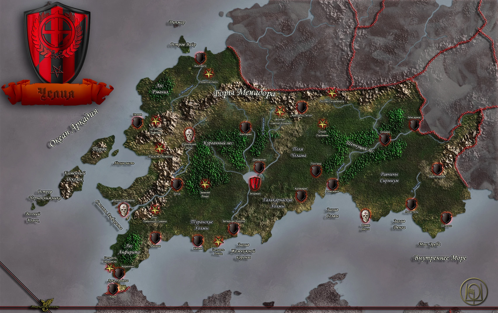
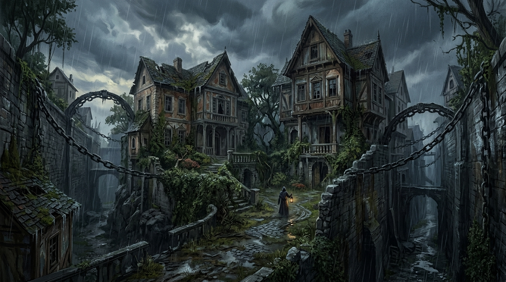
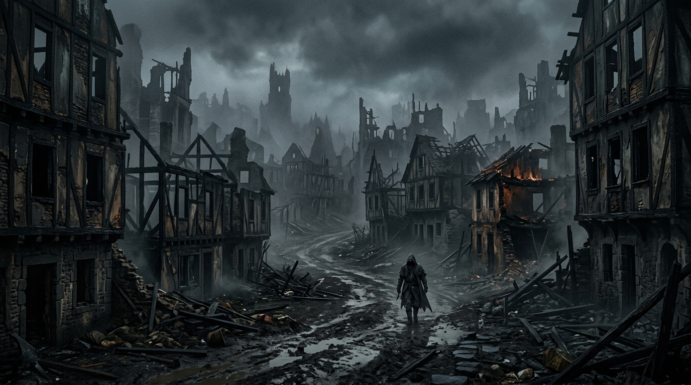
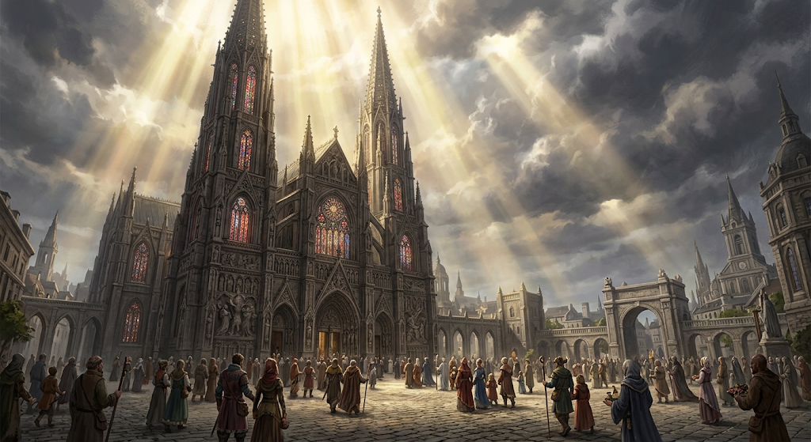
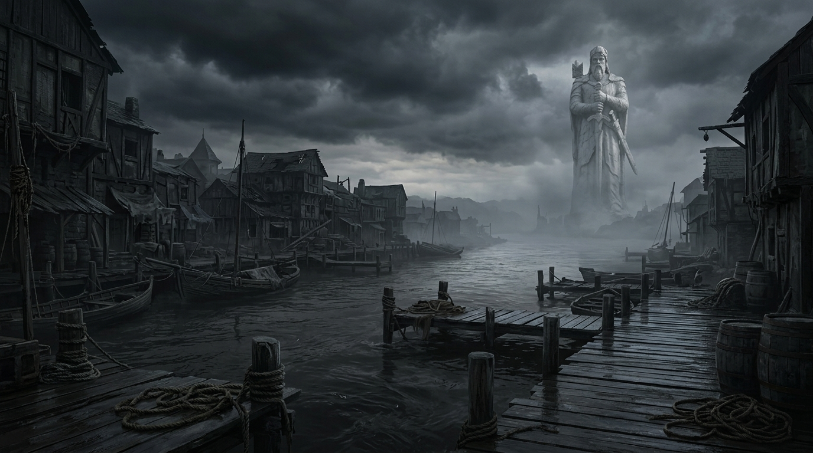

# Лор — Челия и Весткроун

## Система и мир

::: pftab[Весткроун]

|                     |                                                                                                                                                     |
|---------------------|-----------------------------------------------------------------------------------------------------------------------------------------------------|
| **Игровая система** | Pathfinder 2e                                                                                                                                       |
| **Мир**             | Голарион (Golarion).                                                                                                                                |
| **Страна**          | **Челия (Cheliax)** — могущественная держава в регионе Внутреннего моря (Inner Sea).                                                                |
| **Город**           | **Весткроун (Westcrown)** — «Город Сумерек», бывшая столица Челии; ныне портовый город в устье реки Адивиан (Adivian), ~150 миль к югу от Эгориана. |
| **Река**            | **Адивиан (Adivian River)** — река, на которой стоит Весткроун; регулярно выходит из берегов из-за таяния снегов в горах Менадор (Menador).         |

:::

# 1. Челия

::: figure[Карта Челии]

:::

- **Государственная религия — дьяволопоклонничество**, почитание **архидьявола Асмодея** (Asmodeus).
- После смерти бога Ародена и гражданской войны к власти пришёл **Дом Трун (House Thrune)**, заключивший **договор с
  Девятью Преисподними** (the Nine Hells).
- Имперская **бюрократия** Челии насаждает дьяволопоклонничество как государственную религию; простые люди живут в
  постоянном подчинении «тёмному владыке Ада».
- Культура современной Челии основана на поклонении дьяволам (devils).
- **Челийский стиль постройки (Chelish-made):**
    - **Крутые ступенчатые фасады** — стены поднимаются уступами, создавая ощущение высоты и мощи.
    - **Острые, квадратные фасады** — никаких изящных изгибов или арок. Только прямые линии, резкие углы, тяжёлые
      пропорции.
    - **Суровая внешность, но огромные интерьеры** — снаружи здание выглядит как крепость, но внутри — высокие потолки,
      призванные подавлять посетителя своим масштабом.
    - **Тёмный камень** — в Челии особенно популярен чёрный аркадский мрамор с красными прожилками, который ценится и за
      вид, и за теплоизоляцию. В более простых постройках — тёмный гранит, базальт, обожжённый кирпич.
    - **Минимум декора** — никаких кружевных узоров или изящной резьбы. Вместо этого — массивные каменные блоки,
      железные скобы, шипы, функциональные бойницы.
    - Для моста это означает: тяжёлые каменные арки, массивные опоры, тёмный камень, резкие геометрические формы
      сторожевых башен — никакой эльфийской лёгкости или талданского изящества.

# 2. Город — Весткроун (Westcrown)

::: figure[Карта Весткроуна]

:::

## Весткроун — «Город Сумерек»

::: pftab[Весткроун]

| **Весткроун**   | Город                                          |
|-----------------|------------------------------------------------|
| Титулы          | Город Сумерек, Город Девяти Звёзд              |
| Государство     | Челия                                          |
| Размер          | Мегаполис                                      |
| Население       | 114 700                                        |
| Демография      | 88% люди, 7% полурослики, 5% другие            |
| Форма правления | Стандартная (мэр при поддержке монархии Челии) |
| Правитель       | Лорд-мэр Абериан Арванкси                      |

:::

- **История:** Бывшая столица Челии, ранее носила название «Город Девяти Звёзд», ныне — «Город Сумерек».
- **Атмосфера:** упадок и изоляции. После смерти бога Ародена и гражданской войны Весткроун пришёл в упадок; улицы
  обветшали.
- **География:** крупный портовый город в устье реки Адивиан, ~150 миль к югу от Эгориана.
- **Власть денег и преступности:** несмотря на видимую законную власть, реальная сила в Весткроуне — **торговля** и
  знаменитый **Совет Воров (Council of Thieves)**, контролирующий город.
- **Стража:** в Весткроуне функции городской стражи выполняют **доттари (Dottari)**. Их начальник - **Дукстатар (
  Duxotar)**. Текущий Дукстатар — Ильтус Мартис, племянник лорд-мэра Абериана Арванкси: молодой, неопытный, вечно пьяный
  и некомпетентный. В реальности, стража подчиняется 4-м дуротасам (капитанам), которые фактически разделили город на
  зоны влияния.
- **Теневые твари:** На ночных улицах временами встречаются **теневые твари**, уцелевшие после смерти вампира Илнерика
  (Ilnerik) — их прежнего хозяина.
- **Почва для культов:** в городе, потерявшем своего бога-покровителя и погрузившемся в отчаяние, люди ищут новые
  объекты для поклонения.

### История: от «Города Девяти Звёзд» до «Города Сумерек»

- Расцвет Весткроуна был напрямую связан с богом **Ароденом**. В течение **800 лет** город был столицей Челии и,
  согласно преданиям, местом рождения и домом самого бога человечества. Его называли **«Городом Девяти Звёзд»**.
- Всё изменилось в **4606 году AR**, когда Ароден умер. Страна погрузилась в кровавую гражданскую войну.
- Окончательный удар — восхождение **Дома Трун (House Thrune)** в **4640 году AR**. Новые правители-дьяволопоклонники
  перенесли столицу на север, в **Эгориан**. Весткроун лишился своего статуса, богатства и влияния.

## Районы (Парего)

Весткроун делится на три больших части (**Парего**):

### Парего Регикона (Parego Regicona) — «Плавучий Дворец»

::: figure[Парего Регикона]

:::

::: block
Огромный остров в центре города, образованный двумя рукавами реки Адивиан.

- **Рего Корна** («Коронный сектор»): старый Имперский Двор (Коррадат) и поместья домов Дровендж, Обе́риго и Джулистарк.
- **Рего Лаина** («Клинковый сектор»): арсеналы и кузницы. Старейшее обитаемое здание — Ставианкара.
- **Рего Аэрум** («Сектор Сокровищ»): торговля редкостями.
:::

### Парего Доспе́ра (Parego Dospera) — «Алтарь Отчаяния»

::: figure[Парего Доспе́ра]

:::

::: block

Северная, разрушенная часть города.

- **Рего Кадер** («Мертвый сектор»): **Сумеречный рынок (Dusk Market)** и заброшенные сады Рэмбл-Гарденс.
- **Рего Круа** («Кровавый сектор»): бывший центр работорговли. Руины рынка Плеатра и заброшенный храм Уолкурт.

:::

### Парего Спе́ра (Parego Spera) — «Алтарь Надежды»

::: figure[Парего Спе́ра]

:::

::: block

Процветающий полуостров, где живёт 95% населения.

- **Рего Скрипа** («Сектор Писцов»): гарнизон Адских Рыцарей Ордена Дыбы в Тараник-Хаус.
- **Рего Пе́на** («Сектор Монет»): нувориши, запечатанная ложа Pathfinder «Дельвхейвен».
- **Рего Сасеро** («Сектор Жрецов»): гигантская статуя Ародена (Ароденнама), **храм Асмодея «Катада Нессудидия» (Qatada
  Nessudidia)**, особняк лорд-мэра.
    - **Катада Нессудидия** — в «Адской мести» (Hell's Vengeance) выступает как **захваченный «Славным Возвращением»
      собор Асмодея**; его «торговые/сервисные» функции **ограничиваются** **нотариальным заверением договоров,
      магическими услугами и посредничеством в вызове дьяволов**.

:::

### Река Адивиан (Adivian River)

::: figure[Река Адивиан]

:::

::: block

Река, на которой стоит Весткроун; регулярно выходит из берегов из-за таяния снегов в горах **Менадор (Menador)**.

:::

## Организация города

### Официальные власти

- **Лорд-мэр Абериан Арванкси** — формальный правитель; власть во многом номинальна.
- **Доттари (Dottari)** — городская стража; на деле разделилась на **четыре почти независимых подразделения**:
    - **Common dottari** — патрулируют улицы в Спе́ра.
    - **Condottari** — «канальные смотрители», патрулируют водные пути.
    - **Rundottari** — «Смотрители руин», в северных разрушенных районах.
    - **Regidottari** — дворцовая стража.
- **Дукстатар Ильтус Мартис** — формальный командир доттари; некомпетентен, вечно пьян; власть по родству (племянник
  лорд-мэра).

### Теневая власть

- **Совет Воров (Council of Thieves)** — легендарная преступная организация, тайное общество. Возник около **4285 AR**;
  после 4469 AR перешёл от насилия к «беловоротничковой» преступности. В Совет входят представители **восьми знатных
  домов** Весткроуна. Патриарх — **Вассиндио Дровендж**. К 4710 AR его власть ослабевает.
- **Адские рыцари (Hellknights)** — **независимый/полуавтономный орден** (не часть государственного аппарата),
  «помогающий» поддерживать порядок. Охотятся на ересь. Гарнизон в **Тараник-Хаус** (Рего Скрипа),
  не менее 15 рыцарей. Штаб — **Цитадель Ривад** (в дне пути к западу).

### Повстанческие движения

- **Дети Весткроуна (Children of Westcrown)** — движение «снизу», возглавляют **Араэль** (полуэльф-жрец Иомедаи) и
  **Джанивен** (человек-следопыт).
- **Славное Возвращение (Glorious Reclamation)** — рыцарский орден Иомедаи, в **4716 AR** поднял восстание.

## Теневые твари (Shadow Beasts)

- **Происхождение:** теневые твари — **прислужники вампира Илнерика (Ilnerik)**, «частично из-за задачи,
  возложенной на него Трунами, и частично как побочный эффект того, что он был вампиром».
- **Исторический статус:** теневые твари **больше не являются постоянной угрозой**.
- **В сценарии:** часть теневых тварей **осталась в городе после смерти Илнерика** и **до сих пор
  временами досаждает жителям**. Из-за них введён **комендантский час**, и ночная жизнь замирает.
- Это — не слух, а реальная (хотя и урезанная) опасность; причина комендантского часа.

---

# 3. Культы

## Асмодей (Asmodeus) — «Принц Тьмы» (The Prince of Darkness)

> Источник: **Core Rulebook** pg. 437; **Lost Omens: Gods & Magic** pg. 14 (описание) и pg. 15 (божественное
> вмешательство).

- **Статус:** **Принц Тьмы**, владыка тьмы и закона, правитель плана **Ада (Hell)** — **царство Несс (Ness)** (План).
  Одни из старейших сущностей мультивселенной; по собственным писаниям Асмодея и «Книге Проклятых» (Book of the Damned)
  — один из первых богов, убивший своего брата **Ихиса (Ihys)** ради абсолютного порядка. **Законно-злое (LE)**
  божество; сильнейшее законно-злое божество региона Внутреннего моря.
- **Сферы интересов:** **контракты, гордость, рабство, тирания**; наслаждается соблазнением смертных встать на путь зла;
  поощряет строгую иерархию, где каждый знает своё место, и использует порядок для собственной эгоистичной выгоды.
- **Эдикты:** заключать контракты с выгодой для себя; править тиранией и пытать более слабых; проявлять подхалимство
  перед теми, кто выше вас.
- **Анафема:** разорвать контракт; освободить раба; оскорблять Асмодея, проявляя милосердие к своим врагам.
- **Мировоззрение последователей:** **Законно-злой (LE)**.
- **Союзник:** **Абадар (Abadar)**. **Враги:** Кайдэн Кайлин (Cayden Cailean), Иомедаи (Iomedae), Ирори (Irori),
  Ламашту (Lamashtu), Ровагуг (Rovagug), Саренрей (Sarenrae), Шелин (Shelyn), Бесмара (Besmara), Бабушка Паучиха
  (Grandmother Spider). **Отношения:** Ихис (Ihys) — умерший брат.
- **Дома:** тёмные храмы возле правительственных зданий. **Верующие:** дьяволопоклонники, юристы, работорговцы, те, кто
  стремится к власти или дисциплине.
- **Священное животное:** **змей**. **Священные цвета:** **чёрный и красный**. **Символ:** **пятилучевая звезда (
  пентаграмма)** — эмблема Асмодея и его ордена.

### Позиция в Челии и роль в «Совете Воров» (Council of Thieves AP)

- **Позиция:** ядро государственной религии Челии. **Статус в Челии:** каждый челиец **хотя бы формально** поклоняется
  Асмодею; в **каждом доме** — его **алтарь или символ**. Дом Трун связан с церковью **договором** и доктринально её
  поддерживает.
- **Доктрина:** **договор превыше всего**; сильные правят слабыми; **письменный договор имеет абсолютную силу**;
  иерархический порядок нерушим. «Следовать букве закона» — без официального запроса церковь не вмешивается.
- **Организационные черты:** жрецы носят **дорогие красно-чёрные одеяния**, предпочитают **сложные ритуалы**
  (включая **жертвоприношения животных**) и **демонстрации магии**; повышение в должности требует подписания **крайне
  суровых договоров**.
- **Адские рыцари (Hellknights)** и **Орден Дыбы (Order of the Rack)** — полуавтономные, независимые, негосударственные
  структуры, «помогающие» поддерживать порядок. Охотятся на **ересь** в различных её проявлениях.

### Преимущества последователя (Devotee Benefits)

> Источник: **Lost Omens: Gods & Magic** pg. 14.

- **Божественная характеристика:** **любая**; однако персонажи, связывающие себя с Асмодеем таким образом, **на всю
  вечность связывают свои души с Принцем Тьмы**.
- **Божественная сила:** **раняющая (wounding)**.
- **Божественный навык:** **Обман (Deception)**.
- **Предпочитаемое оружие:** **булава (mace)**.
- **Домены:** **Уверенность (Confidence), Огонь (Fire), Хитрость (Trickery), Тирания (Tyranny)**.
- **Альтернативные домены:** **Долг (Duty), Глиф (Glyph)**.

**Заклинания жреца:**

::: pftab[Заклинания жреца]

| Уровень | Заклинание                      |
|---------|---------------------------------|
| 1-й     | Очаровать (Charm) / Закл. 1     |
| 4-й     | Внушение (Suggestion) / Закл. 4 |
| 6-й     | Обманка (Mislead) / Закл. 6     |

:::

### Божественное вмешательство (Divine Intercession)

> Источник: **Lost Omens: Gods & Magic** pg. 15.

- Асмодей склонен предлагать дары, чтобы соблазнить тех, кто готов поддаться его гнусным искушениям; его проклятия
  чаще всего направлены на тех, кто нарушает контракты от его имени или совершает другие личные оскорбления.

**Дары (Boons):**

- **Небольшой дар (Minor Boon):** довольный талантом к манипуляциям, Асмодей усиливает ваши навыки. Однажды, когда вы
  проваливаете проверку Дипломатии для значимой или последовательной Просьбы (Request), вы можете сотворить на цель
  Просьбы **Внушение (Suggestion) / Закл. 4**, предложив тот же ход действий. Это врождённое сакральное заклинание.
- **Умеренный дар (Moderate Boon):** глаза светятся красным, как угольки, кожа приобретает малиновый оттенок. Вы
  получаете **ночное зрение** и **сопротивление огню 5**.
- **Серьёзный дар (Major Boon):** Асмодей помогает обеспечивать соблюдение ваших сделок и контрактов. Когда существо
  заключает с вами сделку/контракт **без принуждения и по собственной воле**, оно **не может добровольно нарушить**
  свою сторону, пока вы поддерживаете свою. Вы всегда можете нарушить сделку сами, но тогда существо тоже перестаёт
  быть обязанным.

**Проклятия (Curses):**

- **Небольшое проклятие (Minor Curse):** пламя Асмодея сжигает вас великой злобой. Вы получаете **слабость 5 к огню**.
- **Умеренное проклятие (Moderate Curse):** Асмодей заставляет вас подчиняться. Вы **не можете добровольно отказаться**
  от соглашения/контракта или от своего слова, хотя нужно следовать **только букве**, а не сути.
- **Серьёзное проклятие (Major Curse):** Асмодей обратил внимание на учинённый вами хаос. Вы получаете **древнюю рану**
  (старше самого времени): **постоянно истощены 4** (нечто, кроме ещё одного дара, не снимает состояние), и рана ноет
  при особенно хаотичных поступках, вызывая **тошноту 1**.

## Дагон (Dagon) — «Тень в Море» (The Shadow in the Sea)

> Источник: **Lost Omens: Gods & Magic** pg. 76 (описание) и pg. 124–125 (преимущества последователя).

- **Происхождение и статус:** **одно из древнейших существ Бездны**; изначально **клинпот (khepate/qlippoth)**,
  превратившийся в **демонического повелителя** — ни один смертный не понимает этого превращения. За это он **
  заслужил неприязнь бывших сородичей**. **Демон (demon, Chaos)**, а НЕ дьявол (devil, Law).
- **Сфера:** **уродства, море и морские чудовища**.
- **Царство:** **Уготанок (Ugathoyk)** — Ишиар / **Бездна (Abyss)** (План).
- **Внешность:** массивное существо с **нижней частью тела угря**, **головой, напоминающей глубоководных хищников**, и
  **четырьмя бьющимися щупальцами вместо рук**. Правит в бесконечном океане, покрытом **дезориентирующими островами**
  и **глубоководными впадинами**, заполненными **непостижимыми затонувшими городами**.
- **Эдикты:** плавать под водой, развивать свою силу, поощрять распространение опасных морских монстров.
- **Анафема:** **нарушить данную клятву**, **поселиться в районе без выхода к морю**, **поделиться с посторонними
  секретами Дагона** (каждый — тяжкий грех против него).
- **Мировоззрение последователей:** **Хаотично-нейтральный (NE), Хаотично-злой (CE)**.
- **Поклоняющиеся:** в первую очередь — **боггарды (boggards), сауагины (sahuagin), скамы (skum) и болотные гиганты (bog
  giants)**; известно, что **отчаявшиеся или порочные прибрежные деревни** присягали лорду демонов (соблазняемые богатым
  уловом или экзотическими золотыми украшениями), **часть моряков**.
- **Типичная деятельность:** подводить корабли к рифам, кровавыми жертвами вызывать морских чудовищ; маскироваться под
  **потерпевших кораблекрушение** или **портовых грузчиков**, чтобы попасть на борт.
- **Священный символ:** **глаз осьминога в золотом диске, окружённый древними рунами**.
- **Связь с Весткроуном:** как портовый город Весткроун **логически подходит** для культа Дагона.

### Преимущества последователя (Devotee Benefits)

- **Божественная характеристика:** **Сила (Strength) или Телосложение (Constitution)**.
- **Божественный навык:** **Атлетика (Athletics)**.
- **Предпочитаемое оружие:** **трезубец (trident)**.
- **Домены:** **Изменение (Change), Разрушение (Destruction), Вода (Water), Рвение (Zeal)**.
- **Божественная сила:** **ранящая (wounding)**.

**Заклинания жреца:**
::: pftab[Заклинания жреца]

| Уровень | Заклинание                     |
|---------|--------------------------------|
| 1-й     | Водный толчок (Hydraulic Push) |
| 3-й     | Ноги-ласты (Feet to Fins)      |
| 6-й     | Цепь молний (Chain Lightning)  |

:::

## Сифкеш (Sifkesh) — «Прошептанное Сомнение» (The Whispered Doubt)

> Источник: **Lost Omens: Gods & Magic** pg. 126–127 (описание и преимущества последователя), **Book of the Damned**
> pg. 93.

- **Природа:** **демон-лорд (demon, Chaos)** самоубийства, отчаяния и сомнения.
- **Происхождение:** многие верят, что изначально Сифкеш была **эринией (erinny)**, ставшей **первым еретиком Ада (the
  first heretic of Hell)**.
- **Способ действия:** она не стремится просто уничтожать плоть и разрушать окружение, а вместо этого **отравляет
  умы**, искушая верующих предать свою религию богохульствами, наносящим **длительный ущерб репутации** их религии и
  обществу. Больше всего удовольствия ей доставляет **почти павший жрец**, понимающий, что он натворил, и **добровольно
  расстающийся с жизнью**, — тогда Сифкеш **подхватывает душу еретика и пожирает её**.
- **Внешност:** **человеческая женщина** с **белоснежными птичьими крыльями** и **тонкими чёрными волосами,
  сочащимися кровью**; губы и глаза **зашиты ржавой проволокой**, тело **разрезано на куски** (обычно в местах бедренных
  и плечевых суставов, но могут быть и другие); каждая часть тела **парит независимо**, двигаясь **не совсем
  синхронно** с остальными.
- **Аномалия классификации:** она воплощает роли **всех трёх основных бесовских народов** — **совращает как дьявол (
  devil)**, **питается как демон (demon)**, но **по факту является демоном** — что долгое время было **головоломкой
  для учёных**, пытавшихся классифицировать её демоническую природу.
- **Эдикты:** **сеять сомнения среди верующих**; **рушить репутацию религий**; **склонять правонарушителей к
  самоубийству** вместо того, чтобы позволять искупление.
- **Анафема:** **давать надежду**, **предлагать прощение**, **искренне чтить или взывать к другому богу**.
- **Мировоззрение последователей:** **Нейтрально-злой (NE), Хаотично-злой (CE)**.
- **Царство:** **Вантиан (Vanthan)** — **Бездна (Abyss)** (План).

### Преимущества последователя (Devotee Benefits)

> Источник: **Lost Omens: Gods & Magic** pg. 126–127.

- **Божественная характеристика:** **Мудрость (Wisdom) или Харизма (Charisma)**.
- **Божественный навык:** **Обман (Deception)**.
- **Предпочитаемое оружие:** **боевая бритва (battle knife)**.
- **Домены:** **Кошмары (Nightmares), Боль (Pain), Скорбь (Sorrow), Хитрость (Trickery)**.
- **Божественная сила:** **раняющая (wounding)**.

**Заклинания жреца:**
::: pftab[Заклинания жреца]

| Уровень | Заклинание                                                   |
|---------|--------------------------------------------------------------|
| 1-й     | Дурная примета (Ill Omen) / Закл. 1                          |
| 4-й     | Сокрушительное отчаяние (Crushing Despair) / Закл. 5         |
| 5-й     | Подсознательное внушение (Subconscious Suggestion) / Закл. 5 |

:::

### Связь с Весткроуном (исторический фон)

- **Белая Чума (White Plague):** в **4573 AR** культ Сифкеша, называвший себя **«Путь Благодати» (Path of Grace)**, в
  Весткроуне устроил **«Белую Чуму»** — **массовые убийства и самоубийства**.
- **Ключевая деталь:** жертв толкали к **самоуничтожению** — **самоубийства** (вместе с убийствами); **«отчаяние» как
  оружие**, что подчёркивает природу культа.
- **Ответ:** на культ были созданы **Адские рыцари (Hellknights)** — орден, охотящийся на демонических культистов.

## Шелин (Shelyn) — «Вечная Роза» (The Eternal Rose)

> Источник: **Core Rulebook** pg. 440; **Lost Omens: Gods & Magic** pg. 44 (описание) и pg. 45 (божественное
> вмешательство).

- **Статус:** **богиня (good, Neutral) искусства, красоты, любви и музыки**; хочет однажды **спасти своего искажённого
  брата Зон-Кутона (Zon-Kuthon)**.
- **Характер:** Шелин наблюдает за жизнью **добрым и любящим взглядом**, побуждая смертных делать всё возможное в
  своей жизни и **распространять любовь, искусство и красоту** как можно лучше. В её глазах **даже самые грубые
  художественные прозрения достойны похвалы**, поскольку представляют собой индивидуальное выражение жизненных
  испытаний и побед. Она считает, что **каждое существо достойно любви** и способно по-своему творить искусство.
- **Отношение к любви:** религия Шелин **не требует целомудрия, привязанности или определённой структуры отношений**,
  поскольку страсть раннего романа — аспект любви столь же важный, как комфортное доверие давней супружеской пары.
  Тем не менее она **различает ухаживания и чистое плотское желание** и предпочитает, чтобы свидания перерастали в
  более значимые отношения.
- **Эдикты:** **быть миролюбивым**, **выбирать и совершенствовать искусство**, **быть примером**, **видеть красоту
  во всём**.
- **Анафема:** **уничтожать искусство или допустить его уничтожение** (если только не спасаете жизнь или не стремитесь
  к большему искусству); **отказаться принимать капитуляцию**.
- **Сферы интересов:** **искусство, красота, любовь, музыка**.
- **Мировоззрение последователей:** **Законопослушное-доброе (LG), Нейтрально-доброе (NG), Хаотично-доброе (CG)**.
- **Царство:** **Цветущее Сердце (Blooming Heart)** — **Нирвана (Nirvana)** (План).
- **Союзники:** **Абадар (Abadar)**, Калистрия (Calistria), Кайдэн Кайлин (Cayden Cailean), Дезна (Desna), Эрастил
  (Erastil), Саренрей (Sarenrae), Брай (Brigh), Шицуру (Shizuru). **Враги:** Асмодей (Asmodeus), Ровагуг (Rovagug),
  Ургатоа (Urgathoa), Зон-Кутон (Zon-Kuthon).
- **Отношения:** Дезна (Desna) — возлюбленный; Саренрей (Sarenrae) — возлюбленный; Зон-Кутон (Zon-Kuthon) — брат.
- **Храмы:** художественные галереи, соборы, сады, музеи, театры. **Верующие:** артисты, любовники, менестрели,
  музыканты, ищущие искупления.
- **Священное животное:** **певчая птица (songbird)**. **Священные цвета:** **все**.

### Преимущества последователя (Devotee Benefits)

> Источник: **Lost Omens: Gods & Magic** pg. 44.

- **Божественная характеристика:** **Мудрость (Wisdom) или Харизма (Charisma)**.
- **Божественная сила:** **исцеляющая (healing)**.
- **Божественный навык:** **Ремесло (Craft) или Выступление (Performance)**.
- **Предпочитаемое оружие:** **глефа (glaive)**.
- **Домены:** **Творчество (Creation), Семья (Family), Страсть (Passion), Защита (Protection)**.
- **Альтернативные домены:** **Покой (Repose)**.

**Заклинания жреца:**
::: pftab[Заклинания жреца]

| Уровень | Заклинание                              |
|---------|-----------------------------------------|
| 1-й     | Цветные брызги (Color Spray) / Закл. 1  |
| 3-й     | Захватывающая речь (Enthrall) / Закл. 3 |
| 4-й     | Созидание (Creation) / Закл. 4          |

:::

### Божественное вмешательство (Divine Intercession)

> Источник: **Lost Omens: Gods & Magic** pg. 45.

- Когда существа совершают приятные поступки (распространение красоты) или неприятные действия (предательство
  близких), Шелин может отреагировать соответствующим образом.

**Дары (Boons):**

- **Небольшой дар (Minor Boon):** однажды, когда вы при броске проверки Дипломатии получаете провал, то **вместо этого
  получаете крит.успех**. Шелин обычно награждает этим даром только тогда, когда проверка Дипломатии служит усилению
  любви или даёт шанс на искупление.
- **Умеренный дар (Moderate Boon):** вы вдохновлены на создание великих произведений и становитесь виртуозом во всех
  видах искусства. Вы получаете способности **Специализация в ремесле (Specialty Crafting) / 1** и **Виртуозный
  исполнитель (Virtuosic Performer) / 1** во всех категориях Ремесла и Выступления.
- **Серьёзный дар (Major Boon):** ваша внутренняя красота и любовь окружают вас аурой. Пока вы не несёте им зла, **все
  существа, кроме бесов, нежити и неразумных**, имеют к вам **дружественное начальное отношение** (если только
  они не были сразу любезными). Это не значит, что они должны менять жизнь или планы ради вас, и дар не предотвращает
  ухудшение отношения, если вы им препятствуете. Эффект **не работает на божеств** и подобных могущественных
  существ. Дополнительно: любовь, которой вы делитесь с друзьями, вдохновляет их — **вы и все союзники получаете
  бонус состояния +3 к спасброскам и проверкам навыков, пока видите друг друга**.

**Проклятия (Curses):**

- **Небольшое проклятие (Minor Curse):** ваше сердце сжимается от раскаяния. Каждый день вы испытываете **тошноту 1**,
  потому что какой-то конкретный проступок снова и снова проигрывается в вашем сознании в виде чувства вины. Состояние
  **не можно снять**, хотя оно утихает достаточно, чтобы быстро есть и пить, когда необходимо. Если вы загладите
  вину или иным образом искренне стремитесь искупить проступок, тошнота **полностью исчезнет в тот же день**.
- **Умеренное проклятие (Moderate Curse):** другие подсознательно признают ваши прошлые предательства. Каждый раз,
  когда вы при броске Дипломатии получаете **провал, вместо этого получаете крит.провал**, а если получаете
  **крит.успех, получаете просто успех**.
- **Серьёзное проклятие (Major Curse):** те, кто сеют страдания с помощью ложной любви, сталкиваются с величайшим
  проклятием Шелин. Вы **теряете способность отличать одно живое существо от другого** по внешнему виду, голосу, запаху
  или подобным сенсорным средствам. Вы можете определить **физический размер** (поэтому не спутаете муравья с лошадью),
  но не более. Если вы были поверхностны, каждое существо, которое вы видите, имеет **общие, мягкие черты**; если ваши
  поступки были гнусными — вы видите **только лица тех, кого обидели**.

---
