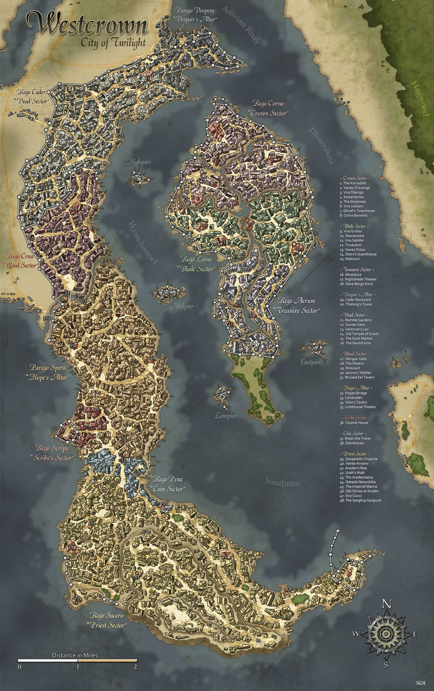
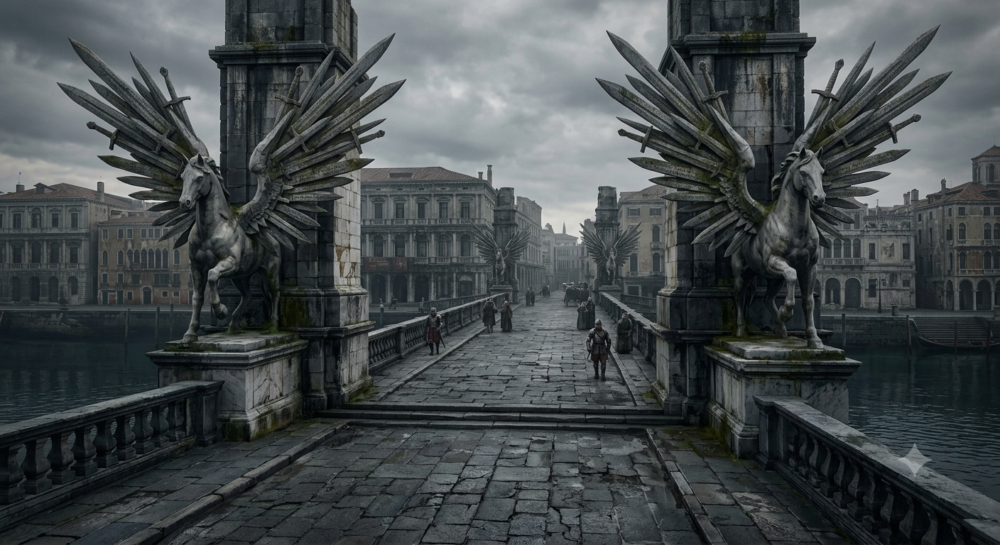
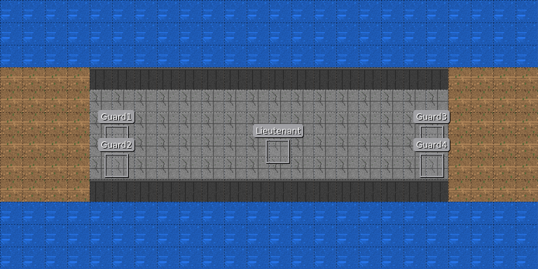

# Глава 1. Город Весткроун

**Таймлайн главы 1: 12:00–17:30.**

Игроки прибывают в Весткроун по западному тракту. Глава — завязка: знакомство с сеттингом и персонажами, получение
зацепок, отправка в таверну «Слёзы устрицы».

## Структура главы

1. **Вход.**
    - Мост Клинкокрыла. Игроки знакомятся с **Художником**, а также с порядками в городе (доттари рассказывают про
      комендантский час и районы).
    - Улицы Весткроуна. Игроки идут по улицам города, натыкаются на место преступления, встречают **Детектива** (который
      отправляет их к дуксотару).
2. **Развилка.** Игроки выбирают, чем займутся дальше:
    - **A. Расследование серии убийств.**
        - A1. Тривардум, офис дуксотара — взятие заказа.
        - A2. Морг — осмотр тел.
        - A3. Помощник доктора — направляет в таверну «Слёзы устрицы».
        - A4. Сход: «Слёзы устрицы».
    - **B. Контрабанда.** Игроки по предложению Художника или своим мотивам пошли на Сумеречный рынок.
        - B1. Сумеречный рынок. Нападение группы воров для проверки навыков.
        - B2. Совет Воров. Получение заказа на поиск новых поставщиков.
        - B3. Сумеречный рынок. Опрос торговцев. Выход на след «Погибели Дьявола».
        - B4. Сход: «Слёзы устрицы».
    - **C. Дезертир.** Игроки по своим мотивам или видя корабль с чёрными парусами решили пойти в порт.
        - C1. Порт. Нападение группы моряков для проверки навыков.
        - C2. Порт. Таверна «Булькающая гаргулья» — встреча с Капитаном.
        - C3. Порт. Таверна «Трикалиста». Допрос моряков/докеров. Выход на след Корина Марроне.
        - C4. Сход: «Слёзы устрицы».
3. **Развязка.**
   Игроки получают одну или несколько зацепок, которые отправляют их в Слёзы устрицы за город.

## Таблица таймлайна

| Время | Триггер                                                  | Событие                                                                                                      | Результат                                                                  |
|-------|----------------------------------------------------------|--------------------------------------------------------------------------------------------------------------|----------------------------------------------------------------------------|
| 12:00 | Начало главы                                             | Игроки прибывают в Весткроун                                                                                 | Фон «Потоп» = 0                                                            |
| —     | Игроки прибывают в Весткроун                             | Зачитывается общий вид Весткроуна                                                                            | Знание «Весткроун». Общий вид города, структура районов                    |
| —     | Осмотр реки (Мудрость/Интеллект, СЛ 15)                  | Мутная река, застывшие флюгеры, беззвучные стаи птиц, тучи, ветер                                            | Зацепка «Ветровой нагон» / «Потоп» — через пару дней может быть наводнение |
| —     | Осмотр залива Жемчужной короны (Внимательность, СЛ 10)   | Из залива входит корабль с чёрными парусами и белой сиреной                                                  | Зацепка «Чёрная Сирена» (корабль уходит к внутренним причалам)             |
| 12:30 | Мост Клинкокрыла                                         | Стража доттари проверяет въезжающих                                                                          | Знание «Оборона запада»                                                    |
| 12:45 | Сцена: встреча с Художником                              | На мосту встречается Лучиано Аврелиан (d6=6)                                                                 | Знакомство: Лучиано Аврелиан (Художник)                                    |
| 13:00 | Таможенная проверка                                      | Доттари требуют документы/пошлину/взятку                                                                     | Игроки не могут войти, пока не разберутся                                  |
| 13:30 | Небо заволакивает облаками                               | Улицы Весткроуна / случайные места убийств d6                                                                | Фон «Потоп» +1                                                             |
| 14:30 | Развилка (A / B / C)                                     | Игроки выбирают, чем займутся дальше                                                                         | Определение ветки расследования                                            |
| 15:00 | Ветер крепчает                                           |                                                                                                              | Фон «Потоп» +1                                                             |
| 16:00 | Вода в реке мутнеет                                      |                                                                                                              | Фон «Потоп» +1                                                             |
| 17:00 | Начинается дождь                                         |                                                                                                              | Фон «Потоп» +1                                                             |
| 17:30 | Развязка главы (A4 / B4 / C4)                            | Игроки отправляются в «Слёзы устрицы»                                                                        | Конец главы 1                                                              |
| 17:30 | Отказ при переправе через реку (паром/лодка в port/pier) | Погода портится, на воде опасно, пармощики отказываются везти. Единственный путь — по суше (Адиванский мост) | Игроки едут через мост (глава 2)                                           |
| 18:30 | Игроки остаются в городе после темноты                   | Теневые звери                                                                                                | Конец приключения (если останутся)                                         |

---

# Этап 1. Прибытие в город

## 1.0 Общий вид Весткроуна

При подходе к городу зачитать:

> Вы стоите на гребне Галикарнасских холмов, и перед вами в утренней дымке расстилается Весткроун.
> С высоты город похож на огромного раненого зверя, приникшего к дельте реки Адивиан. Когда-то его называли Городом
> Девяти Звёзд — теперь это Город Сумерек. Ветер, словно стеной давящий на грудь, несёт с залива Жемчужной короны запахи
> соли и гниющего дерева.
> Самый заметный ориентир — гигантская статуя Ародена. Беломраморный колосс высотой в девяносто футов поднимается над
> крышами южного берега. Даже отсюда видно серебряную инкрустацию на его груди — символ крылатого ока. Статуя не тронута
> временем: ни пятна, ни трещины. Она стоит, как и сотни лет назад, лицом к реке, словно всё ещё ждёт возвращения
> мёртвого
> бога. Вокруг неё — площадь с заброшенными зданиями, построенными к его приходу. Приход, который так и не случился.
> Левее, в самом сердце города, остров Парего Регикона — «Плавучий Дворец». Его окружает стена с цепными арками, а за
> ней
> теснятся дворцы старой знати: Дровендж, Обе́риго, Джулистарк. Шпили и купола ещё хранят остатки былого величия, но
> краска облупилась, а сады заросли. Флюгеры, некогда радостно крутящиеся на крышах, кажется намертво застыли, показывая
> на север. Некогда здесь заседал Имперский Двор. Теперь это остров призраков в человеческом обличье — обедневших
> аристократов, цепляющихся за титулы.
> Прямо под вами, вдоль южного берега, кипит порт. Сотни мачт, склады, причалы.
> Стаи птиц, беззвучно кружащих над утренним хаосом занятых людей.
> Утро — время торговли, и Весткроун на несколько часов становится похож на живого.
> Отсюда уходят корабли вниз по реке, к Внутреннему морю. Но чем дальше на север, тем тише становится город.
> Там, за каналами, лежит Парего Доспе́ра — «Алтарь Отчаяния». Руины, обгоревшие каркасы домов, пустые глазницы окон.
> Там не ходят днём. А ночью там не ходят вообще.
> И вот, когда вы уже готовы тронуться в путь, взгляд цепляется за движение на воде.
> Из залива Жемчужной короны в устье мутного Адивиана входит корабль.
> Он идёт медленно, уверенно, словно не замечая тёмных туч на горизонте, медленно ползущих к городу.
> Чёрные паруса, как вымпелы ночи, надуты теплым и упругим ветром с залива.
> А на каждом из них — белая сирена, раскинувшая руки, словно приглашающая в объятия.
> Корабль скользит мимо доков, не сворачивая к торговым причалам, мимо статуи Ародена и уходит к внутренним причалам
> острова. Никто на берегу не машет ему. Никто не выходит встречать.
> Весткроун смотрит на него молча.
> Добро пожаловать в Город Сумерек.

**Проверка на Мудрость (Выживание) или Интеллект (Природа), СЛ 15:** игроки узнают, что мутная река, застывшие флюгеры,
беззвучные стаи птиц, тучи на горизонте и незатухающий ветер с залива — это всё признаки **Ветрового нагона**, и через
пару дней в городе может произойти мощное наводнение (зацепка «Ветровой нагон» / «Потоп»).

---

# Этап 2. Мост Клинкокрыла

**Время:** 12:30.

## Зачитать при первом входе

Вы подходите к западному въезду в Весткроун. Перед вами — Мост Клинкокрыла: длинная каменная лента, перекинутая через
Канароден. Под вами — тёмная, глубокая вода, вдвое глубже городских каналов. Опоры, перила и парапеты украшены крылатыми
конями, а вдоль стен канала тянутся огромные фризы высотой в пятнадцать футов — фигуры, стёртые временем, но всё ещё
смотрящие на проходящих.

На мосту кипит обычная дневная толчея. Стража проверяет документы, заглядывает в повозки, откидывает полог, стучит по
ящикам. Писец у стола скрипит пером, записывая пошлины. Кто-то смеётся, кто-то спорит, ребёнок плачет, лошадь фыркает,
колёса грохочут по брусчатке. Пахнет мокрым камнем, водой, пылью, лошадьми и дымом. За мостом видны чистые, строгие
здания Rego Scripa — Сектора Писцов.

Чуть в стороне, у парапета, стоит высокий стройный мужчина. Он не спешит пройти. Он смотрит на толпу так, словно перед
ним не пропускной пункт, а полотно: оценивающе, жадно, смакуя каждый звук и запах. В его длинных пальцах — карандаш, из
карманов жилета торчат кисти и тюбики. На мгновение его серые глаза останавливаются на вас. Улыбка трогает губы, но не
доходит до глаз. В воздухе — лёгкий запах масляной краски, льняного масла, резких трав и странного, противоестественного
холода. Он ещё не подошёл. Но вы уже чувствуете, что вас оценивают.

## Атмосфера

Каменный мост Пегасов, перекинутый через глубокий канал Канароден — самый длинный и наименее изменённый канал
Весткроуна, вдвое глубже каналов внутреннего города. На мосту — стража и, возможно, укрепления. За мостом — Rego Scripa,
часть Parego Spera. Это главный вход в Весткроун с запада. Пахнет водой, мокрым камнем и пылью; слышны шаги стражи,
плеск воды и ветер.

## Наблюдения

- **Оборонительные укрепления** — мост имеет важное оборонное значение.
- **Фризы Канародена** — огромные фризы высотой 15 футов с изображениями фигур.
- **Изображения крылатых коней** — как и другие мосты Пегасов.

## Входы и выходы

- **Вход:** с западного тракта — единственная сухопутная дорога в город с запада.
- **Выход → Rego Scripa** — торговый район; далее к **Улицам Весткроуна**.
- **Выход (условный, при провале переговоров):** → **Боевая сцена** доттари.

## Сцена: встреча с Художником

Мост — место, где игроки могут впервые встретить **Лучиано Аврелиана (Художника, d6=6)**.

- **Как это работает.** Художник наблюдает за игроками, делает заметки/зарисовку и подходит — то ли как любознательный,
  то ли как «заказчик». Может предложить работу — помощь с поиском артефакта его храма.
- **Атмосфера.** Бесшумная кошачья грация, вкрадчивый голос с металлическим оттенком, стойкий запах масляной краски,
  льняного масла и резких трав; еле уловимый противоестественный холод. Улыбка — натянутая, не доходит до глаз.
- **Улики/намёки.** При проверке (Внимательность, СЛ 10): пальцы и кисти испачканы в краске, из карманов торчат кисти и
  тюбики (зацепка «Художник»). При критическом успехе (Внимательность, СЛ 15) — «Признаки маньяка»: противоестественный
  холод, «пустая маска» и холод во взгляде.
- **Последствие.** Взятие заказа «Поиск артефакта храма» → отношение Художника +1; провал/отказ → Художник уходит
  бесшумно, но следит за партией.

### Стат-блок: Лучиано Аврелиан — Художник (d6=6)

#### Что зачитать игрокам при первой встрече

> У парапета стоит высокий, стройный мужчина лет тридцати пяти с почти аристократическими и необычайно острыми чертами
> лица — резкими скулами и высоко очерченным лбом. В его осанке и движениях — мягкая, бесшумная кошачья грация; держится
> он слишком прямо и дерзко легко для обычного горожанина. Тёмные волосы аккуратно зачёсаны назад. Серые глаза с
> безумной
> искрой и обаятельная улыбка — но эта улыбка кажется натянутой фальшивкой, не доходит до глаз. Стоит ему подумать, что
> на
> него никто не смотрит, как лицо мгновенно теряет эмоции и превращается в пустую маску. Он одет в простую, но
> качественную тёмную рубаху, кожаный жилет и тёмные штаны; на ногах — мягкие туфли. Длинные пальцы и кисти рук
> испачканы
> в краске, из карманов жилета торчат кисти и тюбики с масляными красками. В воздухе вокруг него — стойкий смешанный
> аромат масляной краски, льняного масла, резких трав и еле уловимого, противоестественного холода.

#### Идентификация

- **Имя:** Лучиано Аврелиан.
- **Прозвище:** «Маэстро».
- **Роль:** ложная личность «вольный художник»; по факту — паладин (тайный агент ордена) из Мендева, серийный убийца.
- **Раса:** аасимар.
- **Мировоззрение:** Хаотично-добрый (CG).
- **Статус:** main_npc.
- **Может ли быть жертвой:** true.

#### Описание

Ложная личность «вольный художник» — на самом деле паладин (тайный агент ордена) из Мендева, поклоняется Шелин; серийный
убийца (убивает тех, кого считает злыми, получает удовольствие).

#### Скрывает

- **[big]** Паладин (тайный агент ордена) из Мендева. Покровитель — ШЕЛИН, но его путь — ПАДЕНИЕ/извращение. Официально
  не имеет права на убийства в этой стране — действует тайно.
- **[big]** Серия убийств — «пытки» участников Праздника Пива (не «охота на культистов» — его ложное убеждение).
- **[big]** Миссия: вернуть реликвию (мумифицированный череп святого, украденную ворами и выкупленную культистами
  Дагона).
- **[big]** Серийный убийца; убивает тех, кого считает злыми, получает удовольствие.
- **[big]** Тайно принимает наркотики — Лист-живодёр (Flayleaf).
- **[small]** Ложная личность: арендовал мансарду, представившись вольным художником.

#### Хочет

- вернуть реликвию в орден;
- покарать укравших её культистов.

#### [PF2e stat-block]

| Параметр          | Значение                                                                                                                         |
|-------------------|----------------------------------------------------------------------------------------------------------------------------------|
| **Уровень**       | 9                                                                                                                                |
| **Мировоззрение** | CG (падший паладин)                                                                                                              |
| **Раса**          | Аасимар                                                                                                                          |
| **Роль**          | Solo boss / melee striker                                                                                                        |
| **Восприятие**    | +18 (moderate)                                                                                                                   |
| **Языки**         | Общий, Небесный, Акло, Варисийский                                                                                               |
| **Навыки**        | Акробатика +18, Атлетика +17, Обман +20, Скрытность +20, Религия +17, Ремесло (живопись) +15, Запугивание +17, Знание Дагона +17 |
| **Сила**          | +3                                                                                                                               |
| **Ловкость**      | +5                                                                                                                               |
| **Телосложение**  | +3                                                                                                                               |
| **Интеллект**     | +3                                                                                                                               |
| **Мудрость**      | +4                                                                                                                               |
| **Харизма**       | +5                                                                                                                               |
| **AC**            | 28 (high)                                                                                                                        |
| **HP**            | 151                                                                                                                              |
| **Скорость**      | 30 футов                                                                                                                         |
| **Спасброски**    | Стойкость +16, Реакция +18, Воля +18                                                                                             |
| **Ближний бой**   | Глефа «Шёпот Душ» +1: +18, 2d8+7 рубящий, +2d6 скрытый удар                                                                      |
| **Дальний бой**   | Метательный нож +17, 2d4+5 колющий                                                                                               |

**Способности:**

- **Скрытый удар (Sneak Attack) 2d6.**
- **Божественная кара (Divine Smite):** при попадании ближним боем +5 persistent spirit damage.
- **Сокрушительный удар (1 действие):** цель «Застигнут врасплох» до конца следующего хода.
- **Художественная казнь (2 действия, 1/раунд):** +2d6 урона, цель проходит Стойкость СЛ 27, иначе «Замедлен 1».
- **Ярость листа-живодёра (1 действие, перезаряжается при убийстве):** +2 к атакам на 1 раунд, но -2 к AC.
- **Ужасающее присутствие (1 действие):** спасбросок Воли СЛ 27, иначе «Испуган 2».
- **Аура защиты (Champion's Aura):** союзники в 15 футов +1 к AC.
- **Оружие-реликвия (Glaive of Soul Whisper):** +1d10 урона по культистам Дагона; при критическом ударе спасбросок Воли
  СЛ 25, иначе «Испуган 2».

#### GM knows

- **Тайны:** [big] серийный убийца; [big] паладин (Орден Вечной Розы) / расправитель над участниками Праздника
  Пива; [big] миссия — вернуть реликвию; [big]
  ложная личность; [small] курит Лист-живодёр.
- **Реакции:** при упоминании культа — лицо пустеет.
- **Ложные убеждения:** Официантка — просто дочь Трактирщика; Врач — просто парень официантки; его миссия незаметна; эта
  таверна — просто случайное место.

---

## Сцена: таможенная проверка

На мосту стоит отряд доттари и проверяет въезжающих в город.

**Способы пройти:**

- **Пошлина** — завышенная въездная пошлина.
- **Взятка** — 50 зм за каждого стражника; лейтенант возьмёт 200 зм.
- **Запугивание** — СЛ 20 для стражников, СЛ 25 для лейтенанта.
- **Помощь Художника** — если Художник встречал игроков, может вмешаться.
- **Сила** — при провале переговоров.

### Боевая сцена: Таможенная проверка

Отряд доттари на мосту — 4 стражника + 1 лейтенант. **Moderate Threat** (уровень 5 партии).

#### Стражники доттари (4 бойца, уровень 2)

| Параметр      | Значение                                       |
|---------------|------------------------------------------------|
| Мировоззрение | LE                                             |
| AC            | 17, касание 10, врасплох 17 (+5 броня, +2 щит) |
| HP            | 22 (2d10+8)                                    |
| Скорость      | 20 футов                                       |
| Ближний бой   | Длинный меч +4 (1d8+2) или копьё +4 (1d8+2)    |
| Дальний бой   | Тяжёлый арбалет +2 (1d10)                      |
| Спасброски    | Стойкость +5, Реакция +0, Воля +0              |
| Навыки        | Запугивание +3, Восприятие +4                  |

**Тактика:** двое у входа с копьями, двое дальше с арбалетами. Действуют парами. Если противник слишком силён —
отступают, продолжая стрелять.

#### Лейтенант доттари (1 командир, уровень 5)

| Параметр      | Значение                                                                          |
|---------------|-----------------------------------------------------------------------------------|
| Мировоззрение | LN (склоняется к LE)                                                              |
| AC            | 21, касание 11, врасплох 20 (+9 броня, +1 Лов, +1 уклонение)                      |
| HP            | 47 (5d10+15)                                                                      |
| Скорость      | 20 футов                                                                          |
| Ближний бой   | Мастерский гладиус +9 (1d6+5) или мастерский длинный меч +9 (1d8+5)               |
| Дальний бой   | Композитный длинный лук +6 (1d8+3)                                                |
| Спасброски    | Стойкость +7, Реакция +2, Воля +4 (+1 против страха)                              |
| Способности   | Храбрость +1, Обучение владению оружием, Стойкость духа (1/день, +2 к спасброску) |

**Тактика:** не вступает в бой первым; стреляет из лука; знает мост как свои пять пальцев.

**Мост как поле боя:** ширина ~20 футов, длина ~80 футов; парапеты высотой 4 фута (укрытие +2 AC); падение = 3d6 урона.

**Итог:** при победе — игроки входят в город; при провале — конец приключения.

---

# Этап 3. Улицы Весткроуна

**Время:** 13:30.

## Зачитать при первом входе

> Вы ступаете на обветшалую каменную мостовую Весткроуна — «Города Сумерек». Это бывшая столица Челии, город, потерявший
> своего бога-покровителя Ародена и погрузившийся в отчаяние; стены потемнели, краска с фасадов сошла, сады давно
> заросли.
> Утром — суета: лавки, трактиры, переклички торговцев. Но стоит зайти в тёмный переулок, как город замирает: из-за
> теневых тварей, привезённых из Нидала, введён комендантский час, и по ночам улицы пустеют. Пахнет смертью, воском,
> солью реки Адивиан и гнилью. В торговом районе над всем доминирует огромное здание Тривардум с шиферной крышей.

## Наблюдения

- **Следы серии смертей** — обезображенные тела, следы крови, ритуальные символы Дагона.
- **Символы культа Дагона** — вырезанные на стенах/колоннах.
- **Курортный контраст** — над торговым районом доминирует Тривардум.

## Таблица случайных встреч (d6)

| d6 | Встреча / событие             |
|----|-------------------------------|
| 1  | Место убийства культиста      |
| 2  | Место убийства вора           |
| 3  | Место проведения ритуала      |
| 4  | Место убийства контрабандиста |
| 5  | Встреча с Художником          |
| 6  | Встреча с Детективом          |

## Сцены: места преступлений

### Сцена 1: Место убийства культиста (Художник убил культиста)

Место преступления обустроено как экспозиция арт-объекта. В центре — аккуратно нарезанное на ровные полоски тело,
сложенное в форме куба из мяса. Обведено красной краской (кровью) по брусчатке. На стене за Мясным кубом — изображена
певчая птица с радужным оперением.

- **Внимательность (СЛ 10):** среди мясной нарезки — кулон в форме трезубца, обросший кораллами.
- **Критический успех:** пальцев из кучи торчит больше 10, и некоторые — с перепонками.
- **Связь с расследованием:** указывает на **Художника**.

### Сцена 2: Место убийства вора (Корин Марроне убил представителя Совета воров)

Тело лежит в луже собственной крови, вытекающей из разрезанного одним быстрым ударом горла.

- **Внимательность (СЛ 10):** записка с указанием на место встречи: «Встретимся сегодня вечером на том-же месте и
  порешаем, чей это район. Ржавый.»
- **Связь с расследованием:** указывает на **Совет Воров / контрабанду**.

### Сцена 3: Место проведения ритуала (Культисты принесли в жертву горожанина)

На стенах — влажные потёки, образующие грубый символ: глаз осьминога в золотом диске, обведённый рунами. На земле —
круг, вычерченный солью и тёмной жидкостью. В центре — выжженный отпечаток человеческого тела. По кругу — чёрные свечи,
оплывшие так, что воск образовал щупальцеобразные наросты.

- **Внимательность (СЛ 10):** следы перепончатых лап, ведущие к стоку ливневой канализации.
- **Критический успех:** золотое кольцо (Кольцо культистов) с гравировкой на древнем языке (Акло).
- **Связь с расследованием:** указывает на **культ Дагона / Официантку+Доктора**.

### Сцена 4: Место убийства контрабандиста (Теневые твари растерзали кого-то из группы контрабандистов)

Тело растерзано, на земле — следы и кровь; рядом — ящик контрабандного товара.

- **Внимательность (СЛ 10):** ящик/следы «Погибели Дьявола».
- **Связь с расследованием:** указывает на **контрабанду / теневые твари из Нидала**.

### Стат-блок: Джакомо Раньери — Детектив (d6=5)

#### Что зачитать игрокам при первой встрече

> На улице вы замечаете грузного, чуть сутулого мужчину лет пятидесяти. Усталое лицо с пробивающейся щетиной и седеющими
> висками, красноватый нос, заметные мешки под глазами. Взгляд цепкий, въедливый, но немного мутный — следы пагубных
> привычек. На нём слегка мятый тёмно-серый плащ, помятый тёмный костюм и шляпа с широкими полями, глубоко надвинутая на
> лоб. На поясе — блокнот и карандаш, из внутреннего кармана плаща то и дело выглядывает металлический бок фляжки. От
> него разит дешёвым табаком и крепким алкоголем. Он что-то быстро записывает, останавливается, прищуривается и
> оглядывает вас хмурым, подозревающим взглядом.

#### Идентификация

- **Имя:** Джакомо Раньери.
- **Прозвище:** «Джек».
- **Роль:** детектив, нанятый Дуксотаром для расследования серии смертей в городе.
- **Раса:** человек.
- **Мировоззрение:** Законопослушно-нейтральное (LN).
- **Статус:** main_npc.
- **Может ли быть жертвой:** true.

#### Скрывает

- **[small]** Его нанял Дуксотар для расследования серии смертей в городе.
- **[small]** Зависимость от алкоголя.

#### Хочет

- раскрыть серию убийств в городе.

#### [PF2e stat-block]

| Параметр          | Значение                                                                                                                           |
|-------------------|------------------------------------------------------------------------------------------------------------------------------------|
| **Уровень**       | 9                                                                                                                                  |
| **Мировоззрение** | LN (склоняется к LE)                                                                                                               |
| **Раса**          | Человек                                                                                                                            |
| **Роль**          | Solo boss / ranged controller                                                                                                      |
| **Восприятие**    | +18 (moderate)                                                                                                                     |
| **Языки**         | Общий, Варисийский                                                                                                                 |
| **Навыки**        | Восприятие +18, Общество +17, Знание (местное) +19, Проницательность +18, Медицина +17, Скрытность +17, Запугивание +17, Обман +15 |
| **Сила**          | +2                                                                                                                                 |
| **Ловкость**      | +4                                                                                                                                 |
| **Телосложение**  | +3                                                                                                                                 |
| **Интеллект**     | +5                                                                                                                                 |
| **Мудрость**      | +4                                                                                                                                 |
| **Харизма**       | +2                                                                                                                                 |
| **AC**            | 27 (moderate)                                                                                                                      |
| **HP**            | 150 (moderate)                                                                                                                     |
| **Скорость**      | 25 футов                                                                                                                           |
| **Спасброски**    | Стойкость +16, Реакция +18, Воля +20                                                                                               |
| **Ближний бой**   | Дубинка +1: +18, 2d6+4 дробящий, нелетальный, +2d6 скрытый удар                                                                    |
| **Дальний бой**   | Дуэльный пистолет +1: +18, 2d6+4 колющий (60 футов, перезарядка 1)                                                                 |

**Способности:**

- **Разработать стратегию (Devise a Stratagem):** бросает d20 и запоминает; при следующей атаке по выбранной цели
  использует этот результат.
- **Стратегический удар (Strategic Strike):** +2d6 точного урона.
- **Подсказка (Clue In):** один союзник получает +1 к следующей проверке Восприятия или Проницательности.
- **Чутьё детектива (реакция):** +2 к AC против атаки.
- **Быстрый выстрел (2 действия):** две атаки с -2; если обе попадают, цель «Замедлена 1».

#### GM knows

- **Тайны:** [small] нанят Дуксотаром; [small] зависимость от алкоголя.
- **Реакции:** при упоминании дела — записывает.

---

# Этап 4. Развилка (14:30)

Игроки выбирают ветку: **A. Расследование**, **B. Контрабанда**, **C. Дезертир**.

---

## Ветка A. Расследование серии убийств

### A1. Офис Дуксотара

#### Зачитать при первом входе

Небольшое здание в торговом районе, рядом с Тривардумом. Внутри — стол, шкаф с делами, карта города на стене, латунная
табличка «Дуксотар». Пахнет бумагой, чернилами и алкоголем. За столом сидит толстый мужчина в потрёпанной форме стражи,
лицом к фляжке. Он не замечает, как входит партия, — он уже на третьем «заседании».

#### Наблюдения

- **Фляжка / следы пьянства** — Дуксотар некомпетентен и вечно пьян.
- **Карта города на стене** — показывает зоны влияния доттари.
- **Шкаф с делами** — часть карточек жертв пустые или с подчёркнутыми «неизвестно».

#### NPC: Дуксотар Ильтус Мартис

#### Что зачитать при первой встрече

> За столом сидит молодой мужчина лет тридцати с отечным, красноватым лицом и небрежной щетиной. Нос заметно покраснел,
> глаза сонные и мутные. На нём официальная парадная форма городской стражи, но выглядит она крайне небрежно и смята,
> мундир заметно велик ему по размеру. На столе — фляжка с алкоголем. Он сидит неуклюже, с трудом сохраняя подобие
> выправки, и разговаривает нечётко, заплетающимся языком. От него разит алкоголем и некомпетентностью.

#### [PF2e stat-block]

| Параметр          | Значение                                           |
|-------------------|----------------------------------------------------|
| **Уровень**       | 3                                                  |
| **Мировоззрение** | LN (склоняется к LE)                               |
| **Раса**          | Человек                                            |
| **Класс**         | Воин (Fighter)                                     |
| **Восприятие**    | +8                                                 |
| **Языки**         | Общий                                              |
| **Навыки**        | Запугивание +8, Знание (местное) +6, Восприятие +8 |
| **Сила**          | +2                                                 |
| **Ловкость**      | +1                                                 |
| **Телосложение**  | +2                                                 |
| **Интеллект**     | +0                                                 |
| **Мудрость**      | +1                                                 |
| **Харизма**       | +2                                                 |
| **AC**            | 22                                                 |
| **HP**            | 45                                                 |
| **Скорость**      | 25 футов                                           |
| **Спасброски**    | Стойкость +10, Реакция +8, Воля +7                 |
| **Ближний бой**   | Длинный меч +7 (1d8+2 рубящий)                     |
| **Дальний бой**   | Тяжёлый арбалет +6 (1d10 колющий)                  |

**Способности:**

- **Пьяный командир (Drunken Commander):** -2 к Восприятию/Проницательности, но +2 к Запугиванию.
- **Связи (Connections):** племянник лорд-мэра; может «надавить» на NPC через родственные связи (1/день).

#### Зацепки

- **Наём Детектива.** Дуксотар нанимает Детектива и может нанять и игроков для расследования серии.
- **Связь с Советом Воров.** За видимой городской властью стоит Совет Воров.

#### GM knows

- **Тайна:** Дуксотар некомпетентен; его власть — по родству; реальные зоны влияния — у 4 дуротасам.
- **При раскрытии тайны:** пытается свалить вину на доттари/на игроков; не нападает, но лжёт.

---

### A2. Тривардум

#### Зачитать при первом входе

Огромное здание с шиферной крышей, доминирующее над торговым районом. Вы заходите в толпу: покупатели, торговцы,
бюрократы. Пахнет специями, бумагой, вином и чернилами. В одном шиферном здании — магазины, таверны, офисы
правительства, даже послов.

#### Зацепки

- **Тривардум (слух).** Дуксотар кого-то нанял, но они не справляются; он не откажется от помощи.
- **Капитан «Чёрной Сирены».** Просит найти бывшего дезертира (Корина Марроне).
- **Совет Воров.** Предлагает найти контрабандистов, которые в общак не скидываются.
- **Адские Рыцари.** Предлагает поискать еретиков или поставщиков «Погибели Дьявола».

#### NPC: Капитан Алессандро Маретти

#### Что зачитать при первой встрече

> Перед вами мужчина лет пятидесяти, суровый и вкрадчивый, с обветренным лицом и тяжёлым взглядом. Он одет в добротный,
> но потрёпанный морской камзол; на поясе — сабля. От него пахнет солью, дёгтем и ромом. Он смотрит на вас оценивающе,
> как
> человек, который привык командовать и не привык повторять дважды.

#### [PF2e stat-block]

| Параметр          | Значение                                                                           |
|-------------------|------------------------------------------------------------------------------------|
| **Уровень**       | 8                                                                                  |
| **Мировоззрение** | LN                                                                                 |
| **Раса**          | Человек                                                                            |
| **Класс**         | Боец (Fighter)                                                                     |
| **Восприятие**    | +16 (moderate)                                                                     |
| **Языки**         | Общий, Варисийский                                                                 |
| **Навыки**        | Атлетика +18, Запугивание +16, Морячество +18, Выживание +14, Знание (морское) +15 |
| **Сила**          | +5                                                                                 |
| **Ловкость**      | +3                                                                                 |
| **Телосложение**  | +3                                                                                 |
| **Интеллект**     | +1                                                                                 |
| **Мудрость**      | +3                                                                                 |
| **Харизма**       | +3                                                                                 |
| **AC**            | 26                                                                                 |
| **HP**            | 135                                                                                |
| **Скорость**      | 25 футов                                                                           |
| **Спасброски**    | Стойкость +16, Реакция +15, Воля +14                                               |
| **Ближний бой**   | Сабля +1: +19, 2d6+7 рубящий                                                       |
| **Дальний бой**   | Пистолет +16, 2d6+4 колющий (перезарядка 1)                                        |

**Способности:**

- **Приказ (Command):** +1 к следующей атаке союзника.
- **Морской волк (Sea Legs):** +2 к Атлетике и Акробатике на корабле или у воды.

#### Зацепка: «Поиск дезертира»

- Награда: золото.
- Знание: «Кайрэн — вор и дезертир».

---

### A3. Морг

#### Зачитать при первом входе

Холодное, светлое помещение. Железная стойка, ящики с телами, лампы, пахнет формалином и металлом. На стенах — карточки
с датами и именами, часть пустых. На телах жертв — символы культа, совпадающие с символами в логове культа (записаны
Доктором). Здесь хранятся невостребованные тела жертв серии смертей.

#### NPC: Тобиа Бандини — Ассистент Доктора

#### Что зачитать при первой встрече

> В морге вас встречает молодой человек лет двадцати пяти, в белом фартуке, с усталым, но живым лицом. Он явно привык к
> трупам, но не потерял любопытства. На столе — бумаги, карточки, инструменты. Он говорит быстро, чуть нервно, но по
> делу.

#### [PF2e stat-block]

| Параметр          | Значение                                                                 |
|-------------------|--------------------------------------------------------------------------|
| **Уровень**       | 2                                                                        |
| **Мировоззрение** | NG                                                                       |
| **Раса**          | Полурослик (Halfling)                                                    |
| **Класс**         | Алхимик (Alchemist, Chirurgeon)                                          |
| **Восприятие**    | +6 (trained; +2 с Keen Eyes)                                             |
| **Языки**         | Общий, Полуросличий, +3 (Варисийский, Акло, Эльфийский)                  |
| **Навыки**        | Медицина +8 (expert), Ремесло (алхимия) +7, Дипломатия +2, Восприятие +6 |
| **Сила**          | -1                                                                       |
| **Ловкость**      | +3                                                                       |
| **Телосложение**  | +1                                                                       |
| **Интеллект**     | +3                                                                       |
| **Мудрость**      | +2                                                                       |
| **Харизма**       | +0                                                                       |
| **AC**            | 18                                                                       |
| **HP**            | 24                                                                       |
| **Скорость**      | 25 футов                                                                 |
| **Спасброски**    | Стойкость +5, Реакция +7, Воля +6                                        |
| **Ближний бой**   | Скальпель: +9, 1d4-1 колющий, finesse                                    |
| **Дальний бой**   | Метательная склянка: +9, 1d6 кислоты                                     |

**Способности:**

- **Полевая медицина (Field Medicine):** лечит 1d8 HP за 10 минут (Медицина СЛ 15, +2).
- **Алхимические бомбы (Alchemical Bombs):** 3 бомбы (кислота, огонь, холод), урон 1d6.
- **Keen Eyes (полурослик):** +2 к Восприятию при Seek.
- **Halfling Luck (1/день):** перебросить провальный спасбросок.

#### Зацепка: «Доктор в таверне»

- Тобиа говорит, что Доктор Элио Вентури сейчас в таверне «Слёзы устрицы», и объясняет дорогу.
- При взятии заказа «Поиск маньяка» игроки могут осмотреть тела:
    - **Культист** → мутации на теле.
    - **Вор** → профессиональный разрез на горле.
    - **Горожанин** → ритуальные символы.
    - **Контрабандист** → остатки Лист-живодёра на губах.

#### GM knows

- **Критическая зацепка:** «Тобиа говорит, что Доктор в таверне» — ключ к развязке; нельзя терять из-за одного провала.

---

## Ветка B. Контрабанда

### B1. Сумеречный рынок — «Налёт воров Совета»

#### Зачитать при первом входе

Блуждающий базар в руинах северной части города (Парего Доспера, «Мертвый Сектор»); никогда не остаётся на одном месте
дважды. Тёмные палатки, фонари, туман. Лавки с ядами, наркотиками, рабами и странными существами. Пахнет дымом, гнилью,
порохом и ядами.

#### Сцена 5: «Налёт воров Совета» (боевой энкаунтер)

Тёмный переулок / Сумеречный рынок ночью. Из теней выходят люди Совета Воров — карманники и «загонщики». Задача —
окружить партию, выбить оружие или оглушить, и увести к `Вассиндио Дровендж` в `Совет Воров`. **Бюджет XP: 80 XP (
Умеренный бой).**

**Улики/намёки:** в ходе боя игроки могут заметить на одном из воров знак/печать `Совета Воров`.

**Последствия:**

- Успех → игроки побеждают; воры могут выдать зацепку про Совет/контрабанду.
- Провал → игроки захвачены и отведены в `Совет Воров`.

#### Статблок: Уличный карманник (Street Cutpurse) — Creature 3

| Параметр      | Значение                                           |
|---------------|----------------------------------------------------|
| Мировоззрение | NE                                                 |
| Восприятие    | +9; слабое освещение                               |
| Языки         | Общий, Воровской жаргон                            |
| AC            | 19                                                 |
| HP            | 42                                                 |
| Скорость      | 30 футов                                           |
| Спасброски    | Стойкость +7, Реакция +11, Воля +8                 |
| Ближний бой   | Дубинка-блэкджек +11 [Нелетальное], 1d6+3 дробящий |
| Дальний бой   | Болы +11 [Сбивает с ног], 1d4+1 дробящий           |

**Способности:**

- **Скрытый удар (Sneak Attack):** +1d6 по «Застигнут врасплох».
- **Ловкий уклон (Nimble Dodge) — Реакция:** +2 к AC против триггерной атаки.
- **Диверсия и кража:** Обман против Воли → «Застигнут врасплох» → свободная кража.

#### Статблок: Заводила Совета (Council Ruffian) — Creature 5

| Параметр      | Значение                                           |
|---------------|----------------------------------------------------|
| Мировоззрение | LE                                                 |
| Восприятие    | +12                                                |
| Языки         | Общий, Воровской жаргон                            |
| AC            | 22                                                 |
| HP            | 75                                                 |
| Скорость      | 25 футов                                           |
| Спасброски    | Стойкость +14, Реакция +11, Воля +10               |
| Ближний бой   | Дубинка-блэкджек +13 [Нелетальное], 2d6+6 дробящий |
| Дальний бой   | Сеть +11 [Обезоруживание, Сбивает с ног]           |

**Способности:**

- **Вынужденный удар (Coercive Strike):** атака + свободное Запугивание против Воли → «Запуган 1».
- **Оглушающий удар (Knockout Blow) — 2 действия:** 2d8+10 дробящий; Стойкость СЛ 22, иначе «Оглушён 1».

**Тактика воров:**

- **Раунд 1:** Карманники кидают Болы, Заводила бросает Сеть.
- **Раунд 2:** Карманники заходят в клещи для «Скрытого удара». Заводила применяет «Вынужденный удар» и «Оглушающий
  удар».

**Цель победы:** когда 2+ игрока упадут без сознания — воры предлагают сдаться. Если более половины воров падает —
представитель Совета останавливает сражение.

---

### B2. Совет Воров

#### Зачитать при первом входе

Совет Воров — легендарная теневая преступная организация Весткроуна и фактическая реальная власть города, скрытая за
видимой городской властью. Большинство горожан считает Совет лишь старой сказкой. Встречи — в тёмных переулках,
подземных подвалах, вдали от глаз. Атмосфера тайны, шантажа, власти. Пахнет дымом, тёмным деревом, вином; слышен шёпот и
далёкие голоса.

#### NPC: Вассиндио Дровендж — Патриарх Совета Воров

#### Что зачитать при первой встрече

> В тёмном подвале, за столом, сидит старик с длинными седыми волосами и пронзительным взглядом. Он одет в тёмные,
> дорогие, но неброские одежды. Вокруг него — несколько фигур в капюшонах. На столе — карта города, свечи, вино. Он
> говорит тихо, но каждое слово звучит как приказ. От него веет властью, тайной и холодом.

#### [PF2e stat-block]

| Параметр          | Значение                                                                                                 |
|-------------------|----------------------------------------------------------------------------------------------------------|
| **Уровень**       | 10                                                                                                       |
| **Мировоззрение** | LE                                                                                                       |
| **Раса**          | Человек                                                                                                  |
| **Класс**         | Вор (Rogue, Mastermind)                                                                                  |
| **Восприятие**    | +20 (мастер)                                                                                             |
| **Языки**         | Общий, Варисийский, Акло, Воровской жаргон                                                               |
| **Навыки**        | Обман +22, Запугивание +20, Проницательность +20, Общество +18, Знание (Совет Воров) +20, Скрытность +18 |
| **Сила**          | +2                                                                                                       |
| **Ловкость**      | +3                                                                                                       |
| **Телосложение**  | +2                                                                                                       |
| **Интеллект**     | +5                                                                                                       |
| **Мудрость**      | +4                                                                                                       |
| **Харизма**       | +5                                                                                                       |
| **AC**            | 29                                                                                                       |
| **HP**            | 150                                                                                                      |
| **Скорость**      | 25 футов                                                                                                 |
| **Спасброски**    | Стойкость +16, Реакция +19, Воля +20                                                                     |
| **Ближний бой**   | Кинжал +2: +20, 2d4+6 колющий, 2d6 скрытый                                                               |
| **Дальний бой**   | Метательный нож +20, 2d4+5 колющий                                                                       |

**Способности:**

- **Коварный удар (Sneak Attack):** +2d6 по «Застигнут врасплох».
- **Мастер-ум (Mastermind):** при успешной Проницательности/Знании цель «Застигнут врасплох» для него.
- **Анализ (Analyze Weakness):** узнаёт уязвимость цели (Восприятие СЛ 25).
- **Связи Совета (Council Connections):** 1/день призывает 2d4 воров Совета (уровень 3).

#### Зацепка: «Поиск нелегальной контрабанды»

- Награда: золото (если одолели воров) или вернут украденные вещи (если проиграли).

#### GM knows

- **Тайна:** Совет — реальная власть города, скрытая за видимой властью; тайное общество.
- **Критическая зацепка:** «Совет Воров» — ключ к пониманию, почему контрабанда не замечена.
- **Реакция при раскрытии тайны:** угрожает, шантажирует, подкупает — не нападает открыто.

---

## Ветка C. Дезертир

### C1. Порт — «Драка с матросами «Чёрной Сирены»»

#### Зачитать при первом входе

Кирпичные причалы, швартованные корабли, лодки, якоря, толпа грузчиков и матросов. Вдалеке — титанический Арсенал со
скелетом строящегося флагманского корабля «Доминатор». Пахнет солью, дёгтем, рыбой и водой. Громкие голоса, стук
молотка, скрип канатов. Порт обрабатывает около половины всей внешней торговли Челии.

#### Сцена 6: «Драка с матросами «Чёрной Сирены»» (боевой энкаунтер)

Порт / у причалов. Закалённые в штормах моряки и абордажники под предводительством боцмана задевают игроков — не ради
убийства, а ради «проверки». Это «кабацкая» драка: без обнажения стального оружия, на импровизированном оружии (кружки,
стулья, бутылки). **Бюджет XP: 80 XP (Умеренный бой).**

**Улики/намёки:** на одном из моряков — знак/тату «Чёрной Сирены» (или упоминание капитана / «Солёный Алессандро» /
дезертира Корина Марроне).

**Последствия:**

- Успех → игроки побеждают; Капитан сам останавливает бой и предлагает поговорить в таверне «Булькающая гаргулья».
- Провал → игроков ведут силой к Капитану.

#### Статблок: Абордажник-матрос (Siren Deckhand) — Creature 3

| Параметр      | Значение                                                           |
|---------------|--------------------------------------------------------------------|
| Мировоззрение | CN                                                                 |
| Восприятие    | +8                                                                 |
| Языки         | Общий                                                              |
| AC            | 18                                                                 |
| HP            | 50                                                                 |
| Скорость      | 25 футов                                                           |
| Спасброски    | Стойкость +10, Реакция +9, Воля +6                                 |
| Ближний бой   | Импровизированное оружие +11 [Нелетальное, Стычка], 1d8+4 дробящий |

**Способности:**

- **Драчун (Barroom Brawler):** не получает -2 за импровизированное оружие.
- **Захват в драке (Brawling Grapple):** Атлетика против Стойкости → «Захвачен».
- **Бросок в драке (Barroom Slam):** 2d6+4 дробящий + «Сбит с ног».

#### Статблок: Портовый Боцман (Siren's Boatswain) — Creature 4

| Параметр      | Значение                                                                     |
|---------------|------------------------------------------------------------------------------|
| Мировоззрение | N                                                                            |
| Восприятие    | +10                                                                          |
| Языки         | Общий                                                                        |
| AC            | 20                                                                           |
| HP            | 68                                                                           |
| Скорость      | 25 футов                                                                     |
| Спасброски    | Стойкость +12, Реакция +9, Воля +10                                          |
| Ближний бой   | Тяжёлый корабельный нагель +12 [Нелетальное, Обезоруживание], 2d6+6 дробящий |

**Способности:**

- **Приказ «Чёрной Сирены» (Siren`s Command):** союзники в 30 футов +1 к атакам и Атлетике.
- **Толчок и сбивание (Bull Rush & Tackling) — 2 действия:** +2 к Толчку/Сбиванию; 2d6+4 + «Захвачен».

#### Статблок: Запевала-корабельный кок (Shanty Cook) — Creature 2

| Параметр      | Значение                                                                     |
|---------------|------------------------------------------------------------------------------|
| Мировоззрение | N                                                                            |
| Восприятие    | +7                                                                           |
| Языки         | Общий                                                                        |
| AC            | 17                                                                           |
| HP            | 34                                                                           |
| Скорость      | 25 футов                                                                     |
| Спасброски    | Стойкость +8, Реакция +7, Воля +9                                            |
| Ближний бой   | Тяжёлая чугунная сковорода +8 [Нелетальное, Смертельный d10], 1d6+3 дробящий |

**Способности:**

- **Ритм кабацкой песни (Shanty Rhythms):** союзники +1 к спасброскам против страха/«Оглушён»; противники в 30 футов
  проходят Волю СЛ 18, иначе «Очарован 1».

**Тактика моряков:**

- **Раунд 1:** Запевала включает «Ритм кабацкой песни». Боцман отдаёт «Приказ» и делает «Толчок».
- **Раунд 2:** Абордажники активно используют окружение, «Захват в драке» и «Бросок в драке».

**Особенность:** бой без стального оружия. Задача — обезоружить и привести к Капитану.

**Цель победы:** если побеждают моряки — игроков ведут силой. Если побеждают игроки (более половины моряков с 0 HP / без
сознания) — Капитан сам останавливает сражение.

#### GM knows

- **Тайна:** «Драка с матросами» — не нападение, а проверка навыков; Капитан хочет нанять игроков.
- **Критическая зацепка:** знак/тату «Чёрной Сирены» — не терять из-за одного провала.
- **При победе игроков:** Капитан предлагает поговорить в таверне «Булькающая гаргулья».

### C2. Таверна «Булькающая гаргулья»

Капитан Алессандро Маретти (стат-блок в § A1) встречает игроков в таверне.

**Зацепка: «Поиск дезертира»**

- Награда: золото или вернут украденные вещи.
- Знание: «Кайрэн — вор и дезертир».

### C3. Таверна «Трикалиста»

Допрос моряков/докеров (Дипломатия или Запугивание, СЛ 15).

**Зацепка:** «Кого-то, похожего на Кайрэн, иногда видят в таверне «Слёзы устрицы»».

### C4. Паром / Аренда лодки

> Если игроки попробуют доехать до таверны «Слёзы устрицы» на пароме или захотят арендовать лодку — им **откажут**:
> погода портится, и на воде становится опасно.
> Так-же посоветуют, что единственный относительно безопасный путь сейчас — **сухопутный**, через Адиванский мост.

- **Как это работает.** В порту (port / pier) есть паром/лодка, но в 17:30 — отказ: ливень/ветровой нагон, на воде
  опасно. Игроки вынуждены ехать **по суше**.
- **Последствие.** Отказ на воде = игроки едут через Адиванский мост (adivian_bridge, сцена главы 2, 18:00); зацепка на
  потенциальный путь спасения при потопе — ялик на причале (sm. `flood_mechanic.json` path_5).
- **Атмосфера.** Дождь льёт как из ведра; ветер с залива; неестественно тихая вода.

---

# Развязка главы (17:30)

Игроки получают одну или несколько зацепок, которые отправляют их в **таверну «Слёзы устрицы»** за город.

- **A4 / B4 / C4 → «Слёзы устрицы»** (Lacrime della Madreperla).
- **17:30 — игроки уезжают из города** (конец главы 1).
- Игроки отправляются в таверну — **конец главы 1**.

**Предупреждение:** если игроки останутся в городе после 18:30 (наступления темноты) — их атакуют **Теневые звери** →
**конец приключения**.
