# Глава 1. Город Весткроун

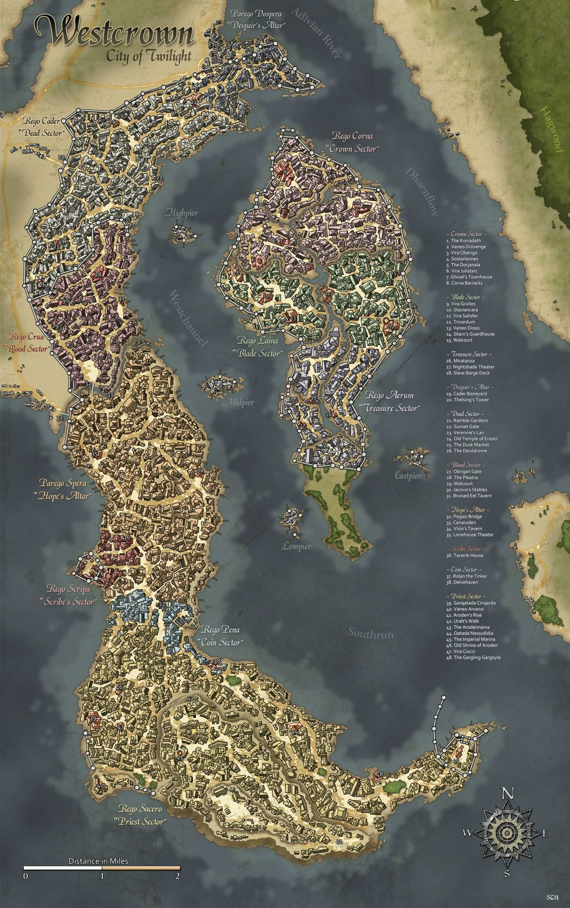

**Таймлайн главы 1: 12:00–17:30.**

Игроки прибывают в Весткроун по западному тракту. Глава — завязка: знакомство с сеттингом и персонажами, получение
зацепок, отправка в таверну «Слёзы устрицы».

## Структура главы

1. **Вход.**
    - Мост Клинкокрыла. Игроки знакомятся с **Художником**, а также с порядками в городе (доттари рассказывают про
      комендантский час и районы).
    - Улицы Весткроуна. Игроки идут по улицам города, натыкаются на место преступления, встречают **Детектива** (который
      отправляет их к Дукстатару).
2. **Развилка.** Игроки выбирают, чем займутся дальше:
    - **A. Расследование серии убийств.**
        - A1. Тривардум, офис Дукстатара — взятие заказа.
        - A2. Морг — осмотр тел.
        - A3. Помощник доктора — направляет в таверну «Слёзы устрицы».
        - A4. Сход: «Слёзы устрицы».
    - **B. Контрабанда.** Игроки по предложению Художника или своим мотивам пошли на Сумеречный рынок.
        - B1. Сумеречный рынок. Нападение группы воров для проверки навыков.
        - B2. Совет Воров. Получение заказа на поиск новых поставщиков.
        - B3. Сумеречный рынок. Опрос торговцев. Выход на след «Погибели Дьявола».
        - B4. Сход: «Слёзы устрицы».
    - **C. Дезертир.** Игроки по своим мотивам или видя корабль с чёрными парусами решили пойти в порт.
        - C1. Порт. Нападение группы моряков для проверки навыков.
        - C2. Порт. Таверна «Булькающая гаргулья» — встреча с Капитаном.
        - C3. Порт. Таверна «Трикалиста». Допрос моряков/докеров. Выход на след Корина Марроне.
        - C4. Сход: «Слёзы устрицы».
3. **Развязка.**
   Игроки получают одну или несколько зацепок, которые отправляют их в Слёзы устрицы за город.
    - Если игроки **не покидают город до заката** (17:30) и остаются после темноты (18:30) → **Этап 5. Ночь в
      городе** (боевая сцена «Стая из Нижних Теней», Extreme+ / TPK).

## Таблица таймлайна

| Время | Триггер                                                  | Событие                                                           | Результат                                                                  |
|-------|----------------------------------------------------------|-------------------------------------------------------------------|----------------------------------------------------------------------------|
| 12:00 | Начало главы                                             | Игроки прибывают в Весткроун                                      | Фон «Потоп» = 0                                                            |
| —     | Игроки прибывают в Весткроун                             | Зачитывается общий вид Весткроуна                                 | Знание «Весткроун». Общий вид города, структура районов                    |
| —     | Осмотр реки (Мудрость/Интеллект, СЛ 15)                  | Мутная река, застывшие флюгеры, беззвучные стаи птиц, тучи, ветер | Зацепка «Ветровой нагон» / «Потоп» — через пару дней может быть наводнение |
| —     | Осмотр залива Жемчужной короны (Внимательность, СЛ 10)   | Из залива входит корабль с чёрными парусами и белой сиреной       | Зацепка «Чёрная Сирена» (корабль уходит к внутренним причалам)             |
| 12:30 | Мост Клинкокрыла                                         | Стража доттари проверяет въезжающих                               | Знание «Оборона запада»                                                    |
| 12:45 | Сцена: встреча с Художником                              | На мосту встречается Лучиано Аврелиан (d6=6)                      | Знакомство: Лучиано Аврелиан (Художник)                                    |
| 13:00 | Таможенная проверка                                      | Доттари требуют документы/пошлину/взятку                          | Игроки не могут войти, пока не разберутся                                  |
| 13:30 | Небо заволакивает облаками                               | Улицы Весткроуна / случайные места убийств d6                     | Фон «Потоп» +1                                                             |
| 14:30 | Развилка (A / B / C)                                     | Игроки выбирают, чем займутся дальше                              | Определение ветки расследования                                            |
| 15:00 | Ветер крепчает                                           |                                                                   | Фон «Потоп» +1                                                             |
| 16:00 | Вода в реке мутнеет                                      |                                                                   | Фон «Потоп» +1                                                             |
| 17:00 | Начинается дождь                                         |                                                                   | Фон «Потоп» +1                                                             |
| 17:30 | Развязка главы (A4 / B4 / C4)                            | Игроки отправляются в «Слёзы устрицы»                             | Конец главы 1                                                              |
| 17:30 | Отказ при переправе через реку (паром/лодка в port/pier) | Погода портится, на воде опасно, пармощики отказываются плыть.    | Игроки едут через мост (глава 2)                                           |
| 18:30 | Игроки остаются в городе после темноты                   | Боевая сцена: «Стая из Нижних Теней» (11 тварей, Extreme+ / TPK)  | TPK без Люциано; с Люциано → стая отступает, он зовёт в «Слёзы устрицы»    |

---

# Этап 1. Прибытие в город

## 1.0 Общий вид Весткроуна

При подходе к городу зачитать:

> Вы стоите на гребне Галикарнасских холмов, и перед вами в утренней дымке расстилается Весткроун.
> С высоты город похож на огромного раненого зверя, приникшего к дельте реки Адивиан. Когда-то его называли Городом
> Девяти Звёзд — теперь это Город Сумерек. Ветер, словно стеной давящий на грудь, несёт с залива Жемчужной короны запахи
> соли и гниющего дерева.
>
> Самый заметный ориентир — гигантская статуя Ародена. Беломраморный колосс высотой в девяносто футов поднимается над
> крышами южного берега. Даже отсюда видно серебряную инкрустацию на его груди — символ крылатого ока. Статуя не тронута
> временем: ни пятна, ни трещины. Она стоит, как и сотни лет назад, лицом к реке, словно всё ещё ждёт возвращения
> мёртвого бога. Вокруг неё — площадь с заброшенными зданиями, построенными к его приходу. Приход, который так и не
> случился.
>
> Левее, в самом сердце города, остров Парего Регикона — «Плавучий Дворец». Его окружает стена с цепными арками, а за
> ней теснятся дворцы старой знати: Дровендж, Обе́риго, Джулистарк. Шпили и купола ещё хранят остатки былого величия, но
> краска облупилась, а сады заросли. Флюгеры, некогда радостно крутящиеся на крышах, кажется намертво застыли, показывая
> на север. Некогда здесь заседал Имперский Двор. Теперь это остров призраков в человеческом обличье — обедневших
> аристократов, цепляющихся за титулы.
>
> Прямо под вами, вдоль южного берега, кипит порт. Сотни мачт, склады, причалы. Стаи птиц, беззвучно кружащих над
> утренним хаосом занятых людей. Утро — время торговли, и Весткроун на несколько часов становится похож на живого.
> Отсюда уходят корабли вниз по реке, к Внутреннему морю. Но чем дальше на север, тем тише становится город.
>
> Там, за каналами, лежит Парего Доспе́ра — «Алтарь Отчаяния». Руины, обгоревшие каркасы домов, пустые глазницы окон.
> Там не ходят днём. А ночью там не ходят вообще.
>
> И вот, когда вы уже готовы тронуться в путь, взгляд цепляется за движение на воде.
> Из залива Жемчужной короны в устье мутного Адивиана входит корабль. Он идёт медленно, уверенно, словно не замечая
> тёмных туч на горизонте, медленно ползущих к городу. Чёрные паруса, как вымпелы ночи, надуты теплым и упругим ветром с
> залива. А на каждом из них — белая сирена, раскинувшая руки, словно приглашающая в объятия. Корабль скользит мимо
> доков, не сворачивая к торговым причалам, мимо статуи Ародена и уходит к внутренним причалам острова. Никто на берегу
> не машет ему. Никто не выходит встречать. Весткроун смотрит на него молча.
>
> Добро пожаловать в Город Сумерек.

**Проверка на Мудрость (Выживание) или Интеллект (Природа), СЛ 15:** игроки узнают, что мутная река, застывшие флюгеры,
беззвучные стаи птиц, тучи на горизонте и незатухающий ветер с залива — это всё признаки **Ветрового нагона**, и через
пару дней в городе может произойти мощное наводнение (зацепка «Ветровой нагон» / «Потоп»).

---

# Этап 2. Мост Клинкокрыла

**Время:** 12:30.

## Зачитать при первом входе

> Вы подходите к западному въезду в Весткроун. Перед вами — Мост Клинкокрыла: длинная каменная лента, перекинутая через
> Канароден. Под вами — тёмная, глубокая вода, вдвое глубже городских каналов. Опоры, перила и парапеты украшены
> крылатыми
> конями, а вдоль стен канала тянутся огромные фризы высотой в пятнадцать футов — фигуры, стёртые временем, но всё ещё
> смотрящие на проходящих.
>
> На мосту кипит обычная дневная толчея. Стража проверяет документы, заглядывает в повозки, откидывает полог, стучит по
> ящикам. Писец у стола скрипит пером, записывая пошлины. Кто-то смеётся, кто-то спорит, ребёнок плачет, лошадь фыркает,
> колёса грохочут по брусчатке. Пахнет мокрым камнем, водой, пылью, лошадьми и дымом. За мостом видны чистые, строгие
> здания Rego Scripa — Сектора Писцов.
>
> Чуть в стороне, у парапета, стоит высокий стройный мужчина. Он не спешит пройти. Он смотрит на толпу так, словно перед
> ним не пропускной пункт, а полотно: оценивающе, жадно, смакуя каждый звук и запах. В его длинных пальцах — карандаш,
> из
> карманов жилета торчат кисти и тюбики. На мгновение его серые глаза останавливаются на вас. Улыбка трогает губы, но не
> доходит до глаз. В воздухе — лёгкий запах масляной краски, льняного масла, резких трав и странного,
> противоестественного
> холода. Он ещё не подошёл. Но вы уже чувствуете, что вас оценивают.

## Атмосфера

Каменный мост Пегасов, перекинутый через глубокий канал Канароден — самый длинный и наименее изменённый канал
Весткроуна, вдвое глубже каналов внутреннего города. На мосту — стража и, возможно, укрепления. За мостом — Rego Scripa,
часть Parego Spera. Это главный вход в Весткроун с запада. Пахнет водой, мокрым камнем и пылью; слышны шаги стражи,
плеск воды и ветер.

## Наблюдения

- **Оборонительные укрепления** — мост имеет важное оборонное значение.
- **Фризы Канародена** — огромные фризы высотой 15 футов с изображениями фигур.
- **Изображения крылатых коней** — как и другие мосты Пегасов.

## Входы и выходы

- **Вход:** с западного тракта — единственная сухопутная дорога в город с запада.
- **Выход → Rego Scripa** — торговый район; далее к **Улицам Весткроуна**.
- **Выход (условный, при провале переговоров):** → **Боевая сцена** доттари.

## Сцена: встреча с Художником

Мост — место, где игроки могут впервые встретить **Лучиано Аврелиана (Художника, d6=6)**.

- **Как это работает.** Художник наблюдает за игроками, делает заметки/зарисовку и подходит — то ли как любознательный,
  то ли как «заказчик». Может предложить работу — помощь с поиском артефакта его храма.
- **Атмосфера.** Бесшумная кошачья грация, вкрадчивый голос с металлическим оттенком, стойкий запах масляной краски,
  льняного масла и резких трав; еле уловимый противоестественный холод. Улыбка — натянутая, не доходит до глаз.
- **Улики/намёки.** При проверке (Внимательность, СЛ 10): пальцы и кисти испачканы в краске, из карманов торчат кисти и
  тюбики (зацепка «Художник»). При критическом успехе (Внимательность, СЛ 15) — «Признаки маньяка»: противоестественный
  холод, «пустая маска» и холод во взгляде.
- **Последствие.** Взятие заказа «Поиск артефакта храма» → отношение Художника +1; провал/отказ → Художник уходит
  бесшумно, но следит за партией.

#### Ответы Лучиано на мосту (уровни откровенности)

Уровни откровенности (`candor_level`) — шкала доверия к партии, **не PF2e-`attitude`** (отдельная ось).
`attitude` (helpful/friendly/indifferent/unfriendly/hostile) задаёт базовый DC проверок общения.
На мосту `attitude` = friendly → `candor_level` = friendly → по умолчанию **«Осторожный»**.
По ходу диалога `candor_level` растёт (true_evidence + правильный вопрос + успех) или падает (false_evidence + провал).
Ответ по `candor_level` читается из таблиц ниже (колонка уровня).

| candor_level           | DC        | Тон                                                                                                                                                                                                                                                               |
|------------------------|-----------|-------------------------------------------------------------------------------------------------------------------------------------------------------------------------------------------------------------------------------------------------------------------|
| **Не доверяет**        | very_hard | Холодный, отрывистый, минимум слов. Обаятельно врёт, мелодично. Не смотрит. Не считает их достойными. Если + провал доверия → нападает (см. interrogations/artist.json).                                                                                          |
| **Осторожный**         | easy      | По умолчанию на мосту (Этап 2). Обаятельный, обходительный, чуть странный. Улыбка не доходит до глаз. Паузы — его главный инструмент. Не врёт прямо, но и не говорит всей правды. Играет «вольного художника». Отвечает по колонке «Осторожный» во всех таблицах. |
| **Доверяет**           | medium    | Открытый, но сдержанный. Говорит больше, не раскрывая всего. «Семейная реликвия», «храм, где вырос», «верну туда, где ей место».                                                                                                                                  |
| **Полностью доверяет** | very_easy | Полное раскрытие. Сам подсказывает. Военный жаргон Мендева, кодекс. «Свет не дрогнет. Долг превыше всего. Мы — щит».                                                                                                                                              |

**Приветствие на мосту.**

Игроки входят на мост, видят толчею. Сбоку, у парапета, стоит высокий стройный мужчина и не спешит пройти. Он смотрит на
толпу так, словно перед ним не пропускной пункт, а полотно. В длинных пальцах — карандаш. Из карманов жилета торчат
кисти и тюбики. На мгновение его серые глаза останавливаются на партии. Улыбка трогает губы, но не доходит до глаз. Он
ещё не подошёл.

Реплика (когда подходит):

> Мужчина делает шаг от парапета — плавно, слишком плавно для обычного горожанина. Останавливается в двух шагах. Смотрит
> на партию, как художник на натуру. «Простите, что задерживаю. Вы — не местные». Пауза. Лёгкая улыбка. «Это видно. У
> вас
> на лицах ещё есть…» — он подбирает слово, как кисть, — «…надежда. Местные так не смотрят». Слегка наклоняет голову.
> «Меня зовут Лучиано. Лучиано Аврелиан. Вольный художник». Пауза. «А вы, простите, кто будете?»

Если игроки молчат или отвечают уклончиво:

> Не настаивает. Улыбка возвращается. «Как хотите. Я не из тех, кто требует имён». Пауза. Смотрит на мост, на толпу.
> «Видите ли, я ищу… компанию. Не для себя. Для одного дела. Мне нужны люди, которые умеют смотреть. А вы умеете — это
> видно».

Если игроки агрессивны или подозрительны:

> Не меняется в лице. Голос остаётся мягким. «Я не враг. Я просто стою на мосту и смотрю. Это не запрещено». Пауза. «Но
> если я мешаю — я уйду. Мост длинный. Места хватит всем».

**Предложение работы** («Поиск артефакта храма» — ложная личность в действии, умалчивание):

Отходит чуть в сторону, чтобы не мешать толпе. Понижает голос — не шёпот, но так, чтобы слышали только игроки. «У меня
есть дело. Не срочное, но важное. Для меня — важное». Пауза. «Я ищу одну вещь. Реликвию. Она была украдена. Не у меня —
у моего… дома». Он подбирает слово. «У храма, где я вырос».

| Вопрос               | Ответ (Осторожный)                                                                                                                                               |
|----------------------|------------------------------------------------------------------------------------------------------------------------------------------------------------------|
| **Что за реликвия?** | «Старая вещь. Семейная». Пауза. «Реликварий. Ковчег. Внутри — череп святого». Лёгкая улыбка. «Не пугайтесь. Он давно мёртв. И, в отличие от живых, не кусается». |
| **Почему мы?**       | «Потому что вы — не местные». Пауза. «Местные боятся. Они знают, что бывает с теми, кто задаёт вопросы в этом городе. А вы — ещё нет». Улыбка. «Это комплимент». |

Если игроки отказываются:

> Не настаивает. Кивает. «Как хотите». Пауза. «Но если передумаете — я буду в таверне „Слёзы устрицы“. За городом. У
> реки». Отворачивается к парапету. «Дорога туда одна. Не заблудитесь».

Если игроки соглашаются:

> Кивает. «Хорошо». Пауза. «Деньги — по факту. Не раньше». Смотрит на партию. «И ещё одно. Если найдёте — не открывайте.
> Просто принесите мне. Это… личное».

**Ответы на вопросы о себе** (candor_level = Осторожный / friendly):

| Вопрос                  | Ответ                                                                                                                                                                                                                                                         |
|-------------------------|---------------------------------------------------------------------------------------------------------------------------------------------------------------------------------------------------------------------------------------------------------------|
| **Кто ты?**             | Лёгкий поклон. «Лучиано Аврелиан. Вольный художник». Пауза. «Путешествую. Ищу красоту в этом… городе. Пока безуспешно». Улыбка, не доходящая до глаз. «Но иногда нахожу. Как сейчас».                                                                         |
| **Откуда ты?**          | «С севера». Пауза. «Из Мендева, если вам это что-то говорит. Теократия. Крестоносцы. Вечная война с Язвой». Тише. «Не самое весёлое место для детства». Смотрит на мост. «Но там я научился видеть красоту там, где другие видят только пепел».               |
| **Почему ты здесь?**    | «Ищу вдохновение». Пауза. «И одну вещь. Я уже говорил». Лёгкая улыбка. «Этот город — как старая картина. Краска облупилась, но под ней — что-то настоящее. Трагедия. Красота в разрушении». Замолкает. Смотрит в сторону. «Простите. Я иногда говорю лишнее». |
| **Ты художник?**        | «Да». Пауза. Показывает пальцы — они в краске. «Видите? Это не отмывается». Лёгкая улыбка. «Я пишу то, что вижу. Иногда — то, что не должен был видеть». Замолкает. «Но это уже другая история».                                                              |
| **Почему ты на мосту?** | «Смотрю». Пауза. «Мост — как рама. Толпа — как натюрморт. Я запоминаю». Смотрит на игроков. «Вы, например, интересная композиция. Контраст света и тени». Улыбка. «Не обижайтесь. Это профессиональное».                                                      |
| **Ты один?**            | «Один». Пауза. «Уже давно». Лёгкая улыбка. «Художники часто одиноки. Это не жалоба. Это факт».                                                                                                                                                                |
| **Ты опасен?**          | Пауза. Долгий взгляд. «Я — художник с кистями и тюбиками. Что в этом опасного?» Улыбка возвращается, но чуть позже, чем нужно. «Но вы задаёте правильные вопросы. Это хорошо. В этом городе это — редкость».                                                  |

**Ответы на вопросы о городе** (candor_level = Осторожный / friendly):

| Вопрос                              | Ответ                                                                                                                                                                                                                                                                      |
|-------------------------------------|----------------------------------------------------------------------------------------------------------------------------------------------------------------------------------------------------------------------------------------------------------------------------|
| **Что это за город?**               | «Весткроун. Город Сумерек». Пауза. «Бывшая столица Челии. Когда-то — Город Девяти Звёзд. Теперь — тень себя прежнего». Смотрит на город. «Ароден умер. Город — тоже. Только не сразу заметил».                                                                             |
| **Почему здесь комендантский час?** | Тише. «Теневые твари. После заката они выходят на охоту». Пауза. «Это не сказки. Это… осколки. После вампира Илнерика. Его убили, а твари остались». Смотрит на игроков. «Не ходите ночью. Серьёзно. Даже если очень надо».                                                |
| **Кто здесь главный?**              | «Формально — лорд-мэр. Абериан Арванкси». Пауза. «Но реальная власть — у Совета Воров. И у доттари. И у Адских рыцарей. И у всех сразу». Лёгкая улыбка. «В Весткроуне никто не главный. И все — главные».                                                                  |
| **Что здесь происходит?**           | «Упадок». Пауза. «Город умирает. Медленно, красиво, как старая картину, которую никто не хочет реставрировать». Тише. «Люди ищут, во что верить. Кто-то — в Асмодея. Кто-то — в старых богов. Кто-то — в то, чего не должно быть». Замолкает. «Я говорю лишнее. Простите». |
| **Кто такие доттари?**              | «Городская стража. Начальник — Дукстатар Ильтус Мартис». Пауза. «Молодой. Некомпетентный. Пьёт». Лёгкая улыбка. «Но он — племянник лорд-мэра. Это всё объясняет».                                                                                                          |
| **Кто такие Адские рыцари?**        | «Орден Дыбы. Hellknights». Пауза. «Не часть стражи. Но „помогают“». Тише. «Охотятся на ересь. На демонопоклонников. На всё, что не вписывается в указ Асмодея». Смотрит на партию. «Будьте осторожны. Они не любят вопросов».                                              |

**Ответы на вопросы о реликвии** (candor_level = Осторожный — умалчивание, не прямая ложь):

| Вопрос                                | Ответ                                                                                                                                                                                                          |
|---------------------------------------|----------------------------------------------------------------------------------------------------------------------------------------------------------------------------------------------------------------|
| **Что за реликвия?**                  | «Старая вещь. Реликварий. Ковчег». Пауза. «Внутри — мумифицированный череп. Святого». Лёгкая улыбка. «Не пугайтесь. Он давно мёртв. И, в отличие от живых, не кусается».                                       |
| **Откуда она у тебя?**                | «Не у меня». Пауза. «У храма, где я вырос. Она была украдена». Тише. «Воры. Потом — перекупщики. Потом — след теряется». Смотрит в сторону. «Я иду по следу уже давно».                                        |
| **Почему она важна?**                 | Пауза. Долгий взгляд на реку. «Это — память. О тех, кто был до меня. О тех, кто верил во что-то настоящее». Тише. «Когда память теряется — теряется всё. Я не хочу, чтобы это случилось».                      |
| **Зачем тебе она?**                   | «Вернуть». Пауза. «Туда, где ей место». Лёгкая улыбка. «Я не коллекционер. Я — курьер. Просто курьер с кистями».                                                                                               |
| **Кто украл?**                        | «Воры». Пауза. «Потом — культисты. Культ Дагона». Тише. «Они выкупили её у воров. Спрятали где-то». Смотрит на партию. «Я не знаю где. Пока не знаю».                                                          |
| **Почему ты не обратишься к страже?** | Лёгкая улыбка. «К доттари? Которые пьют и не могут найти маньяка, убивающего по ночам?» Пауза. «Нет. Это — моё дело. Личное. Я не хочу, чтобы его топтали сапогами».                                           |
| **Что ты сделаешь, когда найдёшь?**   | «Верну». Пауза. «Туда, где ей место». Смотрит на игроков. «И, возможно, покараю тех, кто её украл». Тише. «Но это — уже не ваша забота. Ваша — найти. Моя — решить, что с ней делать».                         |
| **Почему мы? Почему не местные?**     | «Потому что местные — боятся». Пауза. «Они знают, что бывает с теми, кто задаёт вопросы. А вы — ещё нет». Улыбка. «Это комплимент».                                                                            |
| **Ты сказал, не открывать. Почему?**  | Пауза. Лицо на секунду теряет эмоции — «пустая маска». Потом улыбка возвращается, но не доходит до глаз. «Потому что это — святое. А святое не для чужих глаз». Тише. «Просто принесите мне. Закрытым. И всё». |
| **Ты связан с культом?**              | Долгий взгляд. «Нет». Пауза. «Я — тот, кто охотится на них». Тише, с металлическим оттенком. «Но это — не ваше дело. Пока не ваше». Смотрит в сторону. «Простите. Я говорю лишнее».                            |

**Как это работает в сцене:**

1. Начало: Лучиано наблюдает за толпой. Игроки замечают его (Внимательность, СЛ 10 — пальцы в краске, кисти в карманах;
   критический успех — «пустая маска», холод во взгляде).
2. Подход: Лучиано сам подходит. Приветствие — Friendly (candor Осторожный), обаятельное, но с паузами.
3. Предложение работы: если игроки не уходят сразу — он предлагает заказ.
4. Вопросы: игроки задают вопросы. Ответы — по candor_level. При candor Осторожный — он не раскрывает свою истинную
   сущность (говорит «семейная реликвия», «храм, где вырос», «верну туда, где ей место»).
5. Отказ или согласие: согласие → candor растёт к helpful (Helpful), он даёт дорогу в таверну. Отказ → он вежливо
   прощается, но следит за партией (важно для дальнейших сцен).

**Триггеры смены тона:**

- Упоминание культа Дагона → лицо на секунду «пустеет», голос с металлом.
- Упоминание «Мендева» или «Язвы» → становится тише, говорит отрывисто, как военный.
- Упоминание реликвии в лоб → улыбка возвращается, но позже, чем нужно.

**Что важно помнить:**

- Лучиано не врёт прямо. Он умалчивает. Это его стиль.
- Он обаятелен, но неприятно обаятелен — как красивая картина, на которую долго смотреть не хочется.
- Он говорит с паузами. Пауза — его главный инструмент.
- Он не настаивает. Если игроки отказываются — он не давит. Он просто запоминает.
- Его улыбка не доходит до глаз. Ключевая деталь. Описывайте её игрокам каждый раз, когда она появляется.
- В моменты «пустой маски» лицо теряет эмоции на секунду. Происходит, когда он слышит что-то важное (культ, Мендев,
  реликвия).
- Запах: масляная краска, льняное масло, резкие травы и противоестественный холод. Холод — намёк. Игроки не поймут
  сразу, но запомнят.
- Жесты: слишком плавные, слишком правильные. Как будто он контролирует каждое движение, чтобы не выдать себя.

### Стат-блок: Лучиано Аврелиан — Художник (d6=6)

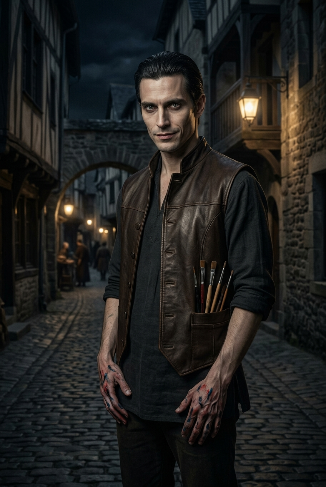

#### Что зачитать игрокам при первой встрече

> У парапета стоит высокий, стройный мужчина лет тридцати пяти с почти аристократическими и необычайно острыми чертами
> лица — резкими скулами и высоко очерченным лбом. В его осанке и движениях — мягкая, бесшумная кошачья грация; держится
> он слишком прямо и дерзко легко для обычного горожанина. Тёмные волосы аккуратно зачёсаны назад. Серые глаза с
> безумной искрой и обаятельная улыбка — но эта улыбка кажется натянутой фальшивкой, не доходит до глаз. Стоит ему
> подумать, что на него никто не смотрит, как лицо мгновенно теряет эмоции и превращается в пустую маску. Он одет в
> простую, но качественную тёмную рубаху, кожаный жилет и тёмные штаны; на ногах — мягкие туфли. Длинные пальцы и кисти
> рук испачканы в краске, из карманов жилета торчат кисти и тюбики с масляными красками. В воздухе вокруг него — стойкий
> смешанный аромат масляной краски, льняного масла, резких трав и еле уловимого, противоестественного холода.

#### Идентификация

- **Имя:** Лучиано Аврелиан.
- **Прозвище:** «Маэстро».
- **Роль:** ложная личность «вольный художник»; по факту — паладин (тайный агент ордена) из Мендева, серийный убийца.
- **Раса:** аасимар.
- **Мировоззрение:** Хаотично-добрый (CG).
- **Статус:** main_npc.
- **Может ли быть жертвой:** true.

#### Описание

Ложная личность «вольный художник» — на самом деле паладин (тайный агент ордена) из Мендева, поклоняется Шелин; серийный
убийца (убивает тех, кого считает злыми, получает удовольствие).

#### Скрывает

- **[big]** Паладин (тайный агент ордена) из Мендева. Покровитель — ШЕЛИН, но его путь — ПАДЕНИЕ/извращение. Официально
  не имеет права на убийства в этой стране — действует тайно.
- **[big]** Серия убийств — «пытки» участников Праздника Пива (не «охота на культистов» — его ложное убеждение).
- **[big]** Миссия: вернуть реликвию (мумифицированный череп святого, украденную ворами и выкупленную культистами
  Дагона).
- **[big]** Серийный убийца; убивает тех, кого считает злыми, получает удовольствие.
- **[big]** Тайно принимает наркотики — Лист-живодёр (Flayleaf).
- **[small]** Ложная личность: арендовал мансарду, представившись вольным художником.

#### Хочет

- вернуть реликвию в орден;
- покарать укравших её культистов.

#### [PF2e stat-block]

| Параметр          | Значение                                                                                                                         |
|-------------------|----------------------------------------------------------------------------------------------------------------------------------|
| **Уровень**       | 9                                                                                                                                |
| **Мировоззрение** | CG (падший паладин)                                                                                                              |
| **Раса**          | Аасимар                                                                                                                          |
| **Класс**         | Чемпион (Champion, Shelyn)                                                                                                       |
| **Роль**          | Solo boss / melee striker                                                                                                        |
| **Восприятие**    | +18 (moderate)                                                                                                                   |
| **Языки**         | Общий, Небесный, Акло, Варисийский                                                                                               |
| **Навыки**        | Акробатика +18, Атлетика +17, Обман +20, Скрытность +20, Религия +17, Ремесло (живопись) +15, Запугивание +17, Знание Дагона +17 |
| **Сила**          | +3                                                                                                                               |
| **Ловкость**      | +5                                                                                                                               |
| **Телосложение**  | +3                                                                                                                               |
| **Интеллект**     | +3                                                                                                                               |
| **Мудрость**      | +4                                                                                                                               |
| **Харизма**       | +5                                                                                                                               |
| **AC**            | 28 (high)                                                                                                                        |
| **HP**            | 151                                                                                                                              |
| **Скорость**      | 30 футов                                                                                                                         |
| **Спасброски**    | Стойкость +16, Реакция +18, Воля +18                                                                                             |
| **Ближний бой**   | Глефа «Шёпот Душ» +1: +18, 2d8+7 рубящий, +2d6 скрытый удар                                                                      |
| **Дальний бой**   | Метательный нож +17, 2d4+5 колющий                                                                                               |

**Способности:**

- **Скрытый удар (Sneak Attack) 2d6.**
- **Божественная кара (Divine Smite):** при попадании ближним боем +5 persistent spirit damage.
- **Сокрушительный удар (1 действие):** цель «Застигнут врасплох» до конца следующего хода.
- **Художественная казнь (2 действия, 1/раунд):** +2d6 урона, цель проходит Стойкость СЛ 27, иначе «Замедлен 1».
- **Ярость листа-живодёра (1 действие, перезаряжается при убийстве):** +2 к атакам на 1 раунд, но -2 к AC.
- **Ужасающее присутствие (1 действие):** спасбросок Воли СЛ 27, иначе «Испуган 2».
- **Аура защиты (Champion's Aura):** союзники в 15 футов +1 к AC.
- **Оружие-реликвия (Glaive of Soul Whisper):** +1d10 урона по культистам Дагона; при критическом ударе спасбросок Воли
  СЛ 25, иначе «Испуган 2».

#### Уровень тона

Отношение Художника к партии определяет его **тон** и то, что он выдаёт. Это отдельный шкала от `attitude` (см.
«Уровень тона» ниже), которой он пользуется в диалогах и при допросе.

| Уровень         | Тон                                                      | Что выдаёт                                             |
|-----------------|----------------------------------------------------------|--------------------------------------------------------|
| **Hostile**     | Холодный, отрывистый, минимум слов. Не смотрит.          | Он не считает их достойными даже презрения             |
| **Unfriendly**  | Сухой, с лёгким раздражением. Отвечает, но не объясняет. | Он видит в них обузу                                   |
| **Indifferent** | Фактический, как доклад. Без поэзии.                     | Он оценивает их как актив — пока бесполезный           |
| **Friendly**    | Поэтичный, с метафорами. Иногда проговаривается.         | Он видит в них потенциальных союзников или «натюрморт» |
| **Helpful**     | Полный, с военным жаргоном и кодексом. Тише, чем обычно. | Он видит в них своих. Временно. Пока они полезны       |

#### Важные детали для отыгрыша

- **«Пустая маска»** — при уровне Friendly и Helpful в моменты паузы лицо теряет эмоции. Опишите это игрокам.
- **Запах** — масляная краска, льняное масло, резкие травы, **противоестественный холод**.
- **Жесты** — слишком плавные, слишком правильные. Как будто он контролирует каждое движение.
- **Поэтические обрывки** — при Friendly и Helpful иногда бормочет: «Красота в разрушении… Песня в крике…» — это след
  наркотиков.
- **Военный жаргон Мендева** — «угроза», «тактика», «цена мира», «необходимые жертвы», «Язва» (как место, а не болезнь).
- **Кодекс** — «Свет не дрогнет. Долг превыше всего. Мы — щит» — он повторяет это, когда напряжение достигает пика.

#### GM knows

- **Тайны:** [big] серийный убийца; [big] паладин (Орден Вечной Розы) / расправитель над участниками Праздника
  Пива; [big] миссия — вернуть реликвию; [big]
  ложная личность; [small] курит Лист-живодёр.
- **Реакции:** при упоминании культа — лицо пустеет.
- **Ложные убеждения:** Официантка — просто дочь Трактирщика; Врач — просто парень официантки; его миссия незаметна; эта
  таверна — просто случайное место.

---

## Сцена: таможенная проверка

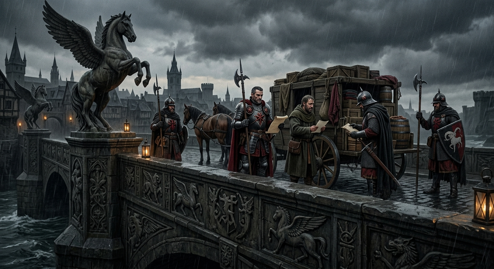

**Время:** 13:00 (после встречи с Художником в 12:45; см. `01-chronology.md`, `events.json` `event_022b`).
**Хронология:** `13:00` — таможная проверка → `13:30` — небо заволакивает облаками (Фон «Потоп» +1) и игроки
попадают на **Улицы Весткроуна**. Пока игроки не разберутся с таможней, **в город они не входят**.

На мосту стоит отряд доттари и проверяет въезжающих в город.

### Как выглядит сцена

Мост перегорожен **шлагбаумом и деревянной стойкой**. Рядом — **палатка писца** с навесом от дождя. На стойке —
**журнал, чернильница, сургучная печать, деревянный ящик для монет**. У стойки — **очередь из пяти-шести человек**:
торговцы с телегами, крестьянин с курами, женщина с корзиной, двое наёмников в потёртых доспехах.

За стойкой **сидит лейтенант**. Он не стоит в дозоре — он **заполняет бумаги**. Медленно. Вдумчиво. Каждого
проходящего он вписывает в **большой журнал** — имя, цель визита, срок пребывания. Он не смотрит на людей — он
смотрит в бумаги. Иногда поднимает взгляд, оценивает — и снова опускает.

Рядом — **четыре стражника**: двое у шлагбаума с копьями, двое чуть дальше с арбалетами. Они скучают. Один из них
**считает монеты** в ящике.

За мостом видны чистые, строгие здания Rego Scripa — Сектора Писцов. Пахнет мокрым камнем, водой, пылью, лошадьми и
дымом. Дождь ещё не начался, но небо затянуто тучами. Ветер с залива несёт соль.

### Что зачитать игрокам при первом входе

> Вы подходите к западному въезду в Весткроун. Перед вами — Мост Клинкокрыла: длинная каменная лента, перекинутая через
> Канароден. Под вами — тёмная, глубокая вода, вдвое глубже городских каналов. Опоры, перила и парапеты украшены
> крылатыми конями, а вдоль стен канала тянутся огромные фризы высотой в пятнадцать футов — фигуры, стёртые временем,
> но всё ещё смотрящие на проходящих.
>
> На мосту кипит обычная дневная толчея. Стража проверяет документы, заглядывает в повозки, откидывает полог, стучит
> по ящикам. Писец у стола скрипит пером, записывая пошлины. Кто-то смеётся, кто-то спорит, ребёнок плачет, лошадь
> фыркает, колёса грохочут по брусчатке.
>
> За стойкой сидит мужчина лет сорока — **жилистый, подтянутый**, с прямой спиной человека, который двадцать лет носил
> доспех. **Короткие тёмные волосы**, **шрам** через левую бровь — старый, заживший. **Без шлема** — шлем лежит рядом
> на стойке, начищенный до блеска. На нём **chainmail hauberk под чёрным табардом**; на **левом предплечье** —
> красный «Глаз Ародена» на чёрном поле. **Тёмно-серый плащ** перекинут через спинку стула. **Masterwork longsword**
> — на поясе. **Composite longbow** — прислонён к стойке.
>
> Он **не встаёт**, когда вы подходите — он **дописывает строку в журнале**. Потом — поднимает взгляд. Серые глаза,
> внимательные, **без улыбки**.
>
> «Следующие. Имя, цель визита, срок пребывания». Пауза. «По одному».

### Лейтенант Чезаре Фальконе

#### Идентификация

- **Имя:** Чезаре Фальконе.
- **Прозвище:** «Лейтенант» (никто не зовёт его по имени — только по званию).
- **Роль:** Лейтенант доттари, начальник таможенного поста на Мосту Клинкокрыла. **В прошлом — патрульный.**
- **Раса:** человек.
- **Мировоззрение:** Законопослушно-нейтральное (LN), склоняется к LE.
- **Статус:** контекстный NPC.

#### Описание

Фальконе служит в доттари **двадцать лет**. Он начинал **патрульным** — ходил по улицам ночью, гонял теневых тварей,
ловил воров. **Шрам** — от той поры. Потом **получил ранение** (не смертельное, но достаточное, чтобы не стоять в
ночном патруле), и его **перевели на таможню**. С тех пор он **сидит за стойкой** и **считает монеты**.

Он **не бюрократ по призванию**. Он **солдат, которого поставили на скучную работу**. Он **скучает**. Он **пьёт**
(немного, на службе). Он **берёт взятки** — не потому что жадный, а потому что **двадцать лет службы, а платят
копейки**.

#### Внешний вид и черты лица

**Жилистый, подтянутый** — не толстый, не худой. **Спина прямая** — привычка двадцати лет. **Шрам** через левую
бровь — старый, заживший. **Короткие тёмные волосы** без седины. **Без усов**. **Без шлема** — шлем лежит рядом на
стойке. **Без украшений** — челийская сдержанность.

#### Одежда и детали

- **Кольчуга (Chainmail hauberk) под чёрным табардом** — он всё ещё носит её. Привычка.
- **Красный «Глаз Ародена» на чёрном поле** — на **левом предплечье** (инвертированный знак, отличие офицера).
- **Тёмно-серый плащ** — перекинут через спинку стула.
- **Длинный меч искусной работы (Masterwork longsword)** — на поясе. Он **умеет** им пользоваться. Просто **не хочет**.
- **Композитный длинный лук (Composite longbow)** — прислонён к стойке. Он **стреляет** из него, когда кто-то пытается
  сбежать через мост.
- **Журнал, чернильница, сургучная печать, деревянный ящик для монет** — на стойке.

#### Поведение и шлейф восприятия

Фальконе **не встаёт** со своего места. Это **не лень** — это **привычка**. Он сидит **прямо**, как на плацу. Он **готов
встать** в любой момент. Он **не расслаблен** — он **скучает**.

Пахнет **чернилами, бумагой и лёгким запахом вина** (он пьёт, но не напивается на службе).

### Механика пошлины

#### Официальная пошлина

**Официальная пошлина за вход в Весткроун — 5 золотых монет (5 зм) с человека.** Это указано на **табличке**,
прибитой к стойке. Табличка старая, буквы полустёрты. Фальконе не обращает на неё внимания.

#### Что требует Фальконе

Фальконе требует **50 золотых монет (50 зм) с человека** — **в десять раз больше** официальной пошлины. Он не скрывает
это. Он не стесняется. Он просто говорит:

> «Пятьдесят золотых с каждого. Или документы, если есть». Пауза. «Документов, я вижу, нет. Значит, придётся
> раскошелиться».

#### Способы разрешения

| Способ                        | Проверка               | Результат                                                      | Цена за 4 игроков      |
|-------------------------------|------------------------|----------------------------------------------------------------|------------------------|
| **Заплатить полностью**       | —                      | Проходят без вопросов                                          | 50 зм × 4 = **200 зм** |
| **Торговаться**               | Дипломатия (СЛ 20)     | Сбивает до 20 зм с человека                                    | **80 зм** (всего)      |
| **Торговаться (крит. успех)** | Дипломатия (СЛ 25)     | Сбивает до 5 зм с человека (официальная)                       | **20 зм** (всего)      |
| **Взятка**                    | Обман (СЛ 18)          | «Неофициально» — 10 зм с человека                              | **40 зм** (всего)      |
| **Запугивание**               | Запугивание (СЛ 20/25) | Пропускает, но **запоминает партию** → `Отношение Доттари -1`  | —                      |
| **Помощь Художника**          | —                      | Художник вмешивается, партия проходит → `Отношение Доттари +1` | —                      |
| **Упоминание Дукстатара**     | —                      | Фальконе пропускает без пошлины, но **записывает имена**       | —                      |
| **Предъявить документы**      | —                      | Если есть — проходят                                           | —                      |
| **Нападение**                 | Бой                    | 4 стражника + 1 лейтенант → `Отношение Доттари = "Hostile"`    | Последствие: розыск    |

### Диалог: приветствие и торг (по уровням отношения)

Уровни отношения (PF2e `attitude`): **Hostile / Unfriendly / Indifferent / Friendly / Helpful**. На мосту (`13:00`) по
умолчанию — **Indifferent** (Фальконе чужой партии, но не враждебен). Торг/взятка/дипломатия
поднимают, запугивание — могут опустить до **Unfriendly/Hostile**. Ответ читается по колонке текущего уровня.

#### Приветствие

Игроки еще не знакомы с Лейтенантом, поэтому он всегда будет нейтральным на начало диалога

| Вопрос        | Indifferent                                                                 |
|---------------|-----------------------------------------------------------------------------|
| **«Кто вы?»** | «Лейтенант Чезаре Фальконе. Доттари. Таможенный пост на Мосту Клинкокрыла». |

#### Пошлина

| Вопрос                       | Hostile                                            | Unfriendly                                   | Indifferent                                                                  | Friendly                                                                        | Helpful                                                                      |
|------------------------------|----------------------------------------------------|----------------------------------------------|------------------------------------------------------------------------------|---------------------------------------------------------------------------------|------------------------------------------------------------------------------|
| **«Сколько стоит вход?»**    | «Пятьдесят. С каждого.» Пауза. «Или проваливайте». | «Пятьдесят. С каждого.» Не поднимает головы. | «Пятьдесят с каждого.» Пауза. «Или покажите документы».                      | «Пятьдесят. С каждого. Или — документы.» Пауза. «По пяти — как на табличке».    | Закрывает журнал. «Проходите. Пошлину не возьму». Пауза. «Только тихо».      |
| **«Почему так дорого?»**     | «Не нравится — уходите».                           | «Такая пошлина. Дальше».                     | «Официальная пошлина для нерезидентов без документов. Пятьдесят с человека». | «Потому что вы без документов.» Пауза. «С документами — пять. Как на табличке.» | «Потому что все платят. А вы — не все.» Пауза. «Проходите. Я вас не считаю.» |
| **«А если мы не заплатим?»** | «Тогда не пройдёте.»                               | «Тогда уходите.»                             | «Тогда не пройдёте. Или предъявите документы.»                               | «Тогда торгуйтесь.» Пауза. «Я не зверь.»                                        | «Тогда проходите так.» Пауза. «Но не шумите. Стражники смотрят.»             |

#### Торг

Проверка **Дипломатия, СЛ 20** (крит. успех — СЛ 25).

Ценовая лестница: **50 → 20 → 5 зм** (за каждого).

| Вопрос                                             | Hostile                      | Unfriendly                                          | Indifferent                                                                                                   | Friendly                                                                          | Helpful                                                                 |
|----------------------------------------------------|------------------------------|-----------------------------------------------------|---------------------------------------------------------------------------------------------------------------|-----------------------------------------------------------------------------------|-------------------------------------------------------------------------|
| **«Можно скидку?»**                                | «Нет.» Рука на рукоять меча. | «Нет.»                                              | Откидывается. Смотрит. Едва заметная улыбка. «Хорошо. По двадцать с каждого. И я забуду, что вы торговались.» | «Хорошо.» Пауза. «По двадцать. И я вас не видел.»                                 | «Не надо. Проходите.» Пауза. «Вы и так в беде. Спрашивайте, что нужно.» |
| **«Пять — официальная цена» (крит. успех, СЛ 25)** | —                            | «Сто. И я запомню, что вы торговались.»             | «Пять. Как на табличке.» Пауза. «Но если кто-то спросит — двести. Понятно?»                                   | «Пять.» Пауза. Тише. «Как на табличке. Но если кто-то спросит — двести. Понятно?» | «Ничего не надо.» Пауза. «Просто идите. И не задерживайтесь.»           |
| **«Мы не будем платить» (провал)**                 | —                            | «Двести. Или уходите.» Закрывает журнал. «Я занят.» | Смотрит холодно. «Двести. Следующие.»                                                                         | Вздыхает. «Ладно. Сто двадцать. И это моё последнее слово.»                       | «Не торгуйтесь. Проходите.» Пауза. «Мне не нужны ваши деньги.»          |

#### Взятка

Фальконе берёт взятки, но **не у тех, кто может пожаловаться**.

Проверка **Дипломатия, СЛ 10**.

| Вопрос                         | Hostile                                                                                                                           | Unfriendly                                               | Indifferent                                               | Friendly                                                   | Helpful                                                               |
|--------------------------------|-----------------------------------------------------------------------------------------------------------------------------------|----------------------------------------------------------|-----------------------------------------------------------|------------------------------------------------------------|-----------------------------------------------------------------------|
| **«Может, договоримся?»**      | «Нет.» Пауза. «Я вас не беру.»                                                                                                    | Смотрит на монеты. Потом — на игроков. «Сто. Не меньше.» | Оглядывается. «Восемьдесят с четверых. И я вас не видел.» | «Пятьдесят.» Пауза. «И я забуду, что вы вообще подходили.» | «Не надо. Я и так на вашей стороне.» Пауза. Тише. «Просто не шумите.» |
| **«Вот сто сверху» (+100 зм)** | Смотрит на монеты. Долго. Закрывает журнал. «Хорошо. Проходите.» Тише. «И если что-то нужно — спрашивайте. Я здесь двадцать лет.» | То же.                                                   | То же.                                                    | То же. Переход в Helpful.                                  | Остаётся Helpful. «Проходите. И слушайте.»                            |

#### Запугивание

Проверка **Запугивание, СЛ 20** (лейтенант — СЛ 25). Успех → **Отношение Доттари -1**, но Фальконе **запоминает**
партию.

| Вопрос                     | Hostile                                                                                                                                                                                                                                                 | Unfriendly                                                                                                                                       | Indifferent                                                | Friendly                                                     | Helpful                                                            |
|----------------------------|---------------------------------------------------------------------------------------------------------------------------------------------------------------------------------------------------------------------------------------------------------|--------------------------------------------------------------------------------------------------------------------------------------------------|------------------------------------------------------------|--------------------------------------------------------------|--------------------------------------------------------------------|
| **«Пропусти нас»**         | «Попробуйте.» Рука на longsword. «Я двадцать лет в доттари. Меня пугали и похуже.»                                                                                                                                                                      | Смотрит прямо. «Вы можете меня запугать. Можете даже пройти.» Пауза. «Но я запомню ваши лица. Двести. Или проходите. Но запомните — я запомнил.» | Не меняется в лице. «Двести. Следующие.» Смотрит в журнал. | Вздыхает. «Не надо.» Пауза. «Восемьдесят. И я вас не видел.» | «Не тратьте слова.» Пауза. Тише. «Проходите. Я и так вас пропущу.» |
| **Крит. успех (унижение)** | Все уровни → **Hostile.** Медленно поднимает взгляд. Голос тише. «Хорошо.» Пауза. Закрывает журнал. «Проходите.» Тише. «Но я вас запомнил. И когда вы вернётесь — а вы вернётесь — я вспомню.» (Остаётся Hostile, но пропускает; Отношение Доттари -1.) | То же.                                                                                                                                           | То же.                                                     | То же.                                                       | То же.                                                             |
| **Крит. провал (позор)**   | Все уровни → **Hostile.** Смеётся. Коротко. Без веселья. «Это всё?» Пауза. Закрывает журнал. «Двести. Или уходите. Мне некогда.»                                                                                                                        | То же.                                                                                                                                           | То же.                                                     | То же.                                                       | То же.                                                             |

#### Упоминание Дукстатара

> Дукстатар (Ильтус Мартис) — начальник стражи, племянник лорд-мэра. Фальконе — формально, его подчинённый.
> **Но: о маньяке Фальконе знает только по слухам**; о Детективе — **не знает**.

| Вопрос                      | Hostile                                                                                                                   | Unfriendly                                                                                                                                           | Indifferent                                                                                                                            | Friendly                                                                                                                                                | Helpful                                                                                                                                                                                             |
|-----------------------------|---------------------------------------------------------------------------------------------------------------------------|------------------------------------------------------------------------------------------------------------------------------------------------------|----------------------------------------------------------------------------------------------------------------------------------------|---------------------------------------------------------------------------------------------------------------------------------------------------------|-----------------------------------------------------------------------------------------------------------------------------------------------------------------------------------------------------|
| **«Мы по делу Дукстатара»** | «Дукстатар?» Пауза. Смотрит. «Хорошо. Проходите.» Тише. «Но я вас всё равно запомнил.» (Остаётся Hostile, но пропускает.) | «По делу Дукстатара?» Пауза. Оценивает. «Проходите.» Пауза. «Скажите ему, что лейтенант Фальконе пропустил. И что я просил помощи. Уже месяц прошу.» | «По делу Дукстатара?» Пауза. Кивает. «Проходите. Пошлину не возьму.» Пауза. «Скажите ему — Фальконе пропустил. И что я просил помощи.» | «По делу Дукстатара?» Закрывает журнал. «Проходите.» Пауза. «И слушайте. Дукстатар — хороший человек. Пьёт. Но хороший. Если можете помочь — помогите.» | «По делу Дукстатара?» Кивает. «Проходите.» Пауза. Тише. «Дукстатар ищет помощи. Я его знаю двадцать лет. Он не злой. Просто слабый. И он пьёт — от этого, что город умирает, а он ничего не может.» |

#### Работа на Художника / Совет Воров

> Художник (Аврелиан) — проходил через пост 6 мес. назад, «вольный художник».
> **Фальконе не считает его «безопасным»** — он **подозревает**, что тот не просто художник.

| Вопрос                                    | Hostile                                                                                                                           | Unfriendly | Indifferent | Friendly | Helpful |
|-------------------------------------------|-----------------------------------------------------------------------------------------------------------------------------------|------------|-------------|----------|---------|
| **«Мы работаем на Художника» (Аврелиан)** | Смотрит на Художника. Потом на партию. «Ваши?» Если Художник кивает — вздыхает. «Проходите. Но если что — я вас предупредил.»     | То же.     | То же.      | То же.   | То же.  |
| **«Мы работаем на Совет» (Дровендж)**     | Смотрит. Понижает голос. «Совет?» Пауза. Оглядывается. «Проходите.» Тише. «И скажите Дровенджу — Фальконе пропустил. Как обычно.» | То же.     | То же.      | То же.   | То же.  |

#### Что это за город

| Вопрос                       | Hostile | Unfriendly           | Indifferent                                                               | Friendly                                                                                                      | Helpful                                                                                                   |
|------------------------------|---------|----------------------|---------------------------------------------------------------------------|---------------------------------------------------------------------------------------------------------------|-----------------------------------------------------------------------------------------------------------|
| **«Что это за город?»**      | Молчит. | «Весткроун. Дальше.» | «Весткроун. Город Сумерек. Бывшая столица Челии. Сейчас — порт.»          | «Весткроун. Город Сумерек.» Пауза. «Бывшая столица. Теперь — порт. И кладбище для тех, кто не умеет считать.» | «Весткроун. Когда-то — Город Девяти Звёзд.» Пауза. «Теперь — Город Сумерек.»                              |
| **«Почему город в упадке?»** | —       | «Дом Трун. Дальше.»  | «Дом Трун перенёс столицу в Эгориан. Богатство ушло. Осталось — вот это.» | «Дом Трун перенёс столицу в Эгориан. Богатство ушло.» Пауза. «Осталось то, что видите.»                       | «Город потерял бога. Потом — статус. Потом — деньги.» Пауза. «Теперь здесь только тени. В прямом смысле.» |

#### Комендантский час

> **Комендантский час — **после заката / 18:00**, из-за **теневых зверей**.
> В каноне твари — осколки вампира Илнерика, **но Фальконе этого не знает** — он видел их издалека и говорит только то,
> что видит сам (причина для него не определена).
> У него **шрам от патруля**; «двенадцать / шлемы» — не канон (это знает Художник).

| Вопрос                                 | Hostile | Unfriendly       | Indifferent                                                                  | Friendly                                                                                                                            | Helpful                                                                                                                                        |
|----------------------------------------|---------|------------------|------------------------------------------------------------------------------|-------------------------------------------------------------------------------------------------------------------------------------|------------------------------------------------------------------------------------------------------------------------------------------------|
| **«Почему комендантский час?»**        | —       | «Приказ.»        | «Теневые твари. После заката. Приказ лорд-мэра. Восемнадцать ноль-ноль.»     | «Теневые твари. После заката они выходят на охоту. Приказ лорд-мэра.» Пауза. «Я в город не хожу ночью. И вам не советую.»           | «Теневые твари. После заката — их время. Приказ лорд-мэра.» Тише. «Я был в патруле. Шрам — от той поры. Не люблю вспоминать. Не ходите ночью.» |
| **«Что будет, если останемся ночью?»** | —       | «Ваши проблемы.» | «Тогда я вас больше не увижу.»                                               | «Тогда я вас больше не увижу.» Пауза. «Твари не оставляют тел. Только тени.»                                                        | «Тогда я вас больше не увижу.» Тише. «Не выходите ночью. Это не совет. Это просьба.»                                                           |
| **«Где переночевать?»**                | —       | «Не моё дело.»   | «В городе — таверны. За городом — „Слёзы устрицы“. Таверна Гаэтано. У реки.» | «В городе — таверны. За городом — „Слёзы устрицы“. Таверна Гаэтано. У реки.» Пауза. «Туда доттари не ходят. Но и твари — пока нет.» | «„Слёзы устрицы“. Таверна Гаэтано. За городом. У реки.» Тише. «Хорошее место. Но я туда не езжу. Уже год. Не спрашивайте почему.»              |

#### Теневые твари

> **Теневые звери — причина комендантского часа. **Фальконе не знает, их можно ли убить, и не знает, что они —
«выведены Илнериком»** (это знает Художник) — он не выходил против них (патруль = днём/на мосту), только видел издалека.

| Вопрос                  | Hostile | Unfriendly                 | Indifferent                                                                                | Friendly                                                                                                           | Helpful                                                                                                                                        |
|-------------------------|---------|----------------------------|--------------------------------------------------------------------------------------------|--------------------------------------------------------------------------------------------------------------------|------------------------------------------------------------------------------------------------------------------------------------------------|
| **«Что это за твари?»** | —       | «Теневые. Дальше.»         | «Теневые звери. Выходят по ночам. Откуда — не знаю. Это не моё дело.»                      | «Теневые звери. После заката.» Пауза. «Откуда — не знаю. Не моё дело. Но я их видел. Издалека.»                    | «Теневые звери.» Пауза. Тише. «Я не знаю, откуда они. Я знаю только, что после заката — их время. И что они не оставляют тел.»                 |
| **«Их можно убить?»**   | —       | «Не моё дело.»             | «Не знаю. Я против них не выходил. Доттари — днём. Ночью — не наша смена.»                 | «Не знаю.» Пауза. «Мне говорили — обычный меч не берёт. Нужен свет. Или благословлённое оружие. Но я не проверял.» | «Я не выходил против них. Доттари — днём.» Пауза. Тише. «Поэтому — не выходите ночью. Я прикрою пост. Но за мостом — не моя зона.»             |
| **«Вы их боитесь?»**    | —       | «Я — лейтенант. Не боюсь.» | «Я — лейтенант стражи. Я не боюсь.» Пауза. Тише. «Но я не выхожу ночью. И вам не советую.» | Долгий взгляд. «Я — лейтенант стражи. Я не боюсь.» Пауза. Тише. «Но я не выхожу ночью. И вам не советую.»          | Долгий взгляд. «Я служу двадцать лет. Я видел, как они убивают.» Пауза. Тише. «Они не оставляют тел. Только тени. Если это не страх — то что?» |

#### Кто здесь главный

| Вопрос                         | Hostile | Unfriendly          | Indifferent                                                                   | Friendly                                                                                                                               | Helpful                                                                                                                                                                                                                |
|--------------------------------|---------|---------------------|-------------------------------------------------------------------------------|----------------------------------------------------------------------------------------------------------------------------------------|------------------------------------------------------------------------------------------------------------------------------------------------------------------------------------------------------------------------|
| **«Кто здесь главный?»**       | —       | «Лорд-мэр.»         | «Формально — лорд-мэр Абериан Арванкси. Реально — Совет Воров. И доттари.»    | «Формально — лорд-мэр. Реально — Совет Воров. И доттари.» Усмехается. «В Весткроуне никто не главный. Это и есть проблема.»            | «Формально — лорд-мэр Абериан Арванкси. Реально — Совет Воров. И доттари.» Пауза. Тише. «Доттари — не единая стража. Мы четыре банды с одним названием. Не единая стража.»                                             |
| **«Кто такие доттари?»**       | —       | «Городская стража.» | «Городская стража. Начальник — Дукстатар Ильтус Мартис. Племянник лорд-мэра.» | «Городская стража. Я — лейтенант.» Пауза. «Начальник — Дукстатар. Племянник лорд-мэра. Молодой. Пьёт. Но не злой. Просто слабый.»      | «Городская стража. Я — лейтенант.» Пауза. «Начальник — Дукстатар. Племянник лорд-мэра.» Тише. «Он не командует. Он подписывает бумаги. Остальное — наши зоны. Мы не единая стража. Мы четыре банды с одним названием.» |
| **«Кто такие Адские рыцари?»** | —       | «Орден Дыбы.»       | «Орден Дыбы. Hellknights. Не часть стражи. Независимые. Но „помогают“.»       | «Орден Дыбы. Hellknights. Не часть стражи. Независимые. Но „помогают“.» Пауза. «Они не любят вопросов. И не любят тех, кто их задаёт.» | «Орден Дыбы. Hellknights. Не часть стражи. Независимые.» Тише. «Они охотятся на ересь. На демонопоклонников. На всё, что не вписывается в указ Асмодея. Будьте осторожны. Они не любят вопросов.»                      |

#### Дукстатар

| Вопрос                     | Hostile | Unfriendly          | Indifferent                                               | Friendly                                                                                                                                    | Helpful                                                                                                                                                                                |
|----------------------------|---------|---------------------|-----------------------------------------------------------|---------------------------------------------------------------------------------------------------------------------------------------------|----------------------------------------------------------------------------------------------------------------------------------------------------------------------------------------|
| **«Кто такой Дукстатар?»** | —       | «Начальник стражи.» | «Ильтус Мартис. Племянник лорд-мэра. Молодой. Пьёт.»      | «Ильтус Мартис. Племянник лорд-мэра. Молодой. Пьёт.» Пауза. «Но не злой. Просто слабый. Если умеете что-то — идите к нему. Он ищет помощи.» | «Ильтус Мартис. Племянник лорд-мэра. Молодой. Пьёт.» Тише. «Он не злой. И он боится. Боится, что маньяк доберётся до него. Поэтому и нанял Детектива. И вас наймёт, если придёте.»     |
| **«Он вам платит?»**       | —       | «Не ваше дело.»     | «Он — мой начальник. Я — его подчинённый.»                | «Он — мой начальник.» Пауза. «Но платят не за это. Платят за службу. Двадцать лет.»                                                         | «Он — мой начальник. Формально.» Тише. «Я служу не ему. Я служу городу. Двадцать лет. И я устал.»                                                                                      |
| **«Почему он пьёт?»**      | —       | «Не моё дело.»      | «Потому что город умирает. И он ничего не может сделать.» | «Потому что город умирает. И он ничего не может сделать.» Пауза. «Он слабый. Но не глупый. Он видит. И пьёт.»                               | «Потому что он слабый. И знает это.» Тише. «Он должен быть командиром. А он — никто. Стража его не слушает. Город его презирает. И он пьёт.» Пауза. «Я его не осуждаю. Я бы тоже пил.» |

#### Художник (Аврелиан)

> **Фальконе подозревает**, что Художник **не просто художник** (см. `GM knows`), **но не считает его опасным**
> (он платит и не буянит). Он **не знает**, что Художник — маньяк/убийца (см. `GM knows`), и **не видел его
> «холодных рук»**.

| Вопрос                           | Hostile | Unfriendly            | Indifferent                                                              | Friendly                                                                                                 | Helpful                                                                                                                                                                                                         |
|----------------------------------|---------|-----------------------|--------------------------------------------------------------------------|----------------------------------------------------------------------------------------------------------|-----------------------------------------------------------------------------------------------------------------------------------------------------------------------------------------------------------------|
| **«Что ты знаешь о Художнике?»** | —       | «С мансарды. Дальше.» | «Аврелиан? Проходил. Шесть месяцев назад. Сказал — художник. Я записал.» | «Аврелиан? Проходил. Шесть месяцев назад. Сказал — художник. Я записал.» Тише. «Он странный. Но платит.» | «Аврелиан. Шесть месяцев назад. Сказал — вольный художник. Я записал.» Тише. «Он странный. Смотрит на людей как на натуру. Но не буянит. Платит. Я его запомнил — не потому что опасен. А потому что странный.» |
| **«Он опасен?»**                 | —       | «Не знаю.»            | «Не знаю. Платит. Не буянит. Больше ничего.»                             | «Не знаю.» Пауза. «Платит. Не буянит. Но взгляд у него…» Замолкает. «Не спрашивайте. Я не знаю.»         | «Платит. Не буянит.» Пауза. Тише. «Но я бы не связывался с ним. Не потому что он опасен. А потому что я не знаю, кто он. И это неспокойно.»                                                                     |

#### Моряк (Марроне)

> **Фальконе знает только, что Морроне (Ржавый) проходил через пост** (дезертир; `01-chronology.md` 2, `event_001–002`).
> **Не знает, где он сейчас** и **не видел его в городе** (за городом = глава 2; «Связи» = только через пост).

| Вопрос                        | Hostile | Unfriendly         | Indifferent                                                                    | Friendly                                                                                                                                               | Helpful                                                                                                                                                                         |
|-------------------------------|---------|--------------------|--------------------------------------------------------------------------------|--------------------------------------------------------------------------------------------------------------------------------------------------------|---------------------------------------------------------------------------------------------------------------------------------------------------------------------------------|
| **«Что ты знаешь о Моряке?»** | —       | «Марроне? Дальше.» | «Корин Марроне. Ржавый. Проходил. Дезертир. Капитан „Чёрной Сирены“ его ищет.» | «Корин Марроне. Ржавый. Проходил. Дезертир. Капитан „Чёрной Сирены“ его ищет. Я знаю.» Тише. «Если найдёте — скажите капитану. Он заплатит. И я тоже.» | «Корин Марроне. Ржавый. Дезертир с „Чёрной Сирены“. Капитан его ищет.» Пауза. Тише. «Он мне должен. Не деньги. Другое. Он однажды ударил моего человека. На посту. Я не забыл.» |
| **«Он в городе?»**            | —       | «Не знаю.»         | «Не знаю. Проходил — месяца два назад. Дальше — не моё дело.»                  | «Не знаю. Проходил — месяца два назад.» Пауза. «Сказал — по делам. Я записал.»                                                                         | «Проходил. Месяца два назад. Сказал — по делам. Я записал.» Тише. «Дальше — не моё дело. Я его не видел. Я на посту. Он — за городом. А я — на мосту.»                          |

#### Доктор (Вентури)

> **Фальконе знает, что Доктор (Элио Вентури) проходил через пост** (`01-chronology.md` 7). **Не знает** о «спросил
> про остывание тела» (это событие главы 2, 18:45+).

| Вопрос                         | Hostile | Unfriendly         | Indifferent                                                 | Friendly                                                                                                                    | Helpful                                                                                                                                                                      |
|--------------------------------|---------|--------------------|-------------------------------------------------------------|-----------------------------------------------------------------------------------------------------------------------------|------------------------------------------------------------------------------------------------------------------------------------------------------------------------------|
| **«Что ты знаешь о Докторе?»** | —       | «Вентури? Дальше.» | «Элио Вентури. Доктор из Морга. Проходил. Тихий. Вежливый.» | «Элио Вентури. Доктор из Морга. Проходил. Тихий. Вежливый.» Пауза. «Но взгляд у него… как у патологоанатома. Я таких знаю.» | «Элио Вентури. Доктор. Проходил. Тихий. Вежливый.» Тише. «Но взгляд — как у патологоанатома. Я двадцать лет в доттари. Я знаю этот взгляд. Он смотрит на людей как на тела.» |
| **«Он опасен?»**               | —       | «Не знаю.»         | «Не знаю. Тихий. Платит. Больше ничего.»                    | «Не знаю. Тихий. Платит.» Пауза. «Но я бы не оставался с ним наедине. Без причины.»                                         | «Не знаю. Но я бы не оставался с ним наедине.» Пауза. Тише. «Я не знаю почему. Но я это чувствую.»                                                                           |

#### Официантка

> **Фальконе видит только, кто проходил через пост.** Официантка **в город почти не ходит** (см. `GM knows`);
> **имя в каноне — не «Виттория»** (это мать, `01-chronology.md` 6/19). Он **не видел её ночью** (за городом =
> глава 2).

| Вопрос                             | Hostile | Unfriendly                  | Indifferent                                                 | Friendly                                                                                                                               | Helpful                                                                                                                                                                     |
|------------------------------------|---------|-----------------------------|-------------------------------------------------------------|----------------------------------------------------------------------------------------------------------------------------------------|-----------------------------------------------------------------------------------------------------------------------------------------------------------------------------|
| **«Что ты знаешь об Официантке?»** | —       | «Дочь трактирщика. Дальше.» | «Дочь Гаэтано. Работает в таверне. В город почти не ходит.» | «Дочь Гаэтано. Работает в таверне. В город почти не ходит. Я её почти не видел.» Тише. «Но Гаэтано — хороший человек. Платит вовремя.» | «Дочь Гаэтано. Работает в таверне.» Пауза. Тише. «Она в город не ходит. Совсем. Даже на рынок. Гаэтано сам всё привозит. Не спрашивайте почему. Я не знаю. Но это странно.» |
| **«Она опасна?»**                  | —       | «Не знаю.»                  | «Она — официантка. Дальше не моё дело.»                     | «Она — официантка.» Пауза. «Я её почти не видел. Не знаю.»                                                                             | «Я её почти не видел. Она в город не ходит.» Пауза. Тише. «Не знаю. Я на посту. Она — за городом. А я — на мосту.»                                                          |

#### Совет Воров

> **Совет Воров — тайная организация, патриарх — Вассиндио Дровендж** (`vassindio_drovenge.json`). **Не
> «8 домов»**.

| Вопрос                        | Hostile | Unfriendly     | Indifferent                                                                | Friendly                                                                                                                                       | Helpful                                                                                                                                                                                 |
|-------------------------------|---------|----------------|----------------------------------------------------------------------------|------------------------------------------------------------------------------------------------------------------------------------------------|-----------------------------------------------------------------------------------------------------------------------------------------------------------------------------------------|
| **«Что ты знаешь о Совете?»** | —       | «Не моё дело.» | «Легенда. Тайное общество. Большинство горожан считает — сказка. Я — нет.» | «Легенда. Тайное общество.» Пауза. «Большинство горожан считает — сказка. Я — нет.» Тише. «Но это не моё дело. Я — стражник. Я стою на мосту.» | «Легенда. Тайное общество. Патриарх — Вассиндио Дровендж.» Тише. «Они контролируют контрабанду. Шантаж. Но не напрямую. Через других. Мы их не трогаем. Они нас не трогают. Так проще.» |
| **«Вы служите Совету?»**      | —       | «Нет.»         | «Нет. Я служу городу.»                                                     | «Нет.» Пауза. «Я служу городу. Не бандитам.»                                                                                                   | «Нет.» Пауза. Тише. «Но я знаю, кто служит. И они знают, что я знаю. Так проще. Для всех.»                                                                                              |

#### Что в таверне «Слёзы устрицы»

> **Фальконе не ходит за городом** («Слёзы устрицы» — за мостом; за городом = глава 2). Он **знает только, что
> проходили через пост** (см. `GM knows`); **не знает, кто там живёт** и **не ходил туда**.

| Вопрос               | Hostile | Unfriendly         | Indifferent                                                          | Friendly                                                                                                                    | Helpful                                                                                                       |
|----------------------|---------|--------------------|----------------------------------------------------------------------|-----------------------------------------------------------------------------------------------------------------------------|---------------------------------------------------------------------------------------------------------------|
| **«Что там?»**       | —       | «Таверна. Дальше.» | «Таверна Гаэтано. За городом. У реки. Хорошее вино. Хороший хозяин.» | «Таверна Гаэтано. За городом. У реки. Хорошее вино. Хороший хозяин.» Пауза. «Туда доттари не ходят. Но и твари — пока нет.» | «Таверна Гаэтано. За городом. У реки.» Тише. «Я туда не езжу. Уже год. Не спрашивайте почему.»                |
| **«Кто там живёт?»** | —       | «Не моё дело.»     | «Гаэтано. Его дочь. Больше я не знаю. Я на посту. Они — за городом.» | «Гаэтано. Его дочь. Больше я не знаю. Я на посту.» Пауза. «Кто снимал комнаты — я не знаю. Я не туда ходил.»                | «Гаэтано. Его дочь.» Тише. «Больше я не знаю. Я на посту. Они — за городом. А я — на мосту. Я не туда ходил.» |

#### Почему ты здесь

| Вопрос                         | Hostile | Unfriendly     | Indifferent                                           | Friendly                                                                                                           | Helpful                                                                                                                                                         |
|--------------------------------|---------|----------------|-------------------------------------------------------|--------------------------------------------------------------------------------------------------------------------|-----------------------------------------------------------------------------------------------------------------------------------------------------------------|
| **«Почему ты на этом посту?»** | —       | «Служба.»      | «Служба. Двадцать лет в доттари. Шесть — на таможне.» | «Служба. Двадцать лет в доттари.» Пауза. «Раньше — патруль. Ночью. Потом — ранение. Теперь — вот. Считаю монеты.»  | «Служба. Двадцать лет в доттари.» Тише. «Раньше — патруль. Ночью. Потом — ранение. Шрам. Вот.» Показывает. «Теперь — таможня. Считаю монеты. Скучно. Но живой.» |
| **«Ты не жалеешь?»**           | —       | «Не моё дело.» | «Жалею? Нет. Служба есть служба.»                     | «Жалею? Нет.» Пауза. «Служба есть служба.» Тише. «Хотя иногда… иногда я скучаю по патрулю. По ночам. Странно, да?» | «Жалею?» Долгий взгляд. «Иногда. Ночью. Когда дождь. Я вспоминаю патруль. Теней. Шрам ноет.» Пауза. «Но я жив. Так что нет. Не жалею.»                          |

### Что Фальконе знает (и что расскажет)

Фальконе — **не главный информатор**, но он **видит всех, кто входит и выходит** из города. Он знает больше, чем
говорит. Если игроки Friendly — он может поделиться.

#### О городе

| Вопрос                                | Ответ                                                                                                                                                   |
|---------------------------------------|---------------------------------------------------------------------------------------------------------------------------------------------------------|
| **«Что это за город?»**               | «Весткроун. Город Сумерек. Бывшая столица». Пауза. «Сейчас — порт. И кладбище для тех, кто не умеет считать».                                           |
| **«Почему здесь комендантский час?»** | «Теневые твари. После заката». Пауза. «Я в город не хожу ночью. И вам не советую».                                                                      |
| **«Кто здесь главный?»**              | «Формально — лорд-мэр. Реально — Совет Воров. И четыре дуротаса». Усмехается. «В Весткроуне никто не главный. Это и есть проблема».                     |
| **«Кто такие доттари?»**              | «Городская стража. Я — лейтенант». Пауза. «Начальник — Дукстатар Ильтус Мартис. Племянник лорд-мэра». Тише. «Молодой. Пьёт. Но не злой. Просто слабый». |

#### О тех, кто проходил

> **Согласуется с `01-chronology.md`** (предистория: Художник ≥6 мес как «вольный художник», `event_021`; Морроне —
> дезертир, `event_001–002`; Доктор/Врач — `event_007`; Официантка — дочь трактирщика).

| Вопрос                     | Ответ                                                                                                                                                                             |
|----------------------------|-----------------------------------------------------------------------------------------------------------------------------------------------------------------------------------|
| **«Художник?»**            | «Аврелиан? — Пауза. — Ходит тут иногда. Впервые месяцев шесть назад появился. Сказал — художник. Я записал». Тише. «Он странный. Но платит хорошо».                               |
| **«Моряк?»**               | «Марроне?» Пауза. Взгляд становится внимательнее. «Проходил. Дезертир. Капитан „Чёрной Сирены“ его ищет. Я знаю». Тише. «Если найдёте — скажите капитану. Он заплатит. И я тоже». |
| **«Доктор?»**              | «Вентури? Доктор из Морга?» Кивает. «Проходил. Тихий. Вежливый». Пауза. «Но взгляд у него… как у патологоанатома. Я таких знаю».                                                  |
| **«Официантка?»**          | «Дочь Гаэтано?» Пауза. «Она в город не ходит. Я её почти не видел». Тише. «Но Гаэтано — хороший человек. Платит вовремя».                                                         |
| **«Кто такой Дукстатар?»** | «Ильтус Мартис. Племянник лорд-мэра. Молодой. Пьёт». Пауза. «Но не злой. Просто слабый. Если вы умеете что-то — идите к нему. Он ищет помощи».                                    |

### Стражники доттари

#### Как выглядят

**4 бойца на мосту, проверяют въезжающих.** Доттари — городская стража Весткроуна. Носит эмблему города — «Глаз
Ародена» (Aroden's Eye): чёрный символ на красном поле, на щите или табарде. Стражники — обычный знак, офицеры —
инвертированный.

> У шлагбаума стоят четверо. Двое — с копьями, двое — чуть дальше, с тяжёлыми арбалетами. На них — **chainmail под
> тёмно-красными табардами**. На груди — **чёрный оттиск глаза в круге** («Глаз Ародена»). **Простые железные
> шлемы с наносниками**, кожаные перчатки, тёмные штаны, потёртые сапоги. У пояса — **длинные мечи**. Один из них
> **считает монеты** в ящике. Остальные **скучают**.

**Тактика (расширенная):** двое у входа с копьями, двое дальше с арбалетами. Действуют парами. Если противник слишком
силён — отступают, продолжая стрелять. **Один из стражников (самый молодой) колеблется перед применением силы** —
это даёт партии возможность для социального взаимодействия. **Один стражник бежит за подкреплением**: через **3
раунда** прибудет ещё **1d4 стражника** (уровень 2, по 15 XP каждый).

### Стат-блок: Лейтенант Чезаре Фальконе (NPC 5)

| Параметр          | Значение                                                                                                                                                 |
|-------------------|----------------------------------------------------------------------------------------------------------------------------------------------------------|
| **Уровень**       | 5                                                                                                                                                        |
| **Мировоззрение** | LN (склоняется к LE)                                                                                                                                     |
| **Раса**          | Человек                                                                                                                                                  |
| **Класс**         | Следователь (Investigator) / Офицер доттари                                                                                                              |
| **Роль**          | Социальный антагонист / контролёр / офицер                                                                                                               |
| **Восприятие**    | +12 (moderate)                                                                                                                                           |
| **Языки**         | Общий, Варисийский                                                                                                                                       |
| **Навыки**        | Обман +15 (extreme), Дипломатия +13 (high), Запугивание +12 (moderate), Проницательность +15 (extreme), Общество +13 (high), Знание (местное) +13 (high) |
| **Сила**          | +2                                                                                                                                                       |
| **Ловкость**      | +3                                                                                                                                                       |
| **Телосложение**  | +2                                                                                                                                                       |
| **Интеллект**     | +4                                                                                                                                                       |
| **Мудрость**      | +3                                                                                                                                                       |
| **Харизма**       | +5                                                                                                                                                       |
| **AC**            | 22 (high)                                                                                                                                                |
| **HP**            | 75 (moderate)                                                                                                                                            |
| **Скорость**      | 25 футов                                                                                                                                                 |
| **Спасброски**    | Стойкость +12 (moderate), Реакция +12 (moderate), Воля +15 (high)                                                                                        |
| **Ближний бой**   | Masterwork longsword: +14 (high), 2d8+5 колющий/рубящий                                                                                                  |
| **Дальний бой**   | Composite longbow: +12 (moderate), 2d8+3 колющий                                                                                                         |

**Способности:**

- **Бюрократическая власть (Bureaucratic Authority).** Фальконе может **задержать** любое существо на таможенном
  посту на **1 час**, если у него есть **хоть какое-то формальное основание** (нет документов, подозрительное
  поведение, несоответствие в показаниях). Это **не бой** — это **законная задержка**. Игроки могут оспорить её
  через Дукстатара, но это займёт время.
- **Взгляд оценщика (Appraiser's Eye).** Фальконе может **оценить платёжеспособность** любого существа
  (Проницательность, СЛ 20). Он всегда знает, кто может заплатить 50 зм, а кто — нет.
- **Связи (Connections).** Фальконе знает **всех, кто входит и выходит** из города. 1/день он может **навести
  справку** об одном существе (кто прошёл, когда, с чем). Это работает только для тех, кто проходил через его пост.
- **Осторожность (Caution).** Фальконе **не вступает в бой первым**. Если начинается драка — он **отступает** за
  спины стражников и **зовёт подкрепление**. Он не трус — он **прагматик**.
- **Печать и журнал (Seal and Ledger).** Фальконе может **подделать запись** в журнале или **изъять** запись, если
  ему заплатят (Обман, СЛ 22). Это его главный **неофициальный** товар.
- **Ветеран патруля (Patrol Veteran).** Фальконе имеет **+2 к Восприятию** против скрытых существ и **+2 к
  спасброскам против страха**. Он **видел** теневых тварей. Он **не боится** их так, как боятся новички.
- **Владение оружием (Weapon Mastery).** Фальконе получает **+2 к урону** при атаке longsword (уже включено).

### Боевая сцена: Таможенная проверка

Отряд доттари на мосту — 4 стражника + 1 лейтенант. **Severe Threat (низкий), ~100 XP** для партии 5 уровня (Moderate —
80 XP, Severe — 120 XP).

> **Согласуется с `event_022b` / `01-chronology.md`:** при провале мирных переговоров — боевая сцена; **победа**
> игроков → вход в город + `Отношение Доттари -1`; **проигрыш** → **конец приключения**.

#### Разбивка XP

| Боец                | Уровень | XP              |
|---------------------|---------|-----------------|
| Стражник доттари ×4 | 2       | 15 × 4 = **60** |
| Лейтенант Фальконе  | 5       | **40**          |
| **Итого**           |         | **100 XP**      |

#### Стражники доттари (4 бойца, уровень 2)

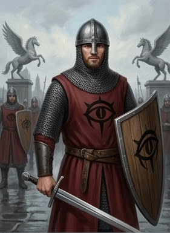

| Параметр      | Значение                                       |
|---------------|------------------------------------------------|
| Мировоззрение | LE                                             |
| AC            | 17, касание 10, врасплох 17 (+5 броня, +2 щит) |
| HP            | 22 (2d10+8)                                    |
| Скорость      | 20 футов                                       |
| Ближний бой   | Длинный меч +4 (1d8+2) или копьё +4 (1d8+2)    |
| Дальний бой   | Тяжёлый арбалет +2 (1d10)                      |
| Спасброски    | Стойкость +5, Реакция +0, Воля +0              |
| Навыки        | Запугивание +3, Восприятие +4                  |

**Тактика:** двое у входа с копьями, двое дальше с арбалетами. Действуют парами. Если противник слишком силён —
отступают, продолжая стрелять.

#### Лейтенант доттари (1 командир, уровень 5)

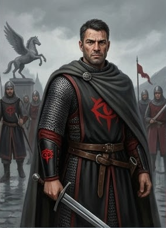

| Параметр      | Значение                                                                          |
|---------------|-----------------------------------------------------------------------------------|
| Мировоззрение | LN (склоняется к LE)                                                              |
| AC            | 21, касание 11, врасплох 20 (+9 броня, +1 Лов, +1 уклонение)                      |
| HP            | 47 (5d10+15)                                                                      |
| Скорость      | 20 футов                                                                          |
| Ближний бой   | Мастерский гладиус +9 (1d6+5) или мастерский длинный меч +9 (1d8+5)               |
| Дальний бой   | Композитный длинный лук +6 (1d8+3)                                                |
| Спасброски    | Стойкость +7, Реакция +2, Воля +4 (+1 против страха)                              |
| Способности   | Храбрость +1, Обучение владению оружием, Стойкость духа (1/день, +2 к спасброску) |

**Тактика:** не вступает в бой первым; стреляет из лука; знает мост как свои пять пальцев.

**Тактика боя (расширенная):**

- Двое стражников с копьями встают у шлагбаума, двое с арбалетами отходят назад.
- Лейтенант **не вступает в бой первым**: он **отступает** за спины стражников и **отдаёт приказы** («Приказ»:
  союзники получают +1 к следующей атаке). Если нужно — **стреляет** из composite longbow.
- Один из стражников (самый молодой) **бежит за подкреплением**. Через **3 раунда** прибудет **ещё 1d4 стражника**
  (уровень 2, по 15 XP каждый).
- **Тактика Фальконе:** он **не тратит** действия на атаку, пока стражники держат линию. Он **ждёт**, пока игроки
  потратят ресурсы, и **только тогда** вступает в бой — с Masterwork longsword, если его достали, или из longbow,
  если держат дистанцию. Если стражники падают — он **отступает** к палатке и **зовёт подкрепление** голосом.

**Мост как поле боя:** ширина ~20 футов, длина ~80 футов; парапеты высотой 4 фута (укрытие +2 AC); под мостом —
тёмная вода, падение = 30 футов (3d6 урона).

**Итог:** при победе — игроки входят в город + `Отношение Доттари -1`; при провале — конец приключения.

### GM knows

- **Тайна:** Фальконе коррумпирован, но осторожен. Он не берёт взяток у тех, кто может пожаловаться. Он **запоминает
  лица** — и **записывает имена** в журнал.
- **Журнал:** в журнале записаны **все, кто проходил** через мост за последние месяцы. Это **улика** — если игроки
  найдут журнал, они узнают, кто и когда входил в город (включая Художника, Моряка, Доктора).
- **Печать:** у Фальконе есть **сургучная печать** доттари. Подделка печати — уголовное преступление. Но Фальконе
  может **продать** оттиск за 100 зм.
- **Реакция при раскрытии тайны:** если игроки поймают Фальконе на взятке — он **отрицает**. Если у них есть
  доказательства — он **предлагает сделку**: «Я дам вам имена. Вы забудете об этом».
- **Что Фальконе не знает:** о культе в таверне, о маньяке (только слухи), о Совете Воров (только подозревает).
- **Что Фальконе подозревает:** что Художник — не просто художник; что Доктор — не просто доктор; что в «Слёзах
  устрицы» что-то нечисто.
- **Шрам** — от старого боя, когда он ещё служил в ночном патруле. Он **не любит** вспоминать. Если игроки спросят —
  он **не ответит**.
- **Chainmail** — он **носит её**, потому что **привык**. Он **не снимает** её, даже на посту.
- **Longbow** — он **стреляет** из него, когда кто-то пытается **сбежать** через мост. Это **случается**.
- **Когда он встаёт** — это **событие**. Он **не встаёт**, чтобы поприветствовать. Он **встаёт**, чтобы **задержать**
  или **ударить**.

### Ключевые детали для отыгрыша

- **Фальконе не встаёт.** Он сидит. Это его власть — он **за стойкой**. Он не поднимается, даже если игроки
  повышают голос.
- **Фальконе не угрожает.** Он **констатирует**. «Пятьдесят золотых. Или документы. Если нет — пошлина».
- **Фальконе запоминает.** Он **смотрит** на каждого. Он **записывает** имена. Он **не забывает**.
- **Фальконе осторожен.** Он **не берёт** взяток у тех, кто может пожаловаться. Он **не связывается** с теми, кто
  может быть опасен. Он **отступает**, если начинается драка.
- **Фальконе — челиец.** Никакой вычурности. Никакого золота. Только функциональность и порядок.
- **Фальконе — не злодей.** Он просто **делает свою работу**. И **немного зарабатывает** на ней.
- **Фальконе — ветеран.** Он **умеет** драться. Он **не хочет**. Если его вынудят — он **опасен**.

### Что зачитать игрокам при выходе с моста

> Фальконе отписывает строку в журнале. Ставит сургучную печать. Поднимает взгляд — впервые в сцене — и говорит ровно,
> без злобы: «Комендантский час. После шести вечера — не ходите по улицам. После заката выходят тени. Это не
> угроза. Это совет от того, кто видел, что они делают». Пауза. «Проходите. И не возвращайтесь в ночь — если только
> не хотите быть в журнале. В следующий раз я не буду так вежлив».

---

# Этап 3. Улицы Весткроуна

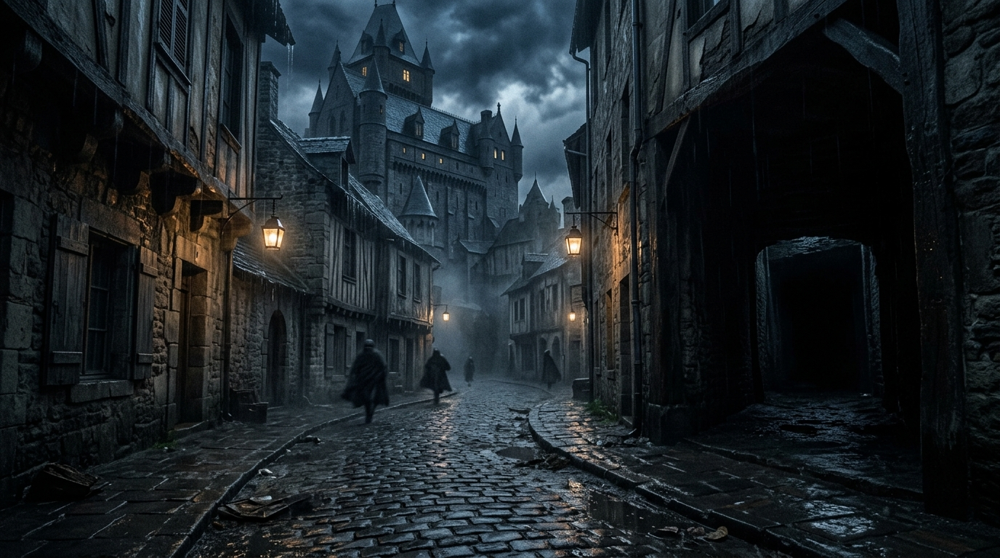

**Время:** 13:30.

## Зачитать при первом входе

> Вы ступаете на обветшалую каменную мостовую Весткроуна — «Города Сумерек». Это бывшая столица Челии, город, потерявший
> своего бога-покровителя Ародена и погрузившийся в отчаяние; стены потемнели, краска с фасадов сошла, сады давно
> заросли.
> Утром — суета: лавки, трактиры, переклички торговцев. Но стоит зайти в тёмный переулок, как город замирает: из-за
> теневых тварей, привезённых из Нидала, введён комендантский час, и по ночам улицы пустеют. Пахнет смертью, воском,
> солью реки Адивиан и гнилью. В торговом районе над всем доминирует огромное здание Тривардум с шиферной крышей.

## Наблюдения

- **Следы серии смертей** — обезображенные тела, следы крови, ритуальные символы Дагона.
- **Символы культа Дагона** — вырезанные на стенах/колоннах.
- **Курортный контраст** — над торговым районом доминирует Тривардум.

## Таблица случайных встреч (d6)

| d6 | Встреча / событие             |
|----|-------------------------------|
| 1  | Место убийства культиста      |
| 2  | Место убийства вора           |
| 3  | Место проведения ритуала      |
| 4  | Место убийства контрабандиста |
| 5  | Встреча с Художником          |
| 6  | Встреча с Детективом          |

## Сцены: места преступлений

### Сцена 1: Место убийства культиста (Художник убил культиста)

Место преступления обустроено как экспозиция арт-объекта. В центре — аккуратно нарезанное на ровные полоски тело,
сложенное в форме куба из мяса. Обведено красной краской (кровью) по брусчатке. На стене за Мясным кубом — изображена
певчая птица с радужным оперением.

- **Внимательность (СЛ 10):** среди мясной нарезки — кулон в форме трезубца, обросший кораллами.
- **Критический успех:** пальцев из кучи торчит больше 10, и некоторые — с перепонками.
- **Связь с расследованием:** указывает на **Художника**.

### Сцена 2: Место убийства вора (Корин Марроне убил представителя Совета воров)

Тело лежит в луже собственной крови, вытекающей из разрезанного одним быстрым ударом горла.

- **Внимательность (СЛ 10):** записка с указанием на место встречи: «Встретимся сегодня вечером на том-же месте и
  порешаем, чей это район. Ржавый.»
- **Связь с расследованием:** указывает на **Совет Воров / контрабанду**.

### Сцена 3: Место проведения ритуала (Культисты принесли в жертву горожанина)

На стенах — влажные потёки, образующие грубый символ: глаз осьминога в золотом диске, обведённый рунами. На земле —
круг, вычерченный солью и тёмной жидкостью. В центре — выжженный отпечаток человеческого тела. По кругу — чёрные свечи,
оплывшие так, что воск образовал щупальцеобразные наросты.

- **Внимательность (СЛ 10):** следы перепончатых лап, ведущие к стоку ливневой канализации.
- **Критический успех:** золотое кольцо (Кольцо культистов) с гравировкой на древнем языке (Акло).
- **Связь с расследованием:** указывает на **культ Дагона / Официантку+Доктора**.

### Сцена 4: Место убийства контрабандиста (Теневые твари растерзали кого-то из группы контрабандистов)

Тело растерзано, на земле — следы и кровь; рядом — ящик контрабандного товара.

- **Внимательность (СЛ 10):** ящик/следы «Погибели Дьявола».
- **Связь с расследованием:** указывает на **контрабанду / теневые твари из Нидала**.

### Стат-блок: Джакомо Раньери — Детектив (d6=5)

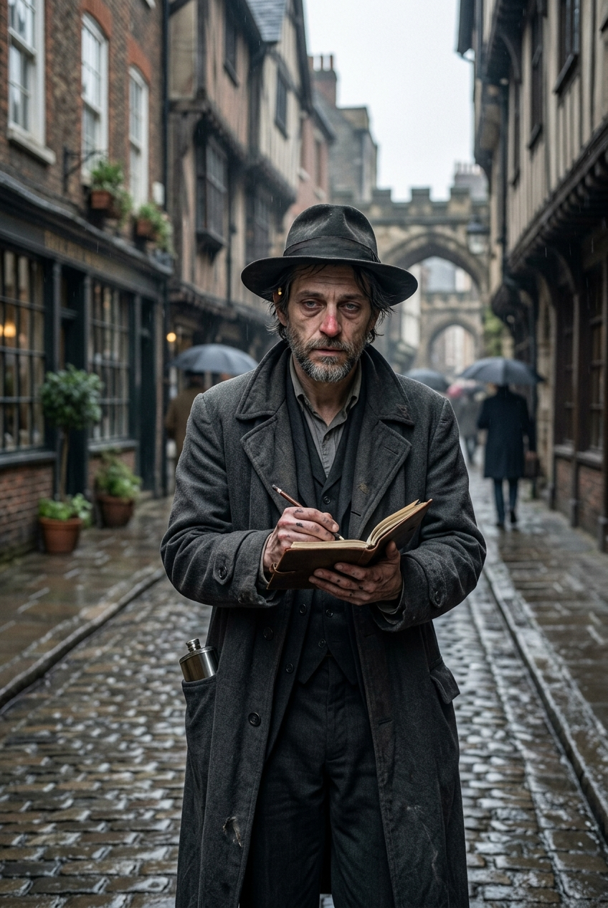

#### Что зачитать игрокам при первой встрече

> На улице вы замечаете грузного, чуть сутулого мужчину лет пятидесяти. Усталое лицо с пробивающейся щетиной и седеющими
> висками, красноватый нос, заметные мешки под глазами. Взгляд цепкий, въедливый, но немного мутный — следы пагубных
> привычек. На нём слегка мятый тёмно-серый плащ, помятый тёмный костюм и шляпа с широкими полями, глубоко надвинутая на
> лоб. На поясе — блокнот и карандаш, из внутреннего кармана плаща то и дело выглядывает металлический бок фляжки. От
> него разит дешёвым табаком и крепким алкоголем. Он что-то быстро записывает, останавливается, прищуривается и
> оглядывает вас хмурым, подозревающим взглядом.

#### Идентификация

- **Имя:** Джакомо Раньери.
- **Прозвище:** «Джек».
- **Роль:** детектив, нанятый Дукстатаром для расследования серии смертей в городе.
- **Раса:** человек.
- **Мировоззрение:** Законопослушно-нейтральное (LN).
- **Статус:** main_npc.
- **Может ли быть жертвой:** true.

#### Скрывает

- **[small]** Его нанял Дукстатар для расследования серии смертей в городе.
- **[small]** Зависимость от алкоголя.

#### Хочет

- раскрыть серию убийств в городе.

#### [PF2e stat-block]

| Параметр          | Значение                                                                                                                           |
|-------------------|------------------------------------------------------------------------------------------------------------------------------------|
| **Уровень**       | 9                                                                                                                                  |
| **Мировоззрение** | LN (склоняется к LE)                                                                                                               |
| **Раса**          | Человек                                                                                                                            |
| **Класс**         | Следователь (Investigator)                                                                                                         |
| **Роль**          | Solo boss / ranged controller                                                                                                      |
| **Восприятие**    | +18 (moderate)                                                                                                                     |
| **Языки**         | Общий, Варисийский                                                                                                                 |
| **Навыки**        | Восприятие +18, Общество +17, Знание (местное) +19, Проницательность +18, Медицина +17, Скрытность +17, Запугивание +17, Обман +15 |
| **Сила**          | +2                                                                                                                                 |
| **Ловкость**      | +4                                                                                                                                 |
| **Телосложение**  | +3                                                                                                                                 |
| **Интеллект**     | +5                                                                                                                                 |
| **Мудрость**      | +4                                                                                                                                 |
| **Харизма**       | +2                                                                                                                                 |
| **AC**            | 27 (moderate)                                                                                                                      |
| **HP**            | 150 (moderate)                                                                                                                     |
| **Скорость**      | 25 футов                                                                                                                           |
| **Спасброски**    | Стойкость +16, Реакция +18, Воля +20                                                                                               |
| **Ближний бой**   | Дубинка +1: +18, 2d6+4 дробящий, нелетальный, +2d6 скрытый удар                                                                    |
| **Дальний бой**   | Дуэльный пистолет +1: +18, 2d6+4 колющий (60 футов, перезарядка 1)                                                                 |

**Способности:**

- **Разработать стратегию (Devise a Stratagem):** бросает d20 и запоминает; при следующей атаке по выбранной цели
  использует этот результат.
- **Стратегический удар (Strategic Strike):** +2d6 точного урона.
- **Подсказка (Clue In):** один союзник получает +1 к следующей проверке Восприятия или Проницательности.
- **Чутьё детектива (реакция):** +2 к AC против атаки.
- **Быстрый выстрел (2 действия):** две атаки с -2; если обе попадают, цель «Замедлена 1».

#### GM knows

- **Тайны:** [small] нанят Дукстатаром; [small] зависимость от алкоголя.
- **Реакции:** при упоминании дела — записывает.

---

# Этап 4. Развилка (14:30)

Игроки выбирают ветку: **A. Расследование**, **B. Контрабанда**, **C. Дезертир**.

---

## Ветка A. Расследование серии убийств

### A1. Офис Дукстатара

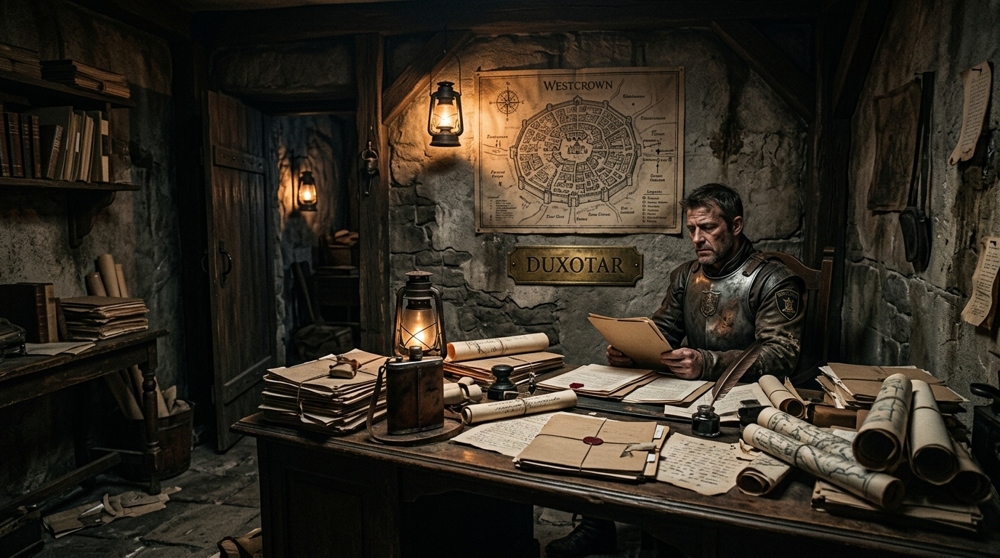

#### Зачитать при первом входе

Небольшое здание в торговом районе, рядом с Тривардумом. Внутри — стол, шкаф с делами, карта города на стене, латунная
табличка «Дукстатар». Пахнет бумагой, чернилами и алкоголем. За столом сидит толстый мужчина в потрёпанной форме стражи,
лицом к фляжке. Он не замечает, как входит партия, — он уже на третьем «заседании».

#### Наблюдения

- **Фляжка / следы пьянства** — Дукстатар некомпетентен и вечно пьян.
- **Карта города на стене** — показывает зоны влияния доттари.
- **Шкаф с делами** — часть карточек жертв пустые или с подчёркнутыми «неизвестно».

#### NPC: Дукстатар Ильтус Мартис

#### Что зачитать при первой встрече

> За столом сидит молодой мужчина лет тридцати с отечным, красноватым лицом и небрежной щетиной. Нос заметно покраснел,
> глаза сонные и мутные. На нём официальная парадная форма городской стражи, но выглядит она крайне небрежно и смята,
> мундир заметно велик ему по размеру. На столе — фляжка с алкоголем. Он сидит неуклюже, с трудом сохраняя подобие
> выправки, и разговаривает нечётко, заплетающимся языком. От него разит алкоголем и некомпетентностью.

#### [PF2e stat-block]

| Параметр          | Значение                                           |
|-------------------|----------------------------------------------------|
| **Уровень**       | 3                                                  |
| **Мировоззрение** | LN (склоняется к LE)                               |
| **Раса**          | Человек                                            |
| **Класс**         | Воин (Fighter)                                     |
| **Роль**          | Soldier / commander                                |
| **Восприятие**    | +8                                                 |
| **Языки**         | Общий                                              |
| **Навыки**        | Запугивание +8, Знание (местное) +6, Восприятие +8 |
| **Сила**          | +2                                                 |
| **Ловкость**      | +1                                                 |
| **Телосложение**  | +2                                                 |
| **Интеллект**     | +0                                                 |
| **Мудрость**      | +1                                                 |
| **Харизма**       | +2                                                 |
| **AC**            | 22                                                 |
| **HP**            | 45                                                 |
| **Скорость**      | 25 футов                                           |
| **Спасброски**    | Стойкость +10, Реакция +8, Воля +7                 |
| **Ближний бой**   | Длинный меч +7 (1d8+2 рубящий)                     |
| **Дальний бой**   | Тяжёлый арбалет +6 (1d10 колющий)                  |

**Способности:**

- **Пьяный командир (Drunken Commander):** -2 к Восприятию/Проницательности, но +2 к Запугиванию.
- **Связи (Connections):** племянник лорд-мэра; может «надавить» на NPC через родственные связи (1/день).

#### Зацепки

- **Наём Детектива.** Дукстатар нанимает Детектива и может нанять и игроков для расследования серии.
- **Связь с Советом Воров.** За видимой городской властью стоит Совет Воров.

#### GM knows

- **Тайна:** Дукстатар некомпетентен; его власть — по родству; реальные зоны влияния — у 4 дуротасам.
- **При раскрытии тайны:** пытается свалить вину на доттари/на игроков; не нападает, но лжёт.

---

### A2. Тривардум

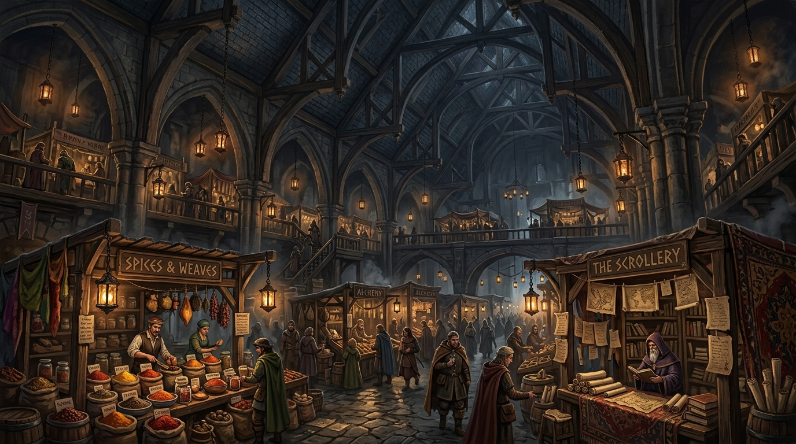

#### Зачитать при первом входе

Огромное здание с шиферной крышей, доминирующее над торговым районом. Вы заходите в толпу: покупатели, торговцы,
бюрократы. Пахнет специями, бумагой, вином и чернилами. В одном шиферном здании — магазины, таверны, офисы
правительства, даже послов.

#### Зацепки

- **Тривардум (слух).** Дукстатар кого-то нанял, но они не справляются; он не откажется от помощи.
- **Капитан «Чёрной Сирены».** Просит найти бывшего дезертира (Корина Марроне).
- **Совет Воров.** Предлагает найти контрабандистов, которые в общак не скидываются.
- **Адские Рыцари.** Предлагает поискать еретиков или поставщиков «Погибели Дьявола».

#### NPC: Капитан Алессандро Маретти

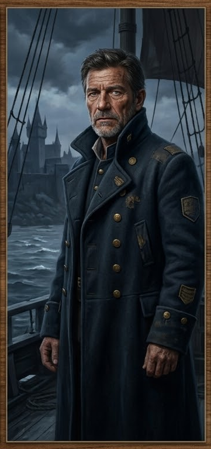

#### Что зачитать при первой встрече

> Перед вами мужчина лет пятидесяти, суровый и вкрадчивый, с обветренным лицом и тяжёлым взглядом. Он одет в добротный,
> но потрёпанный морской камзол; на поясе — сабля. От него пахнет солью, дёгтем и ромом. Он смотрит на вас оценивающе,
> как человек, который привык командовать и не привык повторять дважды.

#### [PF2e stat-block]

| Параметр          | Значение                                                                           |
|-------------------|------------------------------------------------------------------------------------|
| **Уровень**       | 8                                                                                  |
| **Мировоззрение** | LN                                                                                 |
| **Раса**          | Человек                                                                            |
| **Класс**         | Боец (Fighter)                                                                     |
| **Роль**          | Soldier / commander                                                                |
| **Восприятие**    | +16 (moderate)                                                                     |
| **Языки**         | Общий, Варисийский                                                                 |
| **Навыки**        | Атлетика +18, Запугивание +16, Морячество +18, Выживание +14, Знание (морское) +15 |
| **Сила**          | +5                                                                                 |
| **Ловкость**      | +3                                                                                 |
| **Телосложение**  | +3                                                                                 |
| **Интеллект**     | +1                                                                                 |
| **Мудрость**      | +3                                                                                 |
| **Харизма**       | +3                                                                                 |
| **AC**            | 26                                                                                 |
| **HP**            | 135                                                                                |
| **Скорость**      | 25 футов                                                                           |
| **Спасброски**    | Стойкость +16, Реакция +15, Воля +14                                               |
| **Ближний бой**   | Сабля +1: +19, 2d6+7 рубящий                                                       |
| **Дальний бой**   | Пистолет +16, 2d6+4 колющий (перезарядка 1)                                        |

**Способности:**

- **Приказ (Command):** +1 к следующей атаке союзника.
- **Морской волк (Sea Legs):** +2 к Атлетике и Акробатике на корабле или у воды.

#### Зацепка: «Поиск дезертира»

- Награда: золото.
- Знание: «Кайрэн — вор и дезертир».

---

### A3. Морг

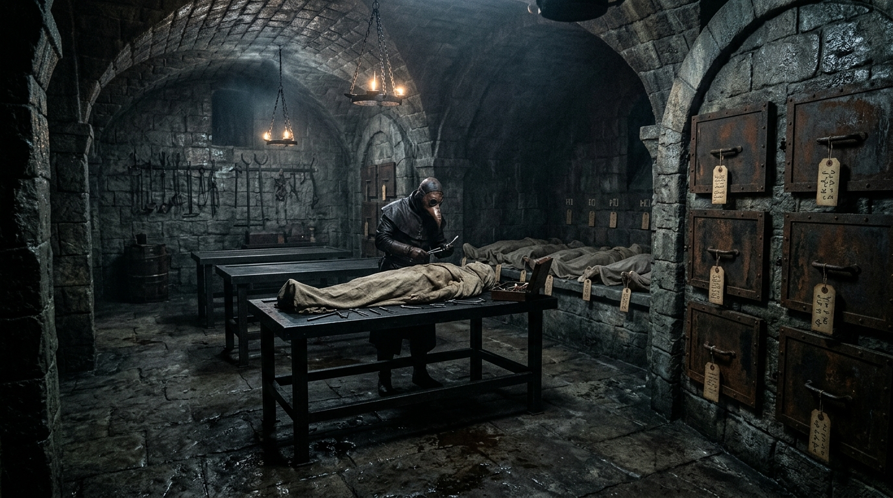

#### Зачитать при первом входе

Холодное, светлое помещение. Железная стойка, ящики с телами, лампы, пахнет формалином и металлом. На стенах — карточки
с датами и именами, часть пустых. На телах жертв — символы культа, совпадающие с символами в логове культа (записаны
Доктором). Здесь хранятся невостребованные тела жертв серии смертей.

#### NPC: Тобиа Бандини — Ассистент Доктора

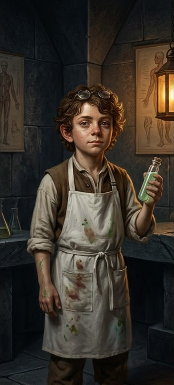

#### Что зачитать при первой встрече

> В морге вас встречает молодой человек лет двадцати пяти, в белом фартуке, с усталым, но живым лицом. Он явно привык к
> трупам, но не потерял любопытства. На столе — бумаги, карточки, инструменты. Он говорит быстро, чуть нервно, но по
> делу.

#### [PF2e stat-block]

| Параметр          | Значение                                                                 |
|-------------------|--------------------------------------------------------------------------|
| **Уровень**       | 2                                                                        |
| **Мировоззрение** | NG                                                                       |
| **Раса**          | Полурослик (Halfling)                                                    |
| **Класс**         | Алхимик (Alchemist, Chirurgeon)                                          |
| **Роль**          | Support / healer                                                         |
| **Восприятие**    | +6 (trained; +2 с Keen Eyes)                                             |
| **Языки**         | Общий, Полуросличий, +3 (Варисийский, Акло, Эльфийский)                  |
| **Навыки**        | Медицина +8 (expert), Ремесло (алхимия) +7, Дипломатия +2, Восприятие +6 |
| **Сила**          | -1                                                                       |
| **Ловкость**      | +3                                                                       |
| **Телосложение**  | +1                                                                       |
| **Интеллект**     | +3                                                                       |
| **Мудрость**      | +2                                                                       |
| **Харизма**       | +0                                                                       |
| **AC**            | 18                                                                       |
| **HP**            | 24                                                                       |
| **Скорость**      | 25 футов                                                                 |
| **Спасброски**    | Стойкость +5, Реакция +7, Воля +6                                        |
| **Ближний бой**   | Скальпель: +9, 1d4-1 колющий, finesse                                    |
| **Дальний бой**   | Метательная склянка: +9, 1d6 кислоты                                     |

**Способности:**

- **Полевая медицина (Field Medicine):** лечит 1d8 HP за 10 минут (Медицина СЛ 15, +2).
- **Алхимические бомбы (Alchemical Bombs):** 3 бомбы (кислота, огонь, холод), урон 1d6.
- **Keen Eyes (полурослик):** +2 к Восприятию при Seek.
- **Halfling Luck (1/день):** перебросить провальный спасбросок.

#### Зацепка: «Доктор в таверне»

- Тобиа говорит, что Доктор Элио Вентури сейчас в таверне «Слёзы устрицы», и объясняет дорогу.
- При взятии заказа «Поиск маньяка» игроки могут осмотреть тела:
    - **Культист** → мутации на теле.
    - **Вор** → профессиональный разрез на горле.
    - **Горожанин** → ритуальные символы.
    - **Контрабандист** → остатки Лист-живодёра на губах.

#### GM knows

- **Критическая зацепка:** «Тобиа говорит, что Доктор в таверне» — ключ к развязке; нельзя терять из-за одного провала.

---

## Ветка B. Контрабанда

### B1. Сумеречный рынок — «Налёт воров Совета»

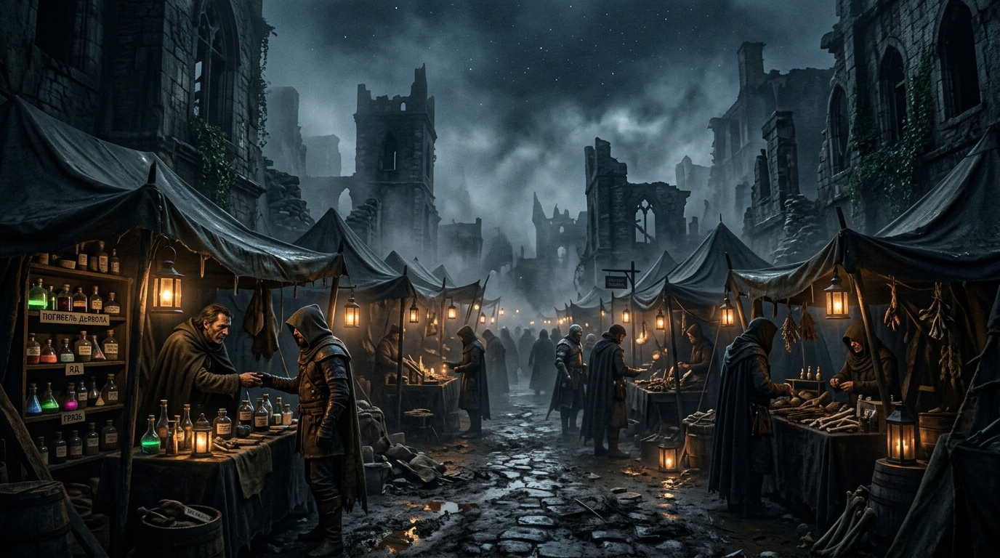

#### Зачитать при первом входе

Блуждающий базар в руинах северной части города (Парего Доспера, «Мертвый Сектор»); никогда не остаётся на одном месте
дважды. Тёмные палатки, фонари, туман. Лавки с ядами, наркотиками, рабами и странными существами. Пахнет дымом, гнилью,
порохом и ядами.

#### Сцена 5: «Налёт воров Совета» (боевой энкаунтер)

Тёмный переулок / Сумеречный рынок ночью. Из теней выходят люди Совета Воров — карманники и «загонщики». Задача —
окружить партию, выбить оружие или оглушить, и увести к **Вассиндио Дровендж** в **Совет Воров**. **Бюджет XP: 80 XP (
Умеренный бой, партия 4×5 уровня).**

**Состав энкаунтера:**

| Боец              | Уровень | XP                 | Количество |
|-------------------|---------|--------------------|------------|
| Уличный карманник | 3       | 40                 | 1          |
| Заводила Совета   | 5       | 80                 | 1          |
| **Итого**         |         | **120** (Moderate) |            |

> Заводила Совета — командир: он не вступает в бой первым, бросает Сеть и применяет «Вынужденный удар». Карманник
> поддерживает «Скрытым ударом» и «Диверсией и кражей».

**Улики/намёки:** в ходе боя игроки могут заметить на одном из воров знак/печать Совета Воров.

**Последствия:**

- Успех → игроки побеждают; воры могут выдать зацепку про Совет/контрабанду.
- Провал → игроки захвачены и отведены в Совет Воров.

#### Статблок: Уличный карманник (Street Cutpurse) — Creature 3

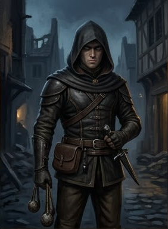

| Параметр      | Значение                                           |
|---------------|----------------------------------------------------|
| Мировоззрение | NE                                                 |
| Восприятие    | +9; слабое освещение                               |
| Языки         | Общий, Воровской жаргон                            |
| AC            | 19                                                 |
| HP            | 42                                                 |
| Скорость      | 30 футов                                           |
| Спасброски    | Стойкость +7, Реакция +11, Воля +8                 |
| Ближний бой   | Дубинка-блэкджек +11 [Нелетальное], 1d6+3 дробящий |
| Дальний бой   | Болы +11 [Сбивает с ног], 1d4+1 дробящий           |

**Способности:**

- **Скрытый удар (Sneak Attack):** +1d6 по «Застигнут врасплох».
- **Ловкий уклон (Nimble Dodge) — Реакция:** +2 к AC против триггерной атаки.
- **Диверсия и кража:** Обман против Воли → «Застигнут врасплох» → свободная кража.

#### Статблок: Заводила Совета (Council Ruffian) — Creature 5

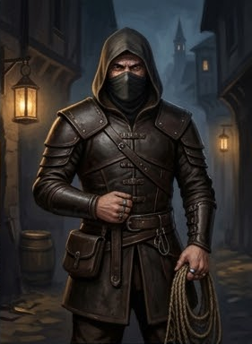

| Параметр      | Значение                                           |
|---------------|----------------------------------------------------|
| Мировоззрение | LE                                                 |
| Восприятие    | +12                                                |
| Языки         | Общий, Воровской жаргон                            |
| AC            | 22                                                 |
| HP            | 75                                                 |
| Скорость      | 25 футов                                           |
| Спасброски    | Стойкость +14, Реакция +11, Воля +10               |
| Ближний бой   | Дубинка-блэкджек +13 [Нелетальное], 2d6+6 дробящий |
| Дальний бой   | Сеть +11 [Обезоруживание, Сбивает с ног]           |

**Способности:**

- **Вынужденный удар (Coercive Strike):** атака + свободное Запугивание против Воли → «Запуган 1».
- **Оглушающий удар (Knockout Blow) — 2 действия:** 2d8+10 дробящий; Стойкость СЛ 22, иначе «Оглушён 1».

**Тактика воров:**

- **Раунд 1:** Карманники кидают Болы, Заводила бросает Сеть.
- **Раунд 2:** Карманники заходят в клещи для «Скрытого удара». Заводила применяет «Вынужденный удар» и «Оглушающий
  удар».

**Цель победы:** когда 2+ игрока упадут без сознания — воры предлагают сдаться. Если более половины воров падает —
представитель Совета останавливает сражение.

---

### B2. Совет Воров

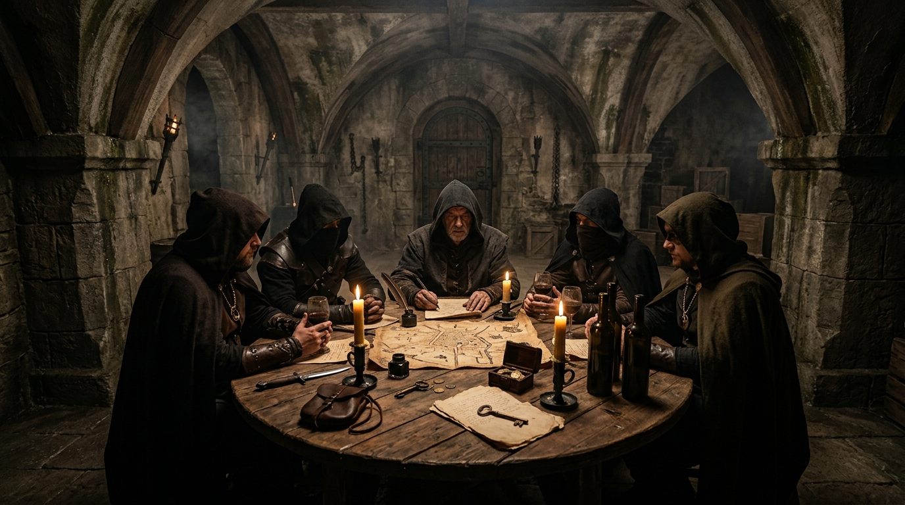

#### Зачитать при первом входе

Совет Воров — легендарная теневая преступная организация Весткроуна и фактическая реальная власть города, скрытая за
видимой городской властью. Большинство горожан считает Совет лишь старой сказкой. Встречи — в тёмных переулках,
подземных подвалах, вдали от глаз. Атмосфера тайны, шантажа, власти. Пахнет дымом, тёмным деревом, вином; слышен шёпот и
далёкие голоса.

#### NPC: Вассиндио Дровендж — Патриарх Совета Воров

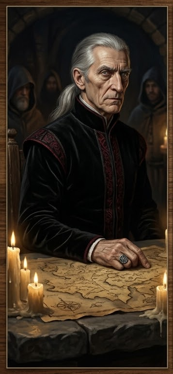

#### Что зачитать при первой встрече

> В тёмном подвале, за столом, сидит старик с длинными седыми волосами и пронзительным взглядом. Он одет в тёмные,
> дорогие, но неброские одежды. Вокруг него — несколько фигур в капюшонах. На столе — карта города, свечи, вино. Он
> говорит тихо, но каждое слово звучит как приказ. От него веет властью, тайной и холодом.

#### [PF2e stat-block]

| Параметр          | Значение                                                                                                 |
|-------------------|----------------------------------------------------------------------------------------------------------|
| **Уровень**       | 10                                                                                                       |
| **Мировоззрение** | LE                                                                                                       |
| **Раса**          | Человек                                                                                                  |
| **Класс**         | Вор (Rogue, Mastermind)                                                                                  |
| **Роль**          | Controller / leader                                                                                      |
| **Восприятие**    | +20 (мастер)                                                                                             |
| **Языки**         | Общий, Варисийский, Акло, Воровской жаргон                                                               |
| **Навыки**        | Обман +22, Запугивание +20, Проницательность +20, Общество +18, Знание (Совет Воров) +20, Скрытность +18 |
| **Сила**          | +2                                                                                                       |
| **Ловкость**      | +3                                                                                                       |
| **Телосложение**  | +2                                                                                                       |
| **Интеллект**     | +5                                                                                                       |
| **Мудрость**      | +4                                                                                                       |
| **Харизма**       | +5                                                                                                       |
| **AC**            | 29                                                                                                       |
| **HP**            | 150                                                                                                      |
| **Скорость**      | 25 футов                                                                                                 |
| **Спасброски**    | Стойкость +16, Реакция +19, Воля +20                                                                     |
| **Ближний бой**   | Кинжал +2: +20, 2d4+6 колющий, 2d6 скрытый                                                               |
| **Дальний бой**   | Метательный нож +20, 2d4+5 колющий                                                                       |

**Способности:**

- **Коварный удар (Sneak Attack):** +2d6 по «Застигнут врасплох».
- **Мастер-ум (Mastermind):** при успешной Проницательности/Знании цель «Застигнут врасплох» для него.
- **Анализ (Analyze Weakness):** узнаёт уязвимость цели (Восприятие СЛ 25).
- **Связи Совета (Council Connections):** 1/день призывает 2d4 воров Совета (уровень 3).

#### Зацепка: «Поиск нелегальной контрабанды»

- Награда: золото (если одолели воров) или вернут украденные вещи (если проиграли).

#### GM knows

- **Тайна:** Совет — реальная власть города, скрытая за видимой властью; тайное общество.
- **Критическая зацепка:** «Совет Воров» — ключ к пониманию, почему контрабанда не замечена.
- **Реакция при раскрытии тайны:** угрожает, шантажирует, подкупает — не нападает открыто.

---

## Ветка C. Дезертир

### C1. Порт — «Драка с матросами «Чёрной Сирены»»

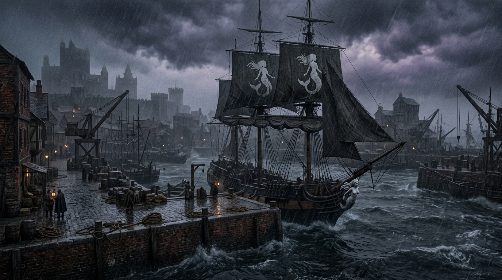

#### Зачитать при первом входе

Кирпичные причалы, швартованные корабли, лодки, якоря, толпа грузчиков и матросов. Вдалеке — титанический Арсенал со
скелетом строящегося флагманского корабля «Доминатор». Пахнет солью, дёгтем, рыбой и водой. Громкие голоса, стук
молотка, скрип канатов. Порт обрабатывает около половины всей внешней торговли Челии.

#### Сцена 6: «Драка с матросами «Чёрной Сирены»» (боевой энкаунтер)

Порт / у причалов. Закалённые в штормах моряки и абордажники под предводительством боцмана задевают игроков — не ради
убийства, а ради «проверки». Это «кабацкая» драка: без обнажения стального оружия, на импровизированном оружии (кружки,
стулья, бутылки). **Бюджет XP: 80 XP (Умеренный бой, партия 4×5 уровня).**

**Состав энкаунтера:**

| Боец                     | Уровень | XP                         | Количество |
|--------------------------|---------|----------------------------|------------|
| Абордажник-матрос        | 3       | 40                         | 1–2        |
| Запевала-корабельный кок | 2       | 30                         | 1          |
| Портовый Боцман          | 4       | 60                         | 1          |
| **Итого**                |         | ~130–170 (Moderate–Severe) |            |

> **Особенность:** «кабацкая» драка — без стального оружия. Задача — обезоружить и привести к Капитану, а не убить.
> Запевала поддерживает «Ритмом кабацкой песни», боцман командует «Приказом «Чёрной Сирены»», абордажники используют
> «Захват/Бросок в драке». Если побеждают моряки — игроков ведут силой; если побеждают игроки (более половины моряков с
> 0 HP / без сознания) — Капитан сам останавливает сражение.

**Улики/намёки:** на одном из моряков — знак/тату «Чёрной Сирены» (или упоминание капитана / «Солёный Алессандро» /
дезертира Корина Марроне).

**Последствия:**

- Успех → игроки побеждают; Капитан сам останавливает бой и предлагает поговорить в таверне «Булькающая гаргулья».
- Провал → игроков ведут силой к Капитану.

#### Статблок: Абордажник-матрос (Siren Deckhand) — Creature 3

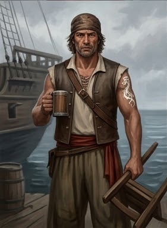

| Параметр      | Значение                                                           |
|---------------|--------------------------------------------------------------------|
| Мировоззрение | CN                                                                 |
| Восприятие    | +8                                                                 |
| Языки         | Общий                                                              |
| AC            | 18                                                                 |
| HP            | 50                                                                 |
| Скорость      | 25 футов                                                           |
| Спасброски    | Стойкость +10, Реакция +9, Воля +6                                 |
| Ближний бой   | Импровизированное оружие +11 [Нелетальное, Стычка], 1d8+4 дробящий |

**Способности:**

- **Драчун (Barroom Brawler):** не получает -2 за импровизированное оружие.
- **Захват в драке (Brawling Grapple):** Атлетика против Стойкости → «Захвачен».
- **Бросок в драке (Barroom Slam):** 2d6+4 дробящий + «Сбит с ног».

#### Статблок: Портовый Боцман (Siren's Boatswain) — Creature 4

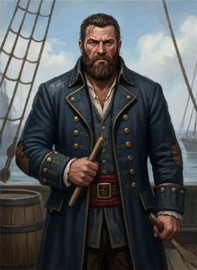

| Параметр      | Значение                                                                     |
|---------------|------------------------------------------------------------------------------|
| Мировоззрение | N                                                                            |
| Восприятие    | +10                                                                          |
| Языки         | Общий                                                                        |
| AC            | 20                                                                           |
| HP            | 68                                                                           |
| Скорость      | 25 футов                                                                     |
| Спасброски    | Стойкость +12, Реакция +9, Воля +10                                          |
| Ближний бой   | Тяжёлый корабельный нагель +12 [Нелетальное, Обезоруживание], 2d6+6 дробящий |

**Способности:**

- **Приказ «Чёрной Сирены» (Siren`s Command):** союзники в 30 футов +1 к атакам и Атлетике.
- **Толчок и сбивание (Bull Rush & Tackling) — 2 действия:** +2 к Толчку/Сбиванию; 2d6+4 + «Захвачен».

#### Статблок: Запевала-корабельный кок (Shanty Cook) — Creature 2

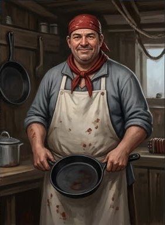

| Параметр      | Значение                                                                     |
|---------------|------------------------------------------------------------------------------|
| Мировоззрение | N                                                                            |
| Восприятие    | +7                                                                           |
| Языки         | Общий                                                                        |
| AC            | 17                                                                           |
| HP            | 34                                                                           |
| Скорость      | 25 футов                                                                     |
| Спасброски    | Стойкость +8, Реакция +7, Воля +9                                            |
| Ближний бой   | Тяжёлая чугунная сковорода +8 [Нелетальное, Смертельный d10], 1d6+3 дробящий |

**Способности:**

- **Ритм кабацкой песни (Shanty Rhythms):** союзники +1 к спасброскам против страха/«Оглушён»; противники в 30 футов
  проходят Волю СЛ 18, иначе «Очарован 1».

**Тактика моряков:**

- **Раунд 1:** Запевала включает «Ритм кабацкой песни». Боцман отдаёт «Приказ» и делает «Толчок».
- **Раунд 2:** Абордажники активно используют окружение, «Захват в драке» и «Бросок в драке».

**Особенность:** бой без стального оружия. Задача — обезоружить и привести к Капитану.

**Действия порта (на инициативе 20, проигрывая ничьи):**

| d6  | Эффект                                                                                                           |
|-----|------------------------------------------------------------------------------------------------------------------|
| 1–2 | **Скользкие доски.** Палуба/причал становится труднопроходимой; спасбросок Акробатики СЛ 18, иначе «Сбит с ног». |
| 3–4 | **Бутылочный дождь.** Бутылки летят в толпу; спасбросок Реакции СЛ 18, иначе 1d6 дробящего урона.                |
| 5–6 | **Толпа.** Грузчики/матросы окружают; цель проходит Стойкость СЛ 18, иначе «Замедлен 1».                         |

**Цель победы:** если побеждают моряки — игроков ведут силой. Если побеждают игроки (более половины моряков с 0 HP / без
сознания) — Капитан сам останавливает сражение.

#### GM knows

- **Тайна:** «Драка с матросами» — не нападение, а проверка навыков; Капитан хочет нанять игроков.
- **Критическая зацепка:** знак/тату «Чёрной Сирены» — не терять из-за одного провала.
- **При победе игроков:** Капитан предлагает поговорить в таверне «Булькающая гаргулья».

### C2. Таверна «Булькающая гаргулья»

Капитан Алессандро Маретти (стат-блок в § A1) встречает игроков в таверне.

**Зацепка: «Поиск дезертира»**

- Награда: золото или вернут украденные вещи.
- Знание: «Кайрэн — вор и дезертир».

### C3. Таверна «Трикалиста»

Допрос моряков/докеров (Дипломатия или Запугивание, СЛ 15).

**Зацепка:** «Кого-то, похожего на Кайрэн, иногда видят в таверне «Слёзы устрицы»».

### C4. Паром / Аренда лодки

> Если игроки попробуют доехать до таверны «Слёзы устрицы» на пароме или захотят арендовать лодку — им **откажут**:
> погода портится, и на воде становится опасно.
> Так-же посоветуют, что единственный относительно безопасный путь сейчас — **сухопутный**, через Адивианский мост.

- **Как это работает.** В порту есть паром/лодка, но в 17:30 — отказ: ливень/ветровой нагон, на воде опасно. Игроки
  вынуждены ехать **по суше**.
- **Последствие.** Отказ на воде = игроки едут через Адивианский мост (сцена главы 2, 18:00); зацепка на потенциальный
  путь спасения при потопе — ялик на причале.
- **Атмосфера.** Дождь льёт как из ведра; ветер с залива; неестественно тихая вода.

---

# Развязка главы (17:30)

Игроки получают одну или несколько зацепок, которые отправляют их в **таверну «Слёзы устрицы»** за город.

- **A4 / B4 / C4 → «Слёзы устрицы»** (Lacrime della Madreperla).
- **17:30 — игроки уезжают из города** (конец главы 1).
- Игроки отправляются в таверну — **конец главы 1**.

**Ветвление:** если игроки **не уезжают** из города до заката (17:30) и остаются в городе после наступления темноты (18:

30) — переход к **Этапу 5. Ночь в городе**.

---

# Этап 5. Ночь в городе (18:30+)

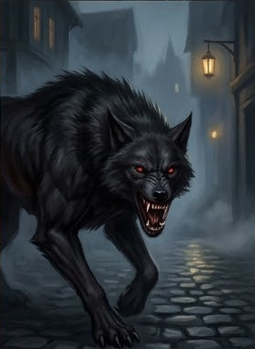

**Время:** 18:30 и позже.

**Условие:** игроки не покинули город до заката и остались на улицах после темноты.

## Атмосфера

Тёмный переулок или пустырь в Парего Спе́ра (южный, «жилой» Весткроун), либо окраина у реки Адивиан. Ночь, туман,
единственный источник света — далёкий фонарь или луна, скрытая облаками.

Сначала — тишина. Потом — низкий, вибрирующий вой, от которого стынет кровь. Из темноты проступают силуэты: огромные
псы с шерстью, которая пьёт свет, и бесплотные фигуры, чьи касания оставляют холод в костях.

## Сцена: Стая из Нижних Теней (боевой энкаунтер)

Это не просто звери — это осколки проклятия Илнерика, движимые голодом и злобой. Они охотятся стаей: Shadow Mastiff
окружают и сбивают с ног, Shadow атакуют сквозь плоть, высасывая жизнь.

**Уровень опасности для партии 4×5:** **Extreme+ (TPK).** Без вмешательства Люциано партия почти гарантированно
погибает в первые 2–3 раунда.

### Состав энкаунтера

| Боец                 | Уровень | Количество |
|----------------------|---------|------------|
| Shadow Mastiff       | 6       | 4          |
| Shadow Mastiff Alpha | 8       | 1          |
| Shadow               | 3       | 6          |
| **Итого**            |         | **11**     |

#### Зачитать при нападении

> Низкий вой разрывает тишину ночи, и в темноте проступают силуэты:
> — огромные псы, чья шерсть пьёт свет;
> — бесплотные фигуры теней, чьи касания оставляют холод в костях.
> Пахнет гарью и морозом.
>
> **Люциано** (если встречал игроков днём) присоединяется к партии после первого хода, ворча:
> «Предупреждали же не ходить в темноте».

#### Тактика стаи

**Раунд 1 (шок и страх):**

- Alpha и два mastiff используют **Ужасающий вой**. Партия 5 уровня имеет Волю примерно +8–+12; при СЛ 22–26
  большинство проваливает. «Испуган 3» = -3 ко всем проверкам и КБ, «Бежит 1» = тратить действия на бегство.
- Shadows используют **Скольжение в тенях (Slink in Shadows)** и подходят вплотную.

**Раунд 2 (окружение):**

- Mastiff используют **Теневое слияние**, становятся невидимыми и атакуют с «Застигнута врасплох». **Стайная
  тактика** даёт +2 к атакам. Каждая атака сбивает с ног.
- Shadows применяют **Украсть тень (Steal Shadow)**: попадают по цели Теневой дланью и в следующем действии
  вытягивают тень, накладывая «Истощение 1». Состояние накапливается (до «Истощения 4»); при «Истощении 3+» тень
  цели может отделиться как **Shadow Spawn**. Каждый удар снижает Силу, что ещё больше ухудшает проверки
  Атлетики и атаки.

**Раунд 3 (добивание):**

- Если партия не отступила — alpha фокусирует самого сильного бойца, mastiff добивают раненых, Shadow блокируют
  отход.

**Итог без Люциано:** TPK за 3–4 раунда. Партия 5 уровня не имеет ни массового урона, ни способов надёжно видеть
невидимых существ, ни сопротивления страху на таком уровне.

#### Статблок: Shadow Mastiff — существо 6

| Параметр      | Значение                                                                                                   |
|---------------|------------------------------------------------------------------------------------------------------------|
| Мировоззрение | NE · Средний · Тень · Зверь                                                                                |
| Восприятие    | +14; тёмное зрение, чутьё (неточное) 30 футов                                                              |
| Навыки        | Акробатика +14, Атлетика +15, Скрытность +16 (+20 в тусклом свете/темноте), Выживание +12                  |
| Сила          | +5                                                                                                         |
| Ловкость      | +4                                                                                                         |
| Телосложение  | +4                                                                                                         |
| Интеллект     | -3                                                                                                         |
| Мудрость      | +2                                                                                                         |
| Харизма       | -1                                                                                                         |
| AC            | 23                                                                                                         |
| HP            | 90                                                                                                         |
| Скорость      | 40 футов                                                                                                   |
| Спасброски    | Стойкость +16, Реакция +14, Воля +12                                                                       |
| Сопротивления | весь урон 5 (кроме силового, призрачного касания, духа, жизненной силы); слабость к солнечному свету       |
| Ближний бой   | Пасть +17 (досягаемость 10 футов), 2d8+7 колющий плюс «Сбит с ног» (Атлетика против Стойкости цели, СЛ 23) |

**Способности:**

- **Теневое слияние (Shadow Blend) — 1 действие.** В тусклом свете или темноте Shadow Mastiff становится невидимым
  до конца своего следующего хода или до атаки. Даже при атаке цель получает «Застигнут врасплох», если не может
  видеть невидимых существ.
- **Вой стаи (Terrifying Howl) — 2 действия, 1/раунд.** Все живые существа в пределах 60 футов проходят спасбросок
  Воли СЛ 22. При провале — «Испуган 2»; при крит. провале — «Испуган 4» и «Бежит 1». Не магический эффект, а
  инстинктивный ужас.
- **Стайная тактика.** Если рядом с целью есть хотя бы один союзник Shadow Mastiff, атаки по этой цели получают +2
  обстоятельственного бонуса.

#### Статблок: Shadow Mastiff Alpha — существо 8

| Параметр      | Значение                                                                                              |
|---------------|-------------------------------------------------------------------------------------------------------|
| Мировоззрение | NE · Средний · Тень · Зверь                                                                           |
| Восприятие    | +17; тёмное зрение, чутьё (неточное) 30 футов                                                         |
| Навыки        | Акробатика +16, Атлетика +18, Запугивание +15, Скрытность +18, Выживание +15                          |
| Сила          | +6                                                                                                    |
| Ловкость      | +4                                                                                                    |
| Телосложение  | +5                                                                                                    |
| Интеллект     | -1                                                                                                    |
| Мудрость      | +3                                                                                                    |
| Харизма       | +1                                                                                                    |
| AC            | 26                                                                                                    |
| HP            | 135                                                                                                   |
| Скорость      | 40 футов                                                                                              |
| Спасброски    | Стойкость +18, Реакция +16, Воля +15                                                                  |
| Сопротивления | весь урон 8 (кроме силового, призрачного касания, духа, жизненной силы); слабость к солнечному свету  |
| Ближний бой   | Пасть +20 (досягаемость 10 футов), 3d8+9 колющий плюс «Сбит с ног» (Атлетика против Стойкости, СЛ 26) |

**Способности:**

- **Теневое слияние** — как у обычного Shadow Mastiff.
- **Ужасающий вой (Terrifying Howl) — 2 действия, 1/раунд.** Воля СЛ 26. При провале — «Испуган 3»;
  при крит. провале — «Испуган 4» и «Бежит 1». Все Shadow Mastiff в пределах 60 футов получают +1 к атакам на 1 раунд
  (альфа ведёт стаю).
- **Альфа-тактика.** Если альфа рядом с целью, все Shadow Mastiff получают +2 к атакам по этой цели (не
  суммируется с обычной стайной тактикой).

#### Статблок: Shadow — существо 4 (официальный PF2e, Monster Core)

| Параметр      | Значение                                                                                                     |
|---------------|--------------------------------------------------------------------------------------------------------------|
| Мировоззрение | CE · Средний · Бесплотный · Нежить · Священный (Unholy)                                                      |
| Восприятие    | +8; тёмное зрение                                                                                            |
| Языки         | Некрил                                                                                                       |
| Навыки        | Акробатика +8, Скрытность +12                                                                                |
| Сила          | -5                                                                                                           |
| Ловкость      | +4                                                                                                           |
| Телосложение  | +0                                                                                                           |
| Интеллект     | -2                                                                                                           |
| Мудрость      | +2                                                                                                           |
| Харизма       | +3                                                                                                           |
| AC            | 20                                                                                                           |
| HP            | 40 (void healing — лечение нежити)                                                                           |
| Скорость      | Полёт 30 футов                                                                                               |
| Спасброски    | Стойкость +6, Реакция +12, Воля +10                                                                          |
| Иммунитеты    | кровотечение, смертельные эффекты, болезни, паралич, яд, точный урон, бессознательное                        |
| Сопротивления | весь урон 5 (кроме силового, призрачного касания, духа, жизненной силы; удвоенное против немагического);     |
| Слабость      | свет (light vulnerability)                                                                                   |
| Ближний бой   | Теневая длань (Shadow Hand) +15, 2d6+3 негативный (void) плюс «Истощение 1» (enfeebled 1) — цель теряет Силу |

**Способности:**

- **Украсть тень (Steal Shadow) — 1 действие, божественная.** Требование: Shadow попал по живой цели атакой
  Теневой длани в предыдущем действии. Shadow вытягивает тень цели, накладывая «Истощение 1» (enfeebled 1). Состояние
  накапливается — до «Истощения 4».
- **Порождение тени (Shadow Spawn).** Если «Истощение» цели достигает 3 или более, тень цели отделяется от тела и
  становится отдельным существом (Shadow Spawn) под контролем убийцы. Если цель умирает — Shadow Spawn становится
  полноценной автономной тенью.
- **Скольжение в тенях (Slink in Shadows).** Shadow может двигаться сквозь существ и объекты (но не через силовые
  эффекты) и заканчивать скрытное передвижение в тени существа или объекта; в тусклом свете или темноте он
  практически необнаружим.
- **Уязвимость к свету (Light Vulnerability).** Атаки по Shadow считаются магическими, если нападающий находится в
  магическом свете или использует объект в магическом свете (например, от заклинания Light). Ключевая механика: без
  магического света партия не может эффективно атаковать Shadow.

**GM knows (Shadow):**

- **Тайна:** Shadow — не «просто тень», а падшая душа: разумное, коварное существо, когда-то жившее. В каноне PF2e
  Shadow — идеальные шпионы: «Те, кто вступает в сговор с тенями, сдерживая их светящимся оружием, могут узнать
  великие тайны».
- **Ключ к бою:** единственная надёжная защита от Shadow — **магический свет** (Light Vulnerability). Без него
  партия 5 уровня не может эффективно их атаковать; с ним — легко.

#### Вмешательство Люциано Аврелиана

**Люциано присоединяется к партии после первого хода**, ворча: «Предупреждали же не ходить в темноте».

Люциано — падший паладин Шелин, уровень 9 (стат-блок в § Этап 2). Его вмешательство переворачивает бой:

- **Аура защиты.** Союзники в 15 футах получают +1 AC. Не спасает от TPK, но даёт партии шанс продержаться на
  1 раунд дольше.
- **Ужасающее присутствие.** Люциано применяет эту способность в первом раунде. Твари (Воля +12/+15) с высокой
  вероятностью проваливают спасбросок СЛ 27: «Испуган 2» = -2 к атакам и КБ. Стая теряет преимущество.
- **Божественная кара.** Люциано фокусирует alpha: атака +18 против AC 26. С «Божественной карой» он наносит +5
  постоянного урона духом (persistent spirit damage). Alpha с 135 HP не выдерживает 3–4 раундов фокуса.
- **Отступление стаи.** Как только alpha погибает, стая теряет лидера и отступает. Это не механическое правило, а
  нарративное: теневые твари Илнерика не сражаются до смерти, если лидер мёртв. Они растворяются в тенях, оставляя
  запах гари и холода.

**Механически:** если Люциано убивает alpha или наносит ей крит, все оставшиеся твари (mastiff и shadow) отступают
(используют действие «Отход» и покидают поле боя). Мастер не бросает мораль — это сценарное решение, зафиксированное
в каноне.

**Зачитать при отступлении стаи:**

> Alpha издаёт низкий, захлёбывающийся рык. Её глаза — две красные точки в темноте — на мгновение встречаются с
> глазами Лучиано. Что-то древнее, что-то из Нижних Теней, узнаёт в нём свет, который не должен был сюда вернуться.
> Alpha даёт сигнал. Стая отступает — не бежит, а растворяется, уходит в стены, в землю, в туман. Через несколько
> секунд на месте остаётся только холод и запах гари.

#### Ответы Лучиано на вопросы о теневых тварях

После боя игроки могут спросить Лучиано, что это было. Он отвечает по уровню отношения (см. «Уровень тона» в его
стат-блоке): **Hostile / Unfriendly / Indifferent / Friendly / Helpful**.

**О происхождении**

| Вопрос                     | Hostile                                                      | Unfriendly                                                            | Indifferent                                                                                            | Friendly                                                                                                                                                                                                                                   | Helpful                                                                                                                                                                                                                                 |
|----------------------------|--------------------------------------------------------------|-----------------------------------------------------------------------|--------------------------------------------------------------------------------------------------------|--------------------------------------------------------------------------------------------------------------------------------------------------------------------------------------------------------------------------------------------|-----------------------------------------------------------------------------------------------------------------------------------------------------------------------------------------------------------------------------------------|
| **«Что это вообще было?»** | Не оборачивается. «Не ваше дело. Скажите спасибо, что живы». | Ворчит, не глядя: «Тени. Недобитые псы дохлого хозяина. Дальше сами». | Сухо, как доклад: «Теневые твари. Осколки своры Илнерика. Не все добиты».                              | Останавливается, не оборачиваясь. Голос ровный, почти нежный: «Тени. Осколки. То, что остаётся, когда красота умирает без свидетелей». Пауза. «Илнерик держал их на поводке. Его убили. А эти ещё бегают».                                 | Глаза заволакивает дымка. Голос отвердевает, почти нараспев: «Это — свора Илнерика. Вампир, полуэльф, пришёл в Весткроун рисовать ночь по заказу Трунов. Ночь, страх, твари на улицах — удобная композиция. Его убили. Твари остались». |
| **«Илнерик? Кто это?»**    | «Мёртвый. Дальше не важно». Отворачивается.                  | «Вампир. Был. Всё».                                                   | «Вампир. Полуэльф. Держал свору. Труны использовали его, чтобы держать горожан по домам после заката». | «Вампир. Полуэльф. Был». Лёгкая улыбка, не доходящая до глаз. «Пришёл в Весткроун по приказу Трунов — рисовать ночь. Ночь, страх, твари на улицах. Удобная композиция». Пауза. «Труны — не художники. Они — реставраторы. Убирают лишнее». | Тихим, ровным голосом, как читая кодекс: «Илнерик Сиваншин. Вампир. Полуэльф. Получил Весткроун в награду за верность Дому Трун. Его задача — держать город в страхе. Ночь — его холст. Тени — его кисти. Он мёртв, но холст остался».  |
| **«Он мёртв?»**            | «Да. Следующий вопрос».                                      | «Мёртв. Но свора — нет».                                              | «Мёртв. Настолько, насколько может быть мёртв вампир. Его твари — нет».                                | «Мёртв». Пауза. «Настолько, насколько может быть мёртв вампир. Но его свора — нет. И это хуже». Смотрит в темноту. «Твари без хозяина — хуже, чем твари с хозяином. Голодные. Злые. И у них нет приказа, который их останавливает».        | «Мёртв. Я видел, как он умирал. Долгая история, не для этой улицы». Голос становится тише. «Но свора осталась. Без поводка. Без приказа. Они охотятся не потому, что им велено, а потому что голодны. Это делает их опаснее».           |

**О природе теневых тварей**

| Вопрос                      | Hostile                                       | Unfriendly                                               | Indifferent                                                                                             | Friendly                                                                                                                                                                                                                            | Helpful                                                                                                                                                                                                                                    |
|-----------------------------|-----------------------------------------------|----------------------------------------------------------|---------------------------------------------------------------------------------------------------------|-------------------------------------------------------------------------------------------------------------------------------------------------------------------------------------------------------------------------------------|--------------------------------------------------------------------------------------------------------------------------------------------------------------------------------------------------------------------------------------------|
| **«Это звери?»**            | «Звери. Идите».                               | «Одни — звери. Другие — хуже».                           | «Мастиффы — звери из Плана Теней. Тени — нежить. Разные существа».                                      | «Одни — звери. Другие — хуже». Кивает в темноту. «Мастиффы — собаки из Плана Теней. Шерсть свет пьёт, вой страх нагоняет. А тени…» Замирает. «Тени — это то, что осталось от тех, кто не успел добежать. Трагедия. Но без красоты». | «Мастиффы — звери. Тени — нежить. Это разные существа, и тактика у них разная». Голос отвердевает, как на плацу. «Мастиффы окружают. Тени блокируют отход. Альфа держит строй. Это не охота — это операция».                               |
| **«Тени? Как бесплотные?»** | «Да. Бесплотные. Дальше?»                     | «Бесплотные. Проходят сквозь стены. Касание — слабеешь». | «Бесплотные. Проходят сквозь стены и плоть. Касание накладывает истощение. Накопится — станешь слабее». | «Бесплотные. Проходят сквозь стены, сквозь плоть. Касание — и ты слабеешь. Ещё касание — и твоя собственная тень начинает…» Замолкает. «…рисовать не то, что ты хочешь».                                                            | «Бесплотные. Проходят сквозь стены. Касание вытягивает силу — истощение накапливается. На третьем касании твоя тень отделяется. На четвёртом — ты умираешь, а твоя тень становится одной из них». Пауза. «Это не смерть. Это превращение». |
| **«Их можно убить?»**       | «Попробуйте. Мне будет интересно посмотреть». | «Всё можно убить. Вопрос — чем».                         | «Обычное железо не берёт. Нужен свет. Магический или благословлённый».                                  | «Всё можно убить. Вопрос — чем». В голосе — механический оттенок. «Обычное железо их не берёт. Нужен свет. Настоящий, магический. Или благословлённое оружие». Пауза. «Или кто-то вроде меня».                                      | «Обычное оружие бесполезно. Нужен магический свет — не факел, а заклинание. Или благословлённое оружие». Смотрит на партию. «У вас такого нет. Поэтому — бегите к свету. Я прикрою».                                                       |

**О текущем состоянии своры**

| Вопрос                                 | Hostile                                                 | Unfriendly                                           | Indifferent                                                    | Friendly                                                                                                                                                                                                                               | Helpful                                                                                                                                                                                                                                                                             |
|----------------------------------------|---------------------------------------------------------|------------------------------------------------------|----------------------------------------------------------------|----------------------------------------------------------------------------------------------------------------------------------------------------------------------------------------------------------------------------------------|-------------------------------------------------------------------------------------------------------------------------------------------------------------------------------------------------------------------------------------------------------------------------------------|
| **«Почему они напали именно на нас?»** | «Потому что вы были в темноте. Туда и надо было».       | «Не на вас. На всех. Просто вы оказались в темноте». | «Они охотятся. Вы были в темноте. Это всё».                    | «Не на вас. На всех». Пожимает плечами — слишком плавно, слишком правильно. «Они охотятся. Всегда охотятся. Просто вы оказались в темноте. А в темноте Весткроуна охотятся только они». Пауза. «Предупреждали же не ходить в темноте». | «Они не выбирали вас. Они охотятся на всё, что движется в темноте. Вы просто оказались там, где не надо». Голос холодный, как доклад. «Комендантский час — не формальность. Это приказ, отданный после того, как твари сожрали патруль доттари. Целый патруль. Двенадцать человек». |
| **«Они были стаей?»**                  | «Стаей. И что?»                                         | «Стаей. Альфа ведёт».                                | «Стаей. Альфа — вожак. Мастиффы слушаются, тени держат строй». | «Стаей. Альфа — вожак. Мастиффы слушаются её, тени держат строй. Убей альфу — и стая развалится». Смотрит оценивающе, как художник на натуру. «Но альфу попробуй убей».                                                                | «Стаей. Альфа — вожак. Она держит их вместе. Убей её — и стая распадётся на одиночек. Одиночки опасны, но не смертельны». Пауза. «Я знаю, как её убить. Но вам это не по силам».                                                                                                    |
| **«Почему они отступили?»**            | «Потому что я сказал им уйти». Холодно, без объяснений. | «Почуяли меня. Дальше не важно».                     | «Почуяли меня. Я — не ужин».                                   | «Потому что почуяли меня». Голос становится тише, с металлическим оттенком. «А я — не ужин. Я — то, что охотится на них. Они помнят таких, как я. Даже мёртвые, даже падшие — помнят».                                                 | «Потому что почуяли свет». Пауза. «Не факел. Не магию. Свет, который во мне. Даже падший, даже извращённый — он всё ещё там». Тише. «Они помнят таких, как я. Из Мендева. С Язвы. Мы — их смерть».                                                                                  |

**О выживании и тактике**

| Вопрос                                       | Hostile                                | Unfriendly                               | Indifferent                                                     | Friendly                                                                                                                                                                            | Helpful                                                                                                                                                                                                                                        |
|----------------------------------------------|----------------------------------------|------------------------------------------|-----------------------------------------------------------------|-------------------------------------------------------------------------------------------------------------------------------------------------------------------------------------|------------------------------------------------------------------------------------------------------------------------------------------------------------------------------------------------------------------------------------------------|
| **«Что нам делать, если они вернутся?»**     | «Молитесь. Или бегите. Мне всё равно». | «Свет. Всегда свет. Без него вы мертвы». | «Свет. Настоящий огонь или магический свет. Без него вы слепы». | «Свет. Всегда свет». Голос ровный, как чтение кодекса. «Настоящий огонь, магический свет, что угодно, что режет тьму. Без света вы — слепые котята в яме с крысами. И без красоты». | «Свет. Магический, не факел. Держитесь вместе. Не давайте окружить. Если альфа воет — бегите, не геройствуйте». Голос — короткий, отрывистый, как военная команда. «И держитесь рядом со мной. Свет не дрогнет. Долг превыше всего. Мы — щит». |
| **«Можно спрятаться?»**                      | «В Весткроуне? Ночью? Вы идиоты».      | «Нет. Только в таверне».                 | «В таверне — да. Стены, свет, люди. Там они не сунутся».        | «В Весткроуне? Ночью?» Лёгкая улыбка. «Нет. В таверне — да. Там стены. Там свет. Там люди. Там я. Твари не сунутся туда, где горит очаг и пахнет железом и солью».                  | «В таверне. „Слёзы устрицы“. Там стены, свет, люди. Там я. Твари не сунутся туда, где горит очаг и пахнет железом и солью». Пауза. «И там тепло. А тепло — это жизнь. Тьма — это дёшево».                                                      |
| **«А если мы снова встретим их в темноте?»** | «Умрёте. Это ваша проблема».           | «Бегите. Не геройствуйте».               | «Бегите к свету. К людям. Ко мне».                              | «Тогда бегите». Голос — короткий, отрывистый, как военная команда. «Не геройствуйте. Бегите к свету, к людям, ко мне. Мёртвые герои мне не нужны. Живые свидетели — нужны».         | «Бегите. Ко мне. К свету. К таверне». Пауза. «Если я рядом — держитесь за мной. Если нет — ищите огонь. Настоящий огонь. Не фонарь. Костёр. Очаг. Свет, который режет тьму». Тише. «И молитесь. Даже если не верите. Молитва — это тоже свет». |

**О себе**

| Вопрос                                       | Hostile                       | Unfriendly                               | Indifferent                                                    | Friendly                                                                                                                                                                                                                                                               | Helpful                                                                                                                                                                                                                                  |
|----------------------------------------------|-------------------------------|------------------------------------------|----------------------------------------------------------------|------------------------------------------------------------------------------------------------------------------------------------------------------------------------------------------------------------------------------------------------------------------------|------------------------------------------------------------------------------------------------------------------------------------------------------------------------------------------------------------------------------------------|
| **«Ты знаешь о них слишком много. Кто ты?»** | «Не ваше дело. Убирайтесь».   | «Тот, кто знает. Дальше не спрашивайте». | «Тот, кто видел их раньше. И кто знает, как их останавливать». | Пауза. Лицо на мгновение теряет эмоции — «пустая маска». Потом улыбка возвращается, но не доходит до глаз. «Тот, кто видел, как они убивают. И тот, кто знает, как их останавливать». Тише: «Остальное — не ваше дело. Свет не дрогнет. Долг превыше всего. Мы — щит». | Долгий взгляд. «Я — тот, кто пришёл из Мендева. С Язвы. Там мы учились убивать тварей, подобных этим». Пауза. «Я был щитом. Теперь — что осталось». Голос становится тише, почти шёпот: «Свет не дрогнет. Долг превыше всего. Мы — щит». |
| **«Ты нам поможешь?»**                       | «Я уже помог. Дальше — сами». | «Я уже помог. Больше не просите».        | «Я уже помог. Можете идти со мной в таверну — или остаться».   | «Я уже помог». Плавный жест в сторону таверны. «Дальше — как решите. Можете идти со мной. Можете остаться здесь и ждать, пока альфа вернётся с подкреплением». Пауза. «Выбор ваш. Но я бы выбрал красоту, а не тьму. Тьма — это дёшево».                               | «Пойдёмте». Голос короткий, как приказ. «Тьма — это дёшево. Красота — редка. А вы сейчас — не красивы. Вы — ужин, который чудом не съели». Пауза. «Идём в таверну. Там свет. Там жизнь. Там я смогу вас защитить».                       |

#### GM knows

- **Тайна:** стая — осколки проклятия вампира Илнерика, а не безмозглые звери; они чувствуют божественную силу
  Люциано и отступают, если гибнет/ранен alpha.
- **Условие TPK:** без Люциано (или без божественной силы) партия 5 уровня погибает за 3–4 раунда.
- **Критическая зацепка:** Люциано — единственный, кто может спасти партию; если его не было в городе (не встречал
  игроков в Этапе 2), партия почти наверняка гибнет.

#### Последствия

- **Выход (с Люциано):** после отступления стаи Люциано говорит партии, что нужно **срочно найти безопасное
  освещённое место**, а не шататься в темноте по улицам, и **звонит игроков за собой в таверну «Слёзы устрицы»**
  (переход к **главе 2**).
- **Провал (TPK):** конец приключения.

---
