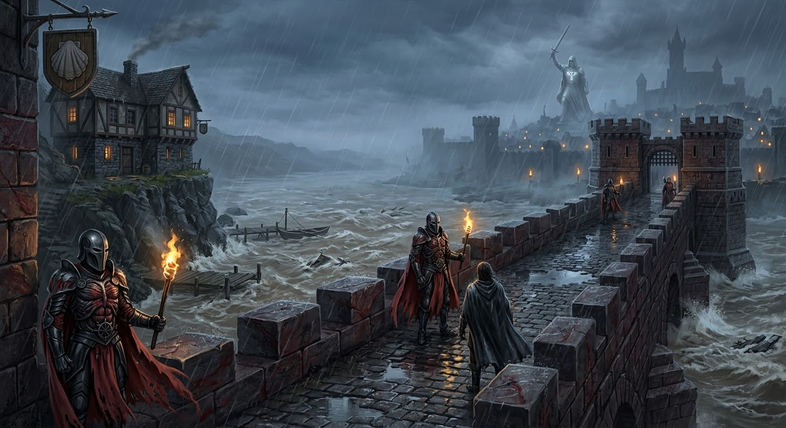
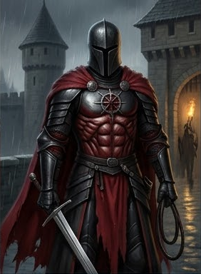
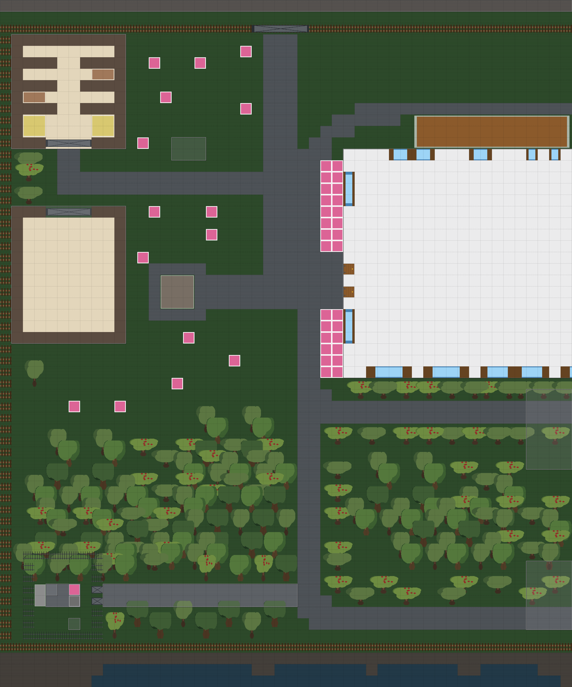
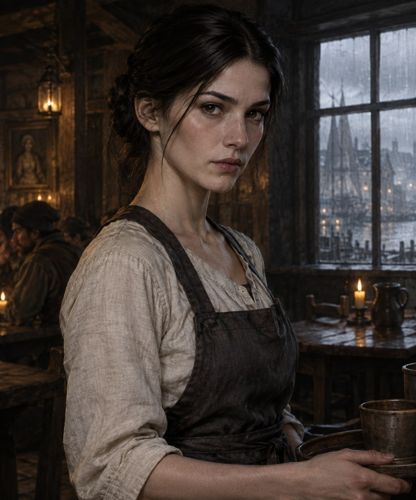
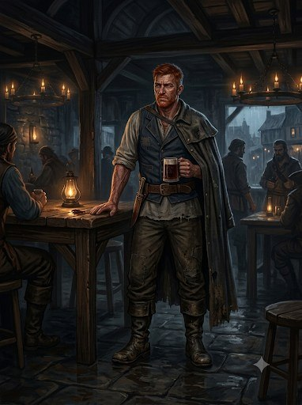
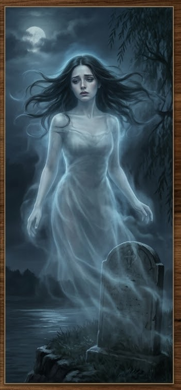
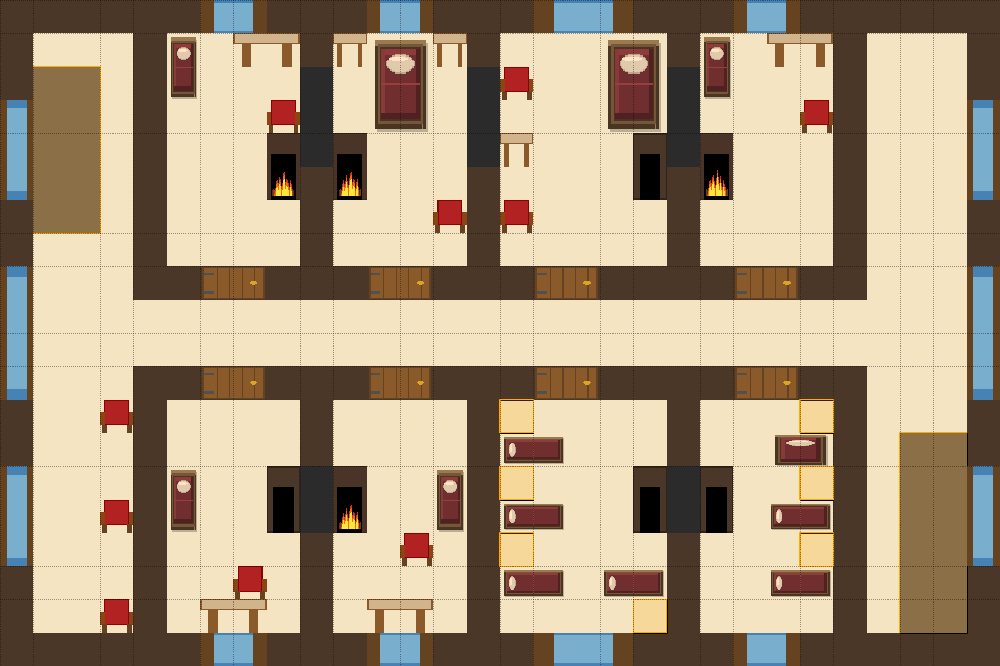

# Глава 2. Таверна «Слёзы устрицы» и Ночь

**Таймлайн главы 2: 17:30–02:00.**

Игроки прибывают в таверну «Слёзы устрицы» (Lacrime della Madreperla), отрезанные от города проливным ливнем. Глава —
раскрытие: знакомство с остальными NPC, публичная сцена конфликта, ночёвка, расследование дела, которое привело в
таверну. Ливень — проливной; река уже мутнеет. **Убийство — 02:00 (следующая глава).**

## Структура главы

1. Прибытие (17:30–18:45).
    - 17:30 — игроки уезжают из города.
    - 18:00 — игроки проезжают Адивианский мост (Adivian Bridge): стража говорит, что мост закрывают до утра, пока
      дождь не закончится.
    - 18:30 — игроки приезжают к таверне, заходят во двор и ставят коней в конюшню (stable).
    - 18:30 — локации двора (tavern_yard): конюшня (stable), сарай (barn), колодец (well), дровница (woodpile),
      могила (wife_grave) — 1.4.
    - 18:45 — игроки заходят в таверну; знакомство с основными NPC.
2. Сцена в зале (19:00–19:45).

- 2.1. Появление Художника; флирт Официантки; раздражение Доктора.
- 2.2. Кухня: Официантка уходит за ужином, Доктор следует; конфликт Доктора и Трактирщика (повышенный тон, хлопок
  дверью).
- 2.3. Ливень: Трактирщик предлагает гостям заночевать. Игроки остаются в таверне на ночь.

3. Вечер (20:00–02:00). Основное время расследования дела, по которому игроки приехали в таверну.
   NPC живут своей жизнью независимо от игроков (молятся, грузят товары, считают деньги, спят).
    - 20:00–22:00.
        - Официантка убирается в зале;
        - Доктор беседует с Официанткой (конфликт с Трактирщиком),
        - Детектив пьет в ожидании утра;
        - Художник тайно покупает Лист-живодёр у Трактирщика;
        - Моряк разгружает контрабанду на пристани/хранилище контрабандистов.
    - 22:00–00:00.
        - Трактирщик закрывает таверну, проверяет счёт/переписку, хранит контрабанду в тайнике кабинета;
        - Официантка делает записи в дневник (waitress_diary);
        - Моряк, Детектив и Художник спят в комнатах;
        - Призрак Жены проявляется у могилы (wife_grave).
    - 00:00–02:00.
        - Собрание культистов в Логове культа (Официантка — верховная жрица, Доктор, Призрак Жены у входа);
        - Трактирщик тайно получает контрабанду от Моряка;
        - Художник рисует/присматривает с мансарды (mansard).
    - 02:00: Развязка главы - переход к **главе 3 — Убийство (02:00)** и к таймеру потопа (глава 5).

## Таблица таймлайна

| Время       | Место                           | Кто в помещении                                                 | Чем занимаются                                                                |
|-------------|---------------------------------|-----------------------------------------------------------------|-------------------------------------------------------------------------------|
| 17:30       | Дорога                          | Игроки                                                          | Уезжают из города                                                             |
| 18:00       | Адивианский мост                | Игроки + Адские рыцари (башни)                                  | Проезд через мост; стража: «мост закрывают до утра» (изоляция)                |
| 18:30       | Двор таверны                    | Игроки                                                          | Приезжают к таверне, ставят коней в конюшне, идут в зал                       |
| 18:45       | Основной зал                    | Трактирщик, Официантка, Доктор, Детектив, Моряк + игроки        | Знакомство с 5 NPC; Детектив у камина приветствует                            |
| 19:00       | Основной зал                    | 5 NPC + Художник (с мансарды)                                   | Появление Художника; флирт Официантки; раздражение Доктора                    |
| 19:15       | Кухня                           | Официантка + Доктор                                             | Официантка уходит за ужином; Доктор следует за ней                            |
| 19:30       | Кухня                           | Официантка + Доктор + Трактирщик                                | Конфликт на кухне; Доктор убегает в комнате доктора (2 этаж)                  |
| 19:45       | Основной зал                    | 5 NPC + игроки                                                  | Ливень; Трактирщик предлагает ночлег; Детектив арендует комнату               |
| 20:00–22:00 | Основной зал / подвал           | Официантка, Доктор, Детектив; Художник + Трактирщик; Моряк      | Обслуживание зала; Художник покупает Лист-живодёр; Моряк привозит контрабанду |
| 22:00–00:00 | Второй этаж + могила            | Трактирщик, Официантка, Моряк, Детектив, Художник; Призрак Жены | Закрывается таверна; дневник; контрабанда в тайнике; сон; призрак у могилы    |
| 00:00–02:00 | Логово культа / двор / мансарда | Официантка + Доктор + Призрак Жены; Трактирщик; Моряк; Художник | Собрание культа; контрабанда ; Моряк следит; Художник с мансарды              |
| 02:00       | Второй этаж                     | Игроки + NPC                                                    | **Убийство** (следующая глава, глава 3); конец главы 2                        |

---

# Этап 1. Прибытие

## 1.1 Адивианский мост (18:00) — первая локация главы 2

**Время:** 18:00.

### Зачитать при проезде

> Вы переезжаете через Адивианский мост (Adivian Bridge) — каменный мост через реку Адивиан (Adivian River), в миле к
> западу-северо-западу от Весткроуна. Мост построен в **челийском стиле (Chelish-made)**: тяжёлые каменные арки,
> массивные опоры, тёмный камень (чёрный с красными прожилками), резкие ступенчатые и квадратные фасады — никаких
> изящных арок или кружевных узоров, только массивные блоки, скобы и шипы. На обоих концах моста — приземистые
> сторожевые башни (gatehouses) с зубчатыми стенами; их патрулируют **Адские рыцари (Hellknights)** — региональное
> отделение **Ордена Дыбы (Order of the Rack)**.
> Рыцари одеты в характерный чёрный доспех Ордена Дыбы: нагрудник и наплечники отлиты в виде стилизованных
> человеческих мышц («обнажённая мускулатура»), на головах — гладкие безликие шлемы с узкой смотровой щелью, за
> спиной — багровые плащи, края которых неровны, словно содранная кожа; на наплечниках и перчатках — геометрические
> шипы, а на нагруднике вырезан символ Ордена — **колесо с шипами**. Оружие — длинные мечи и кнуты; у кого-то в руках
> — факелы, пламя которых шипит на дожде.
> Дождь льёт как из ведра, река под мостом мутнеет и прибывает; на поверхности — пена, брызги, ощущение
> приближающегося потопа.
> Вы останавливаетесь посередине моста, и вдали, через струи дождя, замечаете двухэтажное здание, стоящее прямо на
> обрыве, над мутнеющей водой реки. Под зданием — **пристань (quay)**, у которой пришвартован ялик с убранным парусом.

### Сцена: стража закрывает мост до утра

> Уже сходя с моста, вас окрикивают рыцари:
> «Учтите, что мост закрывается до утра, пока дождь не прекратится. Так что постарайтесь найти ночлег там, куда бы вы ни
> шли. Доброй вам дороги.».
> Вы вспоминаете, что это был единственный сухопутный путь в город. Теперь вы не сможете вернуться в город, пока дождь
> не закончится.

- **Как это работает.** Стража (Адские рыцари) сообщает, что мост закрывают до утра (пока не прекратится дождь);
  переправа по воде закрыта (см. главу 1). Таверна отрезана от города — **изоляция** (давление).
- **Последствие.** Игроки не могут уехать/вернуться в город до утра; переход к Этапу 1.1 (приезд к таверне).
- **Проверка (Внимательность/Восприятие, СЛ 12):** рыцари в башнях **следят за переезжающими** (Орден Дыбы патрулирует
  мост); можно заметить, что одного из них (или двоих) нет — зацепка, что рыцарь куда-то ушёл.
- **Проверка (Историки/Религия, СЛ 15):** Орден Дыбы (Order of the Rack) — создан 4573 AR в ответ на «Белую Чуму» (White
  Plague), серию убийств культа Сифкеш («Путь Благодати»); охотится на демонических культистов (в т.ч. Дагон,
  запрещённая ересь в Челии).
- **Проверка (Мудрость Религия / Интеллект Природа, СЛ 15):** вода ведёт себя странно — тянет вверх, неестественно
  тиха (зацепка «Потоп / заклинание Дагона»).

### Наблюдения

- Мост охраняется гарнизоном **Адских рыцарей (Hellknights / Order of the Rack).**
- У таверны внизу есть **пристань** с причаленным к ней яликом.

### Входы и выходы

- **Вход:** с тракта/города (road, city_streets, bladewing_bridge).
- **Выход → tavern** — к таверне (18:30; Этап 1.1).
- **Выход → pier / quay** — причал, набережная (путь к ялику).

---

## 1.2 Приезд к таверне (18:30)

При подходе к таверне зачитать:

> Вы двигаетесь по уже порядком раскисшей дороге, и в просветах ливня перед вами проступает «Слёзы устрицы» — Lacrime
> della Madreperla.
> Двухэтажное здание стоит на возвышенности, словно остров в море дождя. Толстые стены из тёмного камня и дерева,
> черепичная крыша, местами поросшая мхом. Из труб идёт дым, пахнет свежей выпечкой и обещанием уюта для уставших
> путников.
> Над воротами висит щит — герб таверны: изображение плачущей морской раковины (oyster), из которой капают «слёзы»,
> вырезанное в тёмном дереве и металле; погнутые края, сочащийся мох.
> Пахнет дымом, жареным мясом, мокрым деревом и солью. Слышны дождь, ветер и скрип вывески на ветру.
> Дождь льёт как из ведра.

**Наблюдения:**

- **Магическая аура (неявно).** Вокруг таверны — лёгкая «магия» Хаоса: странные запахи, неестественно тихая вода,
  застывшие стаи птиц.

### Входы и выходы

- **Вход:** с моста (аdivian_bridge).
- **Выход → tavern_yard** — двор таверны (Этап 1.2).

---

## 1.3 Двор (tavern_yard)

**Время:** 18:30.

### Зачитать при первом входе

> Внешняя территория таверны, окружённая забором.
> У северной стены таверны — дровница. В дальнем углу двора — конюшня и сараи.
> Главных вход, закрытый тяжелой, обитой металлом дверью - в восточной стене. К нему идёт мощёная брусчаткой дорожка,
> уже успевшая превратиться в маленькую речку, бегущую поперек двора.
> Пахнет мокрой землёй и дымом растопленного очага.

### Наблюдения

- **Следы и грязь** — утренние следы Трактирщика (рубил дрова) и Моряка (следит за таверной).
- **Могила (wife_grave)** — могила Изабеллы Вельди (dead_wife); призыв/присутствие призрака (wife_ghost).
- **Колодец (well), сарай (barn), конюшня (stable), дровница (woodpile), могила (wife_grave)** — локации двора
  (подробнее — в 1.4).
- **Магическая аура / потоп (flood_spell).** Проверка Мудрость (Религия) или Интеллект (Природа), СЛ 15 → «Вода
  ведёт себя странно: не та, что дождь; она тянет вверх» (зацепка «Потоп / заклинание Дагона»).

### Входы и выходы

- **Вход:** с моста (главный вход со двора, на восток).
- **Выход → tavern_hall** — зал таверны (Этап 2).
- **Выход → stable / barn / well / woodpile / wife_grave** — локации двора (подробнее — в 1.4).
- **Выход → backyard → quay** — задний двор, набережная (путь к ялику).
- **Выход → adivian_bridge** — северные ворота к тракту/городу (заблокированы паводком).

---

## 1.4 Локации двора (18:30)

> Локации двора доступны игрокам при осмотре/обыске двора.
> Здесь игроки могут найти улики/наблюдения и случайные встречи с NPC.

### Конюшня (stable)

> Тесное строение из грубого дерева в углу двора, у забора. Стойла, сеновал, кормушки, вёдра, навоз; снаружи — ворота.
> Пахнет сеном, навозом и влажной землёй.

- **Лошадь Детектива** — в конюшне (приехал в город для расследования; потоп отрезал отъезд).
- **Лошадь Доктора** — в конюшне (приехал из Морга; потоп отрезал отъезд).
- **Наблюдения.** Повозки, сено, кормушки; место, где можно спрятать/скрыть вещи.
- **Входы и выходы:** из конюшни — на двор через ворота.

### Сарай (barn)

> Просторное деревянное строение из грубого бревна во дворе, у забора. Внутри — телеги, сеновал, инструменты, ящики с
> припасами. Снаружи — ворота (barn-gate). Пахнет сеном, навозом и влажной землёй.

- **Наблюдения.** Телеги, сено, инструменты, припасы; место для скрывания/спрятанных вещей.
- **Входы и выходы:** из сарая — на двор через ворота.

### Колодец (well)

> Старый каменный колодец во дворе, по центру площадки перед таверной. Верёвка с ведром, погнутый каркас-козлы для
> подъёма воды. Рядом — лужа и грязь. Пахнет мокрой землёй и ржавчиной.

- **Наблюдения.** Верёвка и ведро; основной источник воды в таверне; место, где можно спрятать/бросить вещи.
- **Входы и выходы:** колодец находится во дворе.

### Дровница (woodpile)

> Большая куча дров, сложенных у северной стены таверны. Рядом — тяжёлый топор и колода, следы рубки. Земля под
> дровницей — в грязной коре и щепе. Пахнет сырым деревом и потом.

- **Трактирщик (Гаэтано Вельди)** — рубил дрова утром (утренние следы во дворе).
- **Наблюдения.** Стопка дров, топор, колода, свежие дрова; следы рубки.
- **Входы и выходы:** можно вернуться во двор.

### Могила жены (wife_grave)

> Небольшой холмик за таверной, у самого края обрыва над рекой. Каменная плита с именем; рядом — засохшие цветы. На
> лицевой стороне плиты — имя и дата; на оборотной (едва заметна, видно только при наклоне) — вырезанный открытый глаз
> осьминога (символ культа Дагона). Пахнет холодом, цветами и чем-то потусторонним.

- **Призрак Жены (dead_wife / wife_ghost)** — обитает на могиле; призыв/присутствие призрака.
- **Наблюдения.** Могила Изабеллы Вельди (dead_wife); обратная сторона могильного камня — символ Дагона (дагон).
- **Секрет:** на могиле — один из входов к убежищу культа (логове культа, связь с подвалом).
- **Входы и выходы:** из могилы — на двор; вход к культистам (связь с подвалом).

---

# Этап 2. Зал таверны

**Время:** 18:45.

## Зачитать при первом входе

> Зал таверны «Слёзы устрицы» — большое помещение с низкими деревянными балками под потолком. Четыре длинных стола
> расставлены вдоль стен, к каждому приделана лавка. В центре зала — один большой каменный очаг, в котором потрескивает
> огонь. На стене на видном месте — портрет красивой женщины. По стенам — окна. В одном углу — лестница на второй этаж,
> рядом — дверь в подвал. С задней стороны (восточной) — дверь на хозяйственный двор (backyard); с западной —
> главный вход со двора.
> Пахнет дымом, элем, жареным мясом и воском свечей. Слышны треск огня, скрип половиц и голоса гостей. Внутри тепло, но
> напряжение — как перед штормом.

## Наблюдения

- **Портрет жены (wife_portrait)** — портрет Изабеллы Вельди (dead_wife) на видном месте; улик/свидетель .
  Призрак dead_wife иногда появляется рядом с портретом.
- **Очаг / камин** — тепло; единственный источник света.
- **Лестница на 2 этаж (foyer_2f)** и **дверь в подвал (basement)** — скрытые пути.
- **Домашние/гости** — 5 NPC в зале: Трактирщик, Официантка, Доктор, Детектив, Моряк (Художник — на мансарде).

## Расстановка NPC (18:45)

- **Трактирщик (Гаэтано Вельди)** — у прилавка / за столом, обслуживает зал.
- **Официантка (Виттория Вельди)** — в зале, обслуживает гостей.
- **Доктор (Элио Вентури)** — в зале, беседует, следит за Официанткой (любовник).
- **Детектив (Джакомо Раньери)** — **сидит у камина** (тепло, он пьян; см. сцену приветствия ниже); при ливне (19:45)
  арендует комнату.
- **Моряк (Корин Марроне)** — в зале, сдержанно; избегает смотреть на Трактирщика.
- **Художник (Лучиано Аврелиан)** — на мансарде; спускается в 19:00.

---

# Этап 2.1. Сцена: приветствие Детектива у камина (18:45)

> Игроки заходят в главный зал. **Детектив (Джакомо Раньери) сидит у камина** — он тёплый, пьяный и в целом в
> хорошем расположении духа. **Уровень отношения Детектива (attitude) повышается на 1** (он пьян, в тепле, в хорошем
> настроении). Приветствие зависит от того, **знают ли игроки Детектива** (по окончании главы 1) и от его **attitude**.

## Правило: знакомы / не знакомы

- **Игроки НЕ знакомы с Детективом** — его отношения на начало главы 2 = Дружелюбный, **но Детектив НЕ
  начинает диалог первым** (он ждёт, пока игроки подойдут/заговорят; сам не здоровается, но не враждебен).
- **Игроки знакомы с Детективом** — в зависимости от его отношения на начало главы 2 (см. таблицу) приветствие будет
  отличаться.

## Правило: +1 к attitude (Детектив)

При входе игроков в зал **attitude Детектива повышается на 1 ступень** (пьян, в тепле, в хорошем расположении духа).
Ступени (ниже→выше): → → → → .

| Отношение (attitude) на конец главы 1 | Отношение на начало главы 2 | Приветствие (текст)                                                                              |
|---------------------------------------|-----------------------------|--------------------------------------------------------------------------------------------------|
| (враждебный)                          | (недружелюбный)             | Обращается к игрокам: «Чего припёрлись? Вам прошлого раза не хватило что-ли?»                    |
| (недружелюбный)                       | (безразличный)              | Бурчит себе под нос: «О, и эти припёрлись. Чего им надо?». **В дальнейшем — игнорирует игроков** |
| (безразличный)                        | (дружелюбный)               | Кричит игрокам: «О, Мужики! Давайте сюда, подсаживайтесь! Какими судьбами?»                      |
| (дружелюбный)                         | (полезный)                  | Кричит игрокам: «О, Мужики! Давайте сюда, подсаживайтесь! Какими судьбами?»                      |
| (полезный)                            | (полезный)                  | Кричит игрокам: «О, Мужики! Давайте сюда, подсаживайтесь! Какими судьбами?»                      |

## Если игроки спрашивают про Доктора (Элио Вентури)

> Вопрос: «Кто такой Доктор? / Что делает Доктор?»

Ответ Детектива зависит от его **attitude на начало главы 2** (см. таблицу выше; после +1 к attitude):

| Attitude на начало главы 2 | Ответ про Доктора                                                                             |
|----------------------------|-----------------------------------------------------------------------------------------------|
| (недружелюбный)            | «Элио? Зачем он тебе?»                                                                        |
| (безразличный)             | «Элио? Вон он, с Витторией трепется. Зачем он тебе?»                                          |
| (дружелюбный)              | «Элио? Этот докторишка? Лучший патологоанатом, что я знаю. Да вон они, с Витторией трепятся.» |
| (полезный)                 | «Элио то? Этот кобелина? Да вон он! Эй, Элио, хорош трепаться, иди сюда — дело есть!»         |

## Если игроки спрашивают про материалы о вскрытии (autopsy_reports)

> Вопрос: «Где отчёты о вскрытиях? / Что с материалами о жертвах?»

Ответ Детектива зависит от его **attitude на начало главы 2** (см. таблицу выше; после +1 к attitude):

| Attitude на начало главы 2 | Ответ про материалы о вскрытии                                                                                                            |
|----------------------------|-------------------------------------------------------------------------------------------------------------------------------------------|
| (недружелюбный)            | «У докторишки они.»                                                                                                                       |
| (безразличный)             | «Они пока у Элио.»                                                                                                                        |
| (дружелюбный)              | «Они у Элио, говорит, что ещё не закончил. Вон, тоже сижу — жду их.»                                                                      |
| (полезный)                 | «Бумажки то эти? Да Элио, прохиндей, за бабой своей всё бегает — не закончил ещё. Давай его позовём и морду набьём, пусть быстрее пишет!» |

---

# Этап 3. Знакомство с NPC

Каждый NPC знакомится с игроками при первом входе (по ходу вечера). Стат-блоки — ниже, в разделе, где игроки впервые
встречают персонажа.

#### Стат-блок: Гаэтано Вельди — Трактирщик (d6=1)

##### Что зачитать игрокам при первой встрече

> За прилавком стоит крепкий мужчина лет пятидесяти пяти, уже не молодой: плечи чуть ссутулены, руки в мозолях.
> Обветренное лицо в глубоких морщинах, седые волосы коротко стрижены; серые усталые глаза с постоянной тенью, тяжёлый
> взгляд, словно он всё время что-то вспоминает. На нём простая тёмная одежда: льняная рубаха с закатанными рукавами,
> кожаный жилет, тяжёлый фартук; на поясе — связка ключей; на левой руке — обручальное кольцо, которое он никогда не
> снимает.
> На ладони — старый шрам от ножа. Говорит сурово, ворчливо, настороженно; речь медленная, с паузами, как будто всё
> обдумывает; голос приглушённый. От него пахнет пылью, бумагой, чернилами и лёгким запахом спирта. Когда смотрит на
> портрет жены на стене — на секунду замирает.

##### Идентификация

- **Имя:** Гаэтано Вельди.
- **Прозвище:** «Старый Гаэтано».
- **Роль:** владелец таверны, контрабандист, подозревает дочь в культе.
- **Раса:** человек.
- **Мировоззрение:** Нейтральный (N).
- **Статус:** main_npc.
- **Может ли быть жертвой:** true.

##### Скрывает

- **[big]** Моряк изнасиловал и убил его жену (Изабеллу Вельди); угрожал дочерью (Официанткой), чтобы тот согласился
  вести общие дела.
- **[small]** Занимается контрабандой: продаёт «Погибель Дьявола» (Devil's Bane), Пеш (Pesh), Лист-живодёр (Flayleaf),
  Грязь (Grit) — инструменты культа Дагона.
- **[small]** Подозревает, что Официантка связана с культом, но не знает о её положении (верховная жрица).

##### Хочет

- защитить дочь (Официантку);
- сохранить контрабанду.

##### [PF2e stat-block]

| Параметр          | Значение                                                                                        |
|-------------------|-------------------------------------------------------------------------------------------------|
| **Уровень**       | 5                                                                                               |
| **Мировоззрение** | N                                                                                               |
| **Раса**          | Человек                                                                                         |
| **Класс**         | Вор (Rogue)                                                                                     |
| **Роль**          | Melee support / bodyguard                                                                       |
| **Восприятие**    | +13 (moderate)                                                                                  |
| **Языки**         | Общий, Варисийский                                                                              |
| **Навыки**        | Атлетика +12, Обман +12, Воровство +12, Скрытность +14, Запугивание +10, Знание контрабанды +12 |
| **Сила**          | +4                                                                                              |
| **Ловкость**      | +3                                                                                              |
| **Телосложение**  | +3                                                                                              |
| **Интеллект**     | +0                                                                                              |
| **Мудрость**      | +2                                                                                              |
| **Харизма**       | +1                                                                                              |
| **AC**            | 22                                                                                              |
| **HP**            | 80                                                                                              |
| **Скорость**      | 25 футов                                                                                        |
| **Спасброски**    | Стойкость +12, Реакция +14, Воля +10                                                            |
| **Ближний бой**   | Кинжал +1 (Striking): +15, 2d4+6 колющий, +2d6 скрытый удар                                     |
| **Дальний бой**   | Тяжёлый арбалет +13, 2d10+4 колющий                                                             |

**Способности:**

- **Скрытый удар (Sneak Attack) 2d6.**
- **Отвергнуть преимущество (Deny Advantage):** существа 5 уровня и ниже не могут застать его врасплох.
- **Уклонение (Evasion).**
- **Защитный удар (Defensive Strike — реакция).**
- **Телохранитель (Bodyguard — 1 действие).**
- **Фигура вора: Ruffian.**

##### GM knows

- **Тайны:** [big] Моряк убил его жену; [small] контрабанда; [small] подозревает дочь в культе.
- **Ложные убеждения:** Моряк — единственный, кто точно знает о его контрабанде; Врач связан с контрабандистами (Ложно:
  Врач не контрабандист, просто знает Моряка).
- **Реакции:** при упоминании жены — замирает; при упоминании Доктора — холодеет; при упоминании контрабанды — врёт.

---

#### Стат-блок: Виттория Вельди — Официантка (d6=3)

##### Что зачитать игрокам при первой встрече

> В зале двигается молодая девушка лет двадцати. Стройная, лёгкая, движения быстрые и точные. Кожа очень светлая, лицо
> тонкое, с выраженными скулами и узкой нижней частью; нос прямой, заметный; глаза тёмные, внимательные, обычно
> спокойные и немного отстранённые; лёгкое семейное сходство с матерью. Волосы густые, тёмные, убраны просто и
> практично. На ней простая практичная одежда работницы таверны: светлая льняная рубаха с длинными рукавами, тёмная
> длинная юбка, плотный простой фартук; одежда чистая и аккуратная, но слегка потёртая от работы. Украшений почти нет —
> никаких заметных религиозных символов. На запястье — тонкий шрам. Говорит тихо, сдержанно, вежливо. От неё тянет
> травами, благовониями и... солёным морским приливом.

##### Идентификация

- **Имя:** Виттория Вельди.
- **Прозвище:** «Госпожа Виттория».
- **Роль:** дочь Трактирщика; **верховная жрица тайного культа Дагона**.
- **Раса:** человек.
- **Мировоззрение:** Хаотично-нейтральный (NE).
- **Статус:** main_npc.
- **Может ли быть жертвой:** true.

##### Скрывает

- **[big]** Верховная жрица культа Дагона; святилище — в тайной комнате в подвале (cult_lair).
- **[big]** Молится Дагону, тот насылает дождь/потоп, чтобы задержать Моряка; потоп — её заклинание (ритуал Дагона,
  усиленный паводком Адивиана).
- **[big]** За пару недель до событий призрак Жены рассказал ей, что Моряк убил её мать и угрожал ей.
- **[small]** Знает, что отец (Трактирщик) занимается нелегальной торговлей, но без подробностей.

##### Хочет

- месть за мать (Моряк убил dead_wife);
- скрыть культ;
- задержать/убить Моряка (заклинание/жертва).

##### [PF2e stat-block]

| Параметр          | Значение                                                                                   |
|-------------------|--------------------------------------------------------------------------------------------|
| **Уровень**       | 7                                                                                          |
| **Мировоззрение** | NE                                                                                         |
| **Раса**          | Человек                                                                                    |
| **Класс**         | Жрец (Cleric, Dagon)                                                                       |
| **Роль**          | Caster (Cleric of Dagon)                                                                   |
| **Восприятие**    | +15 (moderate)                                                                             |
| **Языки**         | Общий, Акло, Варисийский                                                                   |
| **Навыки**        | Религия +17, Дипломатия +15, Обман +15, Запугивание +13, Скрытность +13, Знание Дагона +17 |
| **Сила**          | +0                                                                                         |
| **Ловкость**      | +2                                                                                         |
| **Телосложение**  | +2                                                                                         |
| **Интеллект**     | +1                                                                                         |
| **Мудрость**      | +5                                                                                         |
| **Харизма**       | +4                                                                                         |
| **AC**            | 25                                                                                         |
| **HP**            | 115                                                                                        |
| **Скорость**      | 25 футов                                                                                   |
| **Спасброски**    | Стойкость +12, Реакция +12, Воля +17                                                       |
| **Ближний бой**   | Ритуальный кинжал +1 (Striking): +15, 2d4+2 колющий                                        |
| **Дальний бой**   | Нет (жрец — Spell Attack +17, Spell DC 25)                                                 |

**Способности:** _СЛ заклинаний 25; Атака заклинанием +17._

- **Волна Дагона (2 действия):** 30-футовый конус, 4d6 холодного урона (Стойкость СЛ 25 — половина), отбрасывает на 10
  футов.
- **Приливная молитва (1 действие, фокус):** +1 к AC на 1 раунд.
- **Касание утопленника (1 действие):** +17, 3d6 холодного урона, Стойкость СЛ 25 — «Замедлен 1».
- **Волна глубин (1/день, 2 действия):** 20-футовый взрыв, 6d6 холодного урона (Стойкость СЛ 25 — половина).
- **Голос Дагона (реакция, 1/раунд):** Воля СЛ 25 — «Испуган 1».

##### GM knows

- **Тайны:** [big] верховная жрица культа Дагона; [big] вызвала потоп; [big] призрак Жены рассказал об убийстве матери;
  [small] подозревает о контрабанде отца.
- **Реакции:** при упоминании матери/Моряка — напрягается; рядом с Доктором — мягче; при упоминании культа — шёпот
  ритуала.
- **Ложные убеждения:** Трактирщик не знает о культе (возможно, подозревает).

---

#### Стат-блок: Элио Вентури — Доктор (d6=4)

##### Что зачитать игрокам при первой встрече

> В зале стоит худощавый, жилистый мужчина лет сорока пяти с узким бледным лицом и острыми скулами. Тёмные волосы с
> проседью зачёсаны назад; серо-голубые глаза внимательные, чуть лихорадочные; под глазами — тёмные круги. На нём тёмный
> сюртук, белая рубашка, жилет; на поясе — сумка с медицинскими инструментами; на пальцах — следы от химикатов; обувь
> добротная, но потёртая. Говорит сухо, хладнокровно, чуть лихорадочно; речь ровная, с точными паузами, как диктовка;
> голос приглушённый. Когда нервничает — поправляет воротник; смотрит на Официантку с плохо скрываемой нежностью. От
> него пахнет спиртом, травами и... благовониями.

##### Идентификация

- **Имя:** Элио Вентури.
- **Прозвище:** «Доктор Вентури».
- **Роль:** врач-патологоанатом; член культа Дагона; любовник Официантки.
- **Раса:** человек.
- **Мировоззрение:** Законопослушно-злой (LE).
- **Статус:** main_npc.
- **Может ли быть жертвой:** true.

##### Скрывает

- **[small]** Состоит в тайном культе Дагона (культе Официантки).
- **[big]** Влюблён в Официантку.

##### Хочет

- быть с Официанткой;
- скрыть культ.

##### [PF2e stat-block]

| Параметр          | Значение                                                                                       |
|-------------------|------------------------------------------------------------------------------------------------|
| **Уровень**       | 6                                                                                              |
| **Мировоззрение** | LE                                                                                             |
| **Раса**          | Человек                                                                                        |
| **Класс**         | Алхимик (Alchemist) / Жрец (Cleric, Dagon)                                                     |
| **Роль**          | Support caster / debuffer                                                                      |
| **Восприятие**    | +14 (moderate)                                                                                 |
| **Языки**         | Общий, Акло, Варисийский                                                                       |
| **Навыки**        | Медицина +17, Религия +14, Ремесло (алхимия) +14, Обман +12, Скрытность +12, Знание Дагона +14 |
| **Сила**          | +0                                                                                             |
| **Ловкость**      | +2                                                                                             |
| **Телосложение**  | +2                                                                                             |
| **Интеллект**     | +4                                                                                             |
| **Мудрость**      | +3                                                                                             |
| **Харизма**       | +2                                                                                             |
| **AC**            | 23                                                                                             |
| **HP**            | 85                                                                                             |
| **Скорость**      | 25 футов                                                                                       |
| **Спасброски**    | Стойкость +12, Реакция +14, Воля +14                                                           |
| **Ближний бой**   | Скальпель +1 (Striking): +14, 2d4+2 колющий, +2d6 скрытый удар                                 |
| **Дальний бой**   | Метательная склянка +14, 2d6 кислоты/огня (20 футов)                                           |

**Способности:**

- **Патологоанатом (Pathologist):** +2 к Медицине при вскрытии.
- **Подделка отчётов (Forged Reports):** Обман vs Восприятие следователя СЛ 20.
- **Алхимические бомбы:** 2d6 в радиусе 5 футов.
- **Анестезирующий яд (1 действие):** +2d6 яда, Стойкость СЛ 22 — «Замедлен 1».
- **Волна тошноты (2 действия):** 15-футовая эманация, 4d6 яда (Стойкость СЛ 22 — половина) — «Тошнота 1».
- **Экстренная помощь (1 действие, 2/день):** 3d8+6 HP.
- **Скрытый удар (Sneak Attack) 2d6.**

##### GM knows

- **Тайны:** [small] член культа Дагона; [big] влюблён в Официантку.
- **Реакции:** при упоминании Официантки — нежность; при упоминании Моряка — избегает, но бросает странные взгляды; при
  упоминании культа — обрывисто.
- **Ложные убеждения:** Никто не знает о его участии в культе (кроме Официантки).

---

#### Стат-блок: Джакомо Раньери — Детектив (d6=5)

(Стат-блок — в `02-chapter-1.md`, Этап 3. Здесь — только роль в таверне.)

- **В таверне:** расследует серию смертей в городе (наём Дукстатара); при ливне (19:00) арендует комнату, чтобы
  переждать дождь/до рассвета.
- **Знакомы по работе:** и Доктор, и Ассистент Доктора — по Моргу/вскрытиям.
- **Зависимость от алкоголя:** в Комнате детектива — следы пьянства (detective_drunk).

---

#### Стат-блок: Лучиано Аврелиан — Художник (d6=6)

(Стат-блок — в главе 1, сцена «Мост Клинкокрыла».)

- **В таверне:** снимает мансарду под мастерскую; ~19:00 спускается из мансарды, Официантка «запала» на него (обычно
  красивый), что раздражает Доктора.
- **Тайное:** тайно покупает у Трактирщика Лист-живодёр (~19:00–19:45); ночью рисует в мастерской (треш-расчленёнка)
  и присматривает с мансарды.

---

#### Стат-блок: Корин «Ржавый» Марроне — Моряк (d6=2)

##### Что зачитать игрокам при первой встрече

> В зале стоит крупный, широкоплечий мужчина лет сорока с грубыми чертами. Загорелое обветренное лицо, недельная
> щетина; тёмные сальные волосы стянуты в хвост; глаза маленькие, глубоко посаженные, бегающие; на правой щеке — старый
> шрам от сабли. На нём потёртая морская куртка, тельняшка, кожаные штаны, тяжёлые сапоги; на шее — амулет из акульих
> зубов; пальцы унизаны перстнями (некоторые — явно краденые). Говорит громко, с морским акцентом, пересыпая речь
> ругательствами; когда нервничает — крутит перстень на левой руке; избегает смотреть в глаза Трактирщику. От него
> пахнет ромом, солью и табаком.

##### Идентификация

- **Имя:** Корин Марроне.
- **Прозвище:** «Ржавый» (старое — «Кайрэн», так его звали на «Чёрной Сирене»).
- **Роль:** дезертир с «Чёрной Сирены», украл судовую казну; контрабандист; деловой партнёр Трактирщика.
- **Раса:** полуэльф.
- **Мировоззрение:** Хаотично-злой (CN).
- **Статус:** main_npc.
- **Может ли быть жертвой:** true.

##### Скрывает

- **[big]** Дезертировал с корабля «Чёрная Сирена» Капитана, украл судовую казну.
- **[big]** Изнасиловал и убил жену Трактирщика (dead_wife); угрожал Официанткой, чтобы Трактирщик согласился вести
  общие дела.
- **[small]** Контрабандист: привозит Трактирщику «Погибель Дьявола», пеш, лист-живодёр, грязь (инструменты культа
  Дагона).

##### Хочет

- сохранить контрабанду;
- не раскрывать дезертирство/кражу.

##### [PF2e stat-block]

| Параметр          | Значение                                                                                     |
|-------------------|----------------------------------------------------------------------------------------------|
| **Уровень**       | 9                                                                                            |
| **Мировоззрение** | CN                                                                                           |
| **Раса**          | Полуэльф                                                                                     |
| **Класс**         | Боец (Fighter) / Вор (Rogue)                                                                 |
| **Роль**          | Solo boss / dirty fighter                                                                    |
| **Восприятие**    | +18 (moderate)                                                                               |
| **Языки**         | Общий, Эльфийский, Варисийский                                                               |
| **Навыки**        | Атлетика +20, Акробатика +17, Запугивание +17, Скрытность +17, Морячество +19, Воровство +17 |
| **Сила**          | +5                                                                                           |
| **Ловкость**      | +4                                                                                           |
| **Телосложение**  | +4                                                                                           |
| **Интеллект**     | +2                                                                                           |
| **Мудрость**      | +3                                                                                           |
| **Харизма**       | +2                                                                                           |
| **AC**            | 28                                                                                           |
| **HP**            | 170                                                                                          |
| **Скорость**      | 25 футов                                                                                     |
| **Спасброски**    | Стойкость +20, Реакция +18, Воля +14                                                         |
| **Ближний бой**   | Боевой нож +2 (Greater Striking): +21, 3d4+8 колющий, +2d6 скрытый удар                      |
| **Дальний бой**   | Метательный нож +19, 2d4+6 колющий                                                           |

**Способности:**

- **Скрытый удар (Sneak Attack) 2d6.**
- **Грязный приём (Dirty Trick — 1 действие).**
- **Двойной разрез (2 действия).**
- **Внезапный рывок (Sudden Charge — 2 действия).**
- **Морские ноги (Sea Legs).**
- **Не уйти (Don't Get Left Behind — реакция).**
- **Жестокий финал (Brutal Finale — 1 действие, 1/раунд).**

##### GM knows

- **Тайны:** [big] дезертирство и кража казны; [big] убил жену Трактирщика/угрожал дочерью; [small] контрабанда.
- **Ложные убеждения:** Никто не знает о его дезертирстве; Трактирщик не знает о его прошлом (кроме контрабанды);
  Официантка не знает о его угрозах.
- **Реакции:** при упоминании Капитана — замирает; при упоминании Доктора — подозревает, что тот выдал его прошлое; при
  упоминании Моряка — избегает глаз Трактирщика.

---

#### Стат-блок: Изабелла Вельди — Призрак Жены

##### Что зачитать игрокам при первой встрече

> В холодном воздухе появляется полупрозрачная фигура женщины с тонкими чертами лица и тёмными волосами. Она смотрит на
> вас с печалью и гневом. Её голос звучит как шёпот издалека: «Найди его. Он убил меня. Он убьёт и её». Затем она
> исчезает, оставляя лишь запах соли и морской воды.

##### Идентификация

- **Имя:** Изабелла Вельди.
- **Прозвище:** «Госпожа Изабелла».
- **Роль:** призрак погибшей жены Трактирщика; бывшая верховная жрица культа Дагона.
- **Статус:** призрак (не может быть жертвой).
- **Обитает:** у Могилы жены (двор), у портрета в зале, у входа к логову культа.

### Скрывает / знает

- **Знает:** Моряк изнасиловал и убил её; Моряк угрожал Официанткой, чтобы заставить Трактирщика вести общие дела.
- **Рассказала Официантке** (за пару недель до игровых событий): Моряк убил её и угрожал её дочери — это подстрекает
  Официантку к мести.
- **Привязка:** не может покинуть стены таверны; появляется только там, где хочет явиться.

##### [PF2e stat-block]

| Параметр          | Значение                                            |
|-------------------|-----------------------------------------------------|
| **Уровень**       | 5                                                   |
| **Мировоззрение** | NG                                                  |
| **Раса**          | Призрак (Ghost)                                     |
| **Класс**         | — (нежить)                                          |
| **Роль**          | Specter / controller                                |
| **Восприятие**    | +12                                                 |
| **Языки**         | Общий, Варисийский                                  |
| **Навыки**        | Религия +12, Проницательность +12, Запугивание +10  |
| **Сила**          | —                                                   |
| **Ловкость**      | —                                                   |
| **Телосложение**  | —                                                   |
| **Интеллект**     | —                                                   |
| **Мудрость**      | —                                                   |
| **Харизма**       | —                                                   |
| **AC**            | 21                                                  |
| **HP**            | 60                                                  |
| **Скорость**      | 25 футов (полёт 25 футов)                           |
| **Спасброски**    | Стойкость +10, Реакция +12, Воля +15                |
| **Ближний бой**   | Призрачное касание +12, 2d6 негативный + 1d6 холода |
| **Дальний бой**   | Нет (нежить)                                        |

**Способности:** _Сопротивления: 5 ко всем типам урона (кроме Force и Ghost Touch)._

- **Ужасающий вид (Frightful Moan).** Издаёт стон; все живые в пределах 30 футов проходят спасбросок Воли СЛ 22, иначе
  «Испуган 2».
- **Дар пророчества (Prophetic Gift).** Может рассказать правду о прошлом (убийство Моряком) или предупредить о будущем
  (потоп). Не может лгать.
- **Невидимость** и **Прохождение сквозь стены.**
- **Привязка (Bound):** не может покинуть таверну.

##### GM knows

- **Роли:** свидетель убийства (Моряк убил её) и бывшая верховная жрица культа Дагона; обучила Официантку ритуалам.
- **Показания (ghost_testimony):** единственная, кто точно знает, что Моряк убил её и угрожал дочерью.
- **Улики:** завещание (wife_will) — при обыске/обнаружении.
- **Взаимодействие:** говорит только с Официанткой и с теми, кого сочтёт достойным; появляется у портрета, у могилы и у
  входа к логову культа.

---

# Этап 4. Эскалация (19:00–19:45)

## 4.1 Сцена: появление Художника

**Время:** 19:00.

С мансарды спускается **Художник (Лучиано Аврелиан)** — его внешность будто соединяет аасимара и эльфа (по расе он
аасимар; см. главу 1, сцена «Мост Клинкокрыла»).
Официантка начинает флиртовать с ним (она «запала» на него, он необычно красив), что **раздражает Доктора** (любовник
Официантки).

- **Как это работает.** Художник спускается из мансарды (mansard) в зал; Официантка обращает на него внимание; Доктор
  раздражён.
- **Атмосфера.** Бесшумная кошачья грация, вкрадчивый голос; Официантка мягче рядом с ним.
- **Улики/намёки.** При проверке (Внимательность, СЛ 10): на Художнике — запах масляной краски/льняного масла/резких
  трав; при критическом успехе (СЛ 15) — противоестественный холод, «пустая маска» (признаки маньяка, из
  `02-chapter-1.md`).
- **Последствие.** Конфликт любви Доктора/Официантки/Художника; эскалация к конфликту Доктора и Трактирщика.

## 4.2 Сцена: конфликт Доктора и Трактирщика на кухне

**Время:** 19:15–19:30.

19:15 — Официантка уходит на кухню за ужином для гостей; **Доктор следует за ней**. 19:30 — Официантка возвращается с
подносами с едой и напитками; с кухни доносятся голоса **Трактирщика и Доктора** — сначала спокойные, но постепенно
переходящие на повышенный тон. В конце **Доктор выбегает из кухни, хлопнув дверью**, и уходит к себе в комнату на 2
этаже (doctor_room).

- **Кухня (kitchen)** — игровая локация.
- **Атмосфера.** Тесное, жаркое помещение; медные кастрюли, крюки для мяса, три печи; пахнет жареным мясом, вином,
  дымом и — странно — благовониями (след культа Дагона, `kitchen.secrets`).
- **Что слышно из-за двери.** Повышенный тон, затем ссора, затем хлопок дверью (игроки могут слушать из зала /
  tavern_hall).
- **Улики/намёки.** Проверка (Слух/Внимательность, СЛ 15): можно подслушать фрагмент ссоры — Трактирщик подозревает
  Доктора в связях с контрабандистами (ложное подозрение), Доктор защищает Официантку.
- **Последствие.** Публичный конфликт Доктора и Трактирщика; Доктор отправлен от зала; Официантка остаётся в зале (за
  ужином).

## 4.3 Сцена: ливень и предложение заночевать

**Время:** 19:45.

Дождь льёт как из ведра (ливень). **Трактирщик предлагает гостям заночевать** в таверне. **Детектив арендует комнату**
(переждать дождь/до рассвета). Игроки оказываются в таверне на ночь.

- **Как это работает.** Ливень (давление, изоляция); Трактирщик предлагает ночлег; игроки и Детектив остаются в таверне
  на ночь.
- **Последствие.** Детектив в таверне (арендованная комната); начинается **ночная часть главы** (тайное время);
  эскалация к потопу (глава 5).
- **Механика прибытия в таверну:** игроки и Детектив остаются в таверне на ночь.

---

# Справочник: комнаты и тайные локации таверны

## Комната Доктора (doctor_room)

Чистая, аккуратная комната на 2 этаже. Кровать, стол, стул, окно, камин. На столе — медицинские инструменты, флаконы,
журнал. В сумке под кроватью — **ритуальный кинжал культа** (doctor_dagger). В ящике стола — **записка к Официантке**
(doctor_note, любовная связь). На стене — полка с травами и свечами. Пахнет травами, благовониями, воском.

- **Улики:** doctor_note (любовная записка), doctor_journal (медицинский журнал с записями о жертвах Художника),
  ritual_marks (зарисовки следов ритуала на телах жертв), doctor_hiding (тайник).
- **Секрет:** Врач — член культа, хранит ритуальный кинжал; влюблён в Официантку.

## Комната Официантки (waitress_room)

Маленькая комната в конце коридора. Кровать, стол, лампа. На столе — **дневник**, перо, чернильница. В углу — шкатулка.
На стене — полка с травами и свечами, камин. Пахнет травами и благовониями. Под кроватью — тайник.

- **Улики:** waitress_diary (дневник; записи о молитве Дагону и потопе), waitress_diary_secret (часть 2),
  waitress_focus (заклинательный фокус), waitress_hiding (тайник), wife_ghost (призрак Жены).
- **Секрет:** дневник доказывает, что потоп — заклинание Официантки (/017).

## Двор (tavern_yard)

(см. Этап 1.2.)

## Кухня (kitchen)

(см. 4.2.)

---

# Этап 5. Ночь (20:00–02:00)

> Это **обыденное время**: NPC живут своей жизнью независимо от игроков (молятся, грузят товары, считают деньги,
> убивают, общаются). Игроки могут случайно застать NPC не в той локации.

## 5.1 Как это работает

- **NPC живут своей жизнью.** Каждый игровой час — бытовые/тайные действия NPC (смотри расписание каждого персонажа).
  **Случайные встречи.** Игроки могут застать NPC не в той локации по расписанию.
- **Давление.** Ливень, изоляция, приближающийся потоп.

## 5.2 Блок 20:00–22:00 (вечерний зал + контрабанда)

> Игроки могут случайно застать NPC не в той локации.

| Персонаж       | Локация                   | Действие (по расписанию)                                                                                                        |
|----------------|---------------------------|---------------------------------------------------------------------------------------------------------------------------------|
| **Официантка** | Главный зал таверны       | Обслуживает вечерний зал, наблюдает за гостями.                                                                                 |
| **Доктор**     | Главный зал таверны       | Беседует с Официанткой; конфликт с Трактирщиком.                                                                                |
| **Детектив**   | Главный зал таверны       | Расследует серию смертей; допрашивает; следит за Моряком.                                                                       |
| **Художник**   | Главный зал таверны       | Тайно **покупает Лист-живодёр (Flayleaf)** у Трактирщика (~19:00–19:45); потом рисует в мастерской.                             |
| **Трактирщик** | Главный зал таверны       | Тайно **продаёт Художнику Лист-живодёр (Flayleaf)** (~19:00–19:45) — знает о его зависимости; обслуживает вечерний зал.         |
| **Моряк**      | Хранилище контрабандистов | Привозит конкретные запрещённые товары: **Погибель Дьявола, Пеш, Лист-живодёр, Грязь** (инструменты культа Дагона) Трактирщику. |

**Наблюдения (если игроки следуют/подглядывают):**

- Хранилище контрабандистов — ящики контрабанды; при проверке (Внимательность, СЛ 12) — «Погибель Дьявола»,
  лист-живодёр, грязь;
- Захват «Художник покупает наркотик» — зацепка на зависимость Художника (причина C / D).

## 5.3 Блок 22:00–00:00 (закрывается таверна)

| Персонаж         | Локация             | Действие (по расписанию)                                                                                        |
|------------------|---------------------|-----------------------------------------------------------------------------------------------------------------|
| **Трактирщик**   | Кабинет трактирщика | Закрывает таверну, проверяет счёт и переписку; тайно хранит контрабанду в тайнике кабинета (contraband_crate).  |
| **Официантка**   | Комната официантки  | Делает записи в дневник (waitress_diary / waitress_diary_secret) перед сном — записи о молитве Дагону и потопе. |
| **Моряк**        | Комната моряка      | Спит в комнате гостя; скрыто хранит улики/личное (sailor_hiding).                                               |
| **Детектив**     | Комната детектива   | Спит в комнате гостя; следы пьянства (detective_drunk).                                                         |
| **Художник**     | Комната художника   | Спит в жилой комнате; в перерывах рисует в мастерской (треш-расчленёнка) и присматривает с мансарды.            |
| **Призрак Жены** | Могила              | Обитает у Могилы жены (dead_wife); призрак (wife_ghost).                                                        |

**Наблюдения (если игроки обыскивают/подглядывают):**

- Комнате официантки — **дневник** (waitress_diary): записи о молитве Дагону и потопе (зацепка на cult, причина D).
- Кабинете трактирщика — тайник (contraband_crate), переписка (tavernkeeper_notebook).
- Комната доктора (2 этаж) — doctor_dagger (ритуальный кинжал), doctor_note (любовная записка к Официантке).

## 5.4 Блок 00:00–02:00 (собрание культа + контрабанда + наблюдение)

| Персонаж         | Локация               | Действие (по расписанию)                                                                                                     |
|------------------|-----------------------|------------------------------------------------------------------------------------------------------------------------------|
| **Официантка**   | Логово культа         | Проводит **собрание культа Дагона** (тайная смена) — верховная жрица; вызывала потоп .                                       |
| **Доктор**       | Логово культа         | Участвует в собрании культа (член культа; не последний жрец, может провести обратный ритуал — sm. ).                         |
| **Призрак Жены** | Логово культа         | Присутствует у входа к логову культа (dead_wife / wife_ghost); рассказал Официантке об убийстве Моряком (за пару недель до). |
| **Трактирщик**   | Склад контрабандистов | Тайно **получает контрабанду от Моряка** .                                                                                   |
| **Моряк**        | Склад контрабандистов | Следит за таверной во дворе; опасается, что Врач выдал его прошлое (дезертирство/кража казны).                               |
| **Художник**     | Мансарда              | Рисует / присматривает с мансарды (возможный сценарий: расправа над участниками Праздника Пива).                             |

**Наблюдения (если игроки следуют/подглядывают):**

- Логово культа - собрание культа; реликвия (reliquary_skull, мумифицированный череп) под алтарём.
- Мансарда — Художник присматривает (возможный сценарий: он охотник на участников Праздника Пива, не убийца
  Трактирщика).

## 5.5 02:00 — убийство (переход к главе 4)

- **Происходит убийство** (жертва определяется д6; см. ). Переход к **главе 4 — Убийство**.

## 5.6 Тайные локации ночи

- **Логово культа (cult_lair).** Подвал; собрание культа Дагона (Официантка — верховная жрица, Доктор — член культа,
  Призрак Жены у входа). **Затопляется первым** при потопе (+1..+2 ч, см. ) — успеть, иначе
  ключ к разгадке потерян.
- **Подвал / хранилища (basement, smuggler_storage, kitchen_storage, meat_storage, wine_cellar).** Контрабанда; тоже
  тонут на этапе +1..+3.
- **Мансарда (mansard).** Наблюдение Художника; рисуется/присматривается.
- **Двор (tavern_yard), могила (wife_grave).** Моряк следит; Призрак Жены.

---

# Развязка главы (02:00)

Игроки остаются в таверне на ночь — **конец главы 2 (17:30–02:00)**.

- **Переход к главе 3 — Убийство (02:00).** Происходит убийство; жертва определяется д6 (см. ).
- **Переход к главе 4 — Рассвет (5:45–07:15).** Кто-то из NPC находит тело (по своему расписанию) или NPC привлекают
  внимание игроков к тому, что одного из персонажей не хватает. **07:15** — река вышла из берегов, таверна
  изолирована, запускается **таймер потопа** (24 игровых часа; уровень воды прибывает и блокирует локации снизу вверх) —
  **глава 5 — Потоп**.
