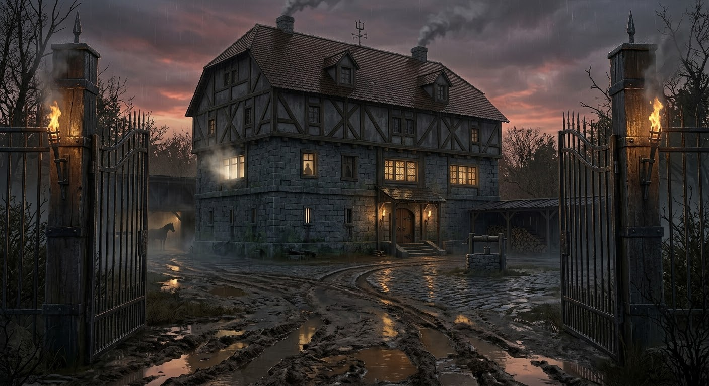

# Глава 2. Таверна «Слёзы устрицы» и Ночь

::: figure[Карта таверны «Слёзы устрицы»]

:::

## Структура главы

Игроки прибывают в таверну «Слёзы устрицы» (Lacrime della Madreperla), отрезанные от города проливным ливнем. Глава —
раскрытие: знакомство с остальными NPC, публичная сцена конфликта, ночёвка, расследование дела, которое привело в
таверну. Ливень — проливной; река уже мутнеет.

1. Прибытие (17:30–18:45).
    - 17:30 — игроки уезжают из города.
    - 18:00 — игроки проезжают Адивианский мост (Adivian Bridge): стража говорит, что мост закрывают до утра, пока
      дождь не закончится.
    - 18:30 — игроки приезжают к таверне, заходят во двор и ставят коней в конюшню (stable).
    - 18:30 — локации двора (tavern_yard): конюшня (stable), сарай (barn), колодец (well), дровница (woodpile),
      могила (wife_grave) — 1.4.
    - 18:45 — игроки заходят в таверну; знакомство с основными NPC.
2. Сцена в зале (19:00–19:45).

- 2.1. Появление Художника; флирт Официантки; раздражение Доктора.
- 2.2. Кухня: Официантка уходит за ужином, Доктор следует; конфликт Доктора и Трактирщика (повышенный тон, хлопок
  дверью).
- 2.3. Ливень: Трактирщик предлагает гостям заночевать. Игроки остаются в таверне на ночь.

3. Вечер (20:00–02:00). Основное время расследования дела, по которому игроки приехали в таверну.
   NPC живут своей жизнью независимо от игроков (молятся, грузят товары, считают деньги, спят).
    - 20:00–22:00.
        - Официантка убирается в зале;
        - Доктор беседует с Официанткой (конфликт с Трактирщиком),
        - Детектив пьет в ожидании утра;
        - Художник тайно покупает Лист-живодёр у Трактирщика;
        - Моряк разгружает контрабанду на пристани/хранилище контрабандистов.
    - 22:00–00:00.
        - Трактирщик закрывает таверну, проверяет счёт/переписку, хранит контрабанду в тайнике кабинета;
        - Официантка делает записи в дневник (waitress_diary);
        - Моряк, Детектив и Художник спят в комнатах;
        - Призрак Жены проявляется у могилы (wife_grave).
    - 00:00–02:00.
        - Собрание культистов в Логове культа (Официантка — верховная жрица, Доктор, Призрак Жены у входа);
        - Трактирщик тайно получает контрабанду от Моряка;
        - Художник рисует/присматривает с мансарды (mansard).
    - 02:00: Развязка главы - переход к **главе 3 — Убийство (02:00)** и к таймеру потопа (глава 5).

::: pftab[Таблица таймлайна]

| Время       | Место                           | Кто в помещении                                                 | Чем занимаются                                                                |
|-------------|---------------------------------|-----------------------------------------------------------------|-------------------------------------------------------------------------------|
| 17:30       | Дорога                          | Игроки                                                          | Уезжают из города                                                             |
| 18:00       | Адивианский мост                | Игроки + Адские рыцари (башни)                                  | Проезд через мост; стража: «мост закрывают до утра» (изоляция)                |
| 18:30       | Двор таверны                    | Игроки                                                          | Приезжают к таверне, ставят коней в конюшне, идут в зал                       |
| 18:45       | Основной зал                    | Трактирщик, Официантка, Доктор, Детектив, Моряк + игроки        | Знакомство с 5 NPC; Детектив у камина приветствует                            |
| 19:00       | Основной зал                    | 5 NPC + Художник (с мансарды)                                   | Появление Художника; флирт Официантки; раздражение Доктора                    |
| 19:15       | Кухня                           | Официантка + Доктор                                             | Официантка уходит за ужином; Доктор следует за ней                            |
| 19:30       | Кухня                           | Официантка + Доктор + Трактирщик                                | Конфликт на кухне; Доктор убегает в комнате доктора (2 этаж)                  |
| 19:45       | Основной зал                    | 5 NPC + игроки                                                  | Ливень; Трактирщик предлагает ночлег; Детектив арендует комнату               |
| 20:00–22:00 | Основной зал / подвал           | Официантка, Доктор, Детектив; Художник + Трактирщик; Моряк      | Обслуживание зала; Художник покупает Лист-живодёр; Моряк привозит контрабанду |
| 22:00–00:00 | Второй этаж + могила            | Трактирщик, Официантка, Моряк, Детектив, Художник; Призрак Жены | Закрывается таверна; дневник; контрабанда в тайнике; сон; призрак у могилы    |
| 00:00–02:00 | Логово культа / двор / мансарда | Официантка + Доктор + Призрак Жены; Трактирщик; Моряк; Художник | Собрание культа; контрабанда ; Моряк следит; Художник с мансарды              |
| 02:00       | Второй этаж                     | Игроки + NPC                                                    | **Убийство** (следующая глава, глава 3); конец главы 2                        |

:::

---

## Этап 1. Прибытие

### 1.1 Адивианский мост (18:00) — первая локация главы 2

::: figure[Адивианский мост]

:::

**Время:** 18:00.

#### Зачитать при проезде

> Вы переезжаете через Адивианский мост (Adivian Bridge) — каменный мост через реку Адивиан (Adivian River), в миле к
> западу-северо-западу от Весткроуна. Мост построен в **челийском стиле (Chelish-made)**: тяжёлые каменные арки,
> массивные опоры, тёмный камень (чёрный с красными прожилками), резкие ступенчатые и квадратные фасады — никаких
> изящных арок или кружевных узоров, только массивные блоки, скобы и шипы. На обоих концах моста — приземистые
> сторожевые башни (gatehouses) с зубчатыми стенами; их патрулируют **Адские рыцари (Hellknights)** — региональное
> отделение **Ордена Дыбы (Order of the Rack)**.
> Рыцари одеты в характерный чёрный доспех Ордена Дыбы: нагрудник и наплечники отлиты в виде стилизованных
> человеческих мышц («обнажённая мускулатура»), на головах — гладкие безликие шлемы с узкой смотровой щелью, за
> спиной — багровые плащи, края которых неровны, словно содранная кожа; на наплечниках и перчатках — геометрические
> шипы, а на нагруднике вырезан символ Ордена — **колесо с шипами**. Оружие — длинные мечи и кнуты; у кого-то в руках
> — факелы, пламя которых шипит на дожде.
> Дождь льёт как из ведра, река под мостом мутнеет и прибывает; на поверхности — пена, брызги, ощущение
> приближающегося потопа.
> Вы останавливаетесь посередине моста, и вдали, через струи дождя, замечаете двухэтажное здание, стоящее прямо на
> обрыве, над мутнеющей водой реки. Под зданием — **пристань (quay)**, у которой пришвартован ялик с убранным парусом.

#### Сцена: стража закрывает мост до утра

> Уже сходя с моста, вас окрикивают рыцари:
> «Учтите, что мост закрывается до утра, пока дождь не прекратится. Так что постарайтесь найти ночлег там, куда бы вы ни
> шли. Доброй вам дороги.».
> Вы вспоминаете, что это был единственный сухопутный путь в город. Теперь вы не сможете вернуться в город, пока дождь
> не закончится.

- **Как это работает.** Стража (Адские рыцари) сообщает, что мост закрывают до утра (пока не прекратится дождь);
  переправа по воде закрыта (см. главу 1). Таверна отрезана от города — **изоляция** (давление).
- **Последствие.** Игроки не могут уехать/вернуться в город до утра; переход к Этапу 1.1 (приезд к таверне).
- **Проверка (Внимательность/Восприятие, СЛ 12):** рыцари в башнях **следят за переезжающими** (Орден Дыбы патрулирует
  мост); можно заметить, что одного из них (или двоих) нет — зацепка, что рыцарь куда-то ушёл.
- **Проверка (Историки/Религия, СЛ 15):** Орден Дыбы (Order of the Rack) — создан 4573 AR в ответ на «Белую Чуму» (White
  Plague), серию убийств культа Сифкеш («Путь Благодати»); охотится на демонических культистов (в т.ч. Дагон,
  запрещённая ересь в Челии).
- **Проверка (Мудрость Религия / Интеллект Природа, СЛ 15):** вода ведёт себя странно — тянет вверх, неестественно
  тиха (зацепка «Потоп / заклинание Дагона»).

#### Наблюдения

- Мост охраняется гарнизоном **Адских рыцарей (Hellknights / Order of the Rack).**
- У таверны внизу есть **пристань** с причаленным к ней яликом.

#### Входы и выходы

- **Вход:** с тракта/города (road, city_streets, bladewing_bridge).
- **Выход → tavern** — к таверне (18:30; Этап 1.1).
- **Выход → pier / quay** — причал, набережная (путь к ялику).

---

### 1.2 Приезд к таверне (18:30)

::: figure[Таверна Слезы устрицы]

:::

При подходе к таверне зачитать:

> Вы двигаетесь по уже порядком раскисшей дороге, и в просветах ливня перед вами проступает «Слёзы устрицы» — Lacrime
> della Madreperla.
> Двухэтажное здание стоит на возвышенности, словно остров в море дождя. Толстые стены из тёмного камня и дерева,
> черепичная крыша, местами поросшая мхом. Из труб идёт дым, пахнет свежей выпечкой и обещанием уюта для уставших
> путников.
> Над воротами висит щит — герб таверны: изображение плачущей морской раковины (oyster), из которой капают «слёзы»,
> вырезанное в тёмном дереве и металле; погнутые края, сочащийся мох.
> Пахнет дымом, жареным мясом, мокрым деревом и солью. Слышны дождь, ветер и скрип вывески на ветру.
> Дождь льёт как из ведра.

**Наблюдения:**

- **Магическая аура (неявно).** Вокруг таверны — лёгкая «магия» Хаоса: странные запахи, неестественно тихая вода,
  застывшие стаи птиц.

#### Вывеска таверны

Вывеска:

- Щит — изображение **плачущей морской раковины (oyster)**, из которой капают «слёзы», вырезанное в тёмном
  дереве/металле;
- погнутые края, сочащийся мох.
- Символ **названия** «Слёзы устрицы».
- Над воротами двора; виден с тракта.

#### Входы и выходы

- **Вход:** с моста (аdivian_bridge).
- **Выход → tavern_yard** — двор таверны (Этап 1.2).

---

### 1.3 Двор (tavern_yard)

::: figure[Двор]

:::

**Время:** 18:30.

#### Зачитать при первом входе

> Внешняя территория таверны, окружённая забором.
> У северной стены таверны — дровница. В дальнем углу двора — конюшня и сараи.
> Главных вход, закрытый тяжелой, обитой металлом дверью - в восточной стене. К нему идёт мощёная брусчаткой дорожка,
> уже успевшая превратиться в маленькую речку, бегущую поперек двора.
> Пахнет мокрой землёй и дымом растопленного очага.

#### Наблюдения

- **Следы и грязь** — утренние следы Трактирщика (рубил дрова) и Моряка (следит за таверной).
- **Могила (wife_grave)** — могила Изабеллы Вельди (dead_wife); призыв/присутствие призрака (wife_ghost).
- **Колодец (well), сарай (barn), конюшня (stable), дровница (woodpile), могила (wife_grave)** — локации двора
  (подробнее — в 1.4).
- **Магическая аура / потоп (flood_spell).** Проверка Мудрость (Религия) или Интеллект (Природа), СЛ 15 → «Вода
  ведёт себя странно: не та, что дождь; она тянет вверх» (зацепка «Потоп / заклинание Дагона»).

#### Входы и выходы

- **Вход:** с моста (главный вход со двора, на восток).
- **Выход → tavern_hall** — зал таверны (Этап 2).
- **Выход → stable / barn / well / woodpile / wife_grave** — локации двора (подробнее — в 1.4).
- **Выход → backyard → quay** — задний двор, набережная (путь к ялику).
- **Выход → adivian_bridge** — северные ворота к тракту/городу (заблокированы паводком).

---

### 1.4 Локации двора (18:30)

> Локации двора доступны игрокам при осмотре/обыске двора.
> Здесь игроки могут найти улики/наблюдения и случайные встречи с NPC.

#### Конюшня (stable)

> Тесное строение из грубого дерева в углу двора, у забора. Стойла, сеновал, кормушки, вёдра, навоз; снаружи — ворота.
> Пахнет сеном, навозом и влажной землёй.

- **Лошадь Детектива** — в конюшне (приехал в город для расследования; потоп отрезал отъезд).
- **Лошадь Доктора** — в конюшне (приехал из Морга; потоп отрезал отъезд).
- **Наблюдения.** Повозки, сено, кормушки; место, где можно спрятать/скрыть вещи.
- **Входы и выходы:** из конюшни — на двор через ворота.

#### Сарай (barn)

> Просторное деревянное строение из грубого бревна во дворе, у забора. Внутри — телеги, сеновал, инструменты, ящики с
> припасами. Снаружи — ворота (barn-gate). Пахнет сеном, навозом и влажной землёй.

- **Наблюдения.** Телеги, сено, инструменты, припасы; место для скрывания/спрятанных вещей.
- **Входы и выходы:** из сарая — на двор через ворота.

#### Колодец (well)

> Старый каменный колодец во дворе, по центру площадки перед таверной. Верёвка с ведром, погнутый каркас-козлы для
> подъёма воды. Рядом — лужа и грязь. Пахнет мокрой землёй и ржавчиной.

- **Наблюдения.** Верёвка и ведро; основной источник воды в таверне; место, где можно спрятать/бросить вещи.
- **Входы и выходы:** колодец находится во дворе.

#### Дровница (woodpile)

> Большая куча дров, сложенных у северной стены таверны. Рядом — тяжёлый топор и колода, следы рубки. Земля под
> дровницей — в грязной коре и щепе. Пахнет сырым деревом и потом.

- **Трактирщик (Гаэтано Вельди)** — рубил дрова утром (утренние следы во дворе).
- **Наблюдения.** Стопка дров, топор, колода, свежие дрова; следы рубки.
- **Входы и выходы:** можно вернуться во двор.

#### Могила жены (wife_grave)

> Небольшой холмик за таверной, у самого края обрыва над рекой. Каменная плита с именем; рядом — засохшие цветы. На
> лицевой стороне плиты — имя и дата; на оборотной (едва заметна, видно только при наклоне) — вырезанный открытый глаз
> осьминога (символ культа Дагона). Пахнет холодом, цветами и чем-то потусторонним.

- **Призрак Жены (dead_wife / wife_ghost)** — обитает на могиле; призыв/присутствие призрака.
- **Наблюдения.** Могила Изабеллы Вельди (dead_wife); обратная сторона могильного камня — символ Дагона (дагон).
- **Секрет:** на могиле — один из входов к убежищу культа (логове культа, связь с подвалом).
- **Входы и выходы:** из могилы — на двор; вход к культистам (связь с подвалом).

---

## Этап 2. Зал таверны

::: figure[Зал таверны]

:::

### Зал таверны

**Время:** 18:45.

#### Зачитать при первом входе

> Зал таверны «Слёзы устрицы» — большое помещение с низкими деревянными балками под потолком. Четыре длинных стола
> расставлены вдоль стен, к каждому приделана лавка. В центре зала — один большой каменный очаг, в котором потрескивает
> огонь. На стене на видном месте — портрет красивой женщины. По стенам — окна. В одном углу — лестница на второй этаж,
> рядом — дверь в подвал. С задней стороны (восточной) — дверь на хозяйственный двор (backyard); с западной —
> главный вход со двора.
> Пахнет дымом, элем, жареным мясом и воском свечей. Слышны треск огня, скрип половиц и голоса гостей. Внутри тепло, но
> напряжение — как перед штормом.

#### Наблюдения

- **Портрет жены (wife_portrait)** — портрет Изабеллы Вельди (dead_wife) на видном месте; улик/свидетель .
  Призрак dead_wife иногда появляется рядом с портретом.
- **Очаг / камин** — тепло; единственный источник света.
- **Лестница на 2 этаж (foyer_2f)** и **дверь в подвал (basement)** — скрытые пути.
- **Домашние/гости** — 5 NPC в зале: Трактирщик, Официантка, Доктор, Детектив, Моряк (Художник — на мансарде).

#### Расстановка NPC (18:45)

- **Трактирщик (Гаэтано Вельди)** — у прилавка / за столом, обслуживает зал.
- **Официантка (Виттория Вельди)** — в зале, обслуживает гостей.
- **Доктор (Элио Вентури)** — в зале, беседует, следит за Официанткой (любовник).
- **Детектив (Джакомо Раньери)** — **сидит у камина** (тепло, он пьян; см. сцену приветствия ниже); при ливне (19:45)
  арендует комнату.
- **Моряк (Корин Марроне)** — в зале, сдержанно; избегает смотреть на Трактирщика.
- **Художник (Лучиано Аврелиан)** — на мансарде; спускается в 19:00.

---

#### Этап 2.1. Сцена: приветствие Детектива у камина (18:45)

> Игроки заходят в главный зал. **Детектив (Джакомо Раньери) сидит у камина** — он тёплый, пьяный и в целом в
> хорошем расположении духа. **Уровень отношения Детектива (attitude) повышается на 1** (он пьян, в тепле, в хорошем
> настроении). Приветствие зависит от того, **знают ли игроки Детектива** (по окончании главы 1) и от его **attitude**.

##### Правило: знакомы / не знакомы

- **Игроки НЕ знакомы с Детективом** — его отношения на начало главы 2 = Дружелюбный, **но Детектив НЕ
  начинает диалог первым** (он ждёт, пока игроки подойдут/заговорят; сам не здоровается, но не враждебен).
- **Игроки знакомы с Детективом** — в зависимости от его отношения на начало главы 2 (см. таблицу) приветствие будет
  отличаться.

##### Правило: +1 к attitude (Детектив)

При входе игроков в зал **attitude Детектива повышается на 1 ступень** (пьян, в тепле, в хорошем расположении духа).

::: pftab[Приветствия Детектива]

| Отношение (attitude) на конец главы 1 | Отношение на начало главы 2 | Приветствие (текст)                                                                              |
|---------------------------------------|-----------------------------|--------------------------------------------------------------------------------------------------|
| (враждебный)                          | (недружелюбный)             | Обращается к игрокам: «Чего припёрлись? Вам прошлого раза не хватило что-ли?»                    |
| (недружелюбный)                       | (безразличный)              | Бурчит себе под нос: «О, и эти припёрлись. Чего им надо?». **В дальнейшем — игнорирует игроков** |
| (безразличный)                        | (дружелюбный)               | Кричит игрокам: «О, Мужики! Давайте сюда, подсаживайтесь! Какими судьбами?»                      |
| (дружелюбный)                         | (полезный)                  | Кричит игрокам: «О, Мужики! Давайте сюда, подсаживайтесь! Какими судьбами?»                      |
| (полезный)                            | (полезный)                  | Кричит игрокам: «О, Мужики! Давайте сюда, подсаживайтесь! Какими судьбами?»                      |

:::

##### Разговор с Детективом

**Если игроки спрашивают про Доктора (Элио Вентури)**

> Вопрос: «Кто такой Доктор? / Что делает Доктор?»

Ответ Детектива зависит от его **attitude на начало главы 2** (см. таблицу выше; после +1 к attitude):

| Attitude на начало главы 2 | Ответ про Доктора                                                                             |
|----------------------------|-----------------------------------------------------------------------------------------------|
| (недружелюбный)            | «Элио? Зачем он тебе?»                                                                        |
| (безразличный)             | «Элио? Вон он, с Витторией трепется. Зачем он тебе?»                                          |
| (дружелюбный)              | «Элио? Этот докторишка? Лучший патологоанатом, что я знаю. Да вон они, с Витторией трепятся.» |
| (полезный)                 | «Элио то? Этот кобелина? Да вон он! Эй, Элио, хорош трепаться, иди сюда — дело есть!»         |

**Если игроки спрашивают про материалы о вскрытии (autopsy_reports)**

> Вопрос: «Где отчёты о вскрытиях? / Что с материалами о жертвах?»

Ответ Детектива зависит от его **attitude на начало главы 2** (см. таблицу выше; после +1 к attitude):

| Attitude на начало главы 2 | Ответ про материалы о вскрытии                                                                                                            |
|----------------------------|-------------------------------------------------------------------------------------------------------------------------------------------|
| (недружелюбный)            | «У докторишки они.»                                                                                                                       |
| (безразличный)             | «Они пока у Элио.»                                                                                                                        |
| (дружелюбный)              | «Они у Элио, говорит, что ещё не закончил. Вон, тоже сижу — жду их.»                                                                      |
| (полезный)                 | «Бумажки то эти? Да Элио, прохиндей, за бабой своей всё бегает — не закончил ещё. Давай его позовём и морду набьём, пусть быстрее пишет!» |

##### Приветствие и знакомство

> Ниже — полный набор вопросов, которые игроки могут задать Детективу у камина. Ответ по **уровню откровенности
> (candor_level)** — текущей ступени `attitude` (стартовое `unfriendly`).

::: answers
Приветствие и знакомство

**Q:** Кто вы? Как вас зовут?
hostile: Проходи мимо. Не твое дело.
unfriendly: Джакомо. Детектив. Не мешай греться.
indifferent: Джакомо Раньери. Детектив на службе у тех, кто платит.
friendly: Джакомо Раньери, к вашим услугам. Частный детектив.
helpful: Джакомо Раньери, частный сыщик. Нанят господином Дукстатаром для наведения порядка.

**Q:** Вы детектив? Кто вас нанял?
hostile: Нанял тот, у кого есть деньги. Назад шагни.
unfriendly: Дукстатар. Ему не нравится то, что происходит в городе.
indifferent: Городской совет в лице Дукстатара. Разгребаю местную грязь.
friendly: Меня нанял Дукстатар. Проблем в городе больше, чем стражников.
helpful: Меня нанял Дукстатар — расследовать серию ритуальных убийств и исчезновений.

**Q:** Что вы здесь делаете?
hostile: Пью. Чего и тебе желаю в другом углу.
unfriendly: Греюсь. Жду, пока высохнет плащ и открыватель моста проспится.
indifferent: Пережидаю шторм, наблюдаю за местным сбродом и делаю выводы.
friendly: Греюсь у огня, пью паршивый эль и присматриваюсь к постояльцам.
helpful: Наблюдаю за фигурантами дела. В этой таверне собрались все, кто мне нужен.

**Q:** Почему вы сидите у камина?
hostile: Потому что тут тепло. Логично?
unfriendly: Дождь снаружи видел? Кости ломит от сырости.
indifferent: У камина тепло, и отсюда виден весь зал и входные двери.
friendly: В камине огонь хороший, да и обзор на всю таверну идеальный.
helpful: Отсюда виден каждый, кто входит, выходит или шепчется по углам. И тепло.

**Q:** Вы здесь по делу или отдыхаете?
hostile: Отдыхаю от глупых вопросов.
unfriendly: И то и другое. Совмещаю полезное с выпивкой.
indifferent: Одно другому не мешает. Пью эль и делаю работу.
friendly: Официоз остался за дверью. Здесь я просто пьянствующий сыщик... пока что.
helpful: Я на работе, хоть и выгляжу пьяным. Это помогает людям расслабиться и болтать лишнее.

**Q:** Вы уже давно в таверне?
hostile: Достаточно, чтобы устать от тебя.
unfriendly: С самого полудня. До шторма успел.
indifferent: Зашел часа три назад, как только заперли мост.
friendly: Пару часов сижу. Успел оценить местную кухню и эль.
helpful: С обеда тут. Как раз успел заметить, кто с кем шептался до начала наводнения.

**Q:** Вы один или с кем-то?
hostile: Один. И хочу остаться один.
unfriendly: Один. Напарники долго не живут.
indifferent: Работаю в одиночку. Так меньше ртов и меньше предательства.
friendly: Один. Но хорошая компания у камина мне не помешает.
helpful: Одиночка. Напарники в нашем деле только привлекают лишнее внимание.

**Q:** Вы местный или приезжий?
hostile: Не из твоего двора, точно.
unfriendly: Приезжий. Из столицы по вызову.
indifferent: Приехал три недели назад по контракту.
friendly: Приезжий. Городок у вас мрачный, но интересный.
helpful: Я из столицы. Приехал специально по приглашению Дукстатара.

**Q:** Как вы оказались в этой таверне?
hostile: Ногами пришел. По дороге.
unfriendly: Мост закрыли, затопило всё. Куда ещё податься?
indifferent: Затопление отрезало путь к центру. «Слёзы устрицы» — единственное сухое место.
friendly: Мост перекрыли из-за воды, вот и пришлось заворачивать сюда.
helpful: Пришел вслед за Моряком и Врачом. А тут еще и мост перекрыли из-за шторма.

:::

##### О деле и расследовании

::: answers
О деле и расследовании

**Q:** Что вы расследуете?
hostile: Не твое собачье дело.
unfriendly: Серию смертей. Тебе лучше не знать деталей.
indifferent: Мокрые дела. Убийства и прочую городскую гниль.
friendly: Серию странных убийств. В городе завелся кто-то очень нехороший.
helpful: Серию странных убийств. Всё, похоже, сходится в этой таверне.

**Q:** Это связано с серией убийств в городе?
hostile: Может связано, может нет. Уйди.
unfriendly: Да. Трупов уже больше, чем пальцев на руке.
indifferent: Прямо связано. Нарезка тел, культисты, теневые твари.
friendly: Угадала. Все эти аккуратно нарезанные бедолаги — моя забота.
helpful: Да, три трупа с резными узорами и двое растерзанных культистов. Один почерк.

**Q:** У вас есть подозреваемые?
hostile: Есть. И ты в их числе, если не отстанешь.
unfriendly: Полный зал подозреваемых. Каждому есть что скрывать.
indifferent: Парочка сидит прямо в этом зале и пьет эль.
friendly: Полно! Почти каждый постоялец тут с двойным дном.
helpful: Да. Я выделю парочку, но точно не назову — не раскрываю карты.

**Q:** Кто вас нанял? Дукстатар?
hostile: Нанял тот, кто платит золотом.
unfriendly: Да, Дукстатар. Ему нужна чистая статистика.
indifferent: Человек из руководства. Дукстатар лично подписал ордер.
friendly: Дукстатар. Старик паникует из-за резни в портовом районе.
helpful: Дукстатар лично выписал мне аванс и полномочия на аресты.

**Q:** Почему вы пьёте? Это связано с делом?
hostile: Пью, потому что хочу. Проваливай.
unfriendly: Пью, потому что работа дрянь, а эль дешёвый.
indifferent: Алкоголь помогает думать и заставляет окружающих считать меня безвредным.
friendly: Это работа под прикрытием, друг мой. Пьяный детектив не вызывает опасений.
helpful: Это маскировка. Когда ты «пьян в хлам», люди при тебе говорят то, о чем обычно молчат.

**Q:** Вы уже нашли что-то?
hostile: Нашел головную боль от твоих вопросов.
unfriendly: Кое-что нашел. Ниточки тянутся в подвал.
indifferent: Нашёл кое-что интересное, связывающее нескольких постояльцев.
friendly: Нашел много интересного. Например, то, что не все здесь те, за кого себя выдают.
helpful: Кое-что по городу. В таверне — пока нет.

**Q:** Вам нужна помощь?
hostile: Нет. Уйди и не мешай.
unfriendly: Справишься не мешать — уже помощь.
indifferent: Если есть полезная информация — выкладывай. За помощь не плачу.
friendly: От хорошего напарника или свежего взгляда не откажусь. Сиди, подливай эль.
helpful: Помощь пригодится. Когда начнется арест, мне понадобятся надежные люди за спиной.

**Q:** Вы работаете один или с кем-то?
hostile: Один. Прочь.
unfriendly: Один. Так надежнее.
indifferent: В одиночку. Сообщники быстро продаются.
friendly: Один, но всегда рад приятной компании у огня.
helpful: Один, но сейчас готов скооперироваться с тем, у кого чистые помыслы.

**Q:** У вас есть улики?
hostile: В кармане. Не про твою честь.
unfriendly: Достаточно, чтобы отправлять людей на висельницу.
indifferent: В блокноте и в голове. Запилы, кольца, следы крови.
friendly: Улик целая сумка. Осталось связать пару узлов.
helpful: Пара записей по городу. И всё.

:::

##### О таверне и её обитателях

::: answers
О таверне и её обитателях

**Q:** Кто здесь живёт? Кто эти люди?
hostile: Сброд. Как и везде.
unfriendly: Бандиты, беглецы и пару дураков вроде тебя.
indifferent: Постояльцы. Моряки, врачи, художники — целый зверинец.
friendly: Сборище колоритных типежей! Один другого подозрительнее.
helpful: Настоящий зверинец — но точно назвать, кто за что отвечает, я не могу.

**Q:** Что вы знаете о Трактирщике?
hostile: Жадный старик. Наливает разбавленное.
unfriendly: Гаэтано. Держит заведение.
indifferent: Гаэтано. Жаден, скупает краденое, знает про подвалы больше, чем говорит.
friendly: Старый лис Гаэтано. Но до жути боится чего-то.
helpful: Гаэтано, похоже, жулик — прячет что-то в подвале. Не убийца, но жулик.

**Q:** Что вы знаете об Официантке?
hostile: Девочка на посылках. Оставь ее в покое.
unfriendly: Тихая. Слишком тихая для этого гадюшника.
indifferent: Дочь Трактирщика. Но ведет себя так, будто управляет этим местом.
friendly: Милая девица, но руки прячет под длинными рукавами... Стыдится перепонок?
helpful: Дочь Трактирщика. Слишком скрытная — я слежу за ней.

**Q:** Что вы знаете о Докторе?
hostile: Лечит или калечит — мне все равно.
unfriendly: Элио. Умник из морга. Слишком часто ошибается в отчётах.
indifferent: Врач Элио. Забирал отчёты о вскрытиях.
friendly: Элио — скользкий тип. В морге у него постоянные «недосдачи» тел.
helpful: Доктор Элио — скользкий тип, с ним что-то не так.

**Q:** Что вы знаете о Моряке?
hostile: Пьяница. Громко орет.
unfriendly: Корин. Пропил корабль и совесть.
indifferent: Моряк Корин. Задолжал гильдии.
friendly: Корин Марроне. Хороший моряк, но влип по самые уши.
helpful: Корин по прозвищу «Ржавый» — влип в какое-то дело.

**Q:** Что вы знаете о Художнике?
hostile: Малюет дрянь. Не смотри на него.
unfriendly: Лучиано. Сумасшедший с кистями. У него странный взгляд.
indifferent: Лучиано. Считает себя гением, рисует птицы.
friendly: Лучиано. Одержимый творец. Местные птички на стенах — его рук дело.
helpful: Лучиано — подозрительный тип. Это, похоже, на что я ставлю.

**Q:** Здесь есть кто-то подозрительный?
hostile: Ты. Слишком много спрашиваешь.
unfriendly: Посмотри вокруг. Здесь ВСЕ подозрительные.
indifferent: Подозрительны абсолютно все, кроме, пожалуй, каминных дров.
friendly: Каждая первая рожа! Но пара постояльцев — вне конкуренции.
helpful: Пара постояльцев мне не нравятся. Но доказательств нет.

**Q:** Почему вы сидите именно здесь?
hostile: Захотел и сел. Свали.
unfriendly: Обзор хороший, спина к стене, тепло.
indifferent: Отсюда видно все передвижения между залом и номером.
friendly: Тут самое теплое место, и видна лестница на второй этаж.
helpful: Стратегическая точка: вижу вход, лестницу к номерам и двери на кухню.

**Q:** Вы следите за кем-то?
hostile: За своей бутылкой слежу.
unfriendly: За всеми сразу. Это экономит время.
indifferent: Наблюдаю за перемещениями пары постояльцев.
friendly: Можно и так сказать. Наблюдаю, кто с кем шепчется у стойки.
helpful: Наблюдаю за контактами между парой постояльцев и за нервничающим Моряком.

:::

##### О городе и обстановке

::: answers
О городе и обстановке

**Q:** Что это за город? Почему он в упадке?
hostile: Гниль и болото. Проезжай мимо.
unfriendly: Весткроун. Прогнивал годами, теперь погружается под воду.
indifferent: Город угасает из-за коррупции, теневых баронов и магии культа.
friendly: Весткроун давно гнил изнутри, а теперь за него взялись теневые твари и наводнение.
helpful: Весткроун рушится из-за союза коррумпированных властей, Совета Воров и культа Дагона.

**Q:** Почему здесь комендантский час?
hostile: Чтобы ты дома сидел.
unfriendly: Из-за тварей на улицах и ритуальных убийств.
indifferent: Власти пытаются удержать контроль над городом, пока твари рвут горожан.
friendly: Чтобы люди не шастали по ночам, когда теневые бестии выходят на охоту.
helpful: Из-за всплеска активности теневых тварей и серии резок. Стража просто боится ночи.

**Q:** Что это за теневые твари?
hostile: Демоны. Не попадайся им.
unfriendly: Порождения тени. Выходят из мрака и рвут людей.
indifferent: Твари с Теневого Плана, призванные древней магией.
friendly: Теневые бестии. Их, похоже, призывают культисты, чтобы держать город в страхе.
helpful: Слуги Теневого Плана, призываемые чьей-то тёмной магией.

**Q:** Кто здесь главный?
hostile: Тот, у кого больше ножей.
unfriendly: Официально — Стража и Совет. На деле — теневые бароны.
indifferent: Официально — Дукстатар. По факту город поделен между гильдией и кем-то ещё.
friendly: На бумаге — Дукстатар. На улице — Совет Воров.
helpful: Власть расщеплена: Дукстатар пытается удержать закон, но улицами правят теневые бароны.

**Q:** Что вы знаете о Совете Воров?
hostile: Бандиты. Убирайся.
unfriendly: Теневая гильдия. Держит порты и контрабанду.
indifferent: Шайка преступников, что держит все теневые доходы города.
friendly: Ребята, которые считают себя хозяевами Весткроуна. Не любители чужаков.
helpful: Гильдия, держащая контрабанду. Гаэтано и Корин платят им долю за право работать.

**Q:** Что вы знаете о культе Дагона?
hostile: Сектанты. Скоро все утонем.
unfriendly: Еретики. Поклоняются глубоководным и творят дичь.
indifferent: Секта, пытающаяся призвать затопление и порчу жителей.
friendly: Опаснейшие фанатики. Я не знаю, чего они хотят в итоге.
helpful: Тайная организация. Я не знаю, кто стоит во главе.

**Q:** Почему вы не уехали до дождя?
hostile: Не успел. Твое какое дело?
unfriendly: Мост закрыли раньше, чем я допил прошлый кружку.
indifferent: Не мог уехать — дело не окончено, да и мост перекрыли.
friendly: Задержался из-за зацепок. А потом шторм пришел и запер нас тут.
helpful: Я сознательно остался. Вся верхушка расследования оказалась заперта в одной таверне.

**Q:** Вы знали, что мост закрывают?
hostile: Не знал. Знал бы — ушел.
unfriendly: Подозревал, что вода поднимется, но не думал, что так быстро.
indifferent: Ожидаемо. При таком ливне стража всегда перекрывает дамбу и мост.
friendly: Управляющий мостом закрывает его, как только вода поднялась.
helpful: Да, я знал регламент стражи. Теперь все фигуранты в ловушке, как и мы с вами.

:::

##### О себе и своих привычках

::: answers
О себе и своих привычках

**Q:** Почему вы пьёте?
hostile: Горло промокаю. Пошел вон.
unfriendly: С такой работой трезвым не выживешь.
indifferent: Лекарство от здешней сырости и плохих воспоминаний.
friendly: Пью, чтобы прогнать сырость и заставить мозги работать быстрее.
helpful: Это мой метод: алкоголь снимает лишнее напряжение и усыпляет бдительность врагов.

**Q:** Вы всегда пьёте на работе?
hostile: Всегда. И тебе советую.
unfriendly: Только когда работа превращается в болотную топь.
indifferent: Это часть рабочего процесса. Трезвых детективов быстро убивают.
friendly: Почти всегда! Это помогает сохранять философский взгляд на трупы.
helpful: Пью регулярно, но норму знаю. Это и маскировка, и стимулятор мысли.

**Q:** Вы помните, что было ночью?
hostile: Помню, что ты мне надоел.
unfriendly: Помню. Пил, слушал дождь, смотрел на дверь.
indifferent: Ночью я был здесь, пил эль и отмечал, кто выходил на улицу.
friendly: Помню каждую деталь. Я умею пить так, чтобы память не отшибало.
helpful: Помню кое-что: кто-то выходил на встречу, кто-то отлучался в подвал.

**Q:** Где вы были вчера?
hostile: Дома. Не твоё дело.
unfriendly: Осматривал очередное место с нарезанным трупом.
indifferent: На месте первого убийства в порту, потом шёл по следу сюда.
friendly: Осматривал тупик, где нашли изрезанного культиста. Занятельное зрелище.
helpful: Собирал доказательства на месте убийства культиста.

**Q:** Вы можете помочь нам?
hostile: Не могу. И не хочу.
unfriendly: Зависит от того, чем и сколько платите.
indifferent: Если ваши интересы совпадают с моим расследованием — посмотрим.
friendly: Помогу, чем смогу. В одной лодке сидим, пока вода не спадет.
helpful: Разумеется. Если вы готовы помочь в расследовании — я с вами.

**Q:** Что вы хотите за помощь?
hostile: Чтобы ты исчез.
unfriendly: Золото. Или хорошую флягу бренди.
indifferent: Информацию и честное сотрудничество.
friendly: Долейте кружку эля и не мешайте, когда начнется заварушка.
helpful: Помогите мне довести расследование до конца и передать улики Дукстатару.

**Q:** Вам что-то нужно?
hostile: Нужно, чтобы ты отстал.
unfriendly: Ещё одна кружка и сухие сапоги.
indifferent: Пара ответов на мои вопросы про местный подвал.
friendly: Хорошая компания и свежие сведения о том, что творится на втором этаже.
helpful: Мне нужна ваша помощь при обыске номера Врача и спуске в подвал.

**Q:** Вы голодны? Хотите ещё выпить?
hostile: От твоих угощений отказался бы.
unfriendly: Налей эля. Но без яда, я проверю.
indifferent: От кружки хорошего эля не откажусь. За твой счет.
friendly: О, от горячего рагу и кружки крепкого не откажусь! Наливай, друг.
helpful: Спасибо! Горячее рагу и эль сейчас весьма кстати. Давай обсудим план.

:::

##### Провокационные и проверочные

::: answers
Провокационные и проверочные

**Q:** Вы точно детектив? Где ваши документы?
hostile: На лбу написаны. Посмотри поближе.
unfriendly: В кармане. Показывать каждому встречному не обязан.
indifferent: Вот жетон сыщика и ордер Дукстатара. Смотри, не погни.
friendly: Вот жетон. Настоящий, со львом и печатью Совета.
helpful: Вот жетон и личная бумага с печатью Дукстатара. Всё официально.

**Q:** Почему вы так много пьёте?
hostile: По кочану. Уйди.
unfriendly: Потому что мир вокруг слишком уродлив, когда трезвый.
indifferent: Привычка профессиональная. И маскировка отличная.
friendly: С моей работой, дружище, без этого давно бы в петлю залез.
helpful: Это держит меня в форме и дает врагам ложное чувство превосходства.

**Q:** Вы уверены, что вам можно доверять?
hostile: Никому не верь. Особенно мне.
unfriendly: Доверять тут никому нельзя. Но я хотя бы не убийца.
indifferent: Можешь не доверять. Но мои интересы сейчас совпадают с твоей безопасностью.
friendly: Доверять можно. Я честный законник, хоть и выгляжу как пропойца.
helpful: Я тут единственный, у кого есть ордер. Этого пока хватит.

**Q:** Вы что-то скрываете?
hostile: Скрываю кошелек от тебя.
unfriendly: У каждого в этом зале есть секреты. У меня — пара лишних улик.
indifferent: Я не раскрываю карты раньше времени. Это профессиональная этика.
friendly: Скрываю пару тузов в рукаве. Для кого — увидишь.
helpful: Скрываю то, что у меня готов план захвата. Не хочу, чтобы кто-то сбежал.

**Q:** Вы знаете больше, чем говорите?
hostile: Знаю, но тебе не скажу.
unfriendly: Намного больше. И это бережёт мне жизнь.
indifferent: Детектив всегда знает больше. На то я и сыщик.
friendly: Ха! Разумеется! Работа такая — знать больше, чем орать на всех углах.
helpful: У меня есть пара догадок. Но делиться ими рано.

**Q:** Почему вы не арестовали подозреваемых?
hostile: Потому что я один, а вас много.
unfriendly: Без подкрепления и в запертом помещении — это суицид.
indifferent: Жду, пока они созреют и дадут прямой повод для взятия с поличным.
friendly: Жду спада воды. Если арестовать сейчас — таверна превратится в бойню.
helpful: Жду подходящего момента и подкрепления.

**Q:** Вы боитесь кого-то в этой таверне?
hostile: Я боюсь только остаться без эля.
unfriendly: Опасаться стоит теневых тварей и безумного Художника.
indifferent: Опасаться нужно тварей. Остальные — обычный сброд.
friendly: Боюсь только застрять тут навечно, если вода не спадет! Ха-ха!
helpful: Я опасаюсь только внезапного вызова теневых тварей.

:::

---

### Этап 3. Знакомство с NPC

Каждый NPC знакомится с игроками при первом входе (по ходу вечера). Стат-блоки — ниже, в разделе, где игроки впервые
встречают персонажа.

#### Стат-блок: Гаэтано Вельди — Трактирщик (d6=1)

##### Что зачитать игрокам при первой встрече

> За прилавком стоит крепкий мужчина лет пятидесяти пяти, уже не молодой: плечи чуть ссутулены, руки в мозолях.
> Обветренное лицо в глубоких морщинах, седые волосы коротко стрижены; серые усталые глаза с постоянной тенью, тяжёлый
> взгляд, словно он всё время что-то вспоминает. На нём простая тёмная одежда: льняная рубаха с закатанными рукавами,
> кожаный жилет, тяжёлый фартук; на поясе — связка ключей; на левой руке — обручальное кольцо, которое он никогда не
> снимает.
> На ладони — старый шрам от ножа. Говорит сурово, ворчливо, настороженно; речь медленная, с паузами, как будто всё
> обдумывает; голос приглушённый. От него пахнет пылью, бумагой, чернилами и лёгким запахом спирта. Когда смотрит на
> портрет жены на стене — на секунду замирает.

##### Идентификация

- **Имя:** Гаэтано Вельди.
- **Прозвище:** «Старый Гаэтано».
- **Роль:** владелец таверны, контрабандист, подозревает дочь в культе.
- **Раса:** человек.
- **Мировоззрение:** Нейтральный (N).
- **Статус:** main_npc.
- **Может ли быть жертвой:** true.

##### Скрывает

- **[big]** Моряк изнасиловал и убил его жену (Изабеллу Вельди); угрожал дочерью (Официанткой), чтобы тот согласился
  вести общие дела.
- **[small]** Занимается контрабандой: продаёт «Погибель Дьявола» (Devil's Bane), Пеш (Pesh), Лист-живодёр (Flayleaf),
  Грязь (Grit) — инструменты культа Дагона.
- **[small]** Подозревает, что Официантка связана с культом, но не знает о её положении (верховная жрица).

##### Хочет

- защитить дочь (Официантку);
- сохранить контрабанду.

##### [PF2e stat-block]

| Параметр          | Значение                                                                                        |
|-------------------|-------------------------------------------------------------------------------------------------|
| **Уровень**       | 5                                                                                               |
| **Мировоззрение** | N                                                                                               |
| **Раса**          | Человек                                                                                         |
| **Класс**         | Вор (Rogue)                                                                                     |
| **Роль**          | Melee support / bodyguard                                                                       |
| **Восприятие**    | +13 (moderate)                                                                                  |
| **Языки**         | Общий, Варисийский                                                                              |
| **Навыки**        | Атлетика +12, Обман +12, Воровство +12, Скрытность +14, Запугивание +10, Знание контрабанды +12 |
| **Сила**          | +4                                                                                              |
| **Ловкость**      | +3                                                                                              |
| **Телосложение**  | +3                                                                                              |
| **Интеллект**     | +0                                                                                              |
| **Мудрость**      | +2                                                                                              |
| **Харизма**       | +1                                                                                              |
| **AC**            | 22                                                                                              |
| **HP**            | 80                                                                                              |
| **Скорость**      | 25 футов                                                                                        |
| **Спасброски**    | Стойкость +12, Реакция +14, Воля +10                                                            |
| **Ближний бой**   | Кинжал +1 (Striking): +15, 2d4+6 колющий, +2d6 скрытый удар                                     |
| **Дальний бой**   | Тяжёлый арбалет +13, 2d10+4 колющий                                                             |

**Способности:**

- **Скрытый удар (Sneak Attack) 2d6.**
- **Отвергнуть преимущество (Deny Advantage):** существа 5 уровня и ниже не могут застать его врасплох.
- **Уклонение (Evasion).**
- **Защитный удар (Defensive Strike — реакция).**
- **Телохранитель (Bodyguard — 1 действие).**
- **Фигура вора: Ruffian.**

##### GM knows

- **Тайны:** [big] Моряк убил его жену; [small] контрабанда; [small] подозревает дочь в культе.
- **Ложные убеждения:** Моряк — единственный, кто точно знает о его контрабанде; Врач связан с контрабандистами (Ложно:
  Врач не контрабандист, просто знает Моряка).
- **Реакции:** при упоминании жены — замирает; при упоминании Доктора — холодеет; при упоминании контрабанды — врёт.

---

#### Стат-блок: Виттория Вельди — Официантка (d6=3)

##### Что зачитать игрокам при первой встрече

> В зале двигается молодая девушка лет двадцати. Стройная, лёгкая, движения быстрые и точные. Кожа очень светлая, лицо
> тонкое, с выраженными скулами и узкой нижней частью; нос прямой, заметный; глаза тёмные, внимательные, обычно
> спокойные и немного отстранённые; лёгкое семейное сходство с матерью. Волосы густые, тёмные, убраны просто и
> практично. На ней простая практичная одежда работницы таверны: светлая льняная рубаха с длинными рукавами, тёмная
> длинная юбка, плотный простой фартук; одежда чистая и аккуратная, но слегка потёртая от работы. Украшений почти нет —
> никаких заметных религиозных символов. На запястье — тонкий шрам. Говорит тихо, сдержанно, вежливо. От неё тянет
> травами, благовониями и... солёным морским приливом.

##### Идентификация

- **Имя:** Виттория Вельди.
- **Прозвище:** «Госпожа Виттория».
- **Роль:** дочь Трактирщика; **верховная жрица тайного культа Дагона**.
- **Раса:** человек.
- **Мировоззрение:** Хаотично-нейтральный (NE).
- **Статус:** main_npc.
- **Может ли быть жертвой:** true.

##### Скрывает

- **[big]** Верховная жрица культа Дагона; святилище — в тайной комнате в подвале (cult_lair).
- **[big]** Молится Дагону, тот насылает дождь/потоп, чтобы задержать Моряка; потоп — её заклинание (ритуал Дагона,
  усиленный паводком Адивиана).
- **[big]** За пару недель до событий призрак Жены рассказал ей, что Моряк убил её мать и угрожал ей.
- **[small]** Знает, что отец (Трактирщик) занимается нелегальной торговлей, но без подробностей.

##### Хочет

- месть за мать (Моряк убил dead_wife);
- скрыть культ;
- задержать/убить Моряка (заклинание/жертва).

##### [PF2e stat-block]

| Параметр          | Значение                                                                                   |
|-------------------|--------------------------------------------------------------------------------------------|
| **Уровень**       | 7                                                                                          |
| **Мировоззрение** | NE                                                                                         |
| **Раса**          | Человек                                                                                    |
| **Класс**         | Жрец (Cleric, Dagon)                                                                       |
| **Роль**          | Caster (Cleric of Dagon)                                                                   |
| **Восприятие**    | +15 (moderate)                                                                             |
| **Языки**         | Общий, Акло, Варисийский                                                                   |
| **Навыки**        | Религия +17, Дипломатия +15, Обман +15, Запугивание +13, Скрытность +13, Знание Дагона +17 |
| **Сила**          | +0                                                                                         |
| **Ловкость**      | +2                                                                                         |
| **Телосложение**  | +2                                                                                         |
| **Интеллект**     | +1                                                                                         |
| **Мудрость**      | +5                                                                                         |
| **Харизма**       | +4                                                                                         |
| **AC**            | 25                                                                                         |
| **HP**            | 115                                                                                        |
| **Скорость**      | 25 футов                                                                                   |
| **Спасброски**    | Стойкость +12, Реакция +12, Воля +17                                                       |
| **Ближний бой**   | Ритуальный кинжал +1 (Striking): +15, 2d4+2 колющий                                        |
| **Дальний бой**   | Нет (жрец — Spell Attack +17, Spell DC 25)                                                 |

**Способности:** _СЛ заклинаний 25; Атака заклинанием +17._

- **Волна Дагона (2 действия):** 30-футовый конус, 4d6 холодного урона (Стойкость СЛ 25 — половина), отбрасывает на 10
  футов.
- **Приливная молитва (1 действие, фокус):** +1 к AC на 1 раунд.
- **Касание утопленника (1 действие):** +17, 3d6 холодного урона, Стойкость СЛ 25 — «Замедлен 1».
- **Волна глубин (1/день, 2 действия):** 20-футовый взрыв, 6d6 холодного урона (Стойкость СЛ 25 — половина).
- **Голос Дагона (реакция, 1/раунд):** Воля СЛ 25 — «Испуган 1».

##### GM knows

- **Тайны:** [big] верховная жрица культа Дагона; [big] вызвала потоп; [big] призрак Жены рассказал об убийстве матери;
  [small] подозревает о контрабанде отца.
- **Реакции:** при упоминании матери/Моряка — напрягается; рядом с Доктором — мягче; при упоминании культа — шёпот
  ритуала.
- **Ложные убеждения:** Трактирщик не знает о культе (возможно, подозревает).

---

#### Стат-блок: Элио Вентури — Доктор (d6=4)

##### Что зачитать игрокам при первой встрече

> В зале стоит худощавый, жилистый мужчина лет сорока пяти с узким бледным лицом и острыми скулами. Тёмные волосы с
> проседью зачёсаны назад; серо-голубые глаза внимательные, чуть лихорадочные; под глазами — тёмные круги. На нём тёмный
> сюртук, белая рубашка, жилет; на поясе — сумка с медицинскими инструментами; на пальцах — следы от химикатов; обувь
> добротная, но потёртая. Говорит сухо, хладнокровно, чуть лихорадочно; речь ровная, с точными паузами, как диктовка;
> голос приглушённый. Когда нервничает — поправляет воротник; смотрит на Официантку с плохо скрываемой нежностью. От
> него пахнет спиртом, травами и... благовониями.

##### Идентификация

- **Имя:** Элио Вентури.
- **Прозвище:** «Доктор Вентури».
- **Роль:** врач-патологоанатом; член культа Дагона; любовник Официантки.
- **Раса:** человек.
- **Мировоззрение:** Законопослушно-злой (LE).
- **Статус:** main_npc.
- **Может ли быть жертвой:** true.

##### Скрывает

- **[small]** Состоит в тайном культе Дагона (культе Официантки).
- **[big]** Влюблён в Официантку.

##### Хочет

- быть с Официанткой;
- скрыть культ.

##### [PF2e stat-block]

| Параметр          | Значение                                                                                       |
|-------------------|------------------------------------------------------------------------------------------------|
| **Уровень**       | 6                                                                                              |
| **Мировоззрение** | LE                                                                                             |
| **Раса**          | Человек                                                                                        |
| **Класс**         | Алхимик (Alchemist) / Жрец (Cleric, Dagon)                                                     |
| **Роль**          | Support caster / debuffer                                                                      |
| **Восприятие**    | +14 (moderate)                                                                                 |
| **Языки**         | Общий, Акло, Варисийский                                                                       |
| **Навыки**        | Медицина +17, Религия +14, Ремесло (алхимия) +14, Обман +12, Скрытность +12, Знание Дагона +14 |
| **Сила**          | +0                                                                                             |
| **Ловкость**      | +2                                                                                             |
| **Телосложение**  | +2                                                                                             |
| **Интеллект**     | +4                                                                                             |
| **Мудрость**      | +3                                                                                             |
| **Харизма**       | +2                                                                                             |
| **AC**            | 23                                                                                             |
| **HP**            | 85                                                                                             |
| **Скорость**      | 25 футов                                                                                       |
| **Спасброски**    | Стойкость +12, Реакция +14, Воля +14                                                           |
| **Ближний бой**   | Скальпель +1 (Striking): +14, 2d4+2 колющий, +2d6 скрытый удар                                 |
| **Дальний бой**   | Метательная склянка +14, 2d6 кислоты/огня (20 футов)                                           |

**Способности:**

- **Патологоанатом (Pathologist):** +2 к Медицине при вскрытии.
- **Подделка отчётов (Forged Reports):** Обман vs Восприятие следователя СЛ 20.
- **Алхимические бомбы:** 2d6 в радиусе 5 футов.
- **Анестезирующий яд (1 действие):** +2d6 яда, Стойкость СЛ 22 — «Замедлен 1».
- **Волна тошноты (2 действия):** 15-футовая эманация, 4d6 яда (Стойкость СЛ 22 — половина) — «Тошнота 1».
- **Экстренная помощь (1 действие, 2/день):** 3d8+6 HP.
- **Скрытый удар (Sneak Attack) 2d6.**

##### GM knows

- **Тайны:** [small] член культа Дагона; [big] влюблён в Официантку.
- **Реакции:** при упоминании Официантки — нежность; при упоминании Моряка — избегает, но бросает странные взгляды; при
  упоминании культа — обрывисто.
- **Ложные убеждения:** Никто не знает о его участии в культе (кроме Официантки).

---

#### Стат-блок: Джакомо Раньери — Детектив (d6=5)

(Стат-блок — в `02-chapter-1.md`, Этап 3. Здесь — только роль в таверне.)

- **В таверне:** расследует серию смертей в городе (наём Дукстатара); при ливне (19:00) арендует комнату, чтобы
  переждать дождь/до рассвета.
- **Знакомы по работе:** и Доктор, и Ассистент Доктора — по Моргу/вскрытиям.
- **Зависимость от алкоголя:** в Комнате детектива — следы пьянства (detective_drunk).

---

#### Стат-блок: Лучиано Аврелиан — Художник (d6=6)

(Стат-блок — в главе 1, сцена «Мост Клинкокрыла».)

- **В таверне:** снимает мансарду под мастерскую; ~19:00 спускается из мансарды, Официантка «запала» на него (обычно
  красивый), что раздражает Доктора.
- **Тайное:** тайно покупает у Трактирщика Лист-живодёр (~19:00–19:45); ночью рисует в мастерской (треш-расчленёнка)
  и присматривает с мансарды.

---

#### Стат-блок: Корин «Ржавый» Марроне — Моряк (d6=2)

##### Что зачитать игрокам при первой встрече

> В зале стоит крупный, широкоплечий мужчина лет сорока с грубыми чертами. Загорелое обветренное лицо, недельная
> щетина; тёмные сальные волосы стянуты в хвост; глаза маленькие, глубоко посаженные, бегающие; на правой щеке — старый
> шрам от сабли. На нём потёртая морская куртка, тельняшка, кожаные штаны, тяжёлые сапоги; на шее — амулет из акульих
> зубов; пальцы унизаны перстнями (некоторые — явно краденые). Говорит громко, с морским акцентом, пересыпая речь
> ругательствами; когда нервничает — крутит перстень на левой руке; избегает смотреть в глаза Трактирщику. От него
> пахнет ромом, солью и табаком.

##### Идентификация

- **Имя:** Корин Марроне.
- **Прозвище:** «Ржавый» (старое — «Кайрэн», так его звали на «Чёрной Сирене»).
- **Роль:** дезертир с «Чёрной Сирены», украл судовую казну; контрабандист; деловой партнёр Трактирщика.
- **Раса:** полуэльф.
- **Мировоззрение:** Хаотично-злой (CN).
- **Статус:** main_npc.
- **Может ли быть жертвой:** true.

##### Скрывает

- **[big]** Дезертировал с корабля «Чёрная Сирена» Капитана, украл судовую казну.
- **[big]** Изнасиловал и убил жену Трактирщика (dead_wife); угрожал Официанткой, чтобы Трактирщик согласился вести
  общие дела.
- **[small]** Контрабандист: привозит Трактирщику «Погибель Дьявола», пеш, лист-живодёр, грязь (инструменты культа
  Дагона).

##### Хочет

- сохранить контрабанду;
- не раскрывать дезертирство/кражу.

##### [PF2e stat-block]

| Параметр          | Значение                                                                                     |
|-------------------|----------------------------------------------------------------------------------------------|
| **Уровень**       | 9                                                                                            |
| **Мировоззрение** | CN                                                                                           |
| **Раса**          | Полуэльф                                                                                     |
| **Класс**         | Боец (Fighter) / Вор (Rogue)                                                                 |
| **Роль**          | Solo boss / dirty fighter                                                                    |
| **Восприятие**    | +18 (moderate)                                                                               |
| **Языки**         | Общий, Эльфийский, Варисийский                                                               |
| **Навыки**        | Атлетика +20, Акробатика +17, Запугивание +17, Скрытность +17, Морячество +19, Воровство +17 |
| **Сила**          | +5                                                                                           |
| **Ловкость**      | +4                                                                                           |
| **Телосложение**  | +4                                                                                           |
| **Интеллект**     | +2                                                                                           |
| **Мудрость**      | +3                                                                                           |
| **Харизма**       | +2                                                                                           |
| **AC**            | 28                                                                                           |
| **HP**            | 170                                                                                          |
| **Скорость**      | 25 футов                                                                                     |
| **Спасброски**    | Стойкость +20, Реакция +18, Воля +14                                                         |
| **Ближний бой**   | Боевой нож +2 (Greater Striking): +21, 3d4+8 колющий, +2d6 скрытый удар                      |
| **Дальний бой**   | Метательный нож +19, 2d4+6 колющий                                                           |

**Способности:**

- **Скрытый удар (Sneak Attack) 2d6.**
- **Грязный приём (Dirty Trick — 1 действие).**
- **Двойной разрез (2 действия).**
- **Внезапный рывок (Sudden Charge — 2 действия).**
- **Морские ноги (Sea Legs).**
- **Не уйти (Don't Get Left Behind — реакция).**
- **Жестокий финал (Brutal Finale — 1 действие, 1/раунд).**

##### GM knows

- **Тайны:** [big] дезертирство и кража казны; [big] убил жену Трактирщика/угрожал дочерью; [small] контрабанда.
- **Ложные убеждения:** Никто не знает о его дезертирстве; Трактирщик не знает о его прошлом (кроме контрабанды);
  Официантка не знает о его угрозах.
- **Реакции:** при упоминании Капитана — замирает; при упоминании Доктора — подозревает, что тот выдал его прошлое; при
  упоминании Моряка — избегает глаз Трактирщика.

---

#### Стат-блок: Изабелла Вельди — Призрак Жены

##### Что зачитать игрокам при первой встрече

> В холодном воздухе появляется полупрозрачная фигура женщины с тонкими чертами лица и тёмными волосами. Она смотрит на
> вас с печалью и гневом. Её голос звучит как шёпот издалека: «Найди его. Он убил меня. Он убьёт и её». Затем она
> исчезает, оставляя лишь запах соли и морской воды.

##### Идентификация

- **Имя:** Изабелла Вельди.
- **Прозвище:** «Госпожа Изабелла».
- **Роль:** призрак погибшей жены Трактирщика; бывшая верховная жрица культа Дагона.
- **Статус:** призрак (не может быть жертвой).
- **Обитает:** у Могилы жены (двор), у портрета в зале, у входа к логову культа.

##### Скрывает / знает

- **Знает:** Моряк изнасиловал и убил её; Моряк угрожал Официанткой, чтобы заставить Трактирщика вести общие дела.
- **Рассказала Официантке** (за пару недель до игровых событий): Моряк убил её и угрожал её дочери — это подстрекает
  Официантку к мести.
- **Привязка:** не может покинуть стены таверны; появляется только там, где хочет явиться.

##### [PF2e stat-block]

| Параметр          | Значение                                            |
|-------------------|-----------------------------------------------------|
| **Уровень**       | 5                                                   |
| **Мировоззрение** | NG                                                  |
| **Раса**          | Призрак (Ghost)                                     |
| **Класс**         | — (нежить)                                          |
| **Роль**          | Specter / controller                                |
| **Восприятие**    | +12                                                 |
| **Языки**         | Общий, Варисийский                                  |
| **Навыки**        | Религия +12, Проницательность +12, Запугивание +10  |
| **Сила**          | —                                                   |
| **Ловкость**      | —                                                   |
| **Телосложение**  | —                                                   |
| **Интеллект**     | —                                                   |
| **Мудрость**      | —                                                   |
| **Харизма**       | —                                                   |
| **AC**            | 21                                                  |
| **HP**            | 60                                                  |
| **Скорость**      | 25 футов (полёт 25 футов)                           |
| **Спасброски**    | Стойкость +10, Реакция +12, Воля +15                |
| **Ближний бой**   | Призрачное касание +12, 2d6 негативный + 1d6 холода |
| **Дальний бой**   | Нет (нежить)                                        |

**Способности:** _Сопротивления: 5 ко всем типам урона (кроме Force и Ghost Touch)._

- **Ужасающий вид (Frightful Moan).** Издаёт стон; все живые в пределах 30 футов проходят спасбросок Воли СЛ 22, иначе
  «Испуган 2».
- **Дар пророчества (Prophetic Gift).** Может рассказать правду о прошлом (убийство Моряком) или предупредить о будущем
  (потоп). Не может лгать.
- **Невидимость** и **Прохождение сквозь стены.**
- **Привязка (Bound):** не может покинуть таверну.

##### GM knows

- **Роли:** свидетель убийства (Моряк убил её) и бывшая верховная жрица культа Дагона; обучила Официантку ритуалам.
- **Показания (ghost_testimony):** единственная, кто точно знает, что Моряк убил её и угрожал дочерью.
- **Улики:** завещание (wife_will) — при обыске/обнаружении.
- **Взаимодействие:** говорит только с Официанткой и с теми, кого сочтёт достойным; появляется у портрета, у могилы и у
  входа к логову культа.

---

### Этап 4. Эскалация (19:00–19:45)

#### 4.1 Сцена: появление Художника

**Время:** 19:00.

С мансарды спускается **Художник (Лучиано Аврелиан)** — его внешность будто соединяет аасимара и эльфа (по расе он
аасимар; см. главу 1, сцена «Мост Клинкокрыла»).
Официантка начинает флиртовать с ним (она «запала» на него, он необычно красив), что **раздражает Доктора** (любовник
Официантки).

- **Как это работает.** Художник спускается из мансарды (mansard) в зал; Официантка обращает на него внимание; Доктор
  раздражён.
- **Атмосфера.** Бесшумная кошачья грация, вкрадчивый голос; Официантка мягче рядом с ним.
- **Улики/намёки.** При проверке (Внимательность, СЛ 10): на Художнике — запах масляной краски/льняного масла/резких
  трав; при критическом успехе (СЛ 15) — противоестественный холод, «пустая маска» (признаки маньяка, из
  `02-chapter-1.md`).
- **Последствие.** Конфликт любви Доктора/Официантки/Художника; эскалация к конфликту Доктора и Трактирщика.

#### 4.2 Сцена: конфликт Доктора и Трактирщика на кухне

**Время:** 19:15–19:30.

19:15 — Официантка уходит на кухню за ужином для гостей; **Доктор следует за ней**. 19:30 — Официантка возвращается с
подносами с едой и напитками; с кухни доносятся голоса **Трактирщика и Доктора** — сначала спокойные, но постепенно
переходящие на повышенный тон. В конце **Доктор выбегает из кухни, хлопнув дверью**, и уходит к себе в комнату на 2
этаже (doctor_room).

- **Кухня (kitchen)** — игровая локация.
- **Атмосфера.** Тесное, жаркое помещение; медные кастрюли, крюки для мяса, три печи; пахнет жареным мясом, вином,
  дымом и — странно — благовониями (след культа Дагона, `kitchen.secrets`).
- **Что слышно из-за двери.** Повышенный тон, затем ссора, затем хлопок дверью (игроки могут слушать из зала /
  tavern_hall).
- **Улики/намёки.** Проверка (Слух/Внимательность, СЛ 15): можно подслушать фрагмент ссоры — Трактирщик подозревает
  Доктора в связях с контрабандистами (ложное подозрение), Доктор защищает Официантку.
- **Последствие.** Публичный конфликт Доктора и Трактирщика; Доктор отправлен от зала; Официантка остаётся в зале (за
  ужином).

#### 4.3 Сцена: ливень и предложение заночевать

**Время:** 19:45.

Дождь льёт как из ведра (ливень). **Трактирщик предлагает гостям заночевать** в таверне. **Детектив арендует комнату**
(переждать дождь/до рассвета). Игроки оказываются в таверне на ночь.

- **Как это работает.** Ливень (давление, изоляция); Трактирщик предлагает ночлег; игроки и Детектив остаются в таверне
  на ночь.
- **Последствие.** Детектив в таверне (арендованная комната); начинается **ночная часть главы** (тайное время);
  эскалация к потопу (глава 5).
- **Механика прибытия в таверну:** игроки и Детектив остаются в таверне на ночь.

---

### Справочник: комнаты и тайные локации таверны

::: figure[Карта 2 этажа]

:::

#### Комната Доктора (doctor_room)

Чистая, аккуратная комната на 2 этаже. Кровать, стол, стул, окно, камин. На столе — медицинские инструменты, флаконы,
журнал. В сумке под кроватью — **ритуальный кинжал культа** (doctor_dagger). В ящике стола — **записка к Официантке**
(doctor_note, любовная связь). На стене — полка с травами и свечами. Пахнет травами, благовониями, воском.

- **Улики:** doctor_note (любовная записка), doctor_journal (медицинский журнал с записями о жертвах Художника),
  ritual_marks (зарисовки следов ритуала на телах жертв), doctor_hiding (тайник).
- **Секрет:** Врач — член культа, хранит ритуальный кинжал; влюблён в Официантку.

#### Комната Официантки (waitress_room)

Маленькая комната в конце коридора. Кровать, стол, лампа. На столе — **дневник**, перо, чернильница. В углу — шкатулка.
На стене — полка с травами и свечами, камин. Пахнет травами и благовониями. Под кроватью — тайник.

- **Улики:** waitress_diary (дневник; записи о молитве Дагону и потопе), waitress_diary_secret (часть 2),
  waitress_focus (заклинательный фокус), waitress_hiding (тайник), wife_ghost (призрак Жены).
- **Секрет:** дневник доказывает, что потоп — заклинание Официантки (/017).

#### Двор (tavern_yard)

(см. Этап 1.2.)

#### Кухня (kitchen)

(см. 4.2.)

## Справочник всех локаций таверны и двора

> Полный перечень помещений «Слёз устрицы» (tavern) и её двора (tavern_yard). Для каждой локации — **описание**, **что
можно найти при проверке** (вечером, до убийства, 17:30–02:00) и **расписание присутствия** персонажей (кто здесь и
> когда). Это база для «случайных встреч»: игроки могут застать NPC не в той локации по расписанию.

> **Порядок фаз:** Утро → День → Вечер (17:30–22:00) → Ночь (22:00–00:00) → Полночь (00:00–02:00). Убийство — 02:00;
> потоп — 07:15 (см. таймер).

### Матрица присутствия (кратко)

Кто находится в какой локации в каждой фазе (по `daily_schedule` и `nightly_beats`):

| Локация              | Утро                        | День                                                   | Вечер (17:30–22:00)                                              | Ночь (22:00–00:00) | Полночь (00:00–02:00)            |
|----------------------|-----------------------------|--------------------------------------------------------|------------------------------------------------------------------|--------------------|----------------------------------|
| tavern_hall          | Доктор, Детектив            | Трактирщик, Официантка, Доктор, Художник, Призрак Жены | Трактирщик, Официантка, Доктор, Детектив, Художник, Призрак Жены | —                  | —                                |
| tavern_yard          | Трактирщик, Моряк, Художник | Детектив                                               | —                                                                | —                  | Моряк                            |
| kitchen              | —                           | —                                                      | —                                                                | —                  | —                                |
| tavern_keeper_office | —                           | —                                                      | —                                                                | Трактирщик         | Трактирщик                       |
| tavern_keeper_room   | —                           | —                                                      | —                                                                | —                  | —                                |
| waitress_room        | Призрак Жены                | —                                                      | —                                                                | Официантка         | —                                |
| doctor_room          | —                           | —                                                      | —                                                                | Доктор             | —                                |
| detective_room       | —                           | —                                                      | —                                                                | Детектив           | Детектив                         |
| sailor_room          | —                           | —                                                      | —                                                                | Моряк              | —                                |
| artist_room          | —                           | —                                                      | —                                                                | Художник           | —                                |
| mansard              | —                           | —                                                      | —                                                                | —                  | Художник                         |
| attic_room_1         | —                           | —                                                      | —                                                                | —                  | —                                |
| smuggler_storage     | —                           | Моряк                                                  | Моряк                                                            | —                  | —                                |
| basement             | —                           | —                                                      | —                                                                | —                  | —                                |
| cult_lair            | Официантка                  | —                                                      | —                                                                | —                  | Официантка, Доктор, Призрак Жены |
| wife_grave           | —                           | —                                                      | —                                                                | Призрак Жены       | —                                |
| kitchen_storage      | —                           | —                                                      | —                                                                | —                  | —                                |
| meat_storage         | —                           | —                                                      | —                                                                | —                  | —                                |
| wine_cellar          | —                           | —                                                      | —                                                                | —                  | —                                |
| foyer_2f             | —                           | —                                                      | —                                                                | —                  | —                                |
| guest_rooms          | —                           | —                                                      | —                                                                | —                  | —                                |
| pier                 | —                           | —                                                      | —                                                                | —                  | —                                |
| quay                 | —                           | —                                                      | —                                                                | —                  | —                                |
| well                 | —                           | —                                                      | —                                                                | —                  | —                                |
| barn                 | —                           | —                                                      | —                                                                | —                  | —                                |
| stable               | —                           | —                                                      | —                                                                | —                  | —                                |
| woodpile             | —                           | —                                                      | —                                                                | —                  | —                                |

> В зал (tavern_hall) днём/вечером приходят все 5 NPC + Призрак Жены (у портрета); ночью и в полночь они расходятся по
> своим комнатам, в логово культа (cult_lair) и на склад (smuggler_storage).

---

### Подробный справочник локаций

#### Lacrime della Madreperla (Слезы устрицы) (tavern)

Основное здание таверны. Все gameplay-локации (tavern_hall, tavern_keeper_office, basement, cult_lair, mansard,
guest_rooms, detective_room, sailor_room, doctor_room, tavern_keeper_room, guest_room_empty_1, guest_room_empty_2,
guest_room_empty_3, tavern_yard, smuggler_storage, kitchen_storage, meat_storage, wine_cellar, kitchen) являются его
частями.

**Ощущения.** ощущение: изоляция, тепло внутри, холод снаружи; запах: дым, жареное мясо, мокрое дерево; звук: дождь,
ветер, скрип вывески.

**Что можно найти при проверке (вечер, до убийства):**

- (ничего скрытого; обычное/хозяйственное помещение)

#### Зал таверны (tavern_hall)

Главное общее помещение таверны. На видном месте висит портрет жены Трактирщика (dead_wife).

**Ощущения.** ощущение: тепло, но напряжение; запах: дым, эль, жареное мясо, воск свечей; звук: треск огня, скрип
половиц, голоса гостей.

**Что можно найти при проверке (вечер, до убийства):**

- Портрет жены Трактирщика
- Семейное древо
- Эктоплазма (след призрака — портрет как точка присутствия dead_wife; место одержимости)  [проверка: Оккультизм СЛ 12]

**Секрет.** портрет жены (dead_wife) на видном месте; призрак dead_wife иногда появляется рядом с портретом.

**Механики/связи.** допросы; наблюдение за реакциями NPC; публичные конфликты; случайно услышанные разговоры; портрет
жены как деталь интерьера.

**Расписание присутствия:**

- **Утро:** Доктор — ходит по залу, наблюдает за гостями; Детектив — встречается с гостями, расспрашивает
- **День:** Трактирщик — обслуживает зал, наблюдает за гостями; Официантка — обслуживает посетителей в зале; Доктор —
  беседует с гостями, следит за Официанткой (любовник); Художник — ходит по залу, оценивает гостей; флиртует с
  Официанткой (она «запала» на него); Призрак Жены — обитает рядом с портретом жены на видном месте в зале
- **Вечер:** Трактирщик — обслуживает вечерний зал, следит за гостями (конфликт с Врачом из-за Официантки, event_028,
  19:15–19:30); тайно продаёт Художнику Лист-живодёр (Flayleaf) (~19:00–19:45) — знает о зависимости Художника;
  Официантка — обслуживает посетителей в зале; Доктор — беседует с Официанткой, конфликт с Трактирщиком; Детектив —
  расследует серию смертей, допрашивает; Художник — приходит к Трактирщику и тайно покупает Лист-живодёр (Flayleaf) —
  его давно используемый наркотик (во время расследований и для отдыха); покупка неофициальная, через контрабанду (~19:
  00–19:45, после event_027). Потом возвращается в мансарду и рисует в мастерской (мрачная треш-расчленёнка: сцены из
  логовов культа, жертвы на алтарях, его расправы); Призрак Жены — обитает рядом с портретом жены в зале

#### Двор (tavern_yard)

Внешняя территория таверны. На территории двора: конюшня (stable), сарай (barn), могила жены (wife_grave), колодец
(well), дровница (woodpile). На восток — главный вход в таверну (tavern_hall), на север — главные ворота к тракту/городу
(adivian_bridge), на юг — обрыв/река. Тропинка за таверной (юг-запад) ведёт к заднему двору (backyard), а оттуда — к
набережной (quay).

**Ощущения.** ощущение: изоляция, тревога; запах: мокрая земля, дым, магия; звук: дождь, ветер, плеск воды.

**Что можно найти при проверке (вечер, до убийства):**

- Потоп как заклинание
- Аура заклинания
- Мокрые следы

**Механики/связи.** следы; грязь; вода; ограниченные пути перемещения; магическая аура (Дагон) вокруг таверны.

**Расписание присутствия:**

- **Утро:** Трактирщик — рубит дрова во дворе у дровницы (woodpile), затем открывает таверну; Моряк — проходит по двору
  (следы, грязь, вода); Художник — проходит по двору, ищет 'плохих' людей; представляется художником
- **День:** Детектив — проходит по двору, осматривает следы
- **Полночь:** Моряк — следит за таверной, опасается, что Врач выдал его прошлое

#### Конюшня (stable)

Конюшня в углу двора таверны (tavern_yard), у забора. Запряжённые повозки, сено, кормушки. В углу — привязь и вёдра. Из
конюшни есть выход на двор через ворота.

**Ощущения.** ощущение: запах, теснота; запах: сено, навоз, влажная земля; звук: храп, скрип ворот, плеск.

**Что можно найти при проверке (вечер, до убийства):**

- (ничего скрытого; обычное/хозяйственное помещение)

**Механики/связи.** ворота конюшни: связь с двором (tavern_yard); повозки, сено, кормушки; место для
скрывания/спрятанных вещей.

#### Сарай (barn)

Сарай во дворе таверны (tavern_yard), у забор. Хранит припасы, телеги, сено, инструменты. Рядом — ворота сарая
(barn-gate) в двор. Из сарая есть выход на двор (tavern_yard) через ворота.

**Ощущения.** ощущение: запах, теснота; запах: сено, навоз, влажная земля; звук: скрип ворот, шорох сена, плеск.

**Что можно найти при проверке (вечер, до убийства):**

- (ничего скрытого; обычное/хозяйственное помещение)

**Механики/связи.** ворота сарая (barn-gate): связь с двором (tavern_yard); телеги, сено, инструменты, припасы; место
для скрывания/спрятанных вещей.

#### Колодец (well)

Каменный колодец во дворе таверны (tavern_yard). Основной источник воды во таверне. У колодца — верёвка и ведро.

**Ощущения.** ощущение: холод, сырость; запах: земля, ржавчина, вода; звук: капание воды, скрип верёвки.

**Что можно найти при проверке (вечер, до убийства):**

- (ничего скрытого; обычное/хозяйственное помещение)

**Механики/связи.** верёвка и ведро; основной источник воды в таверне; место для спрятанных/брошенных вещей; связь с
двором (tavern_yard).

#### Дровница (woodpile)

Дровница (стопка дров) во дворе таверны (tavern_yard), у стены. Рядом — топор, колода и свежесрубленные поленья.

**Ощущения.** ощущение: холод, усталость; запах: сырое дерево, пот; звук: стук топора, скрип дров.

**Что можно найти при проверке (вечер, до убийства):**

- (ничего скрытого; обычное/хозяйственное помещение)

**Механики/связи.** стопка дров у стены; топор и колода; свежие дрова.

#### Могила жены (wife_grave)

Могила жены Трактирщика (dead_wife), на территории двора (tavern_yard), у самого края обрыва над рекой. Место обитания
призрака dead_wife. На ней один из входов к убежищу культа (cult_lair).

**Ощущения.** ощущение: печаль, тайна, страх; запах: холод, цветы, земля; звук: ветер, шёпот, тишина.

**Что можно найти при проверке (вечер, до убийства):**

- Призрак Жены
- Показания призрака
- Эктоплазма (след призрака — место, где персонаж мог быть одержим)  [проверка: Оккультизм СЛ 12]
- Завещание dead_wife
- Оборотная сторона могильного камня: открытый глаз осьминога (символ Дагона) → **Открытый глаз осьминога на обороте
  могильного камня Жены (символ Дагона)**

**Секрет.** призрак dead_wife обитает здесь; на могиле один из входов к убежищу культа; на оборотной стороне могильного
камня — открытый глаз осьминога (символ Дагона, дагон).

**Механики/связи.** вход к культистам; связь с basement; призрак dead_wife.

**Расписание присутствия:**

- **Ночь:** Призрак Жены — обитает у Могилы жены

#### Кухня (kitchen)

Хозяйственная кухня таверны за залом. Здесь готовит Официантка, здесь Трактирщик принимает Моряка с контрабандой, и
здесь (вечером) вспыхивает конфликт между Доктором и Трактирщиком из-за отношений Доктора с Официанткой. Сцена 19:15–19:
30 (привязка сценария, event_028, глава 2): Официантка уходит за ужином, Доктор следует за ней; на кухне голоса
Трактирщика и Доктора переходят в ссору, Доктор выбегает, хлопнув дверью, и уходит в свою комнату на 2 этаже.

**Ощущения.** ощущение: жара, напряжение, тайна; запах: жареное мясо, вино, дым, благовония; звук: стук ножа, плеск
воды, голоса из-за двери, хлопанье дверью.

**Что можно найти при проверке (вечер, до убийства):**

- (ничего скрытого; обычное/хозяйственное помещение)

**Секрет.** конфликт Доктора и Трактирщика (есть ли связь с текущим убийством — определяется автором); Трактирщик тайно
принимает контрабанду Моряка (event_005) — возможна загрузка через кухню/подвал; запах благовоний культа (след
Официантки, см. waitress.senses).

**Механики/связи.** приготовление ужина (19:15–19:30); тайная загрузка контрабанды (связь с basement, smuggler_storage);
публичный конфликт Доктора и Трактирщика (повышенный тон, хлопок дверью); шум/эхо из-за двери (случайно услышанные
разговоры из tavern_hall); потоп: кухня на уровне 1 этажа — затапливается на уровне земли/1 этажа (см. flood_mechanic).

#### Кладовая (kitchen_storage)

Кладовая: овощи, крупы, мука. Запасы на ежедневное готовку. Связано с кухней (kitchen) — оттуда сюда носят продукты.

**Ощущения.** ощущение: теснота, застой; запах: мука, крупы, соль, сырость; звук: капли воды, скрип мешков.

**Что можно найти при проверке (вечер, до убийства):**

- (ничего скрытого; обычное/хозяйственное помещение)

**Механики/связи.** склад продуктов (овощи, крупы, мука); запасы на ежедневную готовку; связь с кухней (kitchen).

#### Подвал (basement)

Подземная часть таверны — точка входа в хранилища и тайные комнаты. Сюда ведут лестница из кухни (kitchen) и второй вход
с улицы, с задней стороны таверны (для незаметной загрузки/разгрузки товаров). Из подвала доступны: кладовая
(kitchen_storage), ледник (meat_storage), винный погреб (wine_cellar), тайный склад контрабандистов (smuggler_storage) и
логово культа (cult_lair).

**Ощущения.** ощущение: холод, тайна, страх; запах: сырость, вино, рыба, мясо, благовония; звук: капли, шёпот, скрип
тайной двери.

**Что можно найти при проверке (вечер, до убийства):**

- (ничего скрытого; обычное/хозяйственное помещение)

**Секрет.** тайная дверь в логово культа (cult_lair); через Могилу жены (wife_grave) есть вход к культистам; второй вход
с улицы (задняя сторона) для незаметной загрузки/разгрузки; контрабанда спрятана в тайном складе (smuggler_storage).

**Механики/связи.** коридор как точка входа в хранилища; тайные двери; скрытые помещения; второй вход с задней стороны
таверны (улица).

#### Тайный склад контрабандистов (smuggler_storage)

Тайный склад контрабанды: конкретные запрещённые PF2e-товары (см. organizations/smugglers.json, поле contraband; и улики
devil_bane–070), спрятанные под стеллажом. Доступ через тайную дверь в подвале. Сюда приносят товар через второй вход с
улицы (задняя сторона). Связан с кабинетом (tavern_keeper_office) — там счёты и записная книжка.

**Ощущения.** ощущение: теснота, тайна, запрет; запах: мазь «Погибель Дьявола», пеш, лист-живодёр, специи, сырость;
звук: капли воды, скрип стеллажей.

**Что можно найти при проверке (вечер, до убийства):**

- Счёт за контрабанду
- «Погибель Дьявола» (Devil's Bane) — мазь на оружие против дьяволов
- Пеш (Pesh) — наркотик из кактуса Катапеша
- Лист-живодёр (Flayleaf) — седатив/внушение
- Грязь (Grit) — берсерк/ярость
- Сломанный нож
- Нож Моряка

**Секрет.** конкретная контрабанда (Devil's Bane, Pesh, Flayleaf, Grit — инструменты культа Дагона) спрятана под
стеллажом; второй вход с улицы (задняя сторона) для незаметной загрузки/разгрузки; связь с кабинетом
(tavern_keeper_office): счёты и записная книжка.

**Механики/связи.** тайная дверь; скрытые товары под стеллажом; второй вход с улицы; связь с кабинетом
(tavern_keeper_office).

**Расписание присутствия:**

- **День:** Моряк — помогает на складе как 'работник', фактически ведёт контрабанду
- **Вечер:** Моряк — привозит конкретные запрещённые товары (Devil's Bane, Pesh, Flayleaf, Grit — инструменты культа
  Дагона) Трактирщику

#### Логово культа (cult_lair)

Тайное святилище КУЛЬТА ДАГОНА (demon, Chaos — запрещённая ересь в Челии; государственная религия — Асмодей). Один из
входов через Могилу жены (wife_grave). Дагон — демон-лорд океана; его ритуал (молитва Официантки) вызвал потоп
(event_016), усиленный паводком реки Адивиан.

**Ощущения.** ощущение: страх, благоговение, зло; запах: благовония, воск, кровь, тёмная магия; звук: эхо, шёпот, капли.

**Что можно найти при проверке (вечер, до убийства):**

- **Призрак Жены** — wife_ghost
- Ритуальные предметы культа
- Реликвия ордена (ковчег с мумифицированным черепом святого)
- Ритуальный кинжал Врача
- Свеча из культа
- Печать культа
- Запах благовоний

**Секрет.** существование культа Дагона; роль Официантки как верховной жрицы культа Дагона; участие Врача в культе
Дагона; вход через Могилу жены; призрак dead_wife обитает рядом с входом; ритуал Дагона (молитва Официантки) вызвал
потоп (event_016).

**Механики/связи.** религиозные символы Дагона; ритуальные предметы; доказательства существования культа Дагона.

**Расписание присутствия:**

- **Утро:** Официантка — молится в тайной комнате культа
- **Полночь:** Официантка — проводит собрание культа; Доктор — участвует в собрании культа; Призрак Жены — присутствует
  у входа к логову культа

#### Фойе 2-го этажа (foyer_2f)

Фойе второго этажа таверны. Сюда ведёт лестница из общего зала (tavern_hall). Из фойе идёт лестница на мансарду
(mansard) и выход в коридор второго этажа (guest_rooms) — коридор ведёт к комнатам жильцов и постояльцев.

**Ощущения.** ощущение: напряжение, тайна; запах: пыль, старый дуб, краска; звук: скрип половиц, эхо лестницы.

**Что можно найти при проверке (вечер, до убийства):**

- (ничего скрытого; обычное/хозяйственное помещение)

**Механики/связи.** лестница из общего зала (tavern_hall) — вход на 2 этаж; лестница на мансарду (mansard); выход в
коридор 2-го этажа (guest_rooms).

#### Коридор 2-го этажа (guest_rooms)

Коридор второго этажа таверны — точка входа в комнаты. Здание проектировалось на 48 гостей, по 6 человек на комнату (8
комнат), но сейчас 5 комнат заняты (Моряк, Официантка, Трактирщик, Врач и Детектив) и 3 свободны для игроков
(guest_room_empty_1..3). На концах коридора — лестница вниз, в общий зал, и лестница на мансарду. Из коридора слышны
храп, бормотание и скрип половиц.

**Ощущения.** ощущение: напряжение, тайна; запах: пыль, пот, алкоголь (из комнаты Детектива), старый дуб; звук: скрип
половиц, храп, бормотание, далёкий стук из кухни.

**Что можно найти при проверке (вечер, до убийства):**

- Следы пьянства Детектива (detective_drunk)
- Ложная улика на Моряка (sailor_false_clue)
- Разбитая бутылка (broken_bottle)
- Записка Врача (doctor_note)
- Медицинский журнал Врача (doctor_journal)
- Следы ритуала на теле (ritual_marks)
- Тайник Моряка (sailor_hiding)
- Тайник Врача (doctor_hiding)
- Поддельное письмо (fake_letter)
- Чужая кровь на одежде (ink_on_fingers)
- Морская карта (nautical_chart)

**Механики/связи.** коридор как точка входа в комнаты 2 этажа; несколько дверей: комнаты персонала и пустые комнаты для
гостей; шум из-за дверей (храп, бормотание, скрип половиц).

#### Комната Трактирщика (tavern_keeper_room)

Личная комната Трактирщика на 2-м этаже. Здесь он спит. Кабинет на 1-м этаже (tavern_keeper_office) — рабочее; комната —
личное. В комнате личные вещи, но основные улики (дневник, записная книжка, письмо Моряка, яд, долговая расписка) — в
кабинете.

**Ощущения.** ощущение: тайна, напряжение; запах: пыль, бумага, чернила, лёгкий запах спирта; звук: тишина, скрип стула,
треск камина.

**Что можно найти при проверке (вечер, до убийства):**

- (ничего скрытого; обычное/хозяйственное помещение)

**Секрет.** комната отдельна от кабинета — личные вещи отделены от рабочих.

**Механики/связи.** обыск комнаты; личные вещи Трактирщика; связь с кабинетом (tavern_keeper_office).

#### Кабинет владельца (tavern_keeper_office)

Личное помещение Владельца таверны.

**Ощущения.** ощущение: тайна, напряжение; запах: пыль, бумага, чернила, лёгкий запах спирта; звук: тишина, скрип стула.

**Что можно найти при проверке (вечер, до убийства):**

- Контрабанда (Devil's Bane, Pesh, Flayleaf, Grit — инструменты культа Дагона) → **Контрабанда: «Погибель Дьявола», пеш,
  лист-живодёр, грязь**
- Записная книжка Трактирщика
- Кинжал Трактирщика
- Дневник Трактирщика
- Письмо Моряка с угрозой
- Тайник Трактирщика
- Флакон яда
- Долговая расписка

**Секрет.** контрабанда (конкретные запрещённые PF2e-товары: Devil's Bane, Pesh, Flayleaf, Grit — инструменты культа
Дагона).

**Механики/связи.** тайники; документы; счета; переписка; конкретные запрещённые товары (Devil's Bane, Pesh, Flayleaf,
Grit).

**Расписание присутствия:**

- **Ночь:** Трактирщик — закрывает таверну, проверяет счёт и переписку
- **Полночь:** Трактирщик — тайно получает контрабанду от Моряка

#### Комната Официантки (waitress_room)

Личная комната Официантки. Здесь она спит ночью и перед сном делает записи в дневник.

**Ощущения.** ощущение: тайна, молитва, страх; запах: травы, благовония, воск; звук: тишина, скрип пера.

**Что можно найти при проверке (вечер, до убийства):**

- **Призрак Жены** — wife_ghost
- Дневник Официантки
- Дневник Официантки (часть 2)
- Заклинательный фокус Официантки
- Тайник Официантки

**Секрет.** дневник Официантки; записи о молитве и потопе.

**Механики/связи.** дневник; личные вещи; ночные записи.

**Расписание присутствия:**

- **Утро:** Призрак Жены — приходит к Официантке на рассвете (раннее утро, до того, как Официантка уходит молиться), и
  рассказывает ей об убийстве
- **Ночь:** Официантка — спит в своей комнате; перед сном делает записи в дневник

#### Комната Врача (doctor_room)

Комната гостя, которую занял Врач. Здесь он спит и хранит медицинские инструменты, журнал с записями о пациентах (в т.ч.
жертвах Художника) и ритуальный кинжал. Записка к Официантке — любовная связь. Тайник с кинжалом — связь с культом.
Зарисовки следов ритуала на телах жертв маньяка (ritual_marks) — улика, которую Врач делал, обследуя тела в morgue.

**Ощущения.** ощущение: тайна, любовь, ритуал; запах: травы, благовония, воск, чернила, тёплый камень камина; звук:
тишина, скрип стула, далёкий храп.

**Что можно найти при проверке (вечер, до убийства):**

- Записка Врача
- Медицинский журнал Врача
- Следы ритуала на теле (зарисовки Доктора по телам жертв)
- Тайник Врача

**Секрет.** Врач — член культа, хранит ритуальный кинжал; Врач влюблён в Официантку (записка); медицинский журнал
содержит записи о жертвах Художника.

**Механики/связи.** обыск комнаты; тайник с медицинскими инструментами и ритуальным кинжалом; медицинский журнал (связь
с культом и жертвами Художника); любовная записка к Официантке.

**Расписание присутствия:**

- **Ночь:** Доктор — спит в своей комнате

#### Комната Детектива (detective_room)

Комната гостя, которую занял Детектив. Здесь он спит и записывает наблюдения. Постоянно пьян: бутылки, запахи, пятна на
одежде. Случайная смерть (accident) могла произойти здесь по неосторожности во время пьянки.

**Ощущения.** ощущение: напряжение, неосторожность; запах: алкоголь, пот, старый дуб, чернила; звук: бормотание во сне,
скрип половиц, тихий хруст стекла, треск камина.

**Что можно найти при проверке (вечер, до убийства):**

- Следы пьянства Детектива
- Разбитая бутылка

**Секрет.** Детектив постоянно пьян, но это НЕ улика на убийство.

**Механики/связи.** обыск комнаты; следы пьянства (бутылки, пятна); разбитая бутылка как ложный след орудия; ночные
записи Детектива (записная книжка).

**Расписание присутствия:**

- **Ночь:** Детектив — спит в комнате гостя (следы пьянства, detective_drunk)
- **Полночь:** Детектив — записывает наблюдения в записную книжку

#### Комната Моряка (sailor_room)

Комната гостя, которую занял Моряк. Здесь он спит и скрыто хранит личные вещи: украденную казну, морскую карту, компас.
Ложные улики на Моряка (поддельное письмо, кровь на одежде, морская карта) могут быть приняты за доказательства
убийства, хотя он не убийца в таверне.

**Ощущения.** ощущение: напряжение, ложный след; запах: соль, рыба, дым, кровь; звук: храп, скрип половиц, тихий стук из
кухни, треск камина.

**Что можно найти при проверке (вечер, до убийства):**

- Ложная улика на Моряка
- Тайник Моряка
- Поддельное письмо
- Чужая кровь на одежде
- Морская карта

**Секрет.** Моряк — дезертир и крадун казны, но не убийца в таверне; поддельное письмо может подвести игроков к Моряку
как убийце (ложный след).

**Механики/связи.** обыск комнаты; тайник под половицей (казна, карта, компас); ложные улики (поддельное письмо, кровь,
карта); личное имущество Моряка.

**Расписание присутствия:**

- **Ночь:** Моряк — спит в комнате гостя

#### Мансарда (mansard)

Верхняя часть здания (мансарда), откуда можно наблюдать за частью территории таверны. Художник арендовал мансарду в
ДАЛЬНОСРОЧНУЮ аренду (минимум 6 месяцев) под видом 'вольного художника' и развёл здесь художественную мастерскую: в
перерывах между убийствами культистов он рисует. Его картины — мрачная треш-расчленёнка (то, что он видел в логовах
культа, то, что случалось с жертвами на алтарях, то, как он расправлялся с культистами) — безумно качественные и
эстетически прекрасные, редкое сочетание безумия и таланта. Художник взял мансарду НЕ случайно: он давно употребляет
Лист-живодёр (Flayleaf) во время расследований и для отдыха, а здесь его продаёт Трактирщик (неофициально) — удобное
место + продают Лист-живодёр = единственная причина его прихода. Также на мансарде — тайные следы, тайники и случайные
улики, не связанные с реальным убийством.

**Ощущения.** ощущение: безумие, талант, страх; запах: краска, льняное масло, кровь, пыль; звук: скрип половиц, ветер в
окне.

**Что можно найти при проверке (вечер, до убийства):**

- Ложные следы Художника
- Художественная мастерская Художника (картины-треш-расчленёнка)
- Наброски Художника (на мольберте и в мастерской)
- Изображение радужной певчей птицы (символ Шелин)

**Секрет.** художественная мастерская Художника (тайная личность 'вольный художник'); картины-треш-расчленёнка (сцены из
логовов культа, жертвы на алтарях, расправы Художника); тайные следы на полу; случайные улики (не связаны с реальным
убийством).

**Механики/связи.** художественная мастерская (холсты, краски, мольберт, миски с кровью); наблюдение; старые вещи;
тайники; ограниченные точки обзора; тайные следы.

**Расписание присутствия:**

- **Полночь:** Художник — рисует / присматривает с мансарды (возможный сценарий: расправа над участниками Праздника
  Пива)

#### Жилая комната Художника (artist_room)

Отдельная жилая комната Художника на мансарде, отделённая от мастерской дверью. Здесь он спит (bed-artist) и хранит
личные вещи: письменный стол, дневник (обложка с символом ордена Шелин), приказ ордена, письмо из ордена, пыльная глефа
«Шёпот Душ» (оружие Шелин), кристаллы/стёкла/лютня (атрибуты Шелин) и ящик с Лист-живодёром (Flayleaf). Комната отделена
от мастерской (mansard) дверью — Художник спит отдельно от места, где рисует. Тайник с наркотиками (Слёзы Размира, Эфир,
Белладонна) и «Погибель Дьявола» — в attic_room_1.

**Ощущения.** ощущение: тишина, тайна; запах: пыль, старый дуб, дым; звук: скрип половиц, ветер в окне.

**Что можно найти при проверке (вечер, до убийства):**

- Кровать Художника (он спит здесь) → **bed-artist**
- Дневник Художника (обложка с символом ордена) → **Дневник Художника (обложка с символом ордена: меч остриём вниз,
  соловей, восходящее Солнце)**
- Приказ ордена
- Письмо из ордена
- Пыльная глефа «Шёпот Душ» (оружие Шелин) → **Глефа «Шёпот Душ» (оружие Шелин)**
- Кристаллы, стёкла, лютня (атрибуты Шелин) → **Кристаллы, стёкла, музыкальные инструменты (атрибуты Шелин)**
- Лист-живодёр (Flayleaf) — не сильно спрятан → **Лист-живодёр (Flayleaf) в жилой комнате Художника (не сильно
  спрятан)**

**Секрет.** Жилая комната отделена от мастерской — Художник спит отдельно от места творчества; Ящик с Лист-живодёром
(Flayleaf) — не сильно спрятан.

**Механики/связи.** дверь в мастерскую (mansard); обыск комнаты; личное имущество Художника.

**Расписание присутствия:**

- **Ночь:** Художник — спит в жилой комнате (bed-artist); в перерывах рисует в мастерской (mansard) и присматривает с
  мансарды (наблюдение)

#### Чердачная комната №1 (косой потолок) (attic_room_1)

Чердачная комната с косым потолком на мансарде. Одна из трёх чердачных комнат, отделённых от мастерской дверью. Тесное
помещение с низким потолком, скошенными балками, пылью. Здесь спрятан тайник Художника (artist_hiding): сундук с
«Погибелью Дьявола» (Devil's Bane) и склянки с наркотиками (Слёзы Размира, Эфир, Белладонна) — топливо безумия/падения.
Может быть занята игроками.

**Ощущения.** ощущение: пустота, косой потолок, тайна; запах: пыль, старый дуб, дым; звук: скрип половиц, ветер в окне.

**Что можно найти при проверке (вечер, до убийства):**

- Тайник Художника (сундук)
- «Погибель Дьявола» (Devil's Bane)
- Слёзы Размира (Tears of Razmir)
- Эфир (Aether)
- Белладонна (Belladonna)

**Секрет.** Тайник Художника (artist_hiding) — сундук с «Погибелью Дьявола» и наркотиками; комнату могут снять игроки;
забытые вещи прошлых жильцов (не связано с текущим убийством).

**Механики/связи.** дверь в мастерскую (mansard); косой потолок; обыск; тайник (сундук).

#### Чердачная комната №2 (косой потолок) (attic_room_2)

Чердачная комната с косым потолком на мансарде. Одна из трёх чердачных комнат, отделённых от мастерской дверью. Тесное
помещение с низким потолком, скошенными балками, пылью. Может быть занята игроками или содержать забытые вещи.

**Ощущения.** ощущение: пустота, косой потолок, пыль; запах: пыль, старый дуб, дым; звук: скрип половиц, ветер в окне.

**Что можно найти при проверке (вечер, до убийства):**

- (ничего скрытого; обычное/хозяйственное помещение)

**Секрет.** комнату могут снять игроки; забытые вещи прошлых жильцов (не связано с текущим убийством).

**Механики/связи.** дверь в мастерскую (mansard); косой потолок; обыск; забытые вещи.

#### Чердачная комната №3 (косой потолок) (attic_room_3)

Чердачная комната с косым потолком на мансарде. Одна из трёх чердачных комнат, отделённых от мастерской дверью. Тесное
помещение с низким потолком, скошенными балками, пылью. Может быть занята игроками или содержать забытые вещи.

**Ощущения.** ощущение: пустота, косой потолок, пыль; запах: пыль, старый дуб, дым; звук: скрип половиц, ветер в окне.

**Что можно найти при проверке (вечер, до убийства):**

- (ничего скрытого; обычное/хозяйственное помещение)

**Секрет.** комнату могут снять игроки; забытые вещи прошлых жильцов (не связано с текущим убийством).

**Механики/связи.** дверь в мастерскую (mansard); косой потолок; обыск; забытые вещи.

#### Винный погреб (wine_cellar)

Винный погреб: бочки с вином и эль. Хранилище для напитков таверны. Связано с залом (tavern_hall) — оттуда сюда уносят
бутылки.

**Ощущения.** ощущение: сырость, застой; запах: вино, эль, сырость, старый дуб; звук: капли воды, скрип бочек.

**Что можно найти при проверке (вечер, до убийства):**

- (ничего скрытого; обычное/хозяйственное помещение)

**Механики/связи.** склад вина и эля; бочки, бочки, бутылки; связь с залом (tavern_hall).

#### Ледник (meat_storage)

Ледник для мяса: холодное помещение, где хранится мясо. Связано с кухней (kitchen) — оттуда сюда приносят мясо. Пахнет
солью, мясом и холодом.

**Ощущения.** ощущение: холод, сырость; запах: мясо, соль, холод, сырость; звук: капли воды, скрип крюков.

**Что можно найти при проверке (вечер, до убийства):**

- (ничего скрытого; обычное/хозяйственное помещение)

**Механики/связи.** холодное хранилище (ледник); склад мяса; связь с кухней (kitchen).

#### Причал (pier)

Причал у подножия таверны, на берегу реки. Здесь стоит ялик с убранным парусом — единственный способ уйти при потопе
(путь решения: отвязать ялик). На ялике можно переплыть по реке к порту (port) и обратно. Связан с Моряком (sailor) и
контрабандистами (smugglers).

**Ощущения.** ощущение: запах воды, теснота, тайна; запах: соль, гниль, дёготь, ром; звук: плеск воды, скрип тросов,
прибой.

**Что можно найти при проверке (вечер, до убийства):**

- **Морская карта** — nautical_chart

**Секрет.** тайный груз контрабандистов (smugglers); ялик — единственный способ уйти при потопе (путь решения: отвязать
ялик); на ялике можно переплыть по реке к порту (port) и обратно.

**Механики/связи.** ялик; парус на фок-мачте убран (видно с моста); переход к порту по реке (port); потоп: нижняя
точка — затапливается первой (см. flood_mechanic).

#### Набережная (quay)

Набережная — площадка у реки вокруг лодочного сарая (shed) и вдоль берега. Одна из точек доступа к таверне: сюда ведёт
задняя дверь из общего зала (tavern_hall), тропинка за таверной из двора (tavern_yard) и лесенка с заднего двора
(backyard). Рядом — причал (pier), где стоит ялик.

**Ощущения.** ощущение: влага, тревога; запах: соль, гниль, дёготь, вода; звук: плеск воды, скрип тросов, прибой.

**Что можно найти при проверке (вечер, до убийства):**

- (ничего скрытого; обычное/хозяйственное помещение)

**Механики/связи.** тропинка за таверной из двора (tavern_yard); двери лодочного сарая (shed); лесенка на задний двор
(backyard); потоп: нижняя точка — затапливается первой (см. flood_mechanic).

#### Задний двор (backyard)

Задний двор таверны — хозяйственный двор на восточной стороне участка, куда выходит восточная дверь из общего зала
(tavern_hall) - это служебный вход в таверну. Сюда ведёт тропинка вокруг таверны (за таверной) из двора (tavern_yard) и
лесенка с набережной (quay). Двор расположен у края обрыва над рекой (river), потому потоп затапливает его на уровне
земли (фазы +4..+6), вместе с двором (tavern_yard) и могилой жены (wife_grave). Место, где служители и контрабандисты
незаметно вывозят/привозят товар.

**Ощущения.** ощущение: теснота, тайна, изоляция; запах: сырая земля, сено, река, гниль; звук: плеск воды, скрип ворот,
шаги, ветер.

**Что можно найти при проверке (вечер, до убийства):**

- Третий, незаметный вход в таверну (восточная дверь в общий зал)
- Сундук/ящик с контрабандой у стены → **Счёт за контрабанду**
- Лесенка на набережную (quay)
- Уступ/обрыв, спускающийся к реке (river)

**Секрет.** служебный вход в таверну, минуя главный двор (tavern_yard) и набережную (quay); незаметная тропа вокруг
таверны из двора (tavern_yard); лесенка с набережной (quay); восточная дверь из общего зала (tavern_hall); выход на
обрыв (cliff) над рекой (river); потоп: затапливается на уровне земли (фазы +4..+6, см. flood_mechanic).

**Механики/связи.** восточная дверь из общего зала (tavern_hall); тропинка вокруг таверны из двора (tavern_yard);
лесенка с набережной (quay); выход на обрыв (cliff) над рекой (river); служебный вход в таверну, минуя главный двор
(tavern_yard) и набережную (quay); потоп: уровень земли — затапливается (фазы +4..+6, см. flood_mechanic).

#### Лодочный сарай (shed)

Лодочный сарай на набережной (quay). Хранит лодки, тросы, вёсла. Из сарая — скрытый решётчатый люк в тайный туннель
(tunnel), ведущий к тайному складу контрабандистов (smuggler_storage). Ворота сарая ведут к реке (river) с южной
стороны, двери — на набережную (quay) с северной стороны.

**Ощущения.** ощущение: теснота, тайна; запах: дёготь, соль, старое дерево; звук: скрип лодок, плеск, капли.

**Что можно найти при проверке (вечер, до убийства):**

- Скрытый решётчатый люк в тайный туннель

**Секрет.** скрытый решётчатый люк в тайный туннель (tunnel) → тайный склад контрабандистов (smuggler_storage); склад
лодок и тросов.

**Механики/связи.** ворота лодочного сарая (юг): связь с рекой (river); двери лодочного сарая (север): связь с
набережной (quay); скрытый решётчатый люк в тайный туннель (tunnel).

#### Тайный туннель (tunnel)

Тайный подземный туннель. Соединяет лодочный сарай (shed) и тайный склад контрабандистов (smuggler_storage). Со стороны
лодочного сарая — скрытый решётчатый люк, со стороны тайного склада — герметичные крепкие ворота. Используется
контрабандистами (smugglers) для незаметной доставки товара.

**Ощущения.** ощущение: холод, теснота, тайна; запах: сырость, земля, вода; звук: капли, эхо, скрип ворот.

**Что можно найти при проверке (вечер, до убийства):**

- (ничего скрытого; обычное/хозяйственное помещение)

**Секрет.** сообщение между лодочным сараем (shed) и тайным складом контрабандистов (smuggler_storage); со стороны
сарая — решётчатый скрытый люк; со стороны склада — герметичные крепкие ворота.

**Механики/связи.** скрытый решётчатый люк со стороны лодочного сарая (shed); герметичные крепкие ворота со стороны
тайного склада (smuggler_storage); потоп: нижняя точка — затапливается (см. flood_mechanic).

---

### Затопление при потопе (07:15, см. таймер главы 5)

При потопе уровень воды прибывает снизу вверх и блокирует локации. Порядок затопления:

- **Затопляется первым:** Логово культа (cult_lair), подвал и хранилища (basement, smuggler_storage, kitchen_storage,
  meat_storage, wine_cellar), причал (pier), набережная (quay) — нижние точки.
- **Далее:** задний двор (backyard), двор (tavern_yard), могила (wife_grave) — уровень земли (фазы +4..+6).
- **Последнее:** зал (tavern_hall), комнаты 2 этажа, мансарда (mansard) — верхние этажи.
- **Путь решения:** отвязать ялик на причале (pier) — единственный способ уйти при потопе.

---

### Этап 5. Ночь (20:00–02:00)

> Это **обыденное время**: NPC живут своей жизнью независимо от игроков (молятся, грузят товары, считают деньги,
> убивают, общаются). Игроки могут случайно застать NPC не в той локации.

#### 5.1 Как это работает

- **NPC живут своей жизнью.** Каждый игровой час — бытовые/тайные действия NPC (смотри расписание каждого персонажа).
  **Случайные встречи.** Игроки могут застать NPC не в той локации по расписанию.
- **Давление.** Ливень, изоляция, приближающийся потоп.

#### 5.2 Блок 20:00–22:00 (вечерний зал + контрабанда)

> Игроки могут случайно застать NPC не в той локации.

::: pftab[Расположение персонажей по времени]

| Персонаж       | Локация                   | Действие (по расписанию)                                                                                                        |
|----------------|---------------------------|---------------------------------------------------------------------------------------------------------------------------------|
| **Официантка** | Главный зал таверны       | Обслуживает вечерний зал, наблюдает за гостями.                                                                                 |
| **Доктор**     | Главный зал таверны       | Беседует с Официанткой; конфликт с Трактирщиком.                                                                                |
| **Детектив**   | Главный зал таверны       | Расследует серию смертей; допрашивает; следит за Моряком.                                                                       |
| **Художник**   | Главный зал таверны       | Тайно **покупает Лист-живодёр (Flayleaf)** у Трактирщика (~19:00–19:45); потом рисует в мастерской.                             |
| **Трактирщик** | Главный зал таверны       | Тайно **продаёт Художнику Лист-живодёр (Flayleaf)** (~19:00–19:45) — знает о его зависимости; обслуживает вечерний зал.         |
| **Моряк**      | Хранилище контрабандистов | Привозит конкретные запрещённые товары: **Погибель Дьявола, Пеш, Лист-живодёр, Грязь** (инструменты культа Дагона) Трактирщику. |

:::

**Наблюдения (если игроки следуют/подглядывают):**

- Хранилище контрабандистов — ящики контрабанды; при проверке (Внимательность, СЛ 12) — «Погибель Дьявола»,
  лист-живодёр, грязь;
- Захват «Художник покупает наркотик» — зацепка на зависимость Художника (причина C / D).

#### 5.3 Блок 22:00–00:00 (закрывается таверна)

::: pftab[Расположение персонажей по времени]

| Персонаж         | Локация             | Действие (по расписанию)                                                                                        |
|------------------|---------------------|-----------------------------------------------------------------------------------------------------------------|
| **Трактирщик**   | Кабинет трактирщика | Закрывает таверну, проверяет счёт и переписку; тайно хранит контрабанду в тайнике кабинета (contraband_crate).  |
| **Официантка**   | Комната официантки  | Делает записи в дневник (waitress_diary / waitress_diary_secret) перед сном — записи о молитве Дагону и потопе. |
| **Моряк**        | Комната моряка      | Спит в комнате гостя; скрыто хранит улики/личное (sailor_hiding).                                               |
| **Детектив**     | Комната детектива   | Спит в комнате гостя; следы пьянства (detective_drunk).                                                         |
| **Художник**     | Комната художника   | Спит в жилой комнате; в перерывах рисует в мастерской (треш-расчленёнка) и присматривает с мансарды.            |
| **Призрак Жены** | Могила              | Обитает у Могилы жены (dead_wife); призрак (wife_ghost).                                                        |

:::

**Наблюдения (если игроки обыскивают/подглядывают):**

- Комнате официантки — **дневник** (waitress_diary): записи о молитве Дагону и потопе (зацепка на cult, причина D).
- Кабинете трактирщика — тайник (contraband_crate), переписка (tavernkeeper_notebook).
- Комната доктора (2 этаж) — doctor_dagger (ритуальный кинжал), doctor_note (любовная записка к Официантке).

#### 5.4 Блок 00:00–02:00 (собрание культа + контрабанда + наблюдение)

::: pftab[Расположение персонажей по времени]

| Персонаж         | Локация               | Действие (по расписанию)                                                                                                     |
|------------------|-----------------------|------------------------------------------------------------------------------------------------------------------------------|
| **Официантка**   | Логово культа         | Проводит **собрание культа Дагона** (тайная смена) — верховная жрица; вызывала потоп .                                       |
| **Доктор**       | Логово культа         | Участвует в собрании культа (член культа; не последний жрец, может провести обратный ритуал — sm. ).                         |
| **Призрак Жены** | Логово культа         | Присутствует у входа к логову культа (dead_wife / wife_ghost); рассказал Официантке об убийстве Моряком (за пару недель до). |
| **Трактирщик**   | Склад контрабандистов | Тайно **получает контрабанду от Моряка** .                                                                                   |
| **Моряк**        | Склад контрабандистов | Следит за таверной во дворе; опасается, что Врач выдал его прошлое (дезертирство/кража казны).                               |
| **Художник**     | Мансарда              | Рисует / присматривает с мансарды (возможный сценарий: расправа над участниками Праздника Пива).                             |

:::

**Наблюдения (если игроки следуют/подглядывают):**

- Логово культа - собрание культа; реликвия (reliquary_skull, мумифицированный череп) под алтарём.
- Мансарда — Художник присматривает (возможный сценарий: он охотник на участников Праздника Пива, не убийца
  Трактирщика).

#### 5.5 02:00 — убийство (переход к главе 4)

- **Происходит убийство** (жертва определяется д6; см. ). Переход к **главе 4 — Убийство**.

#### 5.6 Тайные локации ночи

- **Логово культа (cult_lair).** Подвал; собрание культа Дагона (Официантка — верховная жрица, Доктор — член культа,
  Призрак Жены у входа). **Затопляется первым** при потопе (+1..+2 ч, см. ) — успеть, иначе
  ключ к разгадке потерян.
- **Подвал / хранилища (basement, smuggler_storage, kitchen_storage, meat_storage, wine_cellar).** Контрабанда; тоже
  тонут на этапе +1..+3.
- **Мансарда (mansard).** Наблюдение Художника; рисуется/присматривается.
- **Двор (tavern_yard), могила (wife_grave).** Моряк следит; Призрак Жены.

---

### Развязка главы (02:00)

Игроки остаются в таверне на ночь — **конец главы 2 (17:30–02:00)**.

- **Переход к главе 3 — Убийство (02:00).** Происходит убийство; жертва определяется д6 (см. ).
- **Переход к главе 4 — Рассвет (5:45–07:15).** Кто-то из NPC находит тело (по своему расписанию) или NPC привлекают
  внимание игроков к тому, что одного из персонажей не хватает. **07:15** — река вышла из берегов, таверна
  изолирована, запускается **таймер потопа** (24 игровых часа; уровень воды прибывает и блокирует локации снизу вверх) —
  **глава 5 — Потоп**.
