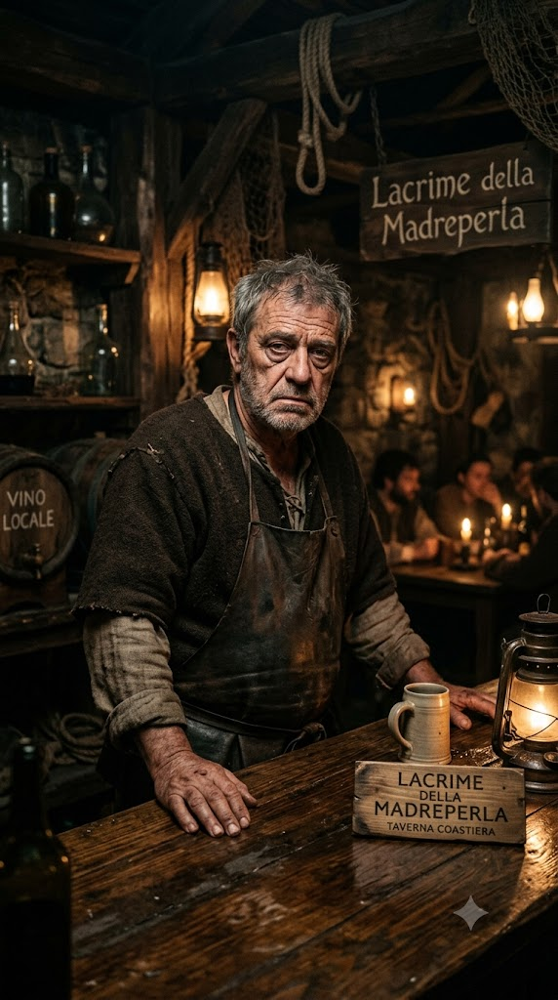
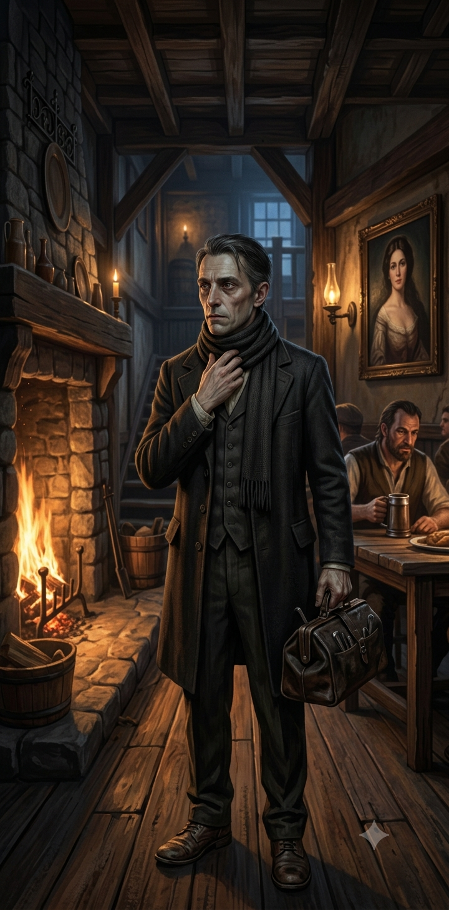
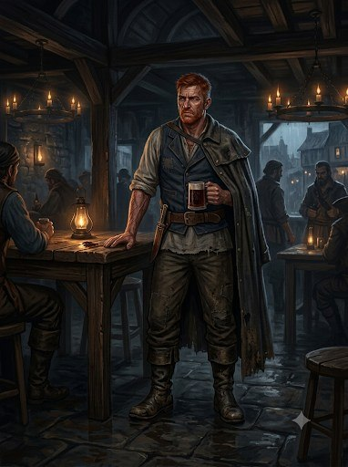

# Глава 2. Таверна «Слёзы устрицы»

**Таймлайн главы 2: 17:30–19:00.**

Игроки прибывают в таверну «Слёзы устрицы» (Lacrime della Madreperla), отрезанные от города проливным ливнем. Глава —
раскрытие: знакомство с остальными NPC, публичная сцена конфликта, ночёвка, переход к тайной ночи (глава 3). Ливень —
проливной; река уже мутнеет.

## Структура главы

1. **Прибытие.**
    - Подъём к таверне. Игроки пересекают мост и с него видят таверну, стоящую как остров в море, с пристанью (quay)
      внизу.
    - Вступление в зал. Знакомство с **Трактирщиком**, **Официанткой**, **Доктором**, **Детективом**, **Моряком**
      (Художник пока не появился).
2. **Эскалация.**
    - **2.1.** Появление Художника; флирт Официантки; раздражение Доктора.
    - **2.2.** Кухня: Официантка уходит за ужином, Доктор следует; конфликт Доктора и Трактирщика (повышенный тон,
      хлопок дверью).
    - **2.3.** Ливень: Трактирщик предлагает гостям заночевать; **Детектив арендует комнату**. Игроки остаются в
      таверне на ночь.
3. **Развязка.** Игроки остаются в таверне на ночь — переход к тайной ночи (глава 3) и к таймеру потопа (глава 6).

## Таблица таймлайна

| Время | Триггер                                    | Событие                                                              | Результат                                                |
|-------|--------------------------------------------|----------------------------------------------------------------------|----------------------------------------------------------|
| 17:30 | Начало главы                               | Игроки прибывают в «Слёзы устрицы» (конец главы 1)                   | Фон «Потоп» = 4; ливень                                  |
| 17:30 | Подъём к таверне / осмотр моста            | Таверна — остров в море; пристань (quay) внизу                       | Знание «Таверна», «Пристань/ялик»; путь спасения         |
| 18:00 | Вступление в зал                           | Знакомство с 5 NPC (Трактирщик, Официантка, Доктор, Детектив, Моряк) | Знание всех NPC; расстановка подозреваемых               |
| 18:00 | Появление Художника (event_027)            | Художник спускается с мансарды; Официантка флиртует                  | Знакомство: Художник в таверне; конфликт Доктора         |
| 18:15 | Официантка уходит на кухню                 | Официантка за ужином; Доктор следует (event_028)                     | Кухня — игровая локация                                  |
| 18:30 | Конфликт на кухне (event_028)              | Голоса Доктора и Трактирщика → ссора; Доктор выбегает                | Публичный конфликт; Доктор уходит в doctor_room (2 этаж) |
| 19:00 | Ливень; предложение заночевать (event_029) | Трактирщик предлагает ночлег; Детектив арендует комнату              | Игроки остаются в таверне; переход к главе 3             |
| 19:00 | Развязка главы                             | Игроки в таверне на ночь                                             | Конец главы 2; тайное время (глава 3)                    |

---

# Этап 1. Прибытие

## 1.1 Подъём к таверне

При подходе к таверне зачитать:

> Вы поднимаетесь по размокшей тропе, и в свете ливня перед вами проступает «Слёзы устрицы» — Lacrime della
> Madreperla.
> Двухэтажное здание стоит на возвышенности, словно остров в море. Толстые стены из тёмного камня и дерева, черепичная
> крыша, покрытая мхом. Вокруг — вода: река Адивиан уже вышла из берегов и смыла мосты, и таверна отрезана от города
> паводком. Из труб идёт дым — внутри тепло.
> Над воротами висит щит — герб таверны: изображение плачущей морской раковины (oyster), из которой капают «слёзы»,
> вырезанное в тёмном дереве и металле; погнутые края, сочащийся мох.
> Пахнет дымом, жареным мясом, мокрым деревом и солью. Слышны дождь, ветер и скрип вывески на ветру.
> Внизу, на берегу реки, — пристань, у которой пришвартован ялик с убранным парусом на фок-мачте. Это единственный путь
> к воде — и, возможно, единственный путь спасения, если вода пойдёт вверх.
> Дождь льёт как из ведра.

**Наблюдения:**

- **Таверна-остров.** Таверна отрезана от города паводком (изоляция; давление).
- **Пристань / ялик (quay / pier / shed).** Пристань связана с Моряком и контрабандистами; ялик — потенциальный путь
  спасения при потопе (см. `flood_mechanic.json`).
- **Магическая аура (неявно).** Вокруг таверны — лёгкая «магия» Дагона: странные запахи, неестественно тихая вода,
  застывшие стаи птиц (см. `tavern_yard.secrets`, `event_016`).

## 1.2 Двор (tavern_yard)

**Время:** 17:45.

### Зачитать при первом входе

Внешняя территория таверны, окружённая забором. У главного входа (восток) — следы ног в мокрой грязи. У северной стены
— дровница. В дальнем углу — конюшня и сарай, у края обрыва — могила. Тропинка за таверной (юг-запад) ведёт к заднему
двору, а оттуда — к набережной (quay). Пахнет мокрой землёй, дымом и чем-то магическим.

### Наблюдения

- **Следы и грязь** — утренние следы Трактирщика (рубил дрова) и Моряка (следит за таверной).
- **Могила (wife_grave)** — могила Изабеллы Вельди (dead_wife); призыв/присутствие призрака (wife_ghost).
- **Колодец (well), сарай (barn), конюшня (stable)** — локации двора.
- **Магическая аура / потоп (flood_spell).** Проверка Мудрость (Религия) или Интеллект (Природа), СЛ 15 → «Вода
  ведёт себя странно: не та, что дождь; она тянет вверх» (зацепка «Потоп / заклинание Дагона»).

### Входы и выходы

- **Вход:** с моста (главный вход со двора, на восток).
- **Выход → tavern_hall** — зал таверны.
- **Выход → stable / barn / well / woodpile / wife_grave** — двор.
- **Выход → backyard → quay** — задний двор, набережная (путь к ялику).
- **Выход → adivian_bridge** — северные ворота к тракту/городу (заблокированы паводком).

---

# Этап 2. Зал таверны

**Время:** 18:00.

## Зачитать при первом входе

В зале таверны «Слёзы устрицы» — большое помещение с низкими деревянными балками под потолком. Четыре длинных стола
расставлены вдоль стен, к каждому приделана лавка. В центре зала — один большой каменный очаг, в котором потрескивает
огонь. На стене на видном месте — портрет красивой женщины. По стенам — окна. В одном углу — лестница на второй этаж (во
фойе), рядом — дверь в подвал. С задней стороны (восточной) — дверь на хозяйственный двор (backyard); с западной —
главный вход со двора.

Пахнет дымом, элем, жареным мясом и воском свечей. Слышны треск огня, скрип половиц и голоса гостей. Внутри тепло, но
напряжение — как перед штормом.

## Наблюдения

- **Портрет жены (wife_portrait)** — портрет Изабеллы Вельди (dead_wife) на видном месте; улик/свидетель (event_014).
  Призрак dead_wife иногда появляется рядом с портретом.
- **Очаг / камин** — тепло; единственный источник света.
- **Лестница на 2 этаж (foyer_2f)** и **дверь в подвал (basement)** — скрытые пути.
- **Домашние/гости** — 5 NPC в зале: Трактирщик, Официантка, Доктор, Детектив, Моряк (Художник — на мансарде).

## Расстановка NPC (18:00)

- **Трактирщик (Гаэтано Вельди)** — у прилавка / за столом, обслуживает зал.
- **Официантка (Виттория Вельди)** — в зале, обслуживает гостей.
- **Доктор (Элио Вентури)** — в зале, беседует, следит за Официанткой (любовник).
- **Детектив (Джакомо Раньери)** — в зале, расследует серию; при ливне (19:00) арендует комнату.
- **Моряк (Корин Марроне)** — в зале, сдержанно; избегает смотреть на Трактирщика.
- **Художник (Лучиано Аврелиан)** — на мансарде; спускается в 18:00 (event_027).

---

# Этап 3. Знакомство с NPC

Каждый NPC знакомится с игроками при первом входе (по ходу вечера). Стат-блоки — ниже, в разделе, где игроки впервые
встречают персонажа.

## Стат-блок: Гаэтано Вельди — Трактирщик (d6=1)

### Что зачитать игрокам при первой встрече

> За прилавком стоит крепкий мужчина лет пятидесяти пяти, уже не молодой: плечи чуть ссутулены, руки в мозолях.
> Обветренное лицо в глубоких морщинах, седые волосы коротко стрижены; серые усталые глаза с постоянной тенью, тяжёлый
> взгляд, словно он всё время что-то вспоминает. На нём простая тёмная одежда: льняная рубаха с закатанными рукавами,
> кожаный жилет, тяжёлый фартук; на поясе — связка ключей; на левой руке — обручальное кольцо, которое он никогда не
> снимает.
> На ладони — старый шрам от ножа. Говорит сурово, ворчливо, настороженно; речь медленная, с паузами, как будто всё
> обдумывает; голос приглушённый. От него пахнет пылью, бумагой, чернилами и лёгким запахом спирта. Когда смотрит на
> портрет жены на стене — на секунду замирает.

### Идентификация

- **Имя:** Гаэтано Вельди.
- **Прозвище:** «Старый Гаэтано».
- **Роль:** владелец таверны, контрабандист, подозревает дочь в культе.
- **Раса:** человек.
- **Мировоззрение:** Нейтральный (N).
- **Статус:** main_npc.
- **Может ли быть жертвой:** true.

### Скрывает

- **[big]** Моряк изнасиловал и убил его жену (Изабеллу Вельди); угрожал дочерью (Официанткой), чтобы тот согласился
  вести общие дела.
- **[small]** Занимается контрабандой: продаёт «Погибель Дьявола» (Devil's Bane), пеш (Pesh), лист-живодёр (Flayleaf),
  грязь (Grit) — инструменты культа Дагона.
- **[small]** Подозревает, что Официантка связана с культом, но не знает о её положении (верховная жрица).

### Хочет

- защитить дочь (Официантку);
- сохранить контрабанду.

### [PF2e stat-block]

| Параметр          | Значение                                                                                        |
|-------------------|-------------------------------------------------------------------------------------------------|
| **Уровень**       | 5                                                                                               |
| **Мировоззрение** | N                                                                                               |
| **Раса**          | Человек                                                                                         |
| **Класс**         | Вор (Rogue)                                                                                     |
| **Роль**          | Melee support / bodyguard                                                                       |
| **Восприятие**    | +13 (moderate)                                                                                  |
| **Языки**         | Общий, Варисийский                                                                              |
| **Навыки**        | Атлетика +12, Обман +12, Воровство +12, Скрытность +14, Запугивание +10, Знание контрабанды +12 |
| **Сила**          | +4                                                                                              |
| **Ловкость**      | +3                                                                                              |
| **Телосложение**  | +3                                                                                              |
| **Интеллект**     | +0                                                                                              |
| **Мудрость**      | +2                                                                                              |
| **Харизма**       | +1                                                                                              |
| **AC**            | 22                                                                                              |
| **HP**            | 80                                                                                              |
| **Скорость**      | 25 футов                                                                                        |
| **Спасброски**    | Стойкость +12, Реакция +14, Воля +10                                                            |
| **Ближний бой**   | Кинжал +1 (Striking): +15, 2d4+6 колющий, +2d6 скрытый удар                                     |
| **Дальний бой**   | Тяжёлый арбалет +13, 2d10+4 колющий                                                             |

**Способности:**

- **Скрытый удар (Sneak Attack) 2d6.**
- **Отвергнуть преимущество (Deny Advantage):** существа 5 уровня и ниже не могут застать его врасплох.
- **Уклонение (Evasion).**
- **Защитный удар (Defensive Strike — реакция).**
- **Телохранитель (Bodyguard — 1 действие).**
- **Фигура вора: Ruffian.**

### GM knows

- **Тайны:** [big] Моряк убил его жену; [small] контрабанда; [small] подозревает дочь в культе.
- **Ложные убеждения:** Моряк — единственный, кто точно знает о его контрабанде; Врач связан с контрабандистами (Ложно:
  Врач не контрабандист, просто знает Моряка).
- **Реакции:** при упоминании жены — замирает; при упоминании Доктора — холодеет; при упоминании контрабанды — врёт.

---

## Стат-блок: Виттория Вельди — Официантка (d6=3)

### Что зачитать игрокам при первой встрече

> В зале двигается молодая девушка лет двадцати. Стройная, лёгкая, движения быстрые и точные. Кожа очень светлая, лицо
> тонкое, с выраженными скулами и узкой нижней частью; нос прямой, заметный; глаза тёмные, внимательные, обычно
> спокойные и немного отстранённые; лёгкое семейное сходство с матерью. Волосы густые, тёмные, убраны просто и
> практично. На ней простая практичная одежда работницы таверны: светлая льняная рубаха с длинными рукавами, тёмная
> длинная юбка, плотный простой фартук; одежда чистая и аккуратная, но слегка потёртая от работы. Украшений почти нет —
> никаких заметных религиозных символов. На запястье — тонкий шрам. Говорит тихо, сдержанно, вежливо. От неё тянет
> травами, благовониями и... солёным морским приливом.

### Идентификация

- **Имя:** Виттория Вельди.
- **Прозвище:** «Госпожа Виттория».
- **Роль:** дочь Трактирщика; **верховная жрица тайного культа Дагона**.
- **Раса:** человек.
- **Мировоззрение:** Хаотично-нейтральный (NE).
- **Статус:** main_npc.
- **Может ли быть жертвой:** true.

### Скрывает

- **[big]** Верховная жрица культа Дагона; святилище — в тайной комнате в подвале (cult_lair).
- **[big]** Молится Дагону, тот насылает дождь/потоп, чтобы задержать Моряка; потоп — её заклинание (ритуал Дагона,
  усиленный паводком Адивиана).
- **[big]** За пару недель до событий призрак Жены рассказал ей, что Моряк убил её мать и угрожал ей.
- **[small]** Знает, что отец (Трактирщик) занимается нелегальной торговлей, но без подробностей.

### Хочет

- месть за мать (Моряк убил dead_wife);
- скрыть культ;
- задержать/убить Моряка (заклинание/жертва).

### [PF2e stat-block]

| Параметр          | Значение                                                                                   |
|-------------------|--------------------------------------------------------------------------------------------|
| **Уровень**       | 7                                                                                          |
| **Мировоззрение** | NE                                                                                         |
| **Раса**          | Человек                                                                                    |
| **Класс**         | Жрец (Cleric, Dagon)                                                                       |
| **Роль**          | Caster (Cleric of Dagon)                                                                   |
| **Восприятие**    | +15 (moderate)                                                                             |
| **Языки**         | Общий, Акло, Варисийский                                                                   |
| **Навыки**        | Религия +17, Дипломатия +15, Обман +15, Запугивание +13, Скрытность +13, Знание Дагона +17 |
| **Сила**          | +0                                                                                         |
| **Ловкость**      | +2                                                                                         |
| **Телосложение**  | +2                                                                                         |
| **Интеллект**     | +1                                                                                         |
| **Мудрость**      | +5                                                                                         |
| **Харизма**       | +4                                                                                         |
| **AC**            | 25                                                                                         |
| **HP**            | 115                                                                                        |
| **Скорость**      | 25 футов                                                                                   |
| **Спасброски**    | Стойкость +12, Реакция +12, Воля +17                                                       |
| **Ближний бой**   | Ритуальный кинжал +1 (Striking): +15, 2d4+2 колющий                                        |
| **Способности**   | Spell DC 25; Spell Attack +17                                                              |

**Способности:**

- **Волна Дагона (2 действия):** 30-футовый конус, 4d6 холодного урона (Стойкость СЛ 25 — половина), отбрасывает на 10
  футов.
- **Приливная молитва (1 действие, фокус):** +1 к AC на 1 раунд.
- **Касание утопленника (1 действие):** +17, 3d6 холодного урона, Стойкость СЛ 25 — «Замедлен 1».
- **Волна глубин (1/день, 2 действия):** 20-футовый взрыв, 6d6 холодного урона (Стойкость СЛ 25 — половина).
- **Голос Дагона (реакция, 1/раунд):** Воля СЛ 25 — «Испуган 1».

### GM knows

- **Тайны:** [big] верховная жрица культа Дагона; [big] вызвала потоп; [big] призрак Жены рассказал об убийстве матери;
  [small] подозревает о контрабанде отца.
- **Реакции:** при упоминании матери/Моряка — напрягается; рядом с Доктором — мягче; при упоминании культа — шёпот
  ритуала.
- **Ложные убеждения:** Трактирщик не знает о культе (возможно, подозревает).

---

## Стат-блок: Элио Вентури — Доктор (d6=4)

### Что зачитать игрокам при первой встрече

> В зале стоит худощавый, жилистый мужчина лет сорока пяти с узким бледным лицом и острыми скулами. Тёмные волосы с
> проседью зачёсаны назад; серо-голубые глаза внимательные, чуть лихорадочные; под глазами — тёмные круги. На нём тёмный
> сюртук, белая рубашка, жилет; на поясе — сумка с медицинскими инструментами; на пальцах — следы от химикатов; обувь
> добротная, но потёртая. Говорит сухо, хладнокровно, чуть лихорадочно; речь ровная, с точными паузами, как диктовка;
> голос приглушённый. Когда нервничает — поправляет воротник; смотрит на Официантку с плохо скрываемой нежностью. От
> него пахнет спиртом, травами и... благовониями.

### Идентификация

- **Имя:** Элио Вентури.
- **Прозвище:** «Доктор Вентури».
- **Роль:** врач-патологоанатом; член культа Дагона; любовник Официантки.
- **Раса:** человек.
- **Мировоззрение:** Законопослушно-злой (LE).
- **Статус:** main_npc.
- **Может ли быть жертвой:** true.

### Скрывает

- **[small]** Состоит в тайном культе Дагона (культе Официантки).
- **[big]** Влюблён в Официантку.

### Хочет

- быть с Официанткой;
- скрыть культ.

### [PF2e stat-block]

| Параметр          | Значение                                                                                       |
|-------------------|------------------------------------------------------------------------------------------------|
| **Уровень**       | 6                                                                                              |
| **Мировоззрение** | LE                                                                                             |
| **Раса**          | Человек                                                                                        |
| **Класс**         | Алхимик (Alchemist) / Жрец (Cleric, Dagon)                                                     |
| **Роль**          | Support caster / debuffer                                                                      |
| **Восприятие**    | +14 (moderate)                                                                                 |
| **Языки**         | Общий, Акло, Варисийский                                                                       |
| **Навыки**        | Медицина +17, Религия +14, Ремесло (алхимия) +14, Обман +12, Скрытность +12, Знание Дагона +14 |
| **Сила**          | +0                                                                                             |
| **Ловкость**      | +2                                                                                             |
| **Телосложение**  | +2                                                                                             |
| **Интеллект**     | +4                                                                                             |
| **Мудрость**      | +3                                                                                             |
| **Харизма**       | +2                                                                                             |
| **AC**            | 23                                                                                             |
| **HP**            | 85                                                                                             |
| **Скорость**      | 25 футов                                                                                       |
| **Спасброски**    | Стойкость +12, Реакция +14, Воля +14                                                           |
| **Ближний бой**   | Скальпель +1 (Striking): +14, 2d4+2 колющий, +2d6 скрытый удар                                 |
| **Дальний бой**   | Метательная склянка +14, 2d6 кислоты/огня (20 футов)                                           |

**Способности:**

- **Патологоанатом (Pathologist):** +2 к Медицине при вскрытии.
- **Подделка отчётов (Forged Reports):** Обман vs Восприятие следователя СЛ 20.
- **Алхимические бомбы:** 2d6 в радиусе 5 футов.
- **Анестезирующий яд (1 действие):** +2d6 яда, Стойкость СЛ 22 — «Замедлен 1».
- **Волна тошноты (2 действия):** 15-футовая эманация, 4d6 яда (Стойкость СЛ 22 — половина) — «Тошнота 1».
- **Экстренная помощь (1 действие, 2/день):** 3d8+6 HP.
- **Скрытый удар (Sneak Attack) 2d6.**

### GM knows

- **Тайны:** [small] член культа Дагона; [big] влюблён в Официантку.
- **Реакции:** при упоминании Официантки — нежность; при упоминании Моряка — избегает, но бросает странные взгляды; при
  упоминании культа — обрывисто.
- **Ложные убеждения:** Никто не знает о его участии в культе (кроме Официантки).

---

## Стат-блок: Джакомо Раньери — Детектив (d6=5)

(Стат-блок — в `02-chapter-1.md`, Этап 3. Здесь — только роль в таверне.)

- **В таверне:** расследует серию смертей в городе (наём Дуксотара); при ливне (19:00) арендует комнату, чтобы
  переждать дождь/до рассвета.
- **Знакомы по работе:** и Доктор, и Ассистент Доктора — по Моргу/вскрытиям.
- **Зависимость от алкоголя:** в `detective_room` — следы пьянства (detective_drunk).

---

## Стат-блок: Корин «Кайрэн» Марроне — Моряк (d6=2)

### Что зачитать игрокам при первой встрече

> В зале стоит крупный, широкоплечий мужчина лет сорока с грубыми чертами. Загорелое обветренное лицо, недельная
> щетина; тёмные сальные волосы стянуты в хвост; глаза маленькие, глубоко посаженные, бегающие; на правой щеке — старый
> шрам от сабли. На нём потёртая морская куртка, тельняшка, кожаные штаны, тяжёлые сапоги; на шее — амулет из акульих
> зубов; пальцы унизаны перстнями (некоторые — явно краденые). Говорит громко, с морским акцентом, пересыпая речь
> ругательствами; когда нервничает — крутит перстень на левой руке; избегает смотреть в глаза Трактирщику. От него
> пахнет ромом, солью и табаком.

### Идентификация

- **Имя:** Корин Марроне.
- **Прозвище:** «Кайрэн», «Ржавый».
- **Роль:** дезертир с «Чёрной Сирены», украл судовую казну; контрабандист; деловой партнёр Трактирщика.
- **Раса:** полуэльф.
- **Мировоззрение:** Хаотично-злой (CN).
- **Статус:** main_npc.
- **Может ли быть жертвой:** true.

### Скрывает

- **[big]** Дезертировал с корабля «Чёрная Сирена» Капитана, украл судовую казну.
- **[big]** Изнасиловал и убил жену Трактирщика (dead_wife); угрожал Официанткой, чтобы Трактирщик согласился вести
  общие дела.
- **[small]** Контрабандист: привозит Трактирщику «Погибель Дьявола», пеш, лист-живодёр, грязь (инструменты культа
  Дагона).

### Хочет

- сохранить контрабанду;
- не раскрывать дезертирство/кражу.

### [PF2e stat-block]

| Параметр          | Значение                                                                                     |
|-------------------|----------------------------------------------------------------------------------------------|
| **Уровень**       | 9                                                                                            |
| **Мировоззрение** | CN                                                                                           |
| **Раса**          | Полуэльф                                                                                     |
| **Класс**         | Боец (Fighter) / Вор (Rogue)                                                                 |
| **Роль**          | Solo boss / dirty fighter                                                                    |
| **Восприятие**    | +18 (moderate)                                                                               |
| **Языки**         | Общий, Эльфийский, Варисийский                                                               |
| **Навыки**        | Атлетика +20, Акробатика +17, Запугивание +17, Скрытность +17, Морячество +19, Воровство +17 |
| **Сила**          | +5                                                                                           |
| **Ловкость**      | +4                                                                                           |
| **Телосложение**  | +4                                                                                           |
| **Интеллект**     | +2                                                                                           |
| **Мудрость**      | +3                                                                                           |
| **Харизма**       | +2                                                                                           |
| **AC**            | 28                                                                                           |
| **HP**            | 170                                                                                          |
| **Скорость**      | 25 футов                                                                                     |
| **Спасброски**    | Стойкость +20, Реакция +18, Воля +14                                                         |
| **Ближний бой**   | Боевой нож +2 (Greater Striking): +21, 3d4+8 колющий, +2d6 скрытый удар                      |
| **Дальний бой**   | Метательный нож +19, 2d4+6 колющий                                                           |

**Способности:**

- **Скрытый удар (Sneak Attack) 2d6.**
- **Грязный приём (Dirty Trick — 1 действие).**
- **Двойной разрез (2 действия).**
- **Внезапный рывок (Sudden Charge — 2 действия).**
- **Морские ноги (Sea Legs).**
- **Не уйти (Don't Get Left Behind — реакция).**
- **Жестокий финал (Brutal Finale — 1 действие, 1/раунд).**

### GM knows

- **Тайны:** [big] дезертирство и кража казны; [big] убил жену Трактирщика/угрожал дочерью; [small] контрабанда.
- **Ложные убеждения:** Никто не знает о его дезертирстве; Трактирщик не знает о его прошлом (кроме контрабанды);
  Официантка не знает о его угрозах.
- **Реакции:** при упоминании Капитана — замирает; при упоминании Доктора — подозревает, что тот выдал его прошлое; при
  упоминании Моряка — избегает глаз Трактирщика.

---

# Этап 4. Эскалация (18:00–19:00)

## 4.1 Сцена: появление Художника (event_027)

**Время:** 18:00.

С мансарды спускается **Художник (Лучиано Аврелиан)** — он как будто потомок аасимара и эльфа сразу. **Официантка
начинает флиртовать с ним** (event_021: она «запала» на него, он необычно красив), что **раздражает Доктора** (любовник
Официантки).

- **Как это работает.** Художник спускается из мансарды (mansard) в зал; Официантка обращает на него внимание; Доктор
  раздражён.
- **Атмосфера.** Бесшумная кошачья грация, вкрадчивый голос; Официантка мягче рядом с ним.
- **Улики/намёки.** При проверке (Внимательность, СЛ 10): на Художнике — запах масляной краски/льняного масла/резких
  трав; при критическом успехе (СЛ 15) — противоестественный холод, «пустая маска» (признаки маньяка, из
  `02-chapter-1.md`).
- **Последствие.** Конфликт любви Доктора/Официантки/Художника; эскалация к конфликту Доктора и Трактирщика (event_028).

## 4.2 Сцена: конфликт Доктора и Трактирщика на кухне (event_028)

**Время:** 18:15–18:30.

18:15 — Официантка уходит на кухню за ужином для гостей; **Доктор следует за ней**. 18:30 — Официантка возвращается с
подносами с едой и напитками; с кухни доносятся голоса **Трактирщика и Доктора** — сначала спокойные, но постепенно
переходящие на повышенный тон. В конце **Доктор выбегает из кухни, хлопнув дверью**, и уходит к себе в комнату на 2
этаге (doctor_room).

- **Кухня (kitchen)** — игровая локация.
- **Атмосфера.** Тесное, жаркое помещение; медные кастрюли, крюки для мяса, три печи; пахнет жареным мясом, вином,
  дымом и — странно — благовониями (след культа Дагона, `kitchen.secrets`).
- **Что слышно из-за двери.** Повышенный тон, затем ссора, затем хлопок дверью (игроки могут слушать из зала /
  tavern_hall).
- **Улики/намёки.** Проверка (Слух/Внимательность, СЛ 15): можно подслушать фрагмент ссоры — Трактирщик подозревает
  Доктора в связях с контрабандистами (ложное подозрение), Доктор защищает Официантку.
- **Последствие.** Публичный конфликт Доктора и Трактирщика; Доктор отправлен от зала; Официантка остаётся в зале (за
  ужином).

## 4.3 Сцена: ливень и предложение заночевать (event_029)

**Время:** 19:00.

Дождь льёт как из ведра (ливень). **Трактирщик предлагает гостям заночевать** в таверне. **Детектив арендует комнату**
(переждать дождь/до рассвета). Игроки оказываются в таверне на ночь.

- **Как это работает.** Ливень (давление, изоляция); Трактирщик предлагает ночлег; игроки и Детектив остаются в таверне
  на ночь.
- **Последствие.** Детектив в таверне (арендованная комната, detective_room); начинается **тайное время** (глава 3);
  эскалация к потопу (глава 6).
- **Механика прибытия в таверну:** игроки и Детектив остаются в таверне; переход к `nightly_beats.json`
  (chapter_2_tavern
  → chapter_3_night).

---

# Справочник: комнаты и тайные локации таверны

> Эти локации доступны игрокам при обыске/наблюдении, но основные события главы 2 — в `tavern_hall` и `kitchen`.

## Комната Доктора (doctor_room)

Чистая, аккуратная комната на 2 этаже. Кровать, стол, стул, окно, камин. На столе — медицинские инструменты, флаконы,
журнал. В сумке под кроватью — **ритуальный кинжал культа** (doctor_dagger). В ящике стола — **записка к Официантке**
(doctor_note, любовная связь). На стене — полка с травами и свечами. Пахнет травами, благовониями, воском.

- **Улики:** doctor_note (любовная записка), doctor_journal (медицинский журнал с записями о жертвах Художника),
  tavernkeeper_alibi (зарисовки следов ритуала на телах жертв), doctor_hiding (тайник).
- **Секрет:** Врач — член культа, хранит ритуальный кинжал; влюблён в Официантку.

## Комната Официантки (waitress_room)

Маленькая комната в конце коридора. Кровать, стол, лампа. На столе — **дневник**, перо, чернильница. В углу — шкатулка.
На стене — полка с травами и свечами, камин. Пахнет травами и благовониями. Под кроватью — тайник.

- **Улики:** waitress_diary (дневник; записи о молитве Дагону и потопе), waitress_diary_secret (часть 2),
  waitress_focus (заклинательный фокус), waitress_hiding (тайник), wife_ghost (призрак Жены).
- **Секрет:** дневник доказывает, что потоп — заклинание Официантки (event_016/017).

## Двор (tavern_yard)

(см. Этап 1.2.)

## Кухня (kitchen)

(см. 4.2.)

---

# Развязка главы (19:00)

Игроки остаются в таверне на ночь — **конец главы 2**.

- **Переход к главе 3 (Ночь, 20:00–2:00).** Тайное время: культисты в `cult_lair`, контрабанда в `basement`/
  `smuggler_storage`, наблюдение на `mansard`, сон. NPC живут своей жизнью (молятся, грузят товары, считают деньги).
- **Переход к главе 6 (Потоп).** 07:15 (event_030) — кто-то из NPC замечает, что река вышла из берегов, таверна
  изолирована, запускается таймер потопа (24 игровых часа; уровень воды прибывает и блокирует локации снизу вверх, см.
  `flood_mechanic.json`).

**Предупреждение:** если игроки не останутся в таверне — их атакуют **Теневые звери** → **конец приключения**.
