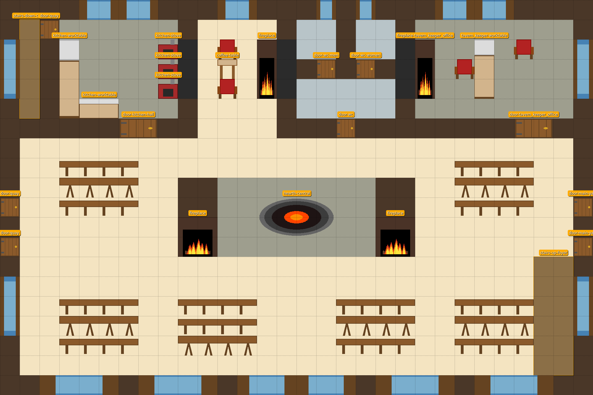

# Глава 3. Убийство

::: figure[Схема ночи таверны]

:::

## Структура главы

Глава 3 — **02:00**, момент, когда тайная ночь таверны сжимается в одну сцену: **убийство**. Жертва определяется
броском **d6** (канон: 1 = Трактирщик, 2 = Моряк, 3 = Официантка, 4 = Доктор, 5 = Детектив, 6 = Художник). Убийца —
один из остальных пяти NPC (см. `murder_matrix.json` / `kill_grid.json`). Глава — короткая, но плотная: она задаёт
**тело, место, орудие, мотив и улики**, по которым игроки (и Детектив) будут расследовать на рассвете (глава 4) и
во время потопа (глава 5).

> **Важно для Мастера:** глава 3 — это **не** то, что видят игроки сразу. Она описывает **то, что случилось в ночи**,
> и то, **как это будет раскрыто** утром. Игроки узнают об убийстве на рассвете (глава 4). Всё, что ниже — заготовки
> для Мастера: сцены убийства по d6, улики, ложные следы, последствия и привязка к потопу.

1. **Как определяется убийство.** d6-жертва → d6-убийца (матрица 6×6) → способ/мотив/улики. `S0X` — несчастный случай
   (`murder: null`), `SXY` — убийство жертвой X убийцей Y.
2. **Сцена убийства (02:00).** Тайная смена ночи: культисты в `cult_lair`, контрабанда в `smuggler_storage`,
   наблюдение с `mansard`. Убийство — кульминация этого тайного времени.
3. **Рассыпание улик.** Убийца оставляет/прячет/подбрасывает улики; ложные следы ведут на неубийц.
4. **Последствия и привязка к потопу.** Убийство меняет отношения и тайны; часть путей остановки потока (path_1/2/4/5)
   завязана на исход убийства. Переход к **главе 4 — Рассвет (05:45–07:15)**.

::: pftab[Таймлайн главы 3]

| Время | Место                            | Что происходит                                                                                                        |
|-------|----------------------------------|-----------------------------------------------------------------------------------------------------------------------|
| 02:00 | Локация убийства (varies)        | Происходит убийство; жертва определяется d6 (`murder_matrix.json`)                                                    |
| 02:00 | cult_lair / mansard / yard       | Тайные сцены ночи завершаются: культисты расходятся, Художник с мансарды, Моряк уходит, Призрак Жены у входа к культа |
| 03:00 | varies                           | Убийца прячет/подбрасывает улики; ложные следы на неубийцах (см. false_evidence)                                      |
| 05:45 | varies                           | Кто-то из NPC (по morning-расписанию) замечает тело или замечает, что одного не хватает (см. nightly_beats.json)      |
| 07:15 | tavern_hall / tavern_yard / quay | Река вышла из берегов; таверна изолирована; **запускается таймер потопа** (24 игровых часа; event_030) — **глава 5**  |

:::

---

## Этап 1. Как определить убийца

### 1.1 Бросок d6: жертва

> Бросок **d6** определяет **жертву**. Канон-маппинг (README/`murder_matrix.json`):
> **1 = Трактирщик (tavern_keeper), 2 = Моряк (sailor), 3 = Официантка (waitress), 4 = Доктор (doctor),
> 5 = Детектив (detective), 6 = Художник (artist).**

> **Внимание:** d6-маппинг жертвы **НЕ совпадает** с порядком `kill_grid._meta.characters`
> (`[sailor, tavern_keeper, waitress, doctor, artist, detective]`). Для ID сценария всегда d6-маппинг из README.

### 1.2 Бросок d6: убийца (в пределах possible_killers жертвы)

> После жертвы бросается **d6-убийца** из числа **возможных убийц** этой жертвы (`possible_killers` в
> `murder_matrix.json`). Комбинация `убийца × жертва` — **ячейка `kill_grid.json`**: она даёт `type`
> (proof / alibi / accident_self / possible_scenario), `motivation`, `probability`, `primary_evidence`,
> `secondary_evidence`, `false_evidence`.

> **ID сценария** = `S` + 2 цифры d6 (жертва/убийца). `S0X` — несчастный случай (`murder: null`).
> Пример: `S12` = жертва 1 (Трактирщик), убийца 2 (Моряк). `S36` = жертва 3 (Официантка), убийца 6 (Художник).

### 1.3 Матрица 6×6 (кто убил кого)

> Строки = **УБИЙЦА**, столбцы = **ЖЕРТВА**. Ячейка — комбинация: `primary` (основная улика, прямо на убийцу),
> `secondary` (подводят к основной), `false` (ложные следы). `alibi` — комбинация исключает (нет мотива/средства).
> `accident_self` — диагональ (несчастный случай/болезнь/самоубийство, `murder: null`).

::: pftab[Ключ к ячейкам kill_grid]

| type                | Что значит                                                                   |
|---------------------|------------------------------------------------------------------------------|
| `proof`             | Улика доказывает, что убийца мог убить жертву (мотив/средство/связь)         |
| `alibi`             | Улика очерчивает убийцу (нет мотива/нет средств) — комбинация исключена      |
| `accident_self`     | Диагональ: без внешнего убийцы (`murder: null`, `S0X`)                       |
| `possible_scenario` | Не-канон: мотив гипотетический, требуется выбор автора (см. `scenario_note`) |

:::

### 1.4 Ключевые (high) и возможные (possible) сценарии

> Ниже — только ячейки с `probability = high` (канон-фавориты) и `possible_scenario` (требуют решения автора).
> Остальные ячейки — см. `kill_grid.json` / `murder_matrix.json`.

::: pftab[Канон-фавориты (high)]

| Жертва (d6)      | Убийца         | Мотив    | Основная улика       | Вероятность |
|------------------|----------------|----------|----------------------|-------------|
| **1** Трактирщик | **Моряк**      | hatred   | sailor_threat_letter | high        |
| **2** Моряк      | **Трактирщик** | hatred   | tavernkeeper_diary   | high        |
| **2** Моряк      | **Официантка** | religion | waitress_diary       | high        |
| **3** Официантка | **Художник**   | religion | reliquary_skull      | high        |
| **4** Доктор     | **Моряк**      | justice  | sailor_false_clue    | high        |
| **5** Детектив   | **Художник**   | justice  | order_order          | high        |

:::

::: pftab[Возможные сценарии (possible_scenario — выбор автора)]

| Жертва (d6)  | Убийца     | Мотив    | Основная улика  | Примечание (scenario_note)                                                                                                                       |
|--------------|------------|----------|-----------------|--------------------------------------------------------------------------------------------------------------------------------------------------|
| 1 Трактирщик | Врач       | love     | doctor_dagger   | Не канон: Врач защищает Официантку от отцовской вражды; в каноне Трактирщик лишь подозревает Доктора в связях с контрабандистами, но не убивает. |
| 1 Трактирщик | Художник   | religion | artist_sketches | Не канон: только если Художник догадается, что таверна — логово культа; в каноне он НЕ знает о культе.                                           |
| 3 Официантка | Официантка | religion | reliquary_skull | Не канон: только если Художник раскрывает ей его истинную природу; на старте она «запала» на него, вражды нет.                                   |
| 5 Детектив   | Трактирщик | money    | contraband      | Не канон: только если Детектив накроет контрабанду.                                                                                              |

:::

> **Правило possible_scenario.** Если выбран `possible_scenario`, уберите/замените его на канон, если автор
> не подтверждает мотив (см. `scenario_note` в `murder_matrix.json` / `kill_grid.json`). Иначе — удалите
> эту причину смерти из матрицы жертвы.

### 1.5 Несчастный случай (murder: null, S0X)

> Диагональные ячейки (`accident_self`): жертва погибает **без внешнего убийцы** — несчастный случай,
> болезнь или одержимость. В этом случае **нет убийцы**, есть **только следствие** (тело + улики-следы).
> ID `S0X`. Это **не** убийство, но **не** и безрассыпание: игроки всё равно ищут, кто виноват.

---

## Этап 2. Сцена убийства (02:00)

> **Тайное время ночи** (см. `03-chapter-2.md`, Этап 5.4): 00:00–02:00 — культисты в `cult_lair`,
> контрабанда в `smuggler_storage`/`basement`, наблюдение с `mansard`, Призрак Жены у входа к культа.
> 02:00 — кульминация: **убийство**.

### 2.1 Как это работает

- **Убийство — тайное.** Никто из NPC (кроме убийцы) не видит, как оно происходит. Оно случается в
  локации жертвы в 02:00 (по расписанию `nightly_beats.json`, `phase: chapter_3_murder`).
- **Локация убийства** зависит от жертвы (см. `murder_matrix.json`, `special_consequences`; и `locations/`).
  Обычно — комната жертвы (2 этаж) или `cult_lair`/`mansard`.
- **Открытость.** Игроки **не видят** убийства. Они узнают о нём на рассвете (глава 4): кто-то из NPC (по
  `daily_schedule.morning`) находит тело или замечает, что одного не хватает.
- **Улика/след.** Убийца оставляет `primary_evidence`, подбрасывает `false_evidence` на неубийцу и
  может «очиścić» `secondary_evidence` (см. `kill_grid.json`).

### 2.2 Сцены убийства по d6-жертве

> Для каждой жертвы — **канон-фаворит** (high) + **основные улики** + **последствия** (`special_consequences`).
> Подварианты — см. `murder_matrix.json`.

#### Жертва 1. Трактирщик (Гаэтано Вельди) — `tavern_keeper`

**Возможные убийцы:** Моряк, Врач, Художник (или `accident`).

- **Канон-фаворит (high): Моряк, hatred.** Моряк убил жену Трактирщика (event_004) и угрожал его дочерью;
  у Моряка есть мотив убить Трактирщика, чтобы тот замолчал. **Основная улика:** `sailor_threat_letter`
  (письмо с угрозой). **Вспомогательные:** `tavernkeeper_notebook`, `wife_portrait`, `wife_ghost`,
  `sailor_knife`. **Ложные следы:** `contraband`, `potion_poison`.
- **Возможный сценарий (не канон): Врач, love** — защищает Официантку (его любовницу) от отцовской
  вражды. `doctor_dagger`. В каноне Трактирщик лишь подозревает Доктора в связях с контрабандистами (ложное подозрение),
  но не убивает.
- **Возможный сценарий (не канон): Художник, religion** — убивает как культиста, если догадается, что
  таверна связана с культом. `artist_sketches`. В каноне Художник НЕ знает, что эта таверна — логово
  культа.
- **accident (medium):** без внешнего убийцы (`S01`). `detective_drunk`, `blood_traces`, `potion_poison`.
- **Последствия (`special_consequences`):** Официантка теряет отца; тайна Владельца (жена, убита Моряком)
  может быть раскрыта; контрабанда Владельца может быть раскрыта; `wife_portrait` / `wife_ghost` /
  `waitress_diary` — как улик.

#### Жертва 2. Моряк (Корин Марроне) — `sailor`

**Возможные убийцы:** Трактирщик, Официантка, Врач, Детектив (или `accident`).

- **Канон-фаворит (high) А: Официантка, religion.** Официантка отомстила за мать: подстрекаемая
  призраком Жены (event_015) и затаив зло за угрозу Моряка, при помощи Дагона (потоп, event_016 —
  ритуал Дагона, усиленный паводком Адивиана) задержала Моряка и принесла его в жертву культа Дагона (`cult_lair`,
  event_006/007). **Основная улика:** `waitress_diary`. **Вспомогательные:**
  `wife_ghost`, `flood_spell`, `waitress_diary_secret`, `waitress_focus`, `ghost_testimony`. **Ложные следы:**
  `sailor_false_clue`, `blood_traces`.
- **Канон-фаворит (high) B: Трактирщик, hatred.** Трактирщик отомстил Моряку за убийство и
  изнасилование его жены (event_004). Воспользовался удачным моментом: потоп (заклинание Официантки,
  event_016) задержал Моряка в таверне. **Основная улика:** `tavernkeeper_diary`. **Вспомогательные:**
  `wife_portrait`, `wife_ghost`, `tavernkeeper_dagger`, `sailor_threat_letter`. **Ложные следы:**
  `sailor_false_clue`, `ink_on_fingers`.
- **Подвариант (medium) justice: Официантка** — Моряк начал распускать руки и угрожал Официантке;
  она убила его в самообороне (event_015). `waitress_diary`.
- **Подвариант (medium) love: Врач** — защищал Официантку от приставаний Моряка. `doctor_dagger`.
- **Подвариант (low) possessed: Врач** — одурманен Официанткой/одержим призраком Мёртвой жены, совершил
  месть за мать Официантки. `doctor_dagger`.
- **Подвариант (low) accident: Детектив** — убил Моряка по неосторожности, сильно напившись (`detective_drunk`).
- **accident (medium):** `detective_drunk`, `blood_traces`.
- **Последствия:** Трактирщик теряет делового партнёра; тайна Моряка (дезертирство, кража казны) может
  быть раскрыта; Врач теряет врага; Официантка отомстила за мать (раскрытие культа и жертвенного
  ритуала, event_015/016/006/007); потоп (заклинание Официантки) может быть раскрыт как причина
  задержания Моряка; `wife_ghost` — как улика/свидетель, но **не** убийца.

#### Жертва 3. Официантка (Виттория Вельди) — `waitress`

**Возможные убийцы:** Художник, Моряк (или `accident`).

> **Алиби (НЕ убийцы):** Доктор — это его любовница (`cult_items` = алиби); Трактирщик — это его дочь
> (`wife_portrait` = алиби); Детектив — нет мотива. Их комбинации с Официанткой — `alibi`/`impossible`.

- **Канон-фаворит (high): Художник, religion.** Художник убивает Официантку, если игроки раскрывают
  ему культ (реликвия в `cult_lair` под алтарём). Она — верховная жрица и знает, где реликвия (`reliquary_skull`).
  Мотив: вернуть реликвию, которую культисты выкупили у воров и спрятали (event_018). **ТРИГГЕР:** игроки раскрывают
  культ Художнику; без триггера Художник НЕ знает, что
  реликвия в таверне, и убийство **не** происходит (см. event_020, event_031). **Основная улика:**
  `reliquary_skull`. **Вспомогательные:** `cult_items`, `order_order`, `artist_sketches`,
  `order_letter`. **Ложные следы:** `waitress_diary`, `artist_workshop`.
- **Подвариант (medium) accident: Моряк** — убивает Официантку случайно, приставая к ней.
  `sailor_false_clue`.
- **Подвариант (low) hatred: Моряк** — запугать Трактирщика (event_004/015). `sailor_threat_letter`.
- **Подвариант (low) religion: Моряк** — узнаёт, что Официантка — культист, боится магии (event_016).
  `sailor_false_clue`, `flood_spell`, `blood_evidence`.
- **accident (medium):** `blood_traces`.
- **disease (low):** `doctor_journal`.
- **Последствия:** Трактирщик теряет дочь; Врач теряет любовницу; Художник теряет цель; культ может
  быть раскрыт; реликвия (`reliquary_skull`) может быть раскрыта/похищена; потоп (заклинание
  Официантки) может быть раскрыт; `waitress_diary` — как улика.

#### Жертва 4. Доктор (Элио Вентури) — `doctor`

**Возможные убийцы:** Трактирщик, Моряк, Художник (или `accident`/`disease`).

- **Канон-фаворит (high): Моряк, justice.** Моряк убивает Доктора для защиты себя от преследования (Врач мог прийти в
  таверну по его душу за дезертирство и кражу казны; Моряк считает, что Доктор его
  выдаст). **Основная улика:** `sailor_false_clue`. **Вспомогательные:** `sailor_knife`, `doctor_hiding`,
  `ink_on_fingers`, `doctor_journal`. **Ложные следы:** `doctor_dagger`.
- **Подвариант (medium) hatred: Трактирщик** — защищает дочь (Официантку), резко против их отношений
  (tavern_keeper.hatred->doctor). `cult_items`, `tavernkeeper_dagger`, `tavernkeeper_diary`,
  `doctor_note`, `doctor_hiding`.
- **Подвариант (low) religion: Художник** — убивает Доктора как участника Праздника Пива (член культа
  Дагона) (event_020, event_018). `cult_items`, `reliquary_skull`, `order_order`, `artist_sketches`,
  `order_letter`.
- **accident (medium):** `blood_traces`.
- **disease (low):** `doctor_journal`.
- **Последствия:** Официантка теряет любовника; Моряк теряет врага; культ теряет члена; реликвия (`reliquary_skull`)
  может быть раскрыта/похищена.

#### Жертва 5. Детектив (Джакомо Раньери) — `detective`

**Возможные убийцы:** Трактирщик, Моряк, Врач, Художник (или `accident`/`disease`).

- **Канон-фаворит (high): Художник, justice.** Художник убивает Детектива, если его раскроют как
  убийцу культистов в городе (event_010: серия убийств; artist.justice->detective: противопоставление
  тайного и официального правосудия). Мотив: замолвить дело, чтобы скрыть свои убийства. **Основная
  улика:** `order_order` (приказ ордена). **Вспомогательные:** `artist_traces`, `artist_sketches`,
  `artist_hiding`, `cord_to_cult_lair`. **Ложные следы:** `detective_drunk`, `artist_workshop`.
- **Подвариант (medium) accident: Моряк** — убивает Детектива по пьянке (`detective_drunk`).
- **Подвариант (medium) love: Врач** — защищает Официантку от пьяного Детектива (detective.daily_schedule:
  следы пьянства). `doctor_dagger`, `cult_items`, `ritual_marks`, `letter_to_tavern`, `doctor_hiding`.
- **Подвариант (medium) money: Трактирщик** — если Детектив найдёт доказательства контрабанды (event_005). `contraband`,
  `tavernkeeper_notebook`, `tavernkeeper_diary`, `tavernkeeper_hiding`,
  `potion_poison`.
- **accident (medium):** `detective_drunk`, `blood_traces`.
- **disease (low):** `detective_drunk`.
- **Последствия:** расследование прекращается; Художник может быть невиновен в текущем убийстве;
  контрабанда (Трактирщик/Моряк) может быть раскрыта.

#### Жертва 6. Художник (Лучиано Аврелиан) — `artist`

**Возможные убийцы:** Трактирщик, Моряк, Официантка, Врач, Детектив (или `accident`/`disease`).

- **Подвариант (medium) love: Врач** — убивает Художника, если тот покусится на Официантку как на
  верховную жрицу (artist.religion->doctor; artist.justice->doctor). `cult_items`, `doctor_dagger`,
  `doctor_note`, `doctor_hiding`, `poison_evidence`.
- **Подвариант (medium) love: Врач** — отравление из ревности (Официантка «запала» на Художника,
  event_021). `potion_poison`, `doctor_note`, `doctor_hiding`, `doctor_journal`.
- **Подвариант (medium) justice: Детектив** — противопоставление личного и официального правосудия (artist.justice->
  detective). `flood_spell`, `artist_traces`, `order_order`, `artist_sketches`,
  `cord_to_cult_lair`.
- **Возможный сценарий (medium, possible_scenario) religion: Официантка** — если Художник найдёт
  `cult_lair` и раскроет её принадлежность. На старте Официантка НЕ знает, что Художник — убийца серии (расправитель над
  участниками Праздника Пива), поэтому вражды нет; она «запала» на него (event_021).
  `reliquary_skull`, `cult_items`, `waitress_diary`, `waitress_focus`, `ghost_testimony`.
- **Подвариант (low) justice: Трактирщик** — если Художник нападает на Официантку (дочь). `wife_portrait`,
  `tavernkeeper_dagger`, `tavernkeeper_diary`, `family_tree`.
- **Подвариант (low) accident: Моряк** — убивает Художника случайно по пьянке. `detective_drunk`,
  `artist_traces`, `artist_workshop`, `artist_hiding`.
- **accident (low):** `detective_drunk`, `artist_traces`, `artist_workshop`.
- **disease (low):** `doctor_journal`.
- **Последствия:** культисты теряют угрозу; серия убийств в городе может быть раскрыта (event_010);
  Художник был **невиновен** в текущем убийстве (is_killer=false, текущее дело); культ может быть
  раскрыт (если убийца — Официантка, найдя `cult_lair`).

---

## Этап 3. Улики и ложные следы

> Каждая комбинация (убийца × жертва) — **ячейка `kill_grid.json`**: `primary` (основная улика, прямо
> на убийцу), `secondary` (вспомогательные, подводят к основной), `false` (ложные следы на неубийц).
> Модель улик: `proof` (улика доказывает, что убийца мог убить) vs `alibi` (улика очерчивает убийцу —
> нет мотива/средства).

### 3.1 Улики-роли

::: pftab[Роли улик]

| Роль          | Что это                                                              |
|---------------|----------------------------------------------------------------------|
| **primary**   | Основная улика: напрямую указывает на убийцу (мотив/средство/связь)  |
| **secondary** | Вспомогательные: подводят к основной, укрепляют картину              |
| **false**     | Ложные следы: ведут на НЕубийцу (заводят с тупика)                   |
| **alibi**     | Улика очерчивает убийцу — комбинация исключена (нет мотива/средства) |

:::

### 3.2 Индекс улик (из `kill_grid.json`, `evidence_index`)

::: pftab[Индекс улик]

| ID                      | Улика                                                                                                        |
|-------------------------|--------------------------------------------------------------------------------------------------------------|
| `contraband`            | Контрабанда: «Погибель Дьявола», пеш, лист-живодёр, грязь (инструменты культа Дагона; в тайнике Трактирщика) |
| `tavernkeeper_notebook` | Записная книжка Трактирщика (деловая связь с Моряком, угрозы)                                                |
| `cult_items`            | Ритуальные предметы культа (Официантка = верховная жрица, Врач = член культа)                                |
| `artist_traces`         | Ложные следы Художника на мансарде (mansard)                                                                 |
| `detective_drunk`       | Следы пьянства Детектива (detective_room)                                                                    |
| `sailor_false_clue`     | Ложная улика на Моряка (в комнате Моряка)                                                                    |
| `wife_portrait`         | Портрет жены (dead_wife) в зале — связь Трактирщик↔dead_wife↔Официантка                                      |
| `wife_ghost`            | Призрак Жены (dead_wife): Моряк убил мать Официантки, угрожал ей                                             |
| `waitress_diary`        | Дневник Официантки (потоп = её заклинание, молитва Дагону — ритуал Дагона)                                   |
| `flood_spell`           | Потоп как заклинание (изолирует таверну, неестественный потоп)                                               |
| `reliquary_skull`       | Реликвия ордена (мумифицированный череп святого) в cult_lair                                                 |
| `artist_workshop`       | Художественная мастерская Художника (картины-треш-расчленёнка)                                               |
| `doctor_dagger`         | Ритуальный кинжал Врача                                                                                      |
| `sailor_knife`          | Нож Моряка                                                                                                   |
| `tavernkeeper_dagger`   | Кинжал Трактирщика                                                                                           |
| `tavernkeeper_diary`    | Дневник Трактирщика                                                                                          |
| `sailor_threat_letter`  | Письмо Моряка с угрозой                                                                                      |
| `contraband_crate`      | Счёт за контрабанду                                                                                          |
| `waitress_diary_secret` | Дневник Официантки (часть 2)                                                                                 |
| `doctor_note`           | Записка Врача                                                                                                |
| `doctor_journal`        | Медицинский журнал Врача                                                                                     |
| `order_order`           | Приказ ордена                                                                                                |
| `artist_sketches`       | Наброски Художника                                                                                           |
| `ritual_marks`          | Следы ритуала на теле                                                                                        |
| `ghost_testimony`       | Показания призрака                                                                                           |
| `cord_to_cult_lair`     | Следы на чердачной лестнице                                                                                  |
| `potion_poison`         | Флакон яда                                                                                                   |

:::

### 3.3 Как расставлять улики (правила)

- **Убийца оставляет `primary_evidence`** на месте/у тела/в локации жертвы.
- **Убийца подбрасывает `false_evidence`** на неубийцу (чтобы завести с тупика).
- **`secondary_evidence`** — в комнатах/локациях, связанных с мотивом (подводят к основной).
- **`alibi`-улики** — в комбинациях `alibi`: их наличие **очерчивает** неубийцу (нет мотива/средства).
- **`false_beliefs`** (см. `characters/*.json`) — что NPC **думают**, но не знают (ложные убеждения);
  дают ложные следы в допросах (см. `06-interrogations-stage-1.md`).

### 3.4 Пространственная привязка улик (улика → локация → проверка → кто знает)

> Это закрывает пробел «улика как строчка» → «улика как игровой элемент». Каждая улика лежит в **конкретной
> локации** (`locations/*.json`), доступна по **конкретной проверке** и **известна только некоторым NPC**
> (`evidence.json`, поля `location` / `discovery` / `visibility.known_by`). Ниже — только улики, участвующие в
> ячейках `kill_grid.json`. Полная карта — `evidence.json`.

#### А. Где физически лежит каждая улика

::: pftab[Улика → локация → кто знает → как найти]

| Улика                                                   | Локация (из `evidence.json`) | Кто знает (`known_by`)         | Как найти (`discovery_method`)             |
|---------------------------------------------------------|------------------------------|--------------------------------|--------------------------------------------|
| `contraband`                                            | `tavern_keeper_office`       | —                              | обыск кабинета трактирщика / обыск тайника |
| `tavernkeeper_notebook`                                 | `tavern_keeper_office`       | tavern_keeper                  | обыск кабинета                             |
| `tavernkeeper_dagger`                                   | `tavern_keeper_office`       | tavern_keeper                  | обыск кабинета                             |
| `tavernkeeper_diary`                                    | `tavern_keeper_office`       | tavern_keeper                  | обыск кабинета                             |
| `potion_poison`                                         | `tavern_keeper_office`       | tavern_keeper                  | обыск кабинета                             |
| `tavernkeeper_hiding`                                   | `tavern_keeper_office`       | tavern_keeper                  | обыск тайника                              |
| `sailor_threat_letter`                                  | `tavern_keeper_office`       | tavern_keeper, sailor          | обыск кабинета                             |
| `contraband_crate`                                      | `smuggler_storage`           | tavern_keeper, sailor          | обыск хранилища                            |
| `sailor_knife`                                          | `smuggler_storage`           | sailor                         | обыск / след на ноже                       |
| `cult_items`                                            | `cult_lair`                  | waitress, doctor               | обыск логова культа / обыск                |
| `doctor_dagger`                                         | `cult_lair`                  | doctor, waitress               | обыск логова культа                        |
| `reliquary_skull`                                       | `cult_lair`                  | waitress, doctor, artist       | обыск под алтарём / обыск логова           |
| `letter_to_tavern`                                      | `cult_lair`                  | waitress, doctor               | обыск культового зала                      |
| `cult_symbol`                                           | `cult_lair`                  | waitress, doctor               | обыск культового зала                      |
| `poison_evidence`                                       | `cult_lair`                  | waitress, doctor               | проверка запаха / исследование             |
| `waitress_diary`                                        | `waitress_room`              | waitress                       | обыск комнаты официантки                   |
| `waitress_diary_secret`                                 | `waitress_room`              | waitress                       | обыск комнаты (часть 2)                    |
| `waitress_focus`                                        | `waitress_room`              | waitress                       | обыск комнаты                              |
| `waitress_hiding`                                       | `waitress_room`              | waitress                       | обыск тайника                              |
| `doctor_note`                                           | `doctor_room`                | doctor                         | обыск комнаты врача                        |
| `doctor_journal`                                        | `doctor_room`                | doctor                         | обыск комнаты врача                        |
| `doctor_hiding`                                         | `doctor_room`                | doctor                         | обыск тайника                              |
| `ritual_marks`                                          | `doctor_room` (и `morgue`)   | —                              | обыск / обыск в морге                      |
| `detective_drunk`                                       | `detective_room`             | detective                      | обыск комнаты                              |
| `broken_bottle`                                         | `detective_room`             | —                              | обыск / исследование                       |
| `order_order`                                           | `artist_room`                | artist                         | обыск комнаты художника                    |
| `order_letter`                                          | `artist_room`                | artist                         | обыск комнаты художника                    |
| `artist_hiding`                                         | `attic_room_1`               | artist                         | обыск чердачной комнаты                    |
| `artist_traces` / `artist_sketches` / `artist_workshop` | `mansard`                    | artist                         | обыск / исследование                       |
| `cord_to_cult_lair`                                     | `mansard`                    | —                              | обыск / след                               |
| `sailor_false_clue` / `ink_on_fingers` / `fake_letter`  | `sailor_room`                | sailor / —                     | обыск комнаты моряка                       |
| `blood_evidence` / `flood_spell`                        | `tavern_yard`                | waitress / —                   | исследование / наблюдение                  |
| `blood_traces`                                          | `tavern_yard`                | —                              | осмотр / след                              |
| `wife_portrait`                                         | `tavern_hall` (публично)     | tavern_keeper                  | визуальный осмотр                          |
| `family_tree`                                           | `tavern_hall` (публично)     | tavern_keeper, waitress        | визуальный осмотр                          |
| `wife_ghost` / `ghost_testimony`                        | `wife_grave`                 | waitress / waitress, dead_wife | призвание / разговор                       |
| `cult_speech` / `mendev_speech`                         | `tavern_hall`                | waitress, doctor / artist      | слушать речь                               |

:::

> **Важно для Мастера:** большинство улик **скрыты** (`visibility.public = false`) и **известны только своему
> NPC** (`known_by`). Это значит: игрок находит улику только при **обыске** или при **сверке с тем, кто её
> знает** (см. 3.5). Ложная улика (`false`) — это **не** улика, «лежащая на месте», а **объект в чьей-то
> локации**, который при обыске *выглядит* как доказательство, но не доказывает убийства (см. `does_not_prove`
> в `evidence.json` / `false_leads` в `evidence_groups.json`). Каждая локация из таблицы выше имеет
> **время затопления** (см. § 4.3a, C1 — «что тонет первым»): `cult_lair` тонет первым (+1..+2),
> `mansard` — последним (+23..+24).

### 3.5 Как игроки отличают true от false (механика различения)

> `false`-улика — это объект, который при обыске/исследовании **выглядит как доказательство**, но по
> `does_not_prove` / `false_leads` **не доказывает** текущее убийство. Различение — по трём признакам.

::: pftab[Как отличить true от false]

| Признак           | `primary` / `secondary` (proof)                      | `false` (ложный след)                                                 |
|-------------------|------------------------------------------------------|-----------------------------------------------------------------------|
| **Мотив/связь**   | прямо указывает на убийцу (мотив + средство + связь) | указывает на человека, у которого **нет** мотива или **нет** средства |
| **Подтверждение** | подтверждается вторичной уликой (cross-check)        | **не** подтверждается; противоречит `alibi`-улике                     |
| **Кто знает**     | известна убийце и/или свидетелю                      | часто «висящая» улика без хозяина или с чужим следом                  |

:::

- **Правило кросс-проверки:** `primary` всегда подкрепляется `secondary` (например, `sailor_threat_letter`
    + `wife_ghost` + `tavernkeeper_notebook`). `false` никогда не подкрепляется — её опровергает `alibi`-улика
      (например, `cult_items` = любовная связь → `doctor`/`waitress` не убивают друг друга).
- **Проверка на «висячую» улику:** если `false`-улика лежит в локации, где **не был** подозреваемый, или
  носит **чужой** след (например, `ink_on_fingers` — кровь не Моряка), она **не** доказывает.
- **СЛ на различение:** Внимательность/Слух/Исследование **СЛ 10–15** (см. `discovery_method` / `discovery_conditions`
  в `evidence.json`). Крит. успех (СЛ 15) — игрок замечает противоречие.

---

## Этап 4. Последствия убийства

### 4.1 Изменение тайн и отношений

> После убийства часть тайн/отношений **меняется** (см. `murder_matrix.json`, `special_consequences`;
> и `characters/*.json`, `relations`).

::: pftab[Типичные последствия по жертве]

| Жертва (d6)  | Что меняется                                                                                                                 |
|--------------|------------------------------------------------------------------------------------------------------------------------------|
| 1 Трактирщик | Официантка теряет отца; тайна Владельца (жена, убита Моряком) может раскрыться; контрабанда может раскрыться                 |
| 2 Моряк      | Официантка отомстила за мать; раскрытие культа и её жертвенного ритуала; потоп = её заклинание (задержание Моряка)           |
| 3 Официантка | Трактирщик теряет дочь; Врач теряет любовницу; Художник теряет цель; реликвия (reliquary_skull) может быть раскрыта/похищена |
| 4 Доктор     | Официантка теряет любовника; Моряк теряет врага; культ теряет члена                                                          |
| 5 Детектив   | Расследование прекращается; контрабанда (Трактирщик/Моряк) может быть раскрыта                                               |
| 6 Художник   | Художник был **невиновен** в текущем убийстве (is_killer=false); серия убийств в городе может раскрыться                     |

:::

### 4.2 Привязка к потопу (path_1–6)

> Убийство **влияет на пути остановки потока** (см. `flood_mechanic.json`, `resolution_paths`).
> **Принцип «убийство ≠ потоп»:** разгадать убийство и остановить потоп — **две разные задачи**
> (`flood_mechanic.separation_of_concerns`). Молитва Официантки вызвала потоп, но это **НЕ**
> автоматически выдаёт её как убийцу.

::: pftab[Как убийство влияет на остановку потопа]

| Путь                                  | Механизм                                                | Связь с убийством                                                               |
|---------------------------------------|---------------------------------------------------------|---------------------------------------------------------------------------------|
| **path_1** Смерть Моряка              | Моряк — цель заклинания; его смерть прекращает его      | убийство Моряка (d6=2) ИЛИ его смерть как побочное следствие                    |
| **path_2** Смерть Официантки          | Официантка — проводник заклинания; её смерть прекращает | убийство Официантки (d6=3)                                                      |
| **path_3** Обратный ритуал Доктора    | убедить Доктора (не последний жрец, может договориться) | если Доктор **не** убит (жив — может провести обратный ритуал)                  |
| **path_4** Возврат реликвии Художнику | вернуть реликвию (event_018, event_020)                 | если Художник **не** убит и реликвия (`reliquary_skull`) доступна в `cult_lair` |
| **path_5** Отвязать ялик и переждать  | Моряк и культисты мертвы И `cult_lair` уже затоплено    | зависит от того, кто убит (Моряк/культисты)                                     |
| **path_6** Утонуть (продление)        | нет условия — таверна тонет                             | ни убийца не найден, ни потоп не остановлен (path_6)                            |

:::

### 4.3 Таймер и изоляция

- **07:15 (event_030)** — река вышла из берегов; таверна изолирована; **запускается таймер потопа**
  (24 игровых часа; см. `flood_mechanic.json`).
- **Затопление снизу вверх:** `+1..+2` — `cult_lair`/подвал (ключ к разгадке физически тонет первым);
  затем `+2..+3` — `pier`/`tunnel`/`quay`/`shed`; `+4..+6` — `wife_grave`/`tavern_yard`/`backyard`;
  `+13..+18` — 1 этаж (`tavern_hall`/`kitchen`/`tavern_keeper_office`); `+19..+22` — 2 этаж (гостевые
  комнаты); `+23..+24` — `mansard`.
- **Давление:** если за 24 игровых часа не развеяно заклинание Официантки — таверна утонет, все погибнут.

### 4.3a Что тонет первым (давление потопа на улики)

> § 4.2–4.3 говорят, какие **пути потопа** зависят от убийства, но не говорят, **какие улики физически
> тонут первыми** и что игроки теряют, если не успеют. Это ключевое давление: `cult_lair` — источник и
> `reliquary_skull`, и `cult_items`, и `doctor_dagger`, и `flood_spell`. Если он затоплен — расследование
> **невозможно** завершить канонически. (См. также § 3.4 — пространственная привязка улик.)

#### C1. Сводная таблица: улика → локация → время затопления

::: pftab[Что тонет первым]

| Время (игровых часов) | Локация                                                                                                | Что там (улики)                                                                                                                                                                                                          | Что теряется                                                                                                                              |
|-----------------------|--------------------------------------------------------------------------------------------------------|--------------------------------------------------------------------------------------------------------------------------------------------------------------------------------------------------------------------------|-------------------------------------------------------------------------------------------------------------------------------------------|
| **+1..+2**            | `cult_lair`                                                                                            | `reliquary_skull`, `cult_items`, `doctor_dagger`, `letter_to_tavern`, `cult_symbol`, `poison_evidence`                                                                                                                   | **Ядро расследования:** реликвия (path_4), ритуальные предметы, кинжал Доктора. Без `cult_lair` — path_4 невозможен, S23/S36 не доказуемы |
| **+1..+3**            | `basement`, `smuggler_storage`, `kitchen_storage`, `meat_storage`, `wine_cellar`                       | `contraband`, `contraband_crate`, `sailor_knife`                                                                                                                                                                         | Контрабанда Трактирщика/Моряка; нож Моряка; связь с Советом                                                                               |
| **+2..+3**            | `pier`, `tunnel`, `quay`, `shed`                                                                       | — (пути к ялику)                                                                                                                                                                                                         | **path_5** (отвязать ялик) — доступ к `pier`/`quay`                                                                                       |
| **+4..+6**            | `wife_grave`, `tavern_yard`, `backyard`                                                                | `wife_ghost` / `ghost_testimony`, `blood_evidence`, `blood_traces`, `flood_spell`                                                                                                                                        | **Свидетель-призрак** (`ghost_testimony`), следы ритуала во дворе, `flood_spell` (доказательство заклинания)                              |
| **+13..+18**          | `tavern_hall`, `kitchen`, `tavern_keeper_office`                                                       | `wife_portrait`, `family_tree`, `tavernkeeper_notebook`, `tavernkeeper_diary`, `tavernkeeper_dagger`, `tavernkeeper_hiding`, `potion_poison`, `sailor_threat_letter`                                                     | Улики Трактирщика (дневник, книжка, кинжал, яд); портрет жены; письмо-угроза                                                              |
| **+19..+22**          | 2 этаж: `sailor_room`, `waitress_room`, `doctor_room`, `detective_room`, `artist_room`, `attic_room_1` | `sailor_false_clue`, `waitress_diary`, `waitress_diary_secret`, `waitress_focus`, `waitress_hiding`, `doctor_note`, `doctor_journal`, `doctor_hiding`, `detective_drunk`, `order_order`, `order_letter`, `artist_hiding` | Дневники Официантки, записки Врача, приказы ордена, ложные следы Моряка                                                                   |
| **+23..+24**          | `mansard`                                                                                              | `artist_traces`, `artist_sketches`, `artist_workshop`, `cord_to_cult_lair`                                                                                                                                               | Мастерская Художника, следы серии, верёвка к `cult_lair`                                                                                  |

:::

#### C2. Read-aloud: момент затопления `cult_lair` (+1..+2)

> Зачитать, когда игроки впервые спускаются в подвал **после начала потопа** (или когда уровень воды достигает
> `cult_lair`).

::: aloud[Затопление cult_lair]

Лестница в подвал уже мокрая. Не от дождя — вода поднимается снизу, по ступеням, ровно, как в сообщающихся
сосудах. На третьей ступени она до щиколотки. На пятой — до колена.

За дверью — плеск. Не тот, что от шагов. Другой: медленный, ритмичный, как дыхание. Вода в логове стоит
уже по пояс. Алтарь — под водой. Свечи погасли. Воск всплыл белыми хлопьями.

Под алтарём, если наклониться и посмотреть сквозь мутную воду, видно тёмное пятно — ниша. Она ещё не
затоплена. Но вода поднимается. Час. Может, два.

Призрак Жены стоит у входа, по ту сторону воды. Она не заходит. Смотрит. И молчит — впервые за всё время.

:::

#### C3. Последствия: что будет, если `cult_lair` затоплен

- **`reliquary_skull` потеряна** → **path_4** (возврат реликвии Художнику) **невозможен**; если Художник
  жив, он **не получит** реликвию и **не поможет** остановить потоп (озлобляется / уходит).
- **`cult_items` / `doctor_dagger` потеряны** → **S23** (жертвоприношение Моряка) и **S36** (убийство
  Официантки) **недоказуемы**; Детектив **не может** назвать культ; Официантка/Доктор **не разоблачены**.
- **`flood_spell`** (во дворе, +4..+6) — **последний шанс** доказать, что потоп — заклинание; если и он
  потерян — **path_2** (смерть Официантки) остаётся, но **без доказательства** её вины (только «убить,
  потому что она жрица»).
- **`ghost_testimony`** (у `wife_grave`, +4..+6) — **последний свидетель** убийства матери Официантки;
  если потерян — **S12/S23** теряют ключевого свидетеля, но не доказательство.
- **`waitress_diary`** (2 этаж, +19..+22) — **самое позднее** доказательство потопа-заклинания; если
  потеряно — **path_2** недоказуем, остаётся только **path_1** (смерть Моряка) или **path_3** (Доктор).

#### C4. Давление: что это меняет для Мастера

- **На рассвете (`+0`)** у игроков есть **~1–2 игровых часа** до затопления `cult_lair`. Это **жёсткое
  окно**: если они тратят утро на допросы в зале — теряют ядро улик.
- **К `+4..+6`** теряется двор: `wife_grave` (призрак), `flood_spell`, `blood_evidence`. Остаётся **только** 1–2 этаж.
- **К `+13..+18`** теряется зал и кабинет Трактирщика. Остаётся **только** 2 этаж и мансарда.
- **К `+19..+24`** теряется всё, кроме мансарды. Расследование **невозможно** — остаётся только **path_5** (отвязать
  ялик) или **path_6** (утонуть).

> **Совет Мастеру:** не говорите игрокам точных цифр. Показывайте: «вода в подвале уже по колено»,
> «лестница на второй этаж мокрая», «в зале плавают стулья». Игроки должны **чувствовать** окно, а не
> считать его.

### 4.4 Карта показаний NPC под конкретный сценарий (кто → что знает → что скажет)

> Это закрывает пробел «улики есть, а показаний — нет». Для **каждого** сценария (жертва × убийца) Мастер
> смотрит: кто **знает** правду (`knowledge`/`false_beliefs` в `characters/*.json`), кто **думает** ложное
> (`false_beliefs`) и **что скажет** при допросе (см. `06-interrogations-stage-1.md`, `07-interrogations-stage-2.md`).
> Ниже — только **high-ячейки** (канон-фавориты); остальные — по матрице.

::: pftab[Кто что знает и скажет (high-сценарии)]

| Сценарий | Жертва     | Убийца     | Кто **знает** правду                      | Кто **думает** ложное (`false_beliefs`)                                | Ключевое показание                                                   |
|----------|------------|------------|-------------------------------------------|------------------------------------------------------------------------|----------------------------------------------------------------------|
| **S12**  | Трактирщик | Моряк      | Моряк (убил жену/угрожал дочерью)         | Врач думает, что Моряк — контрабандист; Трактирщик подозревает Доктора | Официантка/Призрак Жены — свидетель, что Моряк убил мать (event_015) |
| **S21**  | Моряк      | Трактирщик | Трактирщик (месть за жену)                | —                                                                      | Дневник Трактирщика (`tavernkeeper_diary`) = мотив мести             |
| **S23**  | Моряк      | Официантка | Официантка (месть за мать, ритуал Дагона) | Трактирщик подозревает, что Официантка в культе                        | Дневник Официантки + `flood_spell` = её заклинание                   |
| **S36**  | Официантка | Художник   | Художник (реликвия в `cult_lair`)         | Официантка «запала» на Художника, вражды нет                           | **ТРИГГЕР**: игроки раскрывают культ Художнику (event_020/031)       |
| **S42**  | Доктор     | Моряк      | Моряк (самозащита)                        | —                                                                      | `sailor_false_clue` — ложная улика, мотив самозащиты                 |
| **S56**  | Детектив   | Художник   | Художник (скрыть охоту)                   | —                                                                      | `order_order` (приказ ордена) = мотив                                |

:::

**Правила для Мастера:**

- **`knowledge` vs `false_beliefs`:** `knowledge` — то, что NPC **знает как факт**; `false_beliefs` — то, что
  NPC **думает, но не знает** (даёт ложные следы в допросах). В допросах (глава 2, `06-`/`07-`) NPC отвечает
  по `false_beliefs`, если его `attitude`/`candor` это позволяют.
- **Свидетели (не убийцы):** `wife_ghost` (Призрак Жены) — единственный, кто точно знает, что Моряк убил мать
  Официантки; **не** является убийцей, только свидетель.
- **Алиби-персонажи** (см. `alibis` в `evidence_groups.json`): родня/любовники (`waitress`↔`doctor`,
  `tavern_keeper`↔`waitress`) — их показания **очерчивают** их (нет мотива), а не доказывают.

> **Показания для `medium`/`low` подвариантов.** Карта выше — только `high`-ячейки. Если Мастер выбросил
> не-high сценарий (например, **S24** «Врач, love» при жертве-Моряке; **S35** «Трактирщик, hatred» при
> жертве-Докторе), показания по той же схеме берутся из `characters/*.json`:
> - **Кто знает правду:** `knowledge` убийцы (мотив, средство, связь) — по `motivation` ячейки.
> - **Кто думает ложное:** `false_beliefs` подозреваемых, чьи ложные убеждения ведут на их (см. `false_beliefs`
>   в `characters/*.json`, `06-interrogations-stage-1.md`).
> - **Ключевое показание:** `primary`-улика + `secondary` (см. § 3.4–3.5), сверяется с `alibi`-уликой.
> - **Подозреваемый без мотива/средства** → `alibi` (очерчивает), не доказывает. Правило то же, что для
>   `high`, только мотив/улики из `medium`/`low`-ячейки `kill_grid.json`.

### 4.5 Триггеры для не-канон сценариев (`possible_scenario`)

> `possible_scenario` — ячейки, которые **не срабатывают автоматически**. Нужен **триггер**, чтобы сценарий
> стал канон; без триггера причину смерти **удаляют** из матрицы жертвы (см. `murder_matrix.json`,
> `scenario_note`).

::: pftab[Триггеры possible_scenario]

| Сценарий | Жертва / Убийца       | Триггер (условие)                                                                                          | Источник (`scenario_note`)       |
|----------|-----------------------|------------------------------------------------------------------------------------------------------------|----------------------------------|
| **S14**  | Трактирщик / Врач     | автор подтверждает мотив `love` (Врач защищает Официантку)                                                 | `murder_matrix.json`             |
| **S16**  | Трактирщик / Художник | Художник **догадается**, что таверна — логово культа                                                       | `murder_matrix.json`             |
| **S63**  | Художник / Официантка | Официантка **раскроет** Художника как расправителя участников Праздника Пива (не «охотника на культистов») | `kill_grid.json` / event_018/020 |
| **S15**  | Трактирщик / Детектив | Детектив **накроет контрабанду** (event_005)                                                               | `murder_matrix.json`             |
| **S36**  | Официантка / Художник | игроки **раскрывают культ** Художнику (реликвия в `cult_lair`)                                             | `kill_grid.json` / event_020/031 |

:::

> **Правило:** если триггер не выполнен — замените `possible_scenario` на **канон-фаворит** той же жертвы или
> удалите эту причину смерти (иначе убийство не произойдёт). Для S36 триггер обязателен: без раскрытия культа
> Художник **не знает**, что реликвия в таверне.

### 4.5a Сцена раскрытия культа Художнику (триггер S36)

> **Зачем.** Без этого триггера убийство Официантки Художником (S36) **не происходит** (см. § 4.5).
> Сцена должна быть **играбельной**, а не «Мастер решает, что игроки раскрыли».
>
> **Условия срабатывания (любое из трёх):**
> 1. **Игроки показывают Художнику улику культа** (`cult_items`, `reliquary_skull`, `cult_symbol`,
>    `waitress_diary`) — при `candor_level` Художника ≥ **Friendly**.
> 2. **Игроки приводят Художника в `cult_lair`** (или рассказывают, где он находится) — при `candor_level`
>    ≥ **Indifferent**.
> 3. **Игроки говорят Художнику, что реликвия — в таверне** (прямо или через намёк) — при `candor_level`
>    ≥ **Helpful**.

#### B1. Точка входа: где это может произойти

> Сцена возможна **в любом месте таверны**, но Мастеру удобнее всего поставить её:
> - **в зале** (после сцены 4.1–4.2, когда Художник спустился с мансарды) — публично, но тихо;
> - **на мансарде** (если игроки поднялись к нему) — приватно;
> - **во дворе / у могилы** (если игроки нашли `cult_symbol` на обратной стороне камня) — символично.

#### B2. Read-aloud: момент раскрытия

> Зачитать, когда игроки показывают улику / называют `cult_lair`.

::: aloud[Раскрытие культа Художнику]

Художник берёт [улику] — не руками, а двумя пальцами, как берут что-то, что может испачкать. Смотрит
долго. Слишком долго для человека, который просто рассматривает безделушку.

Что-то в его лице меняется. Не эмоция — её отсутствие. Улыбка остаётся на месте, но перестаёт быть
улыбкой; глаза делаются пустыми, как у статуи. На секунду в мастерской становится холоднее — не
метафорически, а буквально: дыхание начинает пахнуть морозом.

«Значит, вот где она», — говорит он тихо, почти нежно. — «В таверне. Под алтарём. Всё это время — под
алтарём».

Он возвращает [улику]. Аккуратно. Слишком аккуратно.

«Спасибо», — говорит он. — «Вы не представляете, что вы сейчас сделали».

:::

#### B3. Ответы Художника — по уровням доверия

> Если игроки задают вопросы **сразу после раскрытия**, Художник отвечает по `candor_level` (см. главу 1,
> таблица «Уровни доверия Лучиано»). Здесь — только ответы, специфичные для S36.

::: answers[Ответы Художника после раскрытия культа]

**Q:** «Ты знал? Что это за место?»

- **hostile:** «Знал. Теперь знаете и вы». Отворачивается.
- **unfriendly:** «Это логово культа. Дагон. Я искал его дольше, чем вы живёте».
- **indifferent:** «Это культ Дагона. Верховная жрица — дочь трактирщика. А под алтарём — то, что они
  украли у моего ордена».
- **friendly:** «Это культ Дагона. Они украли реликвию — череп святого. Я пришёл за ней». Пауза. «И за
  ними».
- **helpful:** «Это логово культа Дагона. Официантка — верховная жрица. Реликвия под алтарём —
  мумифицированный череп святого. Я охотился за ними восемь месяцев. Вы только что отдали мне ключ».

**Q:** «Что ты сделаешь?»

- **hostile:** «То, что должен был сделать восемь месяцев назад».
- **unfriendly:** «Заберу своё. Остальное — не ваше дело».
- **indifferent:** «Заберу реликвию. И покараю тех, кто её украл».
- **friendly:** «Заберу реликвию. И закончу то, что начал в городе». Пауза. «Она знает, где череп. Она —
  верховная жрица. Она — ключ».
- **helpful:** «Я заберу реликвию и покараю культ. Начну с неё — она верховная жрица и знает всё».
  Тише, с металлическим оттенком: «Свет не дрогнет. Долг превыше всего».

**Q:** «Ты убьёшь её?»

- **hostile:** «Не ваше дело».
- **unfriendly:** «Это правосудие. Не убийство».
- **indifferent:** «Если понадобится — да. Она — верховная жрица. Она не сдастся».
- **friendly:** «Она — верховная жрица культа, который украл у моего ордена и убивал людей». Пауза. «Да.
  Если понадобится».
- **helpful:** «Я не убиваю без нужды. Но она — верховная жрица. Она знает, где череп, и не отдаст его
  добровольно». Долгий взгляд. «Я дам ей шанс. Один. Если она откажется — это будет её выбор».

**Q:** «Почему ты не сказал нам раньше?»

- **hostile:** «Потому что вы не спрашивали».
- **unfriendly:** «Потому что вы — не те, кому я обязан отчитываться».
- **indifferent:** «Потому что вы — не орден. И потому что я не знал, можно ли вам доверять».
- **friendly:** «Потому что я не знал, можно ли вам доверять». Пауза. «Теперь знаю. Отчасти».
- **helpful:** «Потому что это — моя миссия. Не ваша». Тише. «Но теперь вы в ней. Хотите вы того или нет».

:::

#### B4. Что происходит дальше (после раскрытия)

- **Если `candor_level` Художника ≥ Friendly и игроки не мешают:** Художник **уходит в `cult_lair`**
  (или ждёт ночи) и в 02:00 **совершает убийство Официантки** (S36). Это происходит **за кадром** —
  игроки узнают на рассвете (см. § 4.6, A1–A4).
- **Если игроки пытаются его остановить / предупредить Официантку:**
    - Официантка **не верит** (она «запала» на Художника, event_021) — при `candor_level` ≤ Indifferent.
    - При `candor_level` ≥ Friendly и **доказательствах** (улика культа + слова Художника) — она **начинает
      подозревать**, но **не отменяет** убийство: вместо этого **готовится** (убийство происходит, но с
      сопротивлением; итог — тот же S36). Правило «триггер выполнен, но жертва предупреждена» — это **сам пункт** (B4):
      предупреждение жертвы **меняет лишь форму** сцены (сопротивление), а не
      исход.
    - Если игроки **физически не дают** Художнику добраться до Официантки (дежурят у её комнаты,
      запирают) — Мастер **переносит убийство** на другую жертву из `possible_killers` Официантки (Моряк) или
      **отменяет** S36 и заменяет на канон-фаворит той же жертвы (см. § 1.4).
- **Если `candor_level` < Friendly:** Художник **не раскрывается**, благодарит за информацию и **не убивает** Официантку
  (S36 не срабатывает). Улика остаётся у него, но он **не знает**, где
  реликвия, — и ночью **не идёт** в `cult_lair`.

### 4.5b Сцена «Официантка раскрывает Художника» (триггер S63)

> **Зачем.** Зеркальная сцена к § 4.5a, но **наоборот**: здесь **Официантка** раскрывает Художника как
> **расправителя** (убийцу серии участников Праздника Пива, event_010/018/020/031), а не игроки. Это
> `possible_scenario` **S63** (жертва 6 = Художник, убийца 3 = Официантка; `religion`, `low`).
>
> **Важно:** в каноне **НЕ** канон — Официантка на старте «запала» на Художника (event_021), вражды нет.
> Вражда (`religion`, event_018/020) возникает **только в `possible_scenario`**. Без триггера S63 не
> срабатывает и Художник **не** убит Официанткой.

> **Условие срабатывания (любое из трёх):**
> 1. Официантка **находит `cult_lair`** (или кто-то приводит её туда) и видит `reliquary_skull` под
>    алтарём → понимает, что таверна — логово культа, а Художник — охотник.
> 2. Кто-то (игрок / Призрак Жены / Призрак) **говорит** Официантке, что Художник — убийца серии
>    (event_010), и раскрывает его `cult_items` / `artist_sketches` как улики охоты.
> 3. Художник **сам раскрывает** Официантке, что он — охотник (см. § 4.5a, B2 — зеркально), и Официантка
>    решает, что он убьёт её как верховную жрицу.

> **Улики S63:** основная — `reliquary_skull`; вспомогательные — `cult_items`, `artist_sketches`
> (рисунки расположения `cult_lair` — «вход через сток», «реликвия под алтарём», `evidence.json`),
> `waitress_diary`, `waitress_focus`, `ghost_testimony`. `false_beliefs`: Официантка думала, что он —
> просто художник (event_021).

::: aloud[Официантка раскрывает Художника]

Официантка стоит на лестнице на мансарду. В руке — [улика]. Она не смотрит на Художника. Она смотрит
на [улику], как смотрят на то, что уже не вернуть.

«Ты не художник», — говорит она тихо. Голос ровный, но в нём — то, чего не было раньше: не любовь, а
узнавание. — «Я знала, что ты не так, как кажешься. Но не знала — кто».

Художник не двигается. «Значит, вы всё поняли. И что?»

Официантка поднимает глаза. В них — не гнев, а решимость. «Ты пришёл за реликвией. Я знаю, где она. Я
— верховная жрица. И я не отдам её».

Тишина. В ней — всё.

:::

#### B3-зеркало. Ответы Официантки — по `candor_level`

> Если игроки задают вопросы **сразу после раскрытия**, Официантка отвечает по **своему** `candor_level`
> (см. главу 2 / `interrogations/waitress.json`). Её `candor_level` = **indifferent**, `attitude` =
> indifferent — поэтому **по умолчанию** она отвечает на уровне **indifferent** (как в её допросных
> таблицах). Здесь — только ответы, специфичные для S63 (раскрытие её как верховной жрицы / угрозы
> Художника).

::: answers[Ответы Официантки после раскрытия (S63)]

**Q:** «Знаешь, кто я? Что я делаю?»

- **hostile:** «Знаю. Ты — палач. Я — жрица. Мы враги». Резко отшатывается.
- **unfriendly:** «Ты — охотник. Я — жрица. Я не отдам реликвию».
- **indifferent:** «Ты пришёл за реликвией. Я знаю, где она. Я — верховная жрица. И я не отдам её».
- **friendly:** «Ты пришёл за реликвией. Я знаю, где она — под алтарём. Я молюсь Дагону. Я вызываю потоп.
  Я не отдам реликвию — но я не скрываюсь. Ты заслужил знать».
- **helpful:** «Ты пришёл за реликвией, которую они украли у твоего ордена. Я знаю, где она — под
  алтарём. Я — верховная жрица. Я не отдам её, но и не стану врать: я знаю, что ты убивал людей в
  городе. Я знаю, что ты — не художник».

**Q:** «Что ты сделаешь с реликвией?»

- **hostile:** «То, что должен жрец. Не твоё дело».
- **unfriendly:** «Не отдам. Ты её не заслужил».
- **indifferent:** «Не отдам. Она — не для тебя. Она — не для меня. Она — для Дагона».
- **friendly:** «Не отдам. Но ты должен понять: я не крадущая. Я — проводник. Реликвия — не моя, и не
  твоя».
- **helpful:** «Я не отдам её тебе — ты не имеешь права. Но я не вору. Реликвия 8 месяцев назад была
  выкуплена культистами и спрятана под алтарём. Я знаю, где она. Ты знал это тоже — ты просто не
  искал».

**Q:** «Ты убьёшь меня?»

- **hostile:** «Может быть».
- **unfriendly:** «Если ты помешаешь — да».
- **indifferent:** «Если понадобится — да. Я не боюсь. Я — жрица».
- **friendly:** «Я не хочу тебя убивать. Но если ты помешаешь мне — я не остановлюсь».
- **helpful:** «Я не хочу тебя убивать. Но я — верховная жрица. Если ты помешаешь мне — я убью. Не
  потому что хочу, а потому что это — мой долг».

**Q:** «Почему ты не сказала мне раньше? (Ты «запала» на меня — event_021.)»

- **hostile:** «Потому что я не знала, кто ты. Теперь знаю».
- **unfriendly:** «Потому что я не знала. Теперь знаю — и боюсь».
- **indifferent:** «Потому что я не знала. Ты был моим утешением. Теперь я знаю, кто ты на самом деле».
- **friendly:** «Потому что я не знала. Ты был тем, кому я доверяла. Теперь я знаю — и это больнее, чем
  убийство».
- **helpful:** «Потому что я не знала, что ты — охотник. Я знала, что ты не художник — но не знала
  что. Теперь я знаю всё. И я всё равно не отдам реликвию».

:::

::: note[Что дальше (S63)]

- Если триггер выполнен и Официантка **не отменяет** убийство — в 02:00 она **убивает Художника** (S63)
  в `cult_lair` / на `mansard` (за кадром; игроки узнают на рассвете, см. § 4.6a A2/A4).
- Если Официантка **предупреждает** Художника или **не верит** (есть доказательство, но она «запала»
  на него, event_021) — S63 **не** срабатывает; Художник **не** убит (остаётся канон-фаворит жертвы 6
  из § 1.4).
- `artist_sketches` (наброски `cult_lair`) — `possible_scenario`: доказывают, что Художник проник в
  логово, **только если** игроки/Официантка раскрывают ему культ (иначе он не знает, что реликвия в
  таверне).
  :::

### 4.6 Таймлайн расследования (рассвет → потоп)

> Это закрывает пробел «стык с главой 4»: **что** игроки узнают, **в каком порядке** и **какими проверками**.
> Данные — `nightly_beats.json` (`phase: chapter_4_dawn`) + `daily_schedule.morning` + `flood_mechanic.json`.

::: pftab[Порядок обнаружения (рассвет, 05:45–07:15)]

| Время | Кто       | Где                    | Что происходит                                                                                     | Привязка              |
|-------|-----------|------------------------|----------------------------------------------------------------------------------------------------|-----------------------|
| 05:45 | varies    | varies                 | кто-то из NPC находит тело (если по `daily_schedule.morning` должен быть в локации убийства)       | `nightly_beats.json`  |
| 05:45 | varies    | `tavern_hall`          | **или** NPC замечает, что одного не хватает, и просит помочь найти                                 | `nightly_beats.json`  |
| 05:45 | dead_wife | `waitress_room`        | Призрак Жены приходит к Официантке (до morning-смены Официантки, event_015)                        | `nightly_beats.json`  |
| 07:15 | varies    | `tavern_hall` / `quay` | NPC по `daily_schedule.morning` видит воду → река вышла (event_030), **запускается таймер потопа** | `flood_mechanic.json` |

:::

**Схема расследования на рассвете:**

1. **Обнаружение тела** — NPC находит тело **в локации убийства** (см. 3.4 — где лежит `primary`). Локация
   убийства зависит от жертвы (комната / `cult_lair` / `mansard` / `tavern_yard`).
2. **Первые проверки** — обыск локации убийства (Внимательность/Исследование **СЛ 10–15**, см. `discovery_method`)
   → находят `primary`; кросс-проверка с `secondary` (см. 3.5).
3. **Первые подозреваемые** — по `primary`-улике + `false_beliefs` (см. 4.4).
4. **Ложные версии** — `false`-улики (см. 3.5 / `false_leads`) заводят с тупика; опровергаются `alibi`-уликами.

### 4.6a Read-aloud: обнаружение тела (рассвет, 05:45–07:15)

> **Как использовать.** Выберите вариант по **локации убийства** (см. § 3.4 / § 4.6). Каждый вариант —
> 2–3 абзаца: сначала то, что видят игроки, потом то, что замечает NPC-нашедший. Если игроки не в
> локации — зачитать им то, что они слышат/видят со стороны (крик, топот, дверь).

#### A1. Тело в комнате (2 этаж) — жертва: Трактирщик, Моряк, Официантка, Доктор, Детектив, Художник

> **Когда:** жертва — любой NPC, убитый в своей комнате (2 этаж: `tavern_keeper_office` — кабинет,
> `sailor_room`, `waitress_room`, `doctor_room`, `detective_room`, `artist_room`).
>
> **Кто находит:** NPC по `daily_schedule.morning` (чаще — тот, кто первым встаёт: Официантка,
> Трактирщик, Доктор; либо Детектив, если он не жертва).

::: aloud[Тело в комнате (2 этаж)]

Утро приходит серое и мокрое. Дождь не прекратился — он сменился мелкой, злой моросью, которая лезет в
лицо и не даёт открыть глаза. В таверне тихо, только где-то на кухне скрипит половица и капает вода с
крыши.

Затем — крик. Короткий, оборванный. Не ужас — узнавание.

Дверь в комнату [имя жертвы] приоткрыта. Внутри — запах, который не спутаешь ни с чем: железо, кровь и
что-то ещё, сладковатое, как воск. Тело лежит [на кровати / у стола / на полу у окна], неестественно,
как сломанная кукла. Кровь уже потемнела и растеклась по половицам тёмным пятном с ровными, почти
аккуратными краями.

[NPC-нашедший] стоит в дверях, держится за косяк и смотрит не на лицо, а на руки. На пальцах — кровь.
Не своя.

«Не трогайте. Ничего не трогайте», — говорит [он/она] слишком ровно, и голос срывается только на
последнем слове.

:::

#### A2. Тело в `cult_lair` (подвал) — жертва: Моряк (S23, жертвоприношение), Официантка, Доктор

> **Когда:** жертва — Моряк, принесённый в жертву (S23), либо Официантка/Доктор, убитые в логове.
>
> **Кто находит:** Призрак Жены (ведёт кого-то), Официантка (если не жертва), Доктор (если не жертва) —
> по `nightly_beats.json`.

::: aloud[Тело в cult_lair (подвал)]

Подвал пахнет не погребом, а морем. Не тот солью, что на пристани, — другой, тяжёлой, как вода в
трюме. Стены влажные, по камню ползут тёмные потёки, и в их узоре — если долго смотреть — угадывается
круг с глазом.

В центре — алтарь, низкий, каменный. На нём — тело. [Моряк / Официантка / Доктор] лежит [на спине / на
боку], руки связаны грубой верёвкой, на запястьях — следы. Вода вокруг алтаря стоит тонким слоем, хотя
потолок сухой. Свечи оплыли так, что воск образовал щупальца.

У входа — Призрак Жены. Она не смотрит на тело. Она смотрит на [игроков / NPC] и шепчет одно слово:
«Поздно». Потом растворяется в холодном воздухе, оставляя запах соли и мокрых цветов.

:::

#### A3. Тело во дворе (`tavern_yard`, `wife_grave`, `well`,

`woodpile`) — жертва: любая; чаще — Моряк (следил), Художник (с мансарды)

> **Когда:** жертва убита во дворе (Моряк следил за таверной; Художник спускался с мансарды; несчастный
> случай у колодца/дровницы).
>
> **Кто находит:** Трактирщик (рубит дрова), Моряк (если не жертва), кто-то из NPC, вышедший по нужде.

::: aloud[Тело во дворе]

Двор залит водой. Брусчатка превратилась в мелкую речку, которая бежит к обрыву и падает в мутный
Адивиан. Дождь стих до мороси, и от этого стало только хуже: видно каждую деталь.

Тело лежит [у дровницы / у колодца / у могилы жены / посреди двора]. Кровь смыло дождём в тонкую
розовую струйку, которая тянется к краю обрыва. Рядом — [орудие: топор / ведро / камень / ничего].
Могильный камень жены — в двух шагах. На его обратной стороне, если наклониться, виден вырезанный глаз
осьминога, мокрый и блестящий.

Трактирщик стоит на пороге, босиком, в рубахе. Он смотрит не на тело. Он смотрит на могилу.

:::

#### A4. Тело на мансарде (`mansard`) — жертва: Художник, Официантка, Детектив (S56)

> **Когда:** жертва убита на мансарде (Художник — в мастерской; Официантка/Детектив — пришли к нему).
>
> **Кто находит:** Моряк (следил), Трактирщик (проверял крышу), Официантка (принесла еду).

::: aloud[Тело на мансарде]

На мансарду ведёт узкая лестница. Чем выше, тем сильнее запах: льняное масло, краска, резкие травы — и
под ними, всё отчётливее, железо.

Дверь открыта. Мастерская залита серым утренним светом. На мольберте — холст, накрытый тканью. Вокруг
— эскизы, кисти, тюбики. На полу — тело. [Художник / Официантка / Детектив] лежит среди красок, и кровь
смешалась с ними в луже, где уже не отличить, что краска, а что нет.

Ткань на мольберте сдёрнута наполовину. На холсте — незаконченная картина: [птица / внутренности /
вскрытие]. И подпись в углу — та же птица, что на местах преступлений в городе.

Художник [если он не жертва] стоит у окна, спиной. Не оборачивается. «Я не хотел, чтобы это видели», —
говорит он ровно. — «Но вы всё равно увидели. Как всегда».

:::

#### A5. Тело в зале (`tavern_hall`) — жертва: любая, убита публично; чаще — Трактирщик (S12/S14/S16), Детектив

> **Когда:** жертва убита в общем зале (Трактирщик за стойкой; Детектив у камина; кто-то застигнут).
>
> **Кто находит:** все, кто спускается утром.

::: aloud[Тело в зале]

Зал утром выглядит так же, как вечером, — и это самое страшное. Те же столы, тот же очаг, та же стойка.
Только у [стойки / камина / стола] лежит тело, и огонь в очаге давно погас.

Кровь на полу уже высохла и стала бурой. Портрет жены на стене — прямо над телом. С него на всё это
смотрит женщина с тонкими чертами лица, и в сером свете кажется, что она улыбается.

Трактирщик [если не жертва] стоит у стойки и не двигается. «Я слышал», — говорит он тихо. — «Ночью.
Шаги. Но не вышел». Он не оправдывается. Он просто говорит это — как факт, который теперь придётся нести.

:::

#### A6. Тело не найдено — «одного не хватает»

> **Когда:** убийца спрятал тело (S0X с сокрытием, или убийца унёс тело в `smuggler_storage`/`cult_lair`/`tunnel`).
>
> **Кто замечает:** Официантка (не вышел [имя] к завтраку), Детектив (не спустился), Трактирщик.

::: aloud[Тело не найдено]

Утро начинается не с крика, а с тишины. В зале накрывают к завтраку, но [имя] не спускается. Проходит
полчаса. Час. Официантка поднимается наверх — дверь заперта изнутри, на стук никто не отвечает.

Трактирщик приносит топор. Дверь поддаётся с третьего удара. Комната пуста. Кровать не смята. Окно
открыто — в него врывается морось. На полу — [след: кровавое пятно / след мокрых сапог / ничего].

И тогда Детектив [если не жертва] говорит то, что все уже поняли: «Значит, тело где-то есть. И тот,
кто его спрятал, всё ещё здесь».

:::

#### A7. Несчастный случай (S0X, `accident_self`) — тело без орудия и без следов борьбы

> **Когда:** диагональная ячейка `accident_self` (`murder: null`, `S0X`) — жертва погибла **без внешнего
> убийцы** (несчастный случай / болезнь / одержимость). **Нет убийцы**, есть **только следствие**.
> (См. § 1.5 и § 4.7.)
>
> **Кто находит:** тот же NPC, что и в A1–A6 (по `daily_schedule.morning`); отличительный признак —
> **нет орудия, нет следов борьбы, нет `primary`-улики** (см. § 4.7).

::: aloud[Несчастный случай — тело без орудия]

Утро пришло тихо, без крика. Кто-то открыл дверь в комнату [имя] и остановился — не потому, что увидел
ужас, а потому, что не понимал. Тело лежит [на кровати / на полу / у окна], но без того, что обычно
следует за смертью: нет орудия, нет крови с ровными краями, нет следов борьбы. Лицо [имя] спокойно,
глаза закрыты — как будто он просто уснул и не проснулся.

Рядом — [след: опрокинутый стакан / бутылка / письмо / ничего]. Ничего не указывает на руку другого
человека. Только [следы болезни / запах горелого / след мокрых сапог].

[Доктор / Детектив] стоит над телом и качает головой. «Не убийство», — говорит он тихо. — «Но кто-то
обязан понять, как это случилось. И почему никто не заметил, пока не стало слишком поздно».

:::

> **Для Мастера:** при `S0X` нет `primary`-улики (нет орудия с мотива) — есть только `secondary` (следы) и
> `false`. Детектив определяет **причину смерти** (несчастный случай / болезнь / одержимость), а не
> убийцу (см. § 4.7). Ложные следы (`false`) всё равно заводят с тупика.
>
> **Проверка для игроков (до вскрытия):** чтобы отличить `S0X` от `SXY`, игрок делает **Медицина** (или
> Внимательность) **СЛ 15**: **Доктор** `Медицина +17` (extreme), **Детектив** `Медицина +17` (high),
> ассистент Доктора `+8` (expert). **Успех (СЛ 15)** — игрок определяет **причину смерти** (нет орудия,
> нет следов борьбы → `accident`/`disease`); **провал** — тело **выглядит как убийство** (нет
> `primary`-улики, но и нет `alibi`-очерчивания → играется как `SXY` до вскрытия). Кто делает проверку:
> **Доктор** или **Детектив** (или ассистент Доктора, `+8`).

### 4.7 Несчастный случай (S0X, murder: null) — как играть

> Диагональ `accident_self`: жертва погибает **без внешнего убийцы** (несчастный случай / болезнь / одержимость).
> **Нет убийцы**, есть **только следствие**. Игроки всё равно ищут, кто виноват.

::: pftab[Что остаётся при S0X]

| Что                  | Убийство (`SXY`)                | Несчастный случай (`S0X`)                               |
|----------------------|---------------------------------|---------------------------------------------------------|
| `primary`            | есть (орудие/мотив)             | **нет**                                                 |
| `secondary`          | есть                            | есть (но без убийцы)                                    |
| `false`              | есть                            | есть (те же)                                            |
| Как отличить         | `primary` + `secondary` + мотив | **нет** `primary`; только `secondary`/`false`           |
| Что делать Детективу | называет убийцу                 | называет **причину смерти** (несчастный случай/болезнь) |

:::

- **Как отличить accident от murder:** при `accident` **отсутствует `primary`-улика** (нет орудия с мотива), есть
  только `secondary` (следы) и `false`. Например, `S02` (Моряк): `detective_drunk` + `blood_traces` (secondary) +
  `contraband`/`sailor_false_clue` (false), но **нет** `primary`.
- **Что делать Детективу:** при `accident` он определяет **причину смерти** (несчастный случай / болезнь /
  одержимость), а не убийцу; `required_facts` = «Причина смерти».

### 4.8 Привязка к «Празднику Пива» и серии убийств Художника

> Сценарии с Художником (убийца `artist`) завязаны на **серию убийств в городе** (event_010) и **Праздник Пива**
> (8 мес. назад). Художник — **не** убийца текущего дела (если он жертва: `is_killer = false`), но **убийца серии**
> участников Праздника Пива.

::: pftab[Серия убийств (event_010 / C5)]

| Элемент                        | Что это                                                            | Где                       | Связь с текущим убийством                     |
|--------------------------------|--------------------------------------------------------------------|---------------------------|-----------------------------------------------|
| **Серия (event_010)**          | серия убийств в городе (нарезанные тела, культисты, маргиналы)     | `city_streets` / `morgue` | Художник = убийца серии, **не** текущего дела |
| **C5 (компромат)**             | Художник — маньяк серии; картины = отчёты о вскрытиях              | `mansard` (`artist_cube`) | `does_not_prove` текущее убийство             |
| **Праздник Пива**              | 8 мес. назад; часть жертв — культисты Дагона, контрабандисты, воры | —                         | причина мотивов `religion`/`justice`          |
| `order_order` / `order_letter` | приказ/письмо ордена                                               | `artist_room`             | мотив X: скрыть охоту (S56)                   |
| `autopsy_morgue`               | вскрытие-улики в Морге (мутации/ритуальные символы)                | `morgue`                  | серия ≠ текущее дело                          |

:::

- **Как игроки обнаруживают серию:** `autopsy_morgue` (СЛ 15, «найти тела в морге»), `trident_pendant` /
  `webbed_paw_prints` / `rusty_note` (random_event в `city_streets`), `detective_notebook` (слух о серии смертей).
- **Пересечение с текущим убийством:** если убийца = Художник (S36/S56/S63), его мотив (`religion`/`justice`) — это
  охота на участников Праздника Пива, а не мести за текущее дело. `false_beliefs` Художника (см.
  `characters/artist.json`): он считает, что **серия убийств в городе — его «охота на культистов» Дагона**
  (`belief`, `confidence: high`), тогда как на самом деле это **«пытки» участников Праздника Пива**
  (event_020), чтобы узнать, кто держит реликвию; «охота на культистов» — его **ложное убеждение**.
  Именно это ложное убеждение объясняет, почему он убивает (он уверен, что карает негодяев).

---

## Этап 5. Развязка главы (переход к главе 4)

- **Убийство совершено** (жертва по d6; убийца — по матрице `murder_matrix.json` / `kill_grid.json`).
- **Улики расставлены:** `primary` (на убийцу), `false` (на неубийц), `secondary` (подводят к основной).
- **Последствия:** часть тайн/отношений изменена; пути остановки потока (path_1–6) зависят от исхода.
- **Переход к главе 4 — Рассвет (05:45–07:15):** кто-то из NPC (по `daily_schedule.morning`) находит тело
  или замечает, что одного не хватает (см. `nightly_beats.json`, `phase: chapter_4_dawn`).
- **07:15 (event_030)** — река вышла из берегов, таверна изолирована, запускается **таймер потопа**
  (24 игровых часа; уровень воды прибывает и блокирует локации снизу вверх) — **глава 5 — Потоп**.

> **Напоминание для Мастера:** игроки узнают об убийстве **на рассвете**, а не в 02:00. Глава 3 — это
> **заготовки** для Мастера: что случилось, кто что знает, какие улик/ложные следы расставлены, как
> убийство связано с потопом. Играется через главу 4 (рассвет, обнаружение тела) и главу 5 (потоп,
> таймер).
