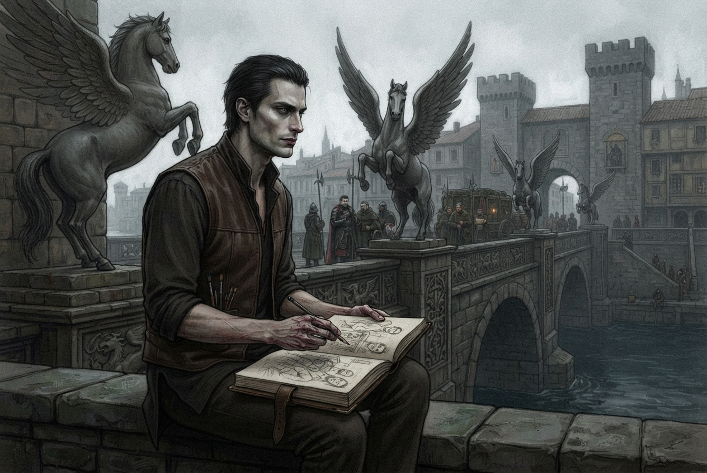

### B2. Художник

**Время:** ~12:45 (после прибытия на мост Клинкокрылов).

На набережной перед мостом, на парапете, сидит человек, который смотрит на толпу так, словно перед ним не пропускной
пункт, а полотно. Это **Лучиано Аврелиан** — «Художник» (d6=6).

Сцена знакомства:

- Лучиано подойдет сам, если игроки проведут более 10 минут перед мостом (например, осматривая мост или слушая слухи);
- Лучиано подойдет сам, если игроки застрянут на таможенном осмотре или сведут его к открытому конфликту;
- Лучиано подойдет сам, если игроки прошли таможню и не познакомились еще с ним;
- Игроки могут подойти к Лучиано, после того как заметят его на мосту, но до того, как пройдут таможню.

По ходу разговора `attitude_level` (уровень отношения) и `candor_level` (уровень откровенности) может изменяться, как
указано в диалогах.

Изначально, Лучиано относится к игрокам дружелюбно (attitude = friendly), но настороженно (candor = easy).

#### Описание NPC

##### Идентификация

- **Имя:** Лучиано Аврелиан.
- **Прозвище:** «Маэстро».
- **Роль:** «вольный художник»
- **Раса:** аасимар.
- **Мировоззрение:** Хаотично-добрый (CG).

##### Внешность и манера держаться

**Высокий, стройный** — чуть выше среднего; **кошачья грация**, длинные руки и пальцы (намёк на аасимское
происхождение). **Красивое, почти аристократическое лицо**; тёмные волосы, аккуратно зачёсанные назад. **Серые глаза с
безумной искрой**; **улыбка — обаятельная, но не доходит до глаз**; стоит ему подумать, что на него никто не смотрит,
как лицо мгновенно теряет эмоции и превращается в **пустую маску**. Черты лица — необычные: чуть более острые скулы
и лоб, чем у обычного человека.

Простая, но качественная тёмная рубаха, кожаный жилет, тёмные штаны. Обувь мягкая, бесшумная.

Длинные пальцы и кисти рук, а так-же манжеты рубашки — испачканы в краске. В длинных пальцах — **Серебряный штифт**
(рисует/делает заметки).

**Поведение и шлейф восприятия:** **держится слишком прямо и дерзко легко** для обычного горожанина. Движется
**бесшумно**, легче, чем человек. В тени становится чуть **прозрачнее/невесомее**, но в ярком свете — обычный.
**Запах:** масляная краска, льняное масло, резкие травы и **еле уловимый, противоестественный холод** (намёк на
аасимское происхождение). Говорит **мягко, чуть звеняще**, с металлическим оттенком; в напряжении — металл слышнее.

#### Начальная реплика

Если Лучиано подходит перед прохождением партии таможни (тот-же текст, что и в B1 - Мост Клинкокрыла):
> Мужчина элегантно встает с парапета и движется к вам. Кажется, что он не идёт, а скользит по брусчатке набережной,
> словно перетекая из одного места в другое.
> "Доброго вам дня, путешественники. Разрешите представиться — Лучиано Аврелиан. Вольный художник. У вас такой
> уникальный типаж! Вы не возражаете, если я вас зарисую?"

Если Лучиано походит к партии во время прохождения досмотра (текст должен быть в B3 - Таможня):
> "Господа, ни к чему ругаться!" - обволакивающи, проникающий в самое нутро голос неожиданно обрывает вашу перепалку.
> К вам подходит элегантный мужчина, которого вы видели на набережной ранее.
> Кажется, что он не идёт, а скользит по брусчатке моста, словно перетекая из одного места в другое.
> "Фальконе, ни к чему это всё" - он машет рукой в воздухе. - "Пропусти моих друзей."
> Лейтенант убирает меч в ножны. "Ну раз это ваши друзья - пусть проходят. Но записаться всё-равно надо."
> "Доброго вам дня, путешественники." - Мужчина уже оборачивается к партии. - "Разрешите представиться — Лучиано
> Аврелиан. Вольный художник. У вас такой уникальный типаж! Вы не возражаете, если мы отойдем отсюда и поговорим?"

Если Лучиано догоняет партию уже после прохождения моста. (Видимо, после сцены B3 - Таможня и перед B4 - Улицы города)
> "Господа!.. Простите великодушно!.." - вы замечаете бегущего за вами художника, сидящего ранее на другом берегу. -
> "Доброго... дня... вам! Фух... хорошо... успел догнать." - Он останавливается, переводит дыхание. "Меня зовут Лучиано
> Аврелиан, местный художник. Не могли бы вы уделить мне буквально 5 минут своего бесспорно драгоценного времени."

::: note

Лучиано — аасимар со Скоростью 30 и Акробатикой +16.
У него не будет отдышки при такой дистанции.
Лучиано **играет** человека, у которого есть физические пределы.

:::

Если партия подходит к Лучиано самостоятельно:
> Мужчина элегантно встает с парапета и поворачивается к вам. Кажется, что он не двигается, а будто перетекает
> из одной позы в другую, не останавливаясь ни на мгновение.
> "Доброго дня" - Он делает реверанс, поклоняется, размахивая невидимой шляпой. - "Разрешите представиться — Лучиано
> Аврелиан. Вольный художник. Чем обязан?»

#### Дальнейший диалог

1. Лучиано сделать наброски персонажей в своем альбоме, но боится что персонажи - с предрассудками и не разрешат ему.
   Если игроки соглашаются - Лучиано начинает доверять им (candor_level = medium).
   Если игроки не соглашаются - отношения не изменяются.
2. Если игроки отказались от наброска сейчас, то Лучиано говорит, что возможно они передумают, и он с радостью тогда их
   нарисует. И говорит, что днем его обычно можно найти в Тривардуме у лавок с художественными товарами или у торговцев
   предметами искусства. Конечно же, он их зовет попозировать не за просто так, а за определенное вознаграждение.
   Если игроки соглашаются - Лучиано начинает доверять им (candor_level = medium) + зацепка "Тривардум".
   Если игроки не соглашаются - отношения не изменяются.
3. Лучиано хочет получше познакомиться с персонажами.
   Если игроки соглашаются - Лучиано начинает доверять им (candor_level = medium).
   Если игроки не соглашаются - отношения не изменяются.
4. Если игроки отказались рассказывать о себе, то Лучиано предлагает угостить их выпивкой в таверне Трикалиста. Он будет
   там ближе к вечеру.
5. Если игроки согласились рассказать о себе, Лучиано предлагает им помочь в его поисках реликвии.
   Независимо от согласия, игроки получают зацепку "Реликвия".
6. Лучиано согласится ответить еще на 5 вопросов игроков, после чего сошлётся на время и уйдет в сторону города,
   буквально растворившись на улицах за считанные секунды.

#### Что Лучиано знает и может рассказать

**Общедоступно (attitude = friendly, без повышения candor):**

- Имя и «профессия»: **Лучиано Аврелиан, «Маэстро», вольный художник**.
- У него **альбом и Серебряный штифт** — он делает наброски прохожих; боится предрассудков и спрашивает разрешение.
- Где его найти днём: в **Тривардуме** у лавок с художественными товарами / у торговцев предметами искусства,
  вечером - бывает в таверне Трикалиста.
- Где ещё его найти вечером: — в таверне **Трикалиста** (предлагает угостить выпивкой).
- Предлагает **заказ «Поиск артефакта/реликвии храма»** (за определённое вознаграждение).

**При candor_level = medium (доверяет):**

- **Реликвия** — он ищет украденный **артефакт/реликвию храма** (мумифицированный череп святого); «если найдёте — не
  открывайте, просто принесите мне, это… личное».
- **Намёк на орден/Мендев** — его путь связан с **Мендевом** и «Язвой» (говорит отрывисто, как военный); при упоминании
  реликвии в лоб улыбка возвращается, но **позже, чем нужно**.

#### Итоги сцены B2

Знакомство с Художником даёт партию:

- зацепку **«Художник»** (если заметили при проверке);
- отношение к Художнику (взятие заказа → +1; провал/отказ → он следует за партией, но не давит);
- возможный заказ «Поиск артефакта/реликвии храма» (ведёт к таверне «Слёзы устрицы»);
- зацепку о комендантском часе, теневых тварях и структуре города (если задавали вопросы о городе).

Если не используется milestone leveling, то партия за сцену получает:

| Действие                                       | XP                                 |
|------------------------------------------------|------------------------------------|
| Заметили Художника (зацепка)                   | 10–20 (Trivial — знакомство)       |
| Взяли заказ «Поиск артефакта»                  | 20–30 (Low — было испытание)       |
| Раскрыли его тайну (паладин / серийный убийца) | 30–40 (Moderate — раскрытие тайны) |
| Провалили доверие, он напал и партия победила  | 160 (Moderate — полный энкаунтер)  |
| Провалили доверие, но не победила              | 40 (Low — частичный успех)         |

Зачем давать опыт: сцена занимает время, содержит важную информацию (заказ ведёт к таверне «Слёзы устрицы») и влияет
на сюжет (отношение/доверие Художника). 0 XP за зацепку обесценивает её — поэтому знакомство, взятие заказа и раскрытие
тайны дают опыт.

Общие итоги и дальнейшие действия:

- Игроки познакомились с Лучиано Аврелианом (Художником, d6=6);
- Игроки могут получить заказ на поиск реликвии (зацепка к таверне «Слёзы устрицы»);
- Игроки могут узнать о комендантском часе, теневых тварях, Совете Воров и Адских рыцарях;
- Отношение/доверие Художника может измениться (взять заказ → candor растёт; провал → падает, при провале доверия →
  нападает).
