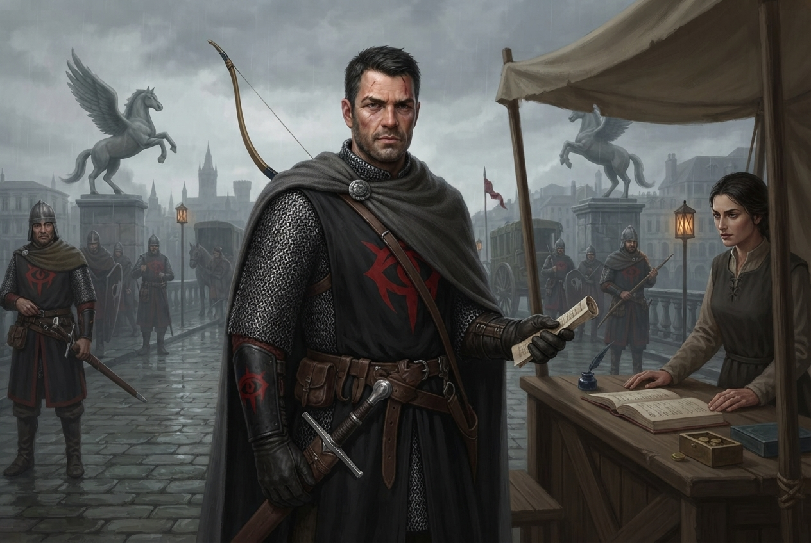

### B3. Таможня

::: image [Таможня;width:100%;height:auto]

:::

На мосту стоит отряд доттари и проверяет въезжающих в город.

#### Как выглядит сцена

Мост перегорожен шлагбаумом и деревянной стойкой. Рядом — навес от дождя, под которым располагается стойка.
На стойке — журнал, чернильница, сургучная печать, деревянный ящик для монет.
У стойки — очередь из пяти-шести человек:
торговцы с телегами, крестьянин с курами, женщина с корзиной, двое наёмников в потёртых доспехах.

За стойкой сидит лейтенант, заполняющий бумаги. Медленно. Вдумчиво.
Каждого проходящего он вписывает в большой журнал — имя, цель визита, срок пребывания.
Он практически не смотрит на людей — только в бумаги.
Иногда поднимает взгляд, оценивает — и снова опускает.

Рядом — четыре стражника: двое у шлагбаума с копьями, двое чуть дальше с арбалетами. Они скучают.

За мостом видны чистые, строгие здания Rego Scripa — Сектора Писцов.

#### Лейтенант Чезаре Фальконе

##### Идентификация

- **Имя:** Чезаре Фальконе.
- **Прозвище:** «Лейтенант» (никто не зовёт его по имени — только по званию).
- **Роль:** Лейтенант доттари, начальник таможенного поста на Мосту Клинкокрыла. **В прошлом — патрульный.**
- **Раса:** человек.
- **Мировоззрение:** Законопослушно-нейтральное (LN), склоняется к LE.
- **Статус:** контекстный NPC.

##### Описание

Фальконе служит в доттари **двадцать лет**. Он начинал **патрульным** — ходил по улицам ночью, гонял теневых тварей,
ловил воров. **Шрам** — от той поры. Потом **получил ранение** (не смертельное, но достаточное, чтобы не стоять в
ночном патруле), и его **перевели на таможню**. С тех пор он **сидит за стойкой** и **считает монеты**.

Он **не бюрократ по призванию**. Он **солдат, которого поставили на скучную работу**. Он **скучает**. Он **пьёт**
(немного, на службе). Он **берёт взятки** — не потому что жадный, а потому что **двадцать лет службы, а платят
копейки**.

##### Внешний вид и черты лица

**Жилистый, подтянутый** — не толстый, не худой. **Спина прямая** — привычка двадцати лет. **Шрам** через левую
бровь — старый, заживший. **Короткие тёмные волосы** без седины. **Без усов**. **Без шлема** — шлем лежит рядом на
стойке. **Без украшений** — челийская сдержанность.

##### Одежда и детали

- **Кольчуга (Chainmail hauberk) под чёрным табардом** — он всё ещё носит её. Привычка.
- **Красный «Глаз Ародена» на чёрном поле** — на **левом предплечье** (инвертированный знак, отличие офицера).
- **Тёмно-серый плащ** — перекинут через спинку стула.
- **Длинный меч искусной работы (Masterwork longsword)** — на поясе. Он **умеет** им пользоваться. Просто **не хочет**.
- **Композитный длинный лук (Composite longbow)** — прислонён к стойке. Он **стреляет** из него, когда кто-то пытается
  сбежать через мост.
- **Журнал, чернильница, сургучная печать, деревянный ящик для монет** — на стойке.

##### Поведение и шлейф восприятия

Фальконе **не встаёт** со своего места. Это **не лень** — это **привычка**. Он сидит **прямо**, как на плацу. Он **готов
встать** в любой момент. Он **не расслаблен** — он **скучает**.

Пахнет **чернилами, бумагой и лёгким запахом вина** (он пьёт, но не напивается на службе).

#### Что зачитать игрокам при первом входе

> За стойкой сидит мужчина лет сорока — **жилистый, подтянутый**, с прямой спиной человека, который двадцать лет носил
> доспех. **Короткие тёмные волосы**, **шрам** через левую бровь — старый, заживший. **Без шлема** — шлем лежит рядом
> на стойке, начищенный до блеска.
> На нём хауберк (длинная кольчужная рубаха, закрывающая тело до колен) под чёрным табардом (накидкой с короткими
> рукавами); на **левом предплечье** — красный «Глаз Ародена» на чёрном поле.
> **Тёмно-серый плащ** перекинут через спинку стула. **Мастерски изготовленный длинный меч** — на поясе.
> **Композитный лук** — прислонён к стойке.
>
> При вашем приближении, он дописывает что-то в журнал, не обращая внимания.
> Потом — поднимает взгляд. Серые глаза, внимательные, **без улыбки**.
>
> «Следующие. Имя, цель визита, срок пребывания». Пауза. «По одному».
>
> Лейтенант доттари останавливает партию у стола писца.
>
> «Пошлина за въезд — пятьдесят золотых. С каждого. Или валите туда, откуда пришли.».

#### Механика пошлины

- Официальная пошлина: указана на табличке. Обычно это 5зм (считаем, что игроки - конные)
- Лейтенант требует 50 зм за каждого - **в десять раз больше** официальной пошлины. Он не скрывает
  это и не стесняется. Это чистое вымогательство — сумма ощутимая для 5-го уровня, но не комическая.
- Социальный конфликт: партия выбирает — заплатить (50 gp × 4), торговаться/обманывать (Обаяние/Обман), запугивать
  (Запугивание) или напасть на заставу.

##### Способы разрешения

Таможня пропускает бесплатно граждан города и людей, работающих на городские власти.

- Если игроки согласились помочь дуксотару в расследовании - у них будет бумага об этом.
- Если игроки являются жителями Весткроуна - у них будут бумаги, подтверждающие место жительства.
- Если игроки владеют недвижимостью в Весткроуне - у них будут бумаги, подтверждающие право владения недвижемостью.

::: check
Способы прохода через таможню:
[Заплатить полностью, 50 зм]
success: игроки без проблем проходят таможню.

[Торговаться (Дипломатия), 20]
critical_success: Лейтенант согласен пропустить игроков по ценам с таблички.
success: Лейтенант согласен снизить цену до 20 зм за каждого.

[Запугивание, 20]
critical_success: Лейтенант согласен пропустить игроков по ценам с таблички.
success: Лейтенант согласен снизить цену до 5 зм за каждого, но портится отношение (Отношение Доттари -1).
failure: Цена не изменилась, но отношение - испортилось (Отношение Доттари -1).
critical_failure: Цена не изменилась, но отношение - испортилось (Отношение Доттари -2).

[Дать взятку (Обман), 18]
critical_success: Лейтенант согласен пропустить игроков по ценам с таблички.
success: Лейтенант согласен Неофициально пропустить игроков по 10 зм за каждого.

[Упоминание Дуксотара (Знание "Челия"/Знание "Весткроун"), 15]
success: Лейтенант согласен пропустить игроков по 10 зм за каждого.

[Предъявить документы (Дипломатия), 10]
success: Лейтенант согласен пропустить игроков бесплатно, если у них есть документы.
failure: Лейтенант всё-равно будет вымогать взятку за проход (по 10 зм с каждого).
critical_failure: Лейтенант всё-равно будет вымогать взятку за проход (по 50 зм с каждого).
:::

Если опустить отношение к доттари ниже -1 (hostile - враждебный), то стража нападёт на игроков.
Либо, игроки могут самостоятельно напасть на заставу.

#### Боевая сцена: Таможенная проверка

Если договориться не получилось, игроки могут попробовать напасть на заставу.

::: figure[Карта Моста Клинкокрыла]

:::

##### Противник: доттари на заставе

Бой со стражей на заставе — социальный конфликт, переходящий в боевую сцену,
если договориться не удалось.

На заставе находится урезанный отряд доттари:

| Роль            | Статблок в бестиарии     | Количество | Расположение                                          |
|-----------------|--------------------------|------------|-------------------------------------------------------|
| Чезаре Фальконе | Лейтенант доттари        | 1          | по центру моста у стола с бумагами                    |
| Мечник          | Стражник-мечник доттари  | 2          | на западном краю моста - следят за очередью на проход |
| Стрелок         | Стражник-стрелок доттари | 2          | на восточном краю моста - прикрывают                  |

::: encounter [Чезаре Фальконе]
**Способности:**

- **Бюрократическая власть (Bureaucratic Authority)** `[two-actions]` (concentrate, linguistic, mental) —
  **Требование:** существо в пределах 30 футов, которое лейтенант может видеть и слышать. **Эффект:** лейтенант требует
  у существа документы и **задерживает** его на **1 час**, если у него есть **любое формальное основание** (отсутствие
  документов, подозрительное поведение, несоответствие в показаниях). Это **не бой** — это **законная задержка**.
  Существо может оспорить задержку через **Дипломатию (КС 20)** или **Запугивание (КС 22)**; при провале оно обязано
  оставаться на посту. Лейтенант не может использовать эту способность на одном и том же существе чаще одного раза в
  сутки.
- **Взгляд оценщика (Appraiser's Eye)** `[one-action]` (concentrate) — лейтенант оценивает платёжеспособность существа в
  пределах 30 футов. Проверка **Проницательности** против **КС 20**. При успехе лейтенант узнаёт, может ли
  существо заплатить **50 зм** без труда, с трудом или не может вовсе. При критическом успехе он также узнаёт примерную
  сумму наличных (в пределах порядка величины).
- **Связи (Connections)** `[free-action]` (concentrate) — **Частота:** 1/день. Лейтенант наводит справку об одном
  существе, которое проходило через его пост. Он узнаёт, **кто** это был, **когда** проходил и **с чем** (краткое
  описание груза). Если существо не проходило через пост лейтенанта, способность не даёт результата.
- **Осторожность (Caution)** — лейтенант **не вступает в бой первым**. Если начинается драка, он **отступает** за спины
  стражников и **зовёт подкрепление**. Это не трусость, а прагматизм: он сохраняет себя как командную единицу.
- **Печать и журнал (Seal and Ledger)** `[one-action]` (concentrate, manipulate) — **Требование:** лейтенант имеет
  доступ к постовому журналу. **Эффект:** он может **подделать** или **изъять** запись в журнале. Проверка **Обмана**
  против **КС 22**. При успехе запись изменена или удалена; при провале остаются следы вмешательства, которые можно
  заметить при проверке **Общества (КС 20)**.
  :::

**Тактика боя:**

- Двое стражников с мечами - встают между лейтенантом и игроками, поднимая щиты, стрелки - отходят назад.
- Лейтенант **не вступает в бой первым**: он **отступает** за спины стражников и **отдаёт приказы** («Приказ»:
  союзники получают +1 к следующей атаке). Если нужно — **стреляет** из composite longbow.
- Один из стрелков **бежит за подкреплением** в городские кварталы. Через **3 раунда** он приведет 2-х
  стражников-копейщиков, которые помогали горожанам рядом с мостом.
- **Тактика Фальконе:** он **не тратит** действия на атаку, пока стражники держат линию. Он **ждёт**, пока игроки
  потратят ресурсы, и **только тогда** вступает в бой — с Masterwork longsword, если его достали, или из longbow,
  если держат дистанцию. Если стражники падают — он **отступает** к палатке и **зовёт подкрепление** голосом.

Доттари — это городская стража, а не отряд головорезов. Их основная задача — задержать, обезвредить и доставить
нарушителей на суд для проведения законного следствия и вынесения приговора

Механически: в ближнем бою для добивания доттари стараются использовать дубинки и нанести несмертельный урон.
Если персонаж игрока опускается до 0 HP от такой атаки — он без сознания и стабилен, а не умирает. После боя его
приводят в чувство, обыскивают и отправляют под арест.

Исключение - если игроки **уже** убили более 1 стражника или лейтенанта. Но и тогда их будут стараться задержать, но не
так активно.

#### Вопросы к Фальконе

Если партия получила возможность пройти в город (заплатив или уговорив их пропустить), Фальконе может ответить на
несколько (3-5) вопросов. После чего - будет обязан предупредить о Теневых тварях и Комендантском часе и, сославшись на
работу, закончит диалог.

Если партия победила в бою, и Фальконе остался жив и захвачен - партия может его допросить (3-5 вопросов), после чего
подойдет подкрепление доттари (еще два таких-же отряда по 1 лейтинанту и 6 солдат-доттари).

::: answers
Вопросы к лейтинанту Фальконе

**Q:** «Кто вы?»
indifferent: «Лейтенант Чезаре Фальконе. Доттари. Таможенный пост на Мосту Клинкокрыла».

**Q:** «Что это за город?»
hostile: Молчит.
unfriendly: «Весткроун. Дальше.»
indifferent: «Весткроун. Город Сумерек. Бывшая столица Челии. Сейчас — порт.»
friendly: «Весткроун. Город Сумерек.» Пауза. «Бывшая столица. Теперь — порт. И кладбище для тех, кто не умеет считать.»
helpful: «Весткроун. Когда-то — Город Девяти Звёзд.» Пауза. «Теперь — Город Сумерек.»

**Q:** «Почему город в упадке?»
unfriendly: «Дом Трун. Дальше.»
indifferent: «Дом Трун перенёс столицу в Эгориан. Богатство ушло. Осталось — вот это.»
friendly: «Дом Трун перенёс столицу в Эгориан. Богатство ушло.» Пауза. «Осталось то, что видите.»
helpful: «Город потерял бога. Потом — статус. Потом — деньги.» Пауза. «Теперь здесь только тени. В прямом смысле.»

**Q:** «Почему в городе введен комендантский час?»
unfriendly: «Приказ.»
indifferent: «Теневые твари. После заката. Приказ лорд-мэра. Восемнадцать ноль-ноль.»
friendly: «Теневые твари. После заката они выходят на охоту. Приказ лорд-мэра.» Пауза. «Я в город не хожу ночью. И вам
не советую.»
helpful: «Теневые твари. После заката — их время. Приказ лорд-мэра.» Тише. «Я был в патруле. Шрам — от той поры. Не
люблю вспоминать. Не ходите ночью.»

**Q:** «Что будет, если останемся ночью на улице?»
unfriendly: «Ваши проблемы.»
indifferent: «Тогда я вас больше не увижу.»
friendly: «Тогда я вас больше не увижу.» Пауза. «Твари не оставляют тел. Только тени.»
helpful: «Тогда я вас больше не увижу.» Тише. «Не выходите ночью. Это не совет. Это просьба.»

**Q:** «Где мы можем переночевать?»
unfriendly: «Не моё дело.»
indifferent: «В городе — таверны. За городом — „Слёзы устрицы“. Таверна Гаэтано. У реки.»
friendly: «В городе — таверны. За городом — „Слёзы устрицы“. Таверна Гаэтано. У реки.» Пауза. «Туда доттари не ходят. Но
и твари — пока нет.»
helpful: «„Слёзы устрицы“. Таверна Гаэтано. За городом. У реки.» Тише. «Хорошее место. Но я туда не езжу. Уже год. Не
спрашивайте почему.»

**Q:** «Кто здесь главный?»
unfriendly: «Лорд-мэр.»
indifferent: «Формально — лорд-мэр Абериан Арванкси. Реально — Совет Воров. И доттари.»
friendly: «Формально — лорд-мэр. Реально — Совет Воров. И доттари.» Усмехается. «В Весткроуне никто не главный. Это и
есть проблема.»
helpful: «Формально — лорд-мэр Абериан Арванкси. Реально — Совет Воров. И доттари.» Пауза. Тише. «Доттари — не единая
стража. Мы четыре банды с одним названием. Не единая стража.»

**Q:** «Кто такие доттари?»
unfriendly: «Городская стража.»
indifferent: «Городская стража. Начальник — Дуксотар Ильтус Мартис. Племянник лорд-мэра.»
friendly: «Городская стража. Я — лейтенант.» Пауза. «Начальник — Дуксотар. Племянник лорд-мэра. Молодой. Пьёт. Но не
злой. Просто слабый.»
helpful: «Городская стража. Я — лейтенант.» Пауза. «Начальник — Дуксотар. Племянник лорд-мэра.» Тише. «Он не командует.
Он подписывает бумаги. Остальное — наши зоны. Мы не единая стража. Мы четыре банды с одним названием.»

**Q:** «Кто такой Дуксотар?»
unfriendly: «Начальник стражи.»
indifferent: «Ильтус Мартис. Племянник лорд-мэра. Молодой. Пьёт.»
friendly: «Ильтус Мартис. Племянник лорд-мэра. Молодой. Пьёт.» Пауза. «Но не злой. Просто слабый. Если умеете что-то —
идите к нему. Он ищет помощи.»
helpful: «Ильтус Мартис. Племянник лорд-мэра. Молодой. Пьёт.» Тише. «Он не злой. И он боится. Боится, что маньяк
доберётся до него. Поэтому и нанял Детектива. И вас наймёт, если придёте.»

**Q:** «Что ты знаешь о Художнике (Аврелиане)?»
unfriendly: «Отвали. Я не знаю ни о ком.»
indifferent: «Аврелиан? Появляется тут иногда. Больше ничего не знаю.»
friendly: «Аврелиан? Частенько ходит здесь через мост. Появился месяцев шесть назад, сказал что он вольный художник.»
Тише. «Он странный. Но платит хорошо.»
helpful: «Аврелиан? Приехал месяцев шесть назад, поселился где-то за городом. Сказал, что вольный художник. Частенько
ходит здесь.» Тише. «Он странный. Смотрит на людей как на... материалы для своих работ. Но не буянит и платит хорошо.»

:::

#### Итоги сцены B3:

Если не используется milestone leveling, то партия за сцену получает:

| Решение                                              | XP                                |
|------------------------------------------------------|-----------------------------------|
| Заплатили 50 зм                                      | 10 (Trivial — просто откупились)  |
| Прошли по протекции Художника                        | 10 (Trivial — просто откупились)  |
| Торговались / запугали / обманули                    | 30 (Low — было испытание)         |
| Прошли по документам / бесплатно                     | 40 (Moderate — чистое решение)    |
| Прошли через бой и победили                          | 100 (Moderate — полный энкаунтер) |
| Прошли через бой, но с потерями (арест, отступление) | 40 (Low — частичный успех)        |
| Прошли через бой, но бой остановил Художник          | 30 (Low — было испытание)         |

Если партия проиграла бой:

- Их разоружают, обыскивают, приводят в чувство и отправляют под арест в Keep Dotar или ближайший пост.
- Фальконе лично допрашивает их (3–5 вопросов), после чего передаёт их Дуксотару. _(здесь по идее - ссылка на сцену, в
  городе, что-то типа "§B11 Приемная дуксотара" должна быть)._
- Отношение доттари при аресте падает до unfriendly (−1) или hostile (−2), но не ниже — их не пытают и не казнят. Это
  стража, а не инквизиция.

Так-же партия может получить дополнительный опыт за каждую найденную зацепку.
Логика распределения опыта по подсказкам - опыт не дается за те подсказки, которые применимы в текущей сцене.

| Зацепка               | опыт  |
|-----------------------|-------|
| Комендантский час     | 10 XP |
| Черная сирена         | 10 XP |
| Маньяк в городе       | 10 XP |
| Художник              | 0 XP  |
| Таверна Слезы устрицы | 10 XP |
| Культ Дагона          | 10 XP |
| Фальконе - взяточник  | 0 XP  |

Общие итоги и дальнейшие действия:

- Игроки получают возможность войти в город;
- Игроки могут узнать о комендантском часе и теневых тварях;
- Игроки могут узнать о структуре города;
- Игроки могут получить изменить отношение доттари (как уменьшить, так и увеличить);
- Игроки познакомились с лейтенантом Фальконе;
