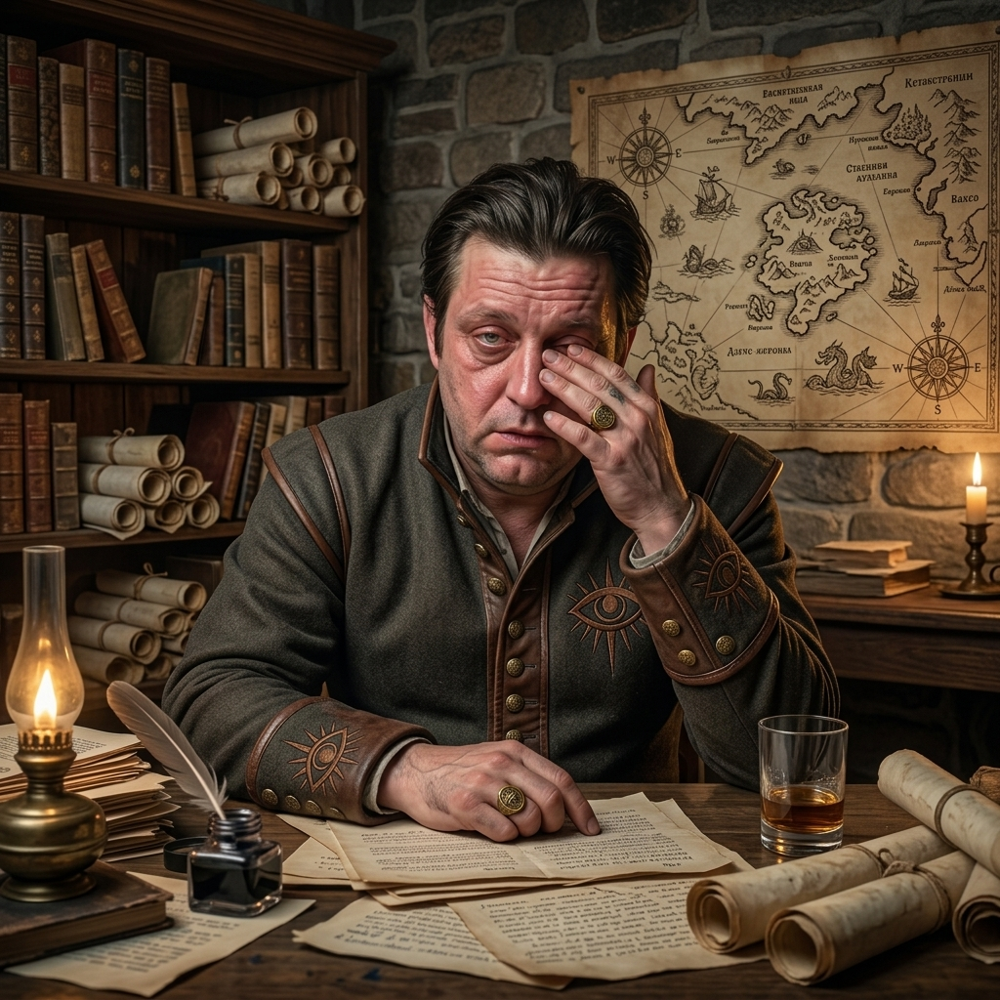

## ДОСЬЕ: Доттари Весткрауна (Westcrown Dottari)

| Название              | Доттари Весткрауна (Westcrown Dottari)                             |
|-----------------------|--------------------------------------------------------------------|
| **Статус:**           | Действующая городская стража                                       | 
| **Юрисдикция:**       | Город Весткраун, Челия                                             | 
| **Тип:**              | Военизированная правоохранительная структура                       | 
| **Штаб-квартира:**    | Весткраун (распределена по районам)                                |
| **Текущий командир:** | Дуксотар Ильтус Мартис (Duxotar Iltus Mhartis) ("Верховный страж") |
| **Подчинение:**       | Лорд-мэр Весткрауна (формально)                                    |

---

#### I. ОБЩИЕ СВЕДЕНИЯ

**Доттари** — официальное название городской стражи Весткрауна, бывшей столицы Челии. Термин "доттари" используется
для обозначения городских стражников и в других городах Челии, однако весткраунские доттари имеют свою уникальную
структуру и традиции.

**Основные задачи:**

- Поддержание общественного порядка на улицах и в каналах города;
- Охрана городских ворот;
- Патрулирование руин к северу от города;
- Охрана дворца и правительственных зданий.

**Реальная ситуация:** Несмотря на формальную структуру, доттари раздираемы личными вендеттами и политическими
интригами, что превращает их в четыре почти независимых подразделения. Фактическая власть в городе принадлежит не
столько доттари, сколько богатству и влиянию, включая легендарный Совет Воров.

---

#### II. СТРУКТУРА И ИЕРАРХИЯ

Доттари организованы по строгой военной иерархии:

| Ранг       | Титул                      | Описание                                                                                                                  |
|------------|----------------------------|---------------------------------------------------------------------------------------------------------------------------|
| **Высший** | **Дуксотар (Duxotar)**     | "Верховный страж". Единственный на город. Командует всеми доттари, подчиняется только мэру. Носит знак Ародена на кольце. |
| **2-й**    | **Дуротас (Durotas)**      | "Ранговый стражник". Четыре дуротаса (durotasi) командуют доттари в масштабах всего города, подчиняются дуксотару.        |
| **3-й**    | **Майор (Major)**          | Подчиняется дуротасу своего района. В каждом районе (rego) может быть несколько майоров.                                  |
| **4-й**    | **Капитан (Captain)**      | Командует пятью отрядами. Подчиняется майору.                                                                             |
| **5-й**    | **Лейтенант (Lieutenant)** | Командует одним отрядом из семи бойцов.                                                                                   |
| **6-й**    | **Солдат (Soldier)**       | "Обычный доттари". Действует в составе отряда.                                                                            |

**Стандартный отряд:** Семь человек — шесть солдат и один лейтенант. Пять отрядов подчиняются одному капитану, не менее
трёх капитанов — одному майору, не менее двух майоров на район — одному из четырёх дуротасов.

---

#### III. УНИФОРМА И ЗНАКИ РАЗЛИЧИЯ

**Основной символ:** **Глаз Ародена** (Aroden's Eye) — эмблема города Весткраун.

**Для рядовых доттари:**

- Глаз Ародена наносится **чёрным по красному полю**
- Размещается на щите или табарде

**Для офицеров:**

- Знак **инвертирован**: красный на чёрном поле
- Носится на **левом рукаве**
- **Положение знака указывает на ранг:** чем выше знак на рукаве, тем выше звание
    - Младшие офицеры — на плече
    - Старшие офицеры — на предплечье

**Для дуксотара:**

Дуксотар носит кольцо с крылатым Оком Ародена, инкрустированное рубином и гагатом.

Кроме того, кольцо является магическим предметом — Duxotar's Signet (кольцо-печатка дуксотара).

---

#### IV. ПОДРАЗДЕЛЕНИЯ (ДУРОТАСЫ)

Формально единая организация, доттари разделены на четыре почти независимых подразделения, каждое со своими задачами,
зоной ответственности и командиром:

::: pftab [1.Обычные доттари (Common Dottari)]

| **Название:**             | **Обычные доттари**                                   |
|---------------------------|-------------------------------------------------------|
| **Командир:**             | Дуротас Сария Рокцин                                  |
| **Зона ответственности:** | Улицы и городские ворота                              |
| **Задачи:**               | Патрулирование улиц района Parego Spera, охрана ворот |

:::

::: pftab [2. Кондоттари (Condottari)]

| **Название:**             | **Кондоттари** - **«Канальные смотрители»**                                 |
|---------------------------|-----------------------------------------------------------------------------|
| **Командир:**             | Дуротас Скази Болвона                                                       |
| **Зона ответственности:** | Каналы и водные пути                                                        |
| **Задачи:**               | Патрулирование каналов Весткрауна. Westchannel, Dhaenflow, каналы Regicona. |

:::

::: pftab [3. Рундоттари (Rundottari)]

| **Название:**             | **Рундоттари** - «Смотрители руин»             |
|---------------------------|------------------------------------------------|
| **Командир:**             | Дуротас Арик Туорнос                           |
| **Зона ответственности:** | Руины к северу от города                       |
| **Задачи:**               | Патрулирование разрушенных районов             |
| **Базируются:**           | Keep Dotar (северо-восточная часть Rego Cader) |

:::

::: pftab [4. Регдоттари (Regidottari)]

| **Название:**             | **Регдоттари** - «Дворцовые смотрители»  |
|---------------------------|------------------------------------------|
| **Командир:**             | Дуротас Лиана Стрикис                    |
| **Зона ответственности:** | Дворец                                   |
| **Задачи:**               | Охрана дворца и правительственных зданий |

:::

---

#### V. ТАКТИКА И СНАРЯЖЕНИЕ

**Патрулирование:**

Ночные патрули несут халорáны — 7-футовые шесты с крюком, на который подвешен яркий фонарь.
Такие шесты публично доступны вдоль главных улиц для тех, кто вынужден выходить после заката солнца.
Но даже с таким освещением стражники редко заходят в тёмные районы глубже, чем на два-три квартала.

**Отношение к нарушителям комендантского часа:**

Доттари могут выписать штраф до 5 золотых за нарушение комендантского часа, но на практике чаще просто торопят
нарушителей покинуть улицы.

**Боевая эффективность:**

- Доттари обучены патрулировать улицы и каналы, а не вести военные действия
- Не способны эффективно противостоять регулярной армии

---

#### VI. КЛЮЧЕВЫЕ ЛИЧНОСТИ

::: pftab [Ильтус Мартис]

| Имя                    | Ильтус Мартис (Iltus Mhartis)                                                        |
|------------------------|--------------------------------------------------------------------------------------|
| **Титул:**             | Верховный страж Весткрауна (Duxotar)                                                 |
| **Статус:**            | Жив                                                                                  |
| **Мировоззрение:**     | Нейтрально-злой  (Neutral evil)                                                      |
| **Расса/Народ:**       | Человек (Челиец)                                                                     |
| **Пол:**               | Мужчина                                                                              |
| **Класс:**             | Noble 5                                                                              |
| **Происхождение:**     | Дом Mhartis, племянник лорд-мэра Aberian Arvanxi                                     |
| **Характеристика:**    | "Пьяный бездельник" (drunkard lout)                                                  |
| **Стиль руководства:** | Крайне отстранённый ("hands off" approach); перекладывает обязанности на подчинённых |

:::

::: pftab [Сария Рокцин]

| Имя                | Сария Рокцин (Saria Roccin)                                                                                                                                    |
|--------------------|----------------------------------------------------------------------------------------------------------------------------------------------------------------|
| **Должность:**     | Капитан городской стражи - Дуротас (Durotas)                                                                                                                   |
| **Статус:**        | Жив                                                                                                                                                            |
| **Мировоззрение:** | Хаотично-добрая  (Chaotic good)                                                                                                                                |
| **Расса/Народ:**   | Человек (Челиец)                                                                                                                                               |
| **Пол:**           | Женщина                                                                                                                                                        |
| **Класс:**         | Fighter 6                                                                                                                                                      |
| **Подразделение:** | common dottari - Обычные доттари  - командир                                                                                                                   |
| **Дополнительно:** | Командует крупнейшим корпусом войск среди всех гражданских лидеров Весткрауна. Скрывает своё презрение к Адским Рыцарям и сотрудничает с ними крайне неохотно. |

:::

::: pftab [Скази Болвона]

| Имя                | Скази Болвона (Scasi Bolvona)                                                                                                                                                                                                                         |
|--------------------|-------------------------------------------------------------------------------------------------------------------------------------------------------------------------------------------------------------------------------------------------------|
| **Должность:**     | Капитан городской стражи - Дуротас (Durotas)                                                                                                                                                                                                          |
| **Статус:**        | Жив                                                                                                                                                                                                                                                   |
| **Мировоззрение:** | Нейтрально-злое (Neutral evil)                                                                                                                                                                                                                        |
| **Класс:**         | Sorcerer 5                                                                                                                                                                                                                                            |
| **Пол:**           | Мужчина                                                                                                                                                                                                                                               |
| **Расса/Народ:**   | Человек (Челиец)                                                                                                                                                                                                                                      |
| **Подразделение:** | Кондоттари (Condottari) - «Канальные смотрители» - командир                                                                                                                                                                                           |
| **Дополнительно:** | Политически амбициозен, поддерживает множество связей с властями Весткрауна. Однако его потенциал compromised (скомпрометирован) наличием полуэльфийской дочери Касисары (Casisara), которую он пытается скрыть (она живёт у родственников в Остенсо) |

:::

::: pftab [Арик Туорнос]

| Имя                | Арик Туорнос (Arik Tuornos)                                                                                                                                                                                                                                                    |
|--------------------|--------------------------------------------------------------------------------------------------------------------------------------------------------------------------------------------------------------------------------------------------------------------------------|
| **Должность:**     | Капитан городской стражи - Дуротас (Durotas)                                                                                                                                                                                                                                   |
| **Статус:**        | Жив                                                                                                                                                                                                                                                                            |
| **Мировоззрение:** | Нейтральное (Neutral)                                                                                                                                                                                                                                                          |
| **Класс:**         | Ranger 8                                                                                                                                                                                                                                                                       |
| **Пол:**           | Мужчина                                                                                                                                                                                                                                                                        |
| **Расса/Народ:**   | Человек (Челиец)                                                                                                                                                                                                                                                               |
| **Подразделение:** | Рундоттари (Rundottari) - «Смотрители руин» - командир                                                                                                                                                                                                                         |
| **Дополнительно:** | Принял командование рундоттари, чтобы помешать своему семейному врагу Эккобару Друмарису (Eccobar Drumaris) занять эту должность. Характеризуется как циник, но справедливый и честный человек, который ведёт своих людей с гордостью в одном из самых опасных районов города. |

:::

::: pftab [Лиана Стрикис]

| Имя                | Лиана Стрикис (Lhiana Strikis)                                                                                                                                                                                                                                                                                    |
|--------------------|-------------------------------------------------------------------------------------------------------------------------------------------------------------------------------------------------------------------------------------------------------------------------------------------------------------------|
| **Должность:**     | Капитан городской стражи - Дуротас (Durotas)                                                                                                                                                                                                                                                                      |
| **Статус:**        | Жив                                                                                                                                                                                                                                                                                                               |
| **Мировоззрение:** | Хаотично-злое (Chaotic evil)                                                                                                                                                                                                                                                                                      |
| **Класс:**         | Fighter 5 с Spellcasting Dedication (Wizard)                                                                                                                                                                                                                                                                      |
| **Пол:**           | Женщина                                                                                                                                                                                                                                                                                                           |
| **Подразделение:** | Регдоттари (Regidottari)  - «Дворцовые смотрители» - командир                                                                                                                                                                                                                                                     |
| **Дополнительно:** | Жестокий командир-рабовладелец (cruel slave-driver), который удерживает контроль над подчинёнными исключительно угрозой лишить их более высокого жалованья и престижа, которые регдоттари имеют по сравнению с обычными доттари. Ходят слухи, что у неё было много романов с высокопоставленными дворянами города |

:::
---

#### VII. ВЗАИМООТНОШЕНИЯ С ДРУГИМИ ФРАКЦИЯМИ

**Союзники:**

- Chelish noble families (знатные дома Челии)
- Eagle Knights (Орден Орла) — фракция Twilight Talons

**Враги:**

- Council of Thieves (Совет Воров) — основная тайная угроза
- Hellknights (Адские рыцари) — Ордена Pyre, Rack и Scourge

**Нейтральные/сложные отношения:**

- Abadarans
- Norgorberites
